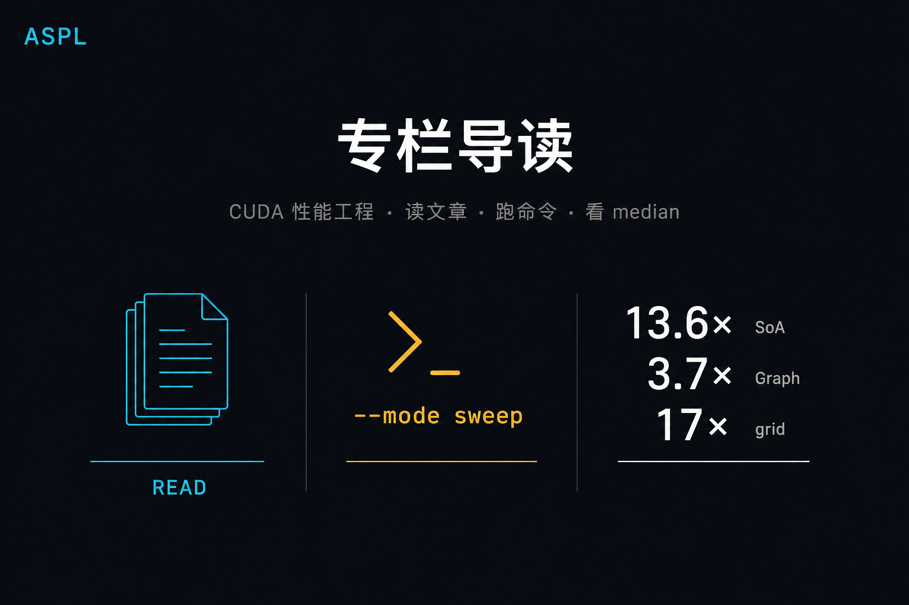

# 导读. 怎么读、怎么跑、本机数字从哪来



> 这是 CUDA 性能工程专栏的入口，不是 API 说明书。  
> **已交付**：Module A；Module B（B-01～B-10）；C-01～C-06（RTX 5090 / `sm_120` 实测）。  
> 仓库里现在没有 Triton、FlashAttention、vLLM；那些在 Module D/E 规划里，不当已开课。

**配套可复现**：[Yapeng-Gao/AI-System-Performance-Lab](https://github.com/Yapeng-Gao/AI-System-Performance-Lab)（文章 + `.cu` + 实测表）。有用请 Star。 下一篇：[A-01 CUDA 核心概念总览](https://github.com/Yapeng-Gao/AI-System-Performance-Lab/tree/main/article/01_cuda_basic)。

---

## TL;DR

1. **这是什么**：每章给决策表、一条主命令、能复现的 CUDA event **median**。权威以仓库 `article/` + `docs/results/` 为准。
2. **本机三句（5090）**：SoA vs AoS（少字段）约 **13.6×**（B-09）；短核 Graph replay 约 **3.7～4.1×**，核变长收到 **1.01×**（C-06）；空同步 `grid/block` 约 **17×**（C-04）。
3. **怎么跑**：按 §4 clone 后进 `build/` 配置（`native`，5090 常用 `120`），再 `./bin/03_compute_primitives_06_cuda_graph --mode sweep`。仓库根目录没有这个路径。
4. **怎么读**：先 A 建立映射；卡带宽去 B（出口 B-10）；卡协作 / fuse / launch 去 C。不要从导读跳去未写的 D/E。
5. **判停**：加速比看形状，不要把别人卡上的绝对 GB/s 当自己的总线利用率；**禁止**把 `ncu` 附着时的墙钟当结论。

---

## 1. 这是什么，现在不是什么

| 仓库里有 | 仓库里没有 |
|---|---|
| 专栏正文 + 可跑 `.cu` + CSV | 生产级推理引擎、完整 FlashAttention |
| RTX 5090 上的相对加速比 / 决策表 | 保证你的卡得到同一绝对 GB/s |
| TMA、Graph、Fusion、布局等 **微基准** | Triton、W4A16、vLLM、TensorRT 插件 |
| Module A；B-01～B-03、B-05～B-10；C-01～C-06 | Module D 算子、Module E 框架集成（规划） |

专栏总规划仍按 A→E 排，约 50 个槽。槽不是库存。没打 ✅ 的章不要当已开课。

口径固定：主证据是裸跑 CUDA event **median**；NCU / SASS 是旁证。

---

## 2. 本机结论速览

> 平台：RTX 5090 / `sm_120`。完整表在 `docs/results/`。主看加速比形状。

| 章 | 一句话 |
|---|---|
| B-01 GMEM | `offset=1` 时 `misaligned` **0.988×** / `float4` **1.038×**（相对 aligned）；小错位 ≠ 合并崩盘 |
| B-02 SMEM | 列扫 padding **14.12×** / swizzle **12.41×**（相对 naive）；不到 32× 仍有效 |
| B-03 寄存器 | `highreg` **0.308×**；regs=19 / occ=6 三档相同，慢的是 local 128→1024 |
| B-09 布局 | `touch_fields=1` 时 SoA / AoS ≈ **13.6×**；字段变多红利收窄到 ~1.8× |
| B-08 TMA | 立刻 wait 常 **~1×**；`pipe2` 低 AI 约 **1.69×**；compute-bound 再上 TMA 没意义 |
| C-04 同步 | 断层在 **grid vs block（~17×）**，不是 warp vs block 神话 |
| C-05 Fusion | 瘦融合随链长 **3.9×→9.8×**；`fat` occupancy 6→1，相对瘦融合慢 **8×** |
| C-06 Graph | 短核链 `stream/graph` ≈ **3.7～4.1×**；`work=4096` → **1.01×** |

数字会随驱动 / 架构变。复现以该章 `--mode sweep` 为准。

---

## 3. 怎么读

```text
A  映射与度量     模型 / 硬件 / 工具 / Roofline
B  数据怎么搬     形状 → on-chip → 跨空间 → 引擎 → 布局 → B-10
C  线程怎么协作   通信 → 争用/同步 → 摊销 launch
D  算子（规划）   Reduce → Softmax/LN → GEMM
E  产品（规划）   扩展 → 测量 → 交付
```

全景权威构图：[`docs/CUDA专栏规划.md`](https://github.com/Yapeng-Gao/AI-System-Performance-Lab/blob/main/docs/CUDA%E4%B8%93%E6%A0%8F%E8%A7%84%E5%88%92.md) §2。

| 你卡在 | 去 |
|---|---|
| Grid / warp / SIMT 在干什么 | A-03、A-04 |
| 带宽、合并、bank、UM、H2D | Module B；对不上号用 [B-10 Checklist](https://github.com/Yapeng-Gao/AI-System-Performance-Lab/blob/main/article/02_memory_optim/B-10.%20Module%20B%20Checklist%EF%BC%9A%E4%BB%8E%E7%97%87%E7%8A%B6%E5%88%B0%E8%AF%81%E6%8D%AE%E5%88%B0%E5%A4%84%E6%96%B9.md) |
| 同 warp 交换、争用、该不该 fuse、短核 launch | C-01～C-06 |
| 手写 Softmax / GEMM / 接 PyTorch | 还没写；先别对着空目录搜 |

每章正文结构（B-06 起、C 全系列）：承接上章 → TL;DR 带数 → 边界表 → 一条主命令 → 误区 / SOP → 下一章钩子。

---

## 4. 怎么跑

前置：CMake ≥ 3.25，官方 CUDA Toolkit ≥ 12.0（不要用 Ubuntu 源的 `nvidia-cuda-toolkit`），C++17。

```bash
git clone https://github.com/Yapeng-Gao/AI-System-Performance-Lab.git
cd AI-System-Performance-Lab
mkdir -p build && cd build
cmake .. -DCMAKE_BUILD_TYPE=Release -DCMAKE_CUDA_ARCHITECTURES=native
cmake --build . --parallel
./bin/03_compute_primitives_06_cuda_graph --mode sweep
```

`native` 探测失败时写死架构：Blackwell 消费卡常见 `120`，Ada 常见 `89`。

Windows / 只编单个 target / 重画实测图：见仓库根 [`README.md`](https://github.com/Yapeng-Gao/AI-System-Performance-Lab/blob/main/README.md)。

---

## 5. 目录（已交付 / 规划）

路径：文章 `article/`，示例 `examples/`，实测 `docs/results/`。进度总表：[`docs/CUDA专栏规划.md`](https://github.com/Yapeng-Gao/AI-System-Performance-Lab/blob/main/docs/CUDA%E4%B8%93%E6%A0%8F%E8%A7%84%E5%88%92.md)。

### Module A · 架构与模型 ✅

| 章 | 主题 |
|---|---|
| A-01 | CUDA 核心概念总览（Host/Device、编译、架构演进） |
| A-02 | GPU 硬件：Ampere / Hopper / Blackwell |
| A-03 | Grid / Block / Warp 物理映射 |
| A-04 | SIMT、Divergence、Replay |
| A-05 | Kernel 调用约定与 SASS 视角 |
| A-06 | NVCC / Fatbin / NVRTC |
| A-07 | 内存空间与 UVA |
| A-08 | Stream / Event / 流水线 |
| A-09 | Compute Sanitizer |
| A-10 | Roofline / Speed-of-Light |

### Module B · 访存 ✅

| 章 | 主题 |
|---|---|
| B-01 | Global Memory：合并 / 对齐 / float4 |
| B-02 | Shared Memory：Bank / Padding / XOR Swizzle |
| B-03 | 寄存器：Spilling / Occupancy / launch_bounds |
| B-04 | L2：Persisting / Access Policy / hitRatio |
| B-05 | Unified Memory：Fault / Prefetch / Advise |
| B-06 | Pinned Memory 与 DMA overlap |
| B-07 | `cp.async` / pipeline（GMEM→SMEM） |
| B-08 | Hopper TMA |
| B-09 | AoS / SoA / Transpose |
| B-10 | Checklist：症状 → 证据 → 处方 |

### Module C · 并发原语 🟡

| 章 | 主题 | 状态 |
|---|---|---|
| C-01 | Warp primitives（shfl / mask / reduce） | ✅ |
| C-02 | Cooperative Groups | ✅ |
| C-03 | Atomics 与 contention | ✅ |
| C-04 | 同步分层：warp / block / grid | ✅ |
| C-05 | Kernel fusion 代价边界 | ✅ |
| C-06 | CUDA Graph 与 launch overhead | ✅ |
| C-07～C-09 | Persistent / 重叠等候选，可裁 | ⏳ |
| C-10 | Module C Checklist | ⏳ |

### Module D / E · 规划 ⏳

| 模块 | 方向（未开写，不逐条点名未交付章节） |
|---|---|
| D | Reduce → Softmax / LayerNorm → GEMM / Tensor Core |
| E | Python 扩展 → profiler 工作流 → 部署形态 |

D/E 落地时会改这份目录。在那之前，仓库里不会出现占位空目录。

---

## 6. 下一篇

从物理图景起笔：[A-01. CUDA 核心概念总览](https://github.com/Yapeng-Gao/AI-System-Performance-Lab/tree/main/article/01_cuda_basic)（异构计算、编译管线、Ampere→Blackwell 该记住的差分）。

A 系列前半仍是概念章，和 B-06 之后的工程索引型不完全同构。读 A 是为了后面的决策表有落点，不是为了把导读里的加速比背下来。

---

> 本文配套代码与实测：[AI-System-Performance-Lab](https://github.com/Yapeng-Gao/AI-System-Performance-Lab)。觉得有用请 Star，后续章更新更好找。  
> 下一篇：[A-01 CUDA 核心概念总览](https://github.com/Yapeng-Gao/AI-System-Performance-Lab/tree/main/article/01_cuda_basic)。
