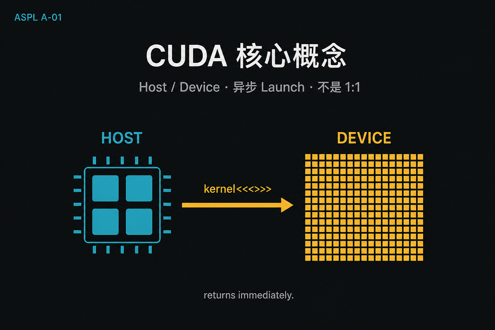
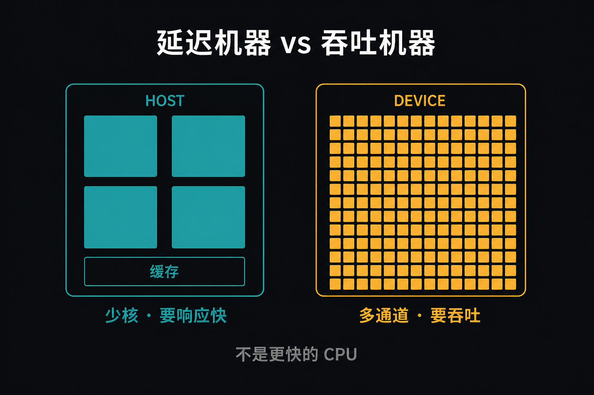
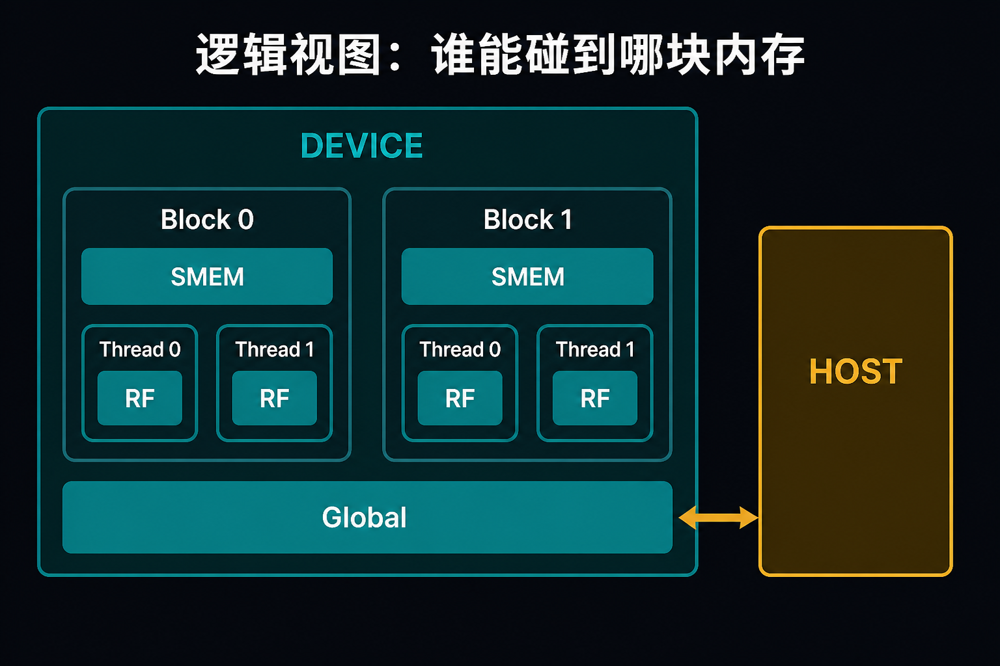
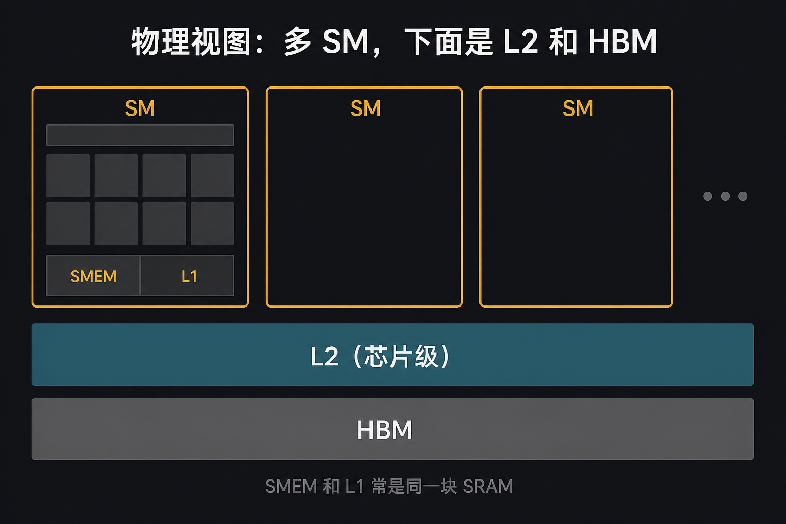
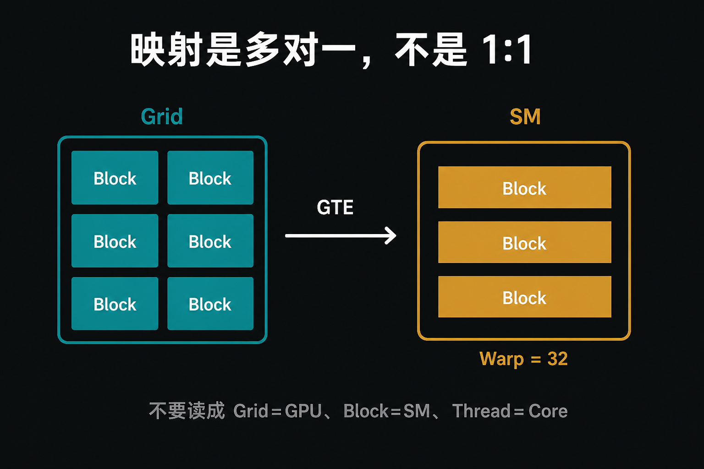
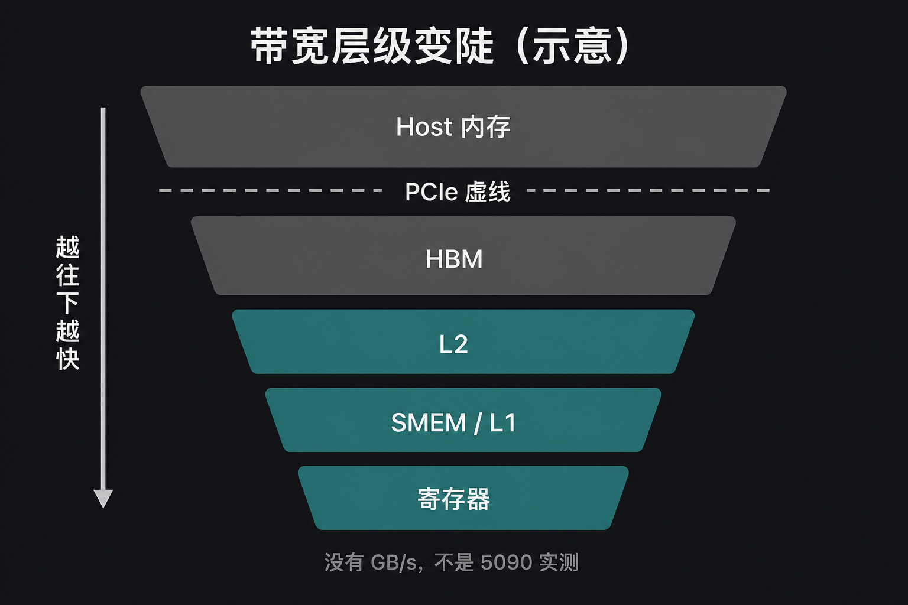
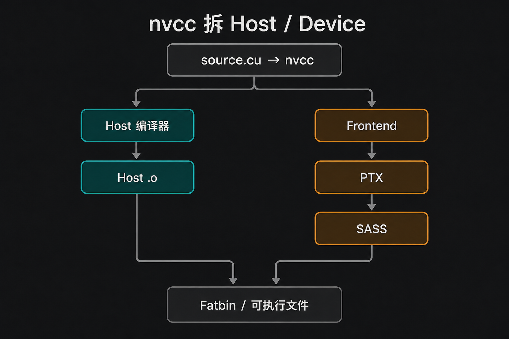
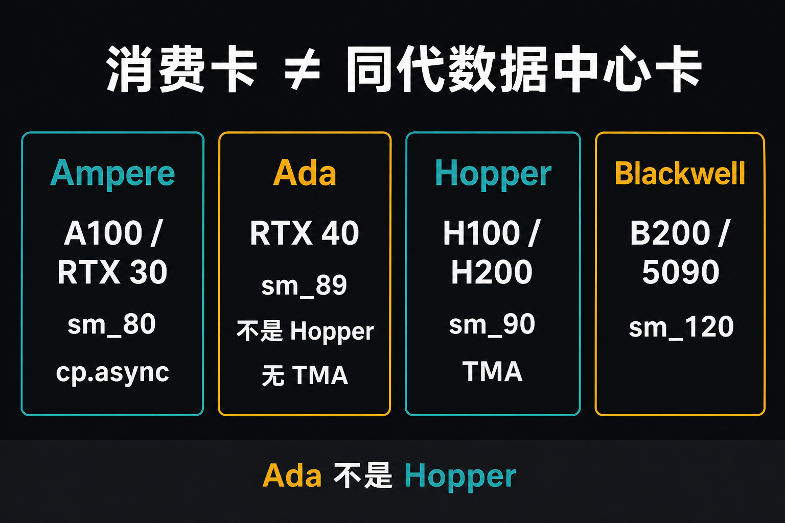

# A-01. CUDA 核心概念总览：从异构计算到 Blackwell 新范式



> 导读把仓库收成：决策表 + 一条命令 + 能复现的 median。  
> 本章不测加速比。只把三件事钉死：**Host/Device 为何分家**、**`<<<>>>` 是异步的**、**Grid/Block/Thread 不是硬件 1:1**。  
> SM / TMA 细节去 A-02；映射与 occupancy 去 A-03。

**配套可复现**：[Yapeng-Gao/AI-System-Performance-Lab](https://github.com/Yapeng-Gao/AI-System-Performance-Lab)（文章 + `.cu` + 实测表）。有用请 Star。本章示例：[`examples/01_cuda_basics/01_hello_modern.cu`](https://github.com/Yapeng-Gao/AI-System-Performance-Lab/blob/main/examples/01_cuda_basics/01_hello_modern.cu)。

---

## TL;DR（工程结论）

1. **CPU 藏延迟，GPU 堆吞吐。** 热路径上的墙，经常是 launch 税或 H2D/D2H，不是「GPU 算得不够快」。
2. **`kernel<<<>>>` 立刻返回。** 没同步就读结果，或用 Host 墙钟当 kernel 时间，都是错的。本章 `cudaDeviceSynchronize` 只为正确性；计时口径去 A-08（event）。
3. **逻辑层级是工单，不是硅片 1:1。** Grid 交给 GigaThread Engine 派 Block；Block 驻留某颗 SM（同一 SM 可同时驻多个 Block）；**Warp（32 threads）才是发射单位**。Thread ≠ 一颗 CUDA Core。细表见 A-03。
4. **`nvcc` 拆 Host/Device。** Device 侧先到 PTX，再落到该架构的 SASS；Fatbin 里常是多份 SASS。5090 写 `CMAKE_CUDA_ARCHITECTURES=120`（探测失败时）。管线细节去 A-06。
5. **消费卡 ≠ 同代数据中心卡。** RTX 40 是 **Ada（sm_89）**，不是 Hopper；**TMA / Cluster 从 Hopper（sm_90）起**。本仓库主测 RTX 5090 / `sm_120`（Blackwell 消费卡）。架构解剖去 A-02。

---

## 1. 本章钉什么，不抢哪章

| 问题 | 本章 | 不在本章 |
|---|---|---|
| 为什么要 Host + Device？ | 延迟 vs 吞吐；瓶颈常在提交/搬运 | 不讲 SM 内部双发射 / Tensor Core 流水（A-02） |
| Grid / Block / Thread 对应哪块硬件？ | 图 2–4：多对一驻留，Warp=32 | 调度、occupancy、尾波（A-03） |
| 编译产物是什么？ | 图 6：PTX / SASS / Fatbin | nvcc 驱动器细节、NVRTC（A-06） |
| 哪一代卡有 TMA / `cp.async`？ | §5 表 + 图 7 | SM 解剖（A-02）、TMA 实测（B-08） |
| `<<<>>>` 之后 CPU 在干什么？ | 图 8：异步返回；同步才看见结果 | Stream / Event / 流水线（A-08） |
| 内存在哪？ | 三层名字 + 图 2 / 图 5 | 空间、UVA、UM 处方（A-07 / B-05） |

---

## 2. 异构：延迟机器 vs 吞吐机器

CPU 把晶体管花在控制、乱序、大缓存上，单次响应要快。GPU 把面积花在重复的计算通道上，一次要喂饱成千上万条线程。不是「GPU 是更强的 CPU」。



> 图 1：左边控制/缓存占比大，右边计算通道铺满。类比到此为止，不要从面积比去推 Occupancy。

工程含义：kernel 写得再满，Host 每次提交都排队、或数据还在 PCIe 上，端到端照样慢。后面 C-06 测的是 launch 税；B-06 测的是 H2D。本章只把分工说清。

---

## 3. 逻辑层级不是硬件 1:1

CUDA 给你 Grid → Block → Thread，是为了写得动。硅片上的对应是**多对一 + 驻留**。



> 图 2：Host 只直接碰到 Global；Block 内交换走 Shared。Constant / Texture 名字留给 A-07。



> 图 3：同一张卡上有很多 SM；SMEM 和 L1 常是同一块物理资源上的分区。



> 图 4：Grid 交给 GigaThread 派 Block；同一 SM 同时驻多个 Block；Warp=32 才到 Scheduler。不要读成 Grid=GPU、Thread=Core。

图 4 没画出的一句：Thread 是 lane 上的寄存器状态，不是绑死一颗 Core。Block 占着该 SM 的 SMEM/寄存器直到结束。读成 1:1 接线，occupancy、divergence、TMA 都会歪。调度去 A-03。

内存只记三层名字，细节归 A-07 / Module B：

| 名字 | 位置 | 本章够用的一句话 |
|---|---|---|
| Registers | 线程私有 | 最快；溢出（spill）会打到 Local/HBM |
| Shared Memory | SM 上 | Block 内交换；容量小、bank 以后再管（B-02） |
| Global (HBM) | 板载 | 容量大、延迟高；合并访问是 B-01 |



> 图 5：只看**层级变陡**（PCIe ≪ HBM ≪ SMEM/寄存器）。图上没有 GB/s，**不要脑补成 5090 实测**。

---

## 4. 编译三层：源码 / PTX / SASS

`nvcc` 是驱动器，不是「一个编译器吃掉整个 .cu」：



> 图 6：左边系统 C++ 编译器，右边 Frontend → PTX → ptxas → SASS，最后打进 Fatbin。

`CMAKE_CUDA_ARCHITECTURES=native` 探测失败时写死：Ada 常见 `89`，5090 常见 `120`（代号见 §5）。想确认 Fatbin 里到底有哪些 `.text._Z…` 段，用示例旁的 `01_fatbin_inspect.sh`（`cuobjdump`）。完整管线去 A-06。

---

## 5. 架构差分：先分清消费卡和数据中心

本专栏会写到 `cp.async`、TMA、Cluster。先把**哪一代、哪张卡**对上，避免把 RTX 40 当成 Hopper。

| 架构 | 数据中心（例） | 消费卡（例） | CC | 本章要记住的差分 |
|---|---|---|---|---|
| Ampere | A100 | RTX 30 | sm_80 | `cp.async`：GMEM→SMEM 异步拷贝入口（B-07） |
| Ada | L40S 等 | **RTX 40** | **sm_89** | **不是 Hopper**。无 TMA / Thread Block Cluster |
| Hopper | H100 / H200 | — | sm_90 | **TMA**、Cluster、异步 Tensor Core 流水（B-08 / A-02） |
| Blackwell | B200 | **RTX 50** | sm_100 / **sm_120** | 低精度（FP4/FP6）路径；本仓库主测 **5090 = sm_120** |

「同代游戏卡 = 同代数据中心卡」不成立。TMA 的门槛写在 B-08：sm_90+。5090 能跑什么，以该章 binary 启动时打印的 `sm_XX` 为准。



> 图 7：Ampere 记 `cp.async`；**Ada（RTX 40 / sm_89）不是 Hopper、无 TMA**；Hopper 只有 H100/H200；5090 = sm_120。

---

## 6. Kernel 生命周期：异步是默认

写下 `hello_kernel<<<1, 32>>>(data)` 时：


> 图 8：黄色间隙就是 CPU 还能干别的活的窗口。同步点只保证可见性，不是标准计时器。

1. 参数进 launch 包（常见路径会落到常量内存侧）。
2. Host 把命令推进 **Stream**；默认就可以继续跑后面的 C++。
3. 没有同步，Host 读 `data` 可能仍是旧值；`printf` 在 Device 上也可能还没刷出。
4. 本章示例用 `cudaDeviceSynchronize()` **等正确性**，不是推荐你用它当 profiler。

计时：warmup + CUDA event median，见 A-08 与 B-06 之后各章。禁止把 Host `chrono` 包住一次 launch 当 kernel 时间。

### 怎么跑

前置与导读相同：官方 CUDA Toolkit，CMake ≥ 3.25。在 `build/` 里：

```bash
cmake .. -DCMAKE_BUILD_TYPE=Release -DCMAKE_CUDA_ARCHITECTURES=native
cmake --build . --parallel --target 01_cuda_basics_01_hello_modern
./bin/01_cuda_basics_01_hello_modern
```

预期：Host 打印 GPU 名和 SM 数；Device 第 0 线程打印 `sm_%d` 和 grid/block 维度；Host 校验 `data[i]==i*10` 后 PASSED。

示例刻意做了四件「能跑起来」的事，不要当成后面各章的处方：

| 做法 | 本章为什么用 | 后面去哪 |
|---|---|---|
| `CUDA_CHECK` | 失败立刻带文件行号退出 | 全程保留 |
| `__CUDA_ARCH__` | 看清这份 SASS 给谁编的 | A-06 |
| `cudaMallocManaged` | 少写 memcpy，Hello 能短 | 性能边界 B-05；手动分配从 B-01 起 |
| `cudaDeviceSynchronize` | 读结果前 GPU 必须做完 | 计时改 event（A-08） |

Windows 输出目录见 [`examples/01_cuda_basics/README.md`](https://github.com/Yapeng-Gao/AI-System-Performance-Lab/blob/main/examples/01_cuda_basics/README.md)。

---

## 7. 扩展阅读（不抢后续章）

1. CUDA C++ Programming Guide — Programming Model（见 §10-1）：官方逻辑层级，对照本章 §3。
2. 下一章 A-02：SM 内部。TMA 正文在 B-08，不要从白皮书一次读完 Hopper。
3. 映射与 occupancy：A-03。异步计时：A-08。

---

## 8. SOP + 误区

1. 新环境先跑通 `01_hello_modern`，确认打印的 CC 和你以为的卡一致。
2. 写任何「快了」之前：有没有同步？量的是 Host 墙钟还是 event？
3. 看到 TMA / Cluster / `cp.async`：先查表 §5，再进对应章。
4. 需要 occupancy、多 block 同 SM、warp 发射：停，去 A-03，不要在 Hello 里脑补。

| 误区 | 纠正 |
|---|---|
| RTX 40 是 Hopper，所以有 TMA | Ada sm_89；TMA 从 sm_90 起 |
| Grid=GPU，Block=SM，Thread=Core | 工单 vs 驻留 vs 发射单位，见图 4 注 |
| launch 返回 = GPU 算完 | 默认异步；要结果就同步 |
| `cudaDeviceSynchronize` = 标准计时 | 只保证可见性；median 用 event |
| UM 已经是现代最佳实践 | Hello 用着方便；热路径另测（B-05） |

---

## 9. 小结与下一章

Host 负责发单和搬数据，Device 负责吞吐；launch 默认不关门。逻辑三级结构能写，但不能当硬件接线图。消费卡和数据中心卡的 ISA 差分用 §5，不要靠产品年份猜。

下一篇进 SM：[A-02 GPU 硬件架构](https://github.com/Yapeng-Gao/AI-System-Performance-Lab/tree/main/article/01_cuda_basic)（GPC/SM、缓存、Tensor Core 流水）。本章的「吞吐机器」四个字，在那里才会变成发射槽和内存分区。

---

> 本文配套代码与实测：[AI-System-Performance-Lab](https://github.com/Yapeng-Gao/AI-System-Performance-Lab)。觉得有用请 Star，后续章更新更好找。  
> 本章示例：[`examples/01_cuda_basics/01_hello_modern.cu`](https://github.com/Yapeng-Gao/AI-System-Performance-Lab/blob/main/examples/01_cuda_basics/01_hello_modern.cu)。下一篇：[A-02 GPU 硬件架构](https://github.com/Yapeng-Gao/AI-System-Performance-Lab/tree/main/article/01_cuda_basic)。

## 10. 参考文献

**官方**

1. NVIDIA, *CUDA C++ Programming Guide*, Programming Model / Hardware Implementation. https://docs.nvidia.com/cuda/cuda-c-programming-guide/
2. NVIDIA, *CUDA C++ Best Practices Guide*, § Asynchronous Execution / Occupancy（计时与驻留，细节归 A-03/A-08）。https://docs.nvidia.com/cuda/cuda-c-best-practices-guide/

**架构白皮书（差分表 §5 的来源；解剖正文在 A-02）**

3. NVIDIA, *NVIDIA A100 Tensor Core GPU Architecture*. Ampere；`cp.async` 入口。
4. NVIDIA, *NVIDIA Ada Lovelace Architecture Whitepaper*. RTX 40 = Ada，不是 Hopper。
5. NVIDIA, *NVIDIA H100 Tensor Core GPU Architecture*. Hopper：TMA、Cluster。
6. NVIDIA, *NVIDIA Blackwell Architecture* 技术介绍 / 产品页。B200 vs RTX 50 的 CC 不同；本仓库 5090 以 runtime `sm_120` 为准。
