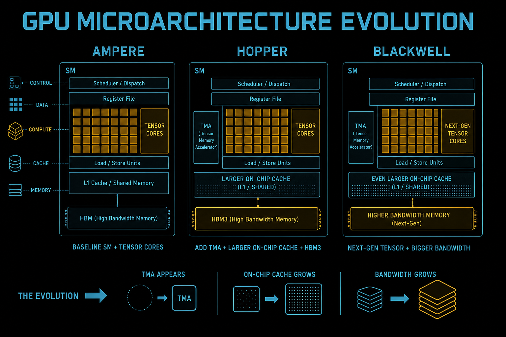
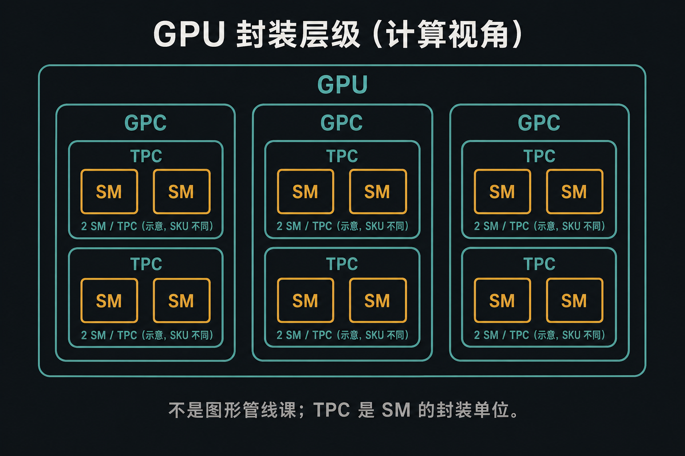
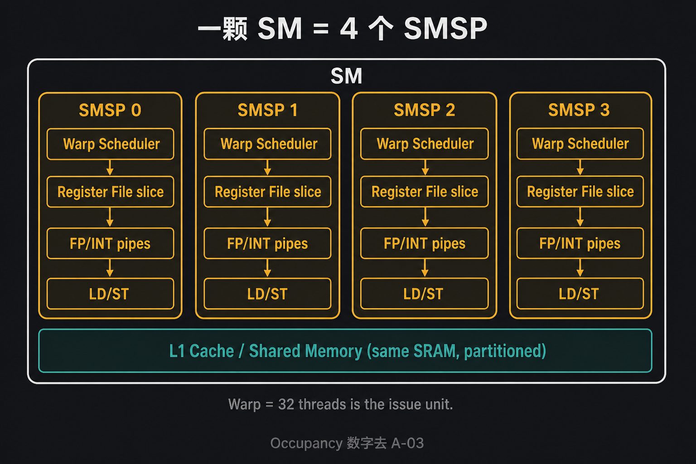
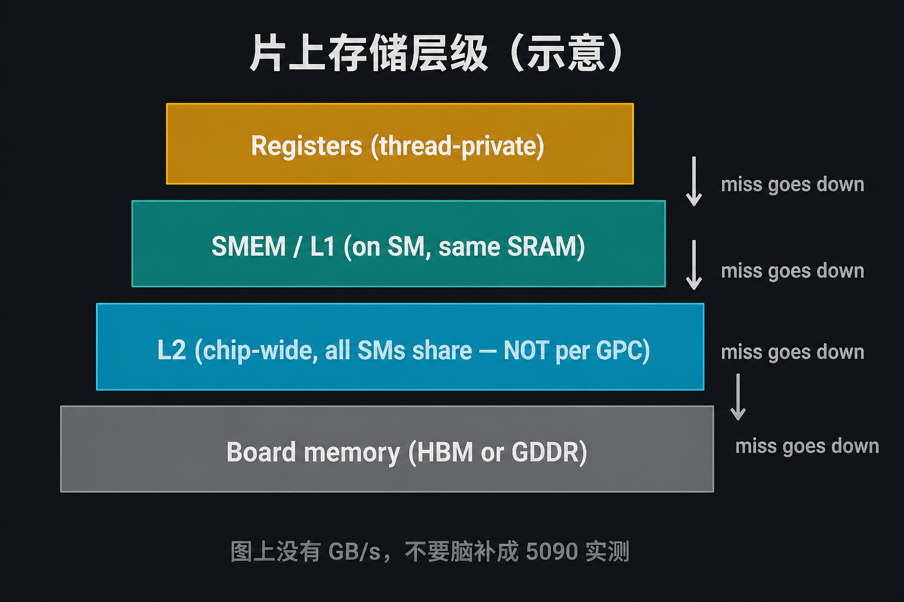
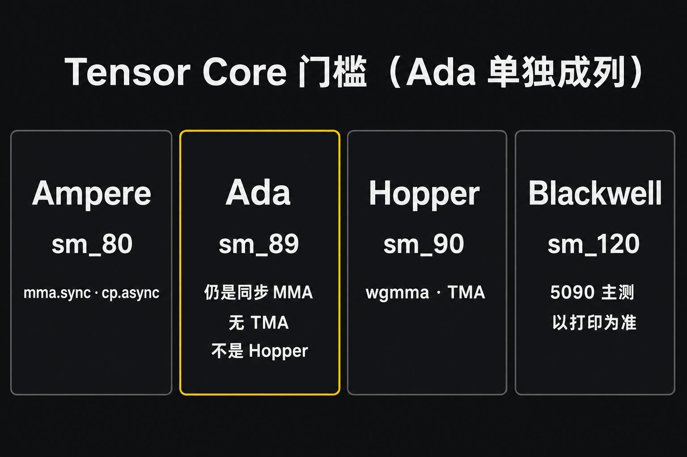
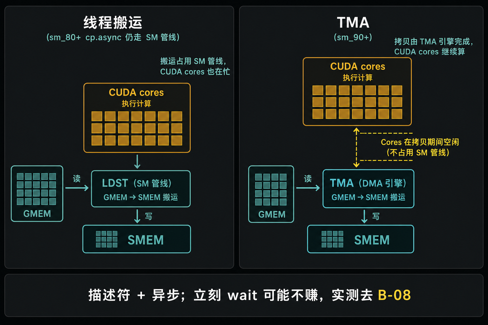

# A-02. GPU 硬件架构深度解析：解剖 Ampere, Hopper 与 Blackwell 的微观世界



> A-01 把 Host/Device、异步 launch、逻辑层级不是 1:1 钉死了。  
> 本章进硅片：**GPC/TPC 只是封装、SM 切成 4 个 SMSP、L2 是芯片级、TMA 从 sm_90 起**。  
> Occupancy 数字去 A-03；TMA 加速比去 B-08。本章不测 kernel 时间。

**配套可复现**：[Yapeng-Gao/AI-System-Performance-Lab](https://github.com/Yapeng-Gao/AI-System-Performance-Lab)（文章 + `.cu` + 实测表）。有用请 Star。本章示例：[`examples/01_cuda_basics/02_hardware_query.cu`](https://github.com/Yapeng-Gao/AI-System-Performance-Lab/blob/main/examples/01_cuda_basics/02_hardware_query.cu)。

---

## TL;DR（工程结论）

1. **GPC / TPC 是封装，SM 才是驻留单位。** 本章按计算视角读：TPC 里装着 SM，不是一堂顶点/光栅课。Block 驻留某颗 SM；怎么派、occupancy 怎么算，去 A-03。
2. **一颗 SM 切成 4 个 SMSP。** 每个分区有自己的 Warp Scheduler；**Warp（32 threads）才是发射单位**。Thread ≠ 绑死一颗 CUDA Core。
3. **INT 和 FP 可以走不同管道，索引计算不是免费。** Ampere 消费卡（sm_86）每分区有两条 datapath，FP32 峰值和 A100（sm_80）不同。不要把「双发射」写成 `idx = ...` 零开销。
4. **L2 是芯片级，不是 GPC 私有。** SMEM 和 L1 常是同一块 SRAM 上的分区。图上没有 GB/s；容量以 `cudaDeviceProp` 为准。
5. **TMA / Cluster 从 Hopper（sm_90）起。** RTX 40 是 **Ada（sm_89）**，无 TMA。本仓库主测 RTX 5090 / `sm_120`。ISA 门槛满足 ≠ 已经量过；搬运处方去 B-08。

---

## 1. 本章钉什么，不抢哪章

| 问题 | 本章 | 不在本章 |
|---|---|---|
| 芯片怎么封装？ | 图 1：GPU → GPC → TPC → SM | 图形管线（顶点/纹理/光栅） |
| SM 内部怎么切？ | 图 2：4×SMSP + Warp=32 | occupancy、尾波、divergence（A-03 / A-04） |
| 片上存储谁共享？ | 图 3：RF / SMEM+L1 / L2 芯片级 | bank、UVA、UM 处方（B-02 / A-07 / B-05） |
| Tensor Core 哪一代？ | 图 4 + §5 表：`mma.sync` vs `wgmma` | 手写 MMA / GEMM（Module D） |
| TMA 是什么？ | 图 5：门槛 sm_90+；Ada 没有 | descriptor、mbarrier、加速比（B-08） |
| 这张卡有什么？ | `02_hardware_query` 打印 CC / SM / L2 | 墙钟当 kernel 时间（A-08） |

---

## 2. 封装层级：GPC / TPC / SM

芯片太大，不能把所有 SM 直接焊成一张网。NVIDIA 用两层盒子来复制：GPC（Graphics Processing Cluster）是更大的物理簇，里面再切成 TPC。常见形态是一个 TPC 里放两颗 SM（SKU 不同，图 1 只是示意）。名字带着 Graphics，是因为同一套封装还要伺候光栅和纹理；**计算 kernel 真正驻留的是 SM**。优化时问的是「这颗 SM 还剩多少寄存器 / SMEM」，不是「GPC 还有没有空位」。



> 图 1：不要从「TPC」三个字母展开成顶点着色和光栅。本章后面的寄存器、SMEM、Tensor Core 都落在 SM 上。

派 Block 的是芯片级的 GigaThread Engine，细节去 A-03。本章只把「盒子套盒子」和「干活的是 SM」分开。

---

## 3. SM 内部：4 个 SMSP

不要把 SM 当成一颗超大 CPU 核。Volta 以降，一颗 SM 物理上切成 **4 个分区（SMSP）**。每个分区有自己的 Warp Scheduler、一份寄存器切片、FP/INT 管道和 LD/ST。四个分区共用这块 SM 上的 L1 / SMEM SRAM。切成四份，是为了每拍能同时伺候更多就绪 Warp，不是为了让一个 Block 变成四个独立小 GPU。

Scheduler 的工作很窄：从本分区里**已经就绪**的 Warp 挑一个，发**一条**指令给这个 Warp 的 32 条 lane。操作数没到、卡在屏障上的 Warp 发不出去，换下一个就绪的。这就是 GPU 藏延迟的基本动作。Warp（32 threads）才是发射单位；Thread 是 lane 上的寄存器状态，不是绑死一颗 CUDA Core。Occupancy 公式和「能驻几个 Block」去 A-03。



> 图 2：Scheduler 每次从就绪 Warp 里发射；Warp = 32 threads。不要在 query 输出里脑补 occupancy。

**管道，不要神话双发射。**

Ampere 白皮书把消费卡（GA10x / sm_86）写成：每分区两条 datapath，一条只做 FP32，另一条 FP32 **或** INT32。于是每分区每拍可以是 32 个 FP32，或 16 FP32 + 16 INT32。A100（sm_80）没有把 FP32 铺成同样的两倍。同一句「Ampere」不能当一张卡。

INT 地址计算和 FP 算术可以重叠，前提是指令真的独立、管道没堵。`idx = blockIdx.x * blockDim.x + threadIdx.x` 不是自动免费。

SFU（`sinf` / `expf` / `rsqrtf`）比 FP32 管道少。Softmax 一类热路径会在这里堵住；处方不在本章。

寄存器：每颗 SM 的 32-bit 寄存器总量有上限（常见说法是每 SMSP 16K）。用多了，能驻留的 Warp 变少，延迟掩盖变差。spill 打到 Local/HBM。细账去 B-03。

---

## 4. 片上存储：L2 是芯片级

寄存器在线程手里，SMEM/L1 在这一颗 SM 上。再往下，访问要跨 SM：原子要汇合、别的 SM 刚写的数据可能还要被读。这块缓存必须是**整颗芯片共享**的，否则每个 GPC 各养一份就对不齐。这就是 L2。不要读成「GPC 私有 L2」。



> 图 3：只看层级变陡。**没有 GB/s**。L2 标注 chip-wide：不是「GPC 私有缓存」。

三层名字够用：

| 名字 | 位置 | 本章够用的一句话 |
|---|---|---|
| Registers | 线程私有 | 最快；spill 去 Local/HBM |
| SMEM / L1 | SM 上同一块 SRAM 的分区 | Block 内交换走 SMEM；carveout 去 A-07 / B-02 |
| L2 | **整颗芯片共享** | 多 SM 复用、原子汇合的中枢；容量看 `l2CacheSize` |
| 板载 | HBM 或 GDDR | 容量大、延迟高；合并访问是 B-01 |

公开规格只作对照，**权威是本机 `cudaDeviceProp`**：

| SKU（例） | 架构 | L2（白皮书 / 规格页） |
|---|---|---|
| A100 | Ampere sm_80 | 40 MB |
| RTX 4090 | Ada sm_89 | 72 MB |
| H100 | Hopper sm_90 | 50 MB |
| RTX 5090 | Blackwell sm_120 | 规格页约 96 MB；以 query 打印为准 |

L2 变大，是因为 Tensor Core 峰值涨得比板载带宽快，需要更多片上复用。不要写成「HBM 已经够快所以 L2 无所谓」。也不要拿 4090 的 72 MB 去类比 H100 的 50 MB：消费卡和数据中心卡的总线、精度路径、TMA 都不是同一张表。

`cudaFuncSetAttribute` 调 SMEM/L1 比例：计算密集倾向 L1，手工 tiling 倾向 SMEM。Hopper 上 TMA 写 SMEM 的带宽保证更独立。调参正文不在本章。

---

## 5. Tensor Core 与 TMA 门槛

Tensor Core 吃的是 MMA 瓦片，不是「把 float 循环写成更漂亮的 C++」。代际只记软件接口和数据从哪进：

| 架构 | CC | 指令形态 | 数据怎么进 TC | 本章要记住的差分 |
|---|---|---|---|---|
| Ampere | sm_80 / 86 | `mma.sync` | 瓦片经寄存器 | `cp.async` 入门（B-07） |
| Ada | **sm_89** | 仍是同步 MMA 家族 | 同左 | **不是 Hopper。无 TMA / Cluster** |
| Hopper | sm_90 | `wgmma.mma_async` | 可从 SMEM 直喂，Warpgroup=128 threads | **TMA**、Cluster（B-08 / A-02 只点名） |
| Blackwell | sm_100 / **sm_120** | 低精度路径（FP4/FP6） | 以该卡 binary 为准 | 5090 = sm_120；不要把 B200 白皮书整份扣过来 |



> 图 4：Ada 列标了「不是 Hopper / 无 TMA」。Hopper 列没有 RTX 40。Blackwell 列的 TMA/Cluster 是门槛延续；5090 能用到哪一步，以启动时打印的 `sm_XX` 和 B-08 实测为准。

Hopper 相对 Ampere 的三句，够本章用：

1. **Warpgroup**：4 个连续 Warp（128 threads）一起喂更大的 MMA。
2. **少经寄存器**：`wgmma` 可以从 SMEM 取操作数。
3. **异步**：发射后 Warp 不必傻等；搬运卸给 TMA。

Blackwell 消费卡多了低精度路径。微缩放、Transformer Engine 细节不在本章展开。



> 图 5：左边 `cp.async` 仍走 SM 的 LD/ST；右边 TMA 是专用拷贝引擎。黄色间隙是「Core 可以去算别的」，不是「拷贝时核心必须闲着」。立刻 wait 可能不赚，数字在 B-08。

Thread Block Cluster / DSMEM：GPC 内多 SM 组成集群，邻居 SMEM 可直接访问。门槛同样是 sm_90+。Halo / 长序列 Attention 的写法不在本章。

---

## 6. 怎么跑：硬件拓扑侦探

前置与导读相同：官方 CUDA Toolkit，CMake ≥ 3.25。在 `build/` 里：

```bash
cmake .. -DCMAKE_BUILD_TYPE=Release -DCMAKE_CUDA_ARCHITECTURES=native
cmake --build . --parallel --target 01_cuda_basics_02_hardware_query
./bin/01_cuda_basics_02_hardware_query
```

`native` 探测失败时：Ada 写 `89`，5090 写 `120`。

预期打印（字段以你这张卡为准）：

- 设备名、**Compute Capability**（先对上 §5 表，再谈 TMA）
- SM 数；CUDA Core/SM 是表驱动推算，未知架构会印 `Unknown`
- 全局内存、总线宽度；CUDA 12+ 已去掉 `memoryClockRate`，理论带宽可能是 `N/A`（不要用 Host 墙钟去「测」峰值）
- **L2 Cache Size**（对照 §4 表）
- 每 Block / 每 SM 的 SMEM、寄存器、线程上限；`warpSize`（应为 32）
- TMA / Cluster：只报告 **ISA 门槛（sm_90+）**，不报告加速比

示例刻意做了这些，不要当成后面各章的处方：

| 做法 | 本章为什么用 | 后面去哪 |
|---|---|---|
| `cudaGetDeviceProperties` | 读 CC、SM、L2、资源上限 | 全程保留 |
| 按 CC 推算 Core/SM | API 不直接给「总 CUDA Core」 | 未知就印 Unknown，不要猜 |
| `major >= 9` 当 TMA 门槛 | 和 §5 表一致 | 真假搬运、wait 点：B-08 |
| 理论带宽公式 | CUDA 11 还能用 clock×bus | CUDA 12+ 缺 clock 就停，别编 |

Windows 输出目录见 [`examples/01_cuda_basics/README.md`](https://github.com/Yapeng-Gao/AI-System-Performance-Lab/blob/main/examples/01_cuda_basics/README.md)。

---

## 7. 扩展阅读（不抢后续章）

1. CUDA C++ Programming Guide — Hardware Implementation（见 §10-1）：SIMT、Warp、调度。对照本章 §3。
2. 下一章 A-03：Block 怎么塞进 SM、occupancy、尾波。Divergence 在 A-04。
3. TMA 正文在 B-08，不要从白皮书一次读完 Hopper。

---

## 8. SOP + 误区

1. 新环境先跑 `02_hardware_query`，确认打印的 CC 和你以为的卡一致。
2. 看到 TMA / Cluster / `wgmma`：先查表 §5。Ada 停。
3. 需要 occupancy、多 Block 同 SM、warp 发射条数：去 A-03。
4. 需要 GMEM→SMEM 加速比：去 B-08，不要在 query 输出上写「已经很快」。

| 误区 | 纠正 |
|---|---|
| RTX 40 是 Hopper，所以有 TMA | Ada sm_89；TMA 从 sm_90 起 |
| L2 是 GPC 私有 | 芯片级，全 SM 共享；见图 3 |
| Grid=GPU，Thread=一颗 CUDA Core | 封装 vs 驻留 vs 发射，见图 1–2；细表 A-03 |
| 双发射让索引计算免费 | 管道可重叠，不是零开销 |
| query 印 `TMA ISA floor … Yes` = 已经量过 | 只是 sm_90+ 门槛；median 在 B-08 |
| 5090 = B200 | 都叫 Blackwell；CC 是 sm_120 vs sm_100，以 runtime 为准 |

---

## 9. 小结与下一章

SM 是资源盒子，里面切成四个调度分区；Warp 才是发射单位。L2 是整颗芯片的中枢，不是 GPC 抽屉。Tensor Core 和 TMA 按 CC 查表，Ada 不要混进 Hopper。

下一篇看工单怎么塞进这些盒子：[A-03 CUDA 编程模型](https://github.com/Yapeng-Gao/AI-System-Performance-Lab/tree/main/article/01_cuda_basic)（GigaThread、驻留、occupancy）。Divergence 留给 A-04。

---

> 本文配套代码与实测：[AI-System-Performance-Lab](https://github.com/Yapeng-Gao/AI-System-Performance-Lab)。觉得有用请 Star，后续章更新更好找。  
> 本章示例：[`examples/01_cuda_basics/02_hardware_query.cu`](https://github.com/Yapeng-Gao/AI-System-Performance-Lab/blob/main/examples/01_cuda_basics/02_hardware_query.cu)。下一篇：[A-03 CUDA 编程模型](https://github.com/Yapeng-Gao/AI-System-Performance-Lab/tree/main/article/01_cuda_basic)。

## 10. 参考文献

**官方**

1. NVIDIA, *CUDA C++ Programming Guide*, Hardware Implementation / Compute Capabilities. https://docs.nvidia.com/cuda/cuda-c-programming-guide/
2. NVIDIA, *NVIDIA Ampere GPU Architecture Tuning Guide*, FP32 throughput（sm_80 vs sm_86）。https://docs.nvidia.com/cuda/ampere-tuning-guide/

**架构白皮书（差分表 §4–§5 的来源）**

3. NVIDIA, *NVIDIA A100 Tensor Core GPU Architecture*. Ampere；L2 40 MB；`cp.async`。
4. NVIDIA, *NVIDIA Ada Lovelace Architecture Whitepaper*. RTX 40 = Ada sm_89，不是 Hopper。
5. NVIDIA, *NVIDIA H100 Tensor Core GPU Architecture*. Hopper：TMA、Cluster、`wgmma`。
6. NVIDIA, *NVIDIA Blackwell Architecture* 技术介绍 / 产品页。B200 vs RTX 50 的 CC 不同；本仓库 5090 以 runtime `sm_120` 为准。

**工程 / 实证（扩展；数字不进本章 TL;DR）**

7. NVIDIA, *NVIDIA Hopper Architecture In-Depth*（开发者博客）。TMA / Warpgroup 叙事。
8. Luo et al., *Dissecting the NVIDIA Hopper GPU Architecture via Microbenchmarking*, arXiv:2501.12084. 延迟与指令吞吐旁证；加速比归 B-08。
