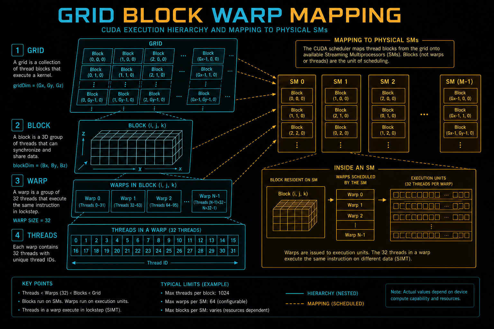
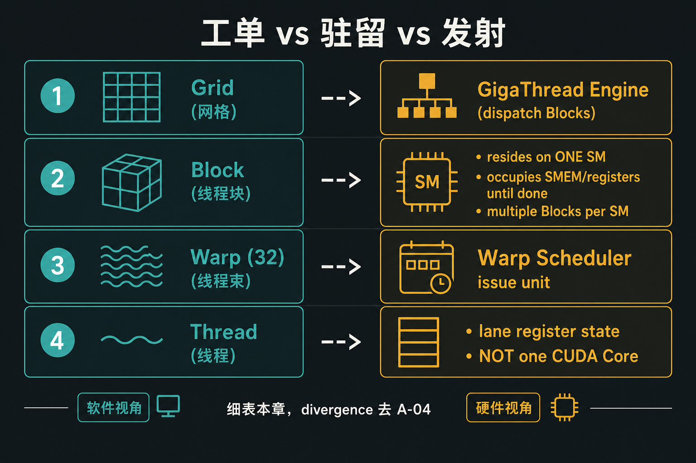
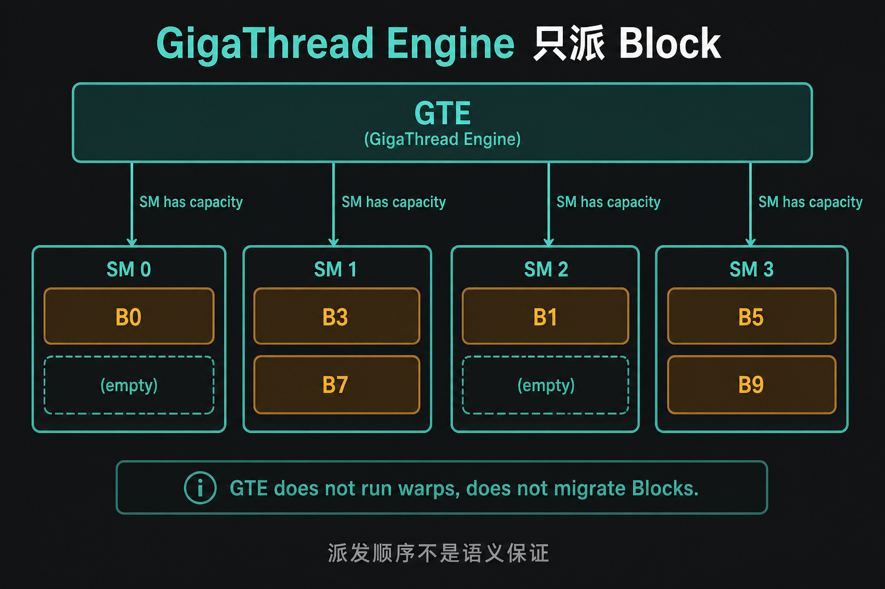
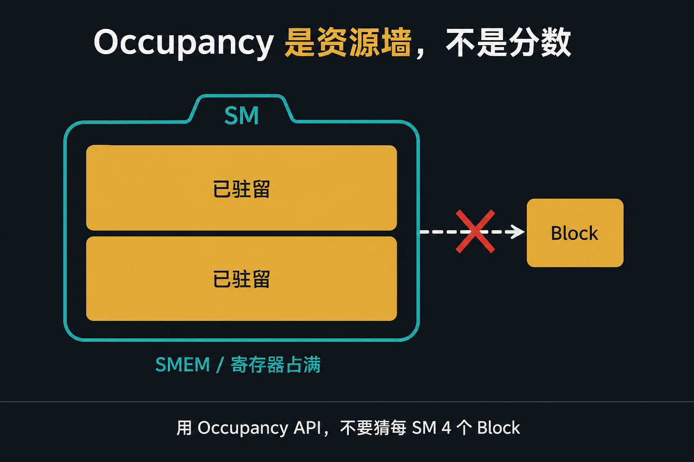
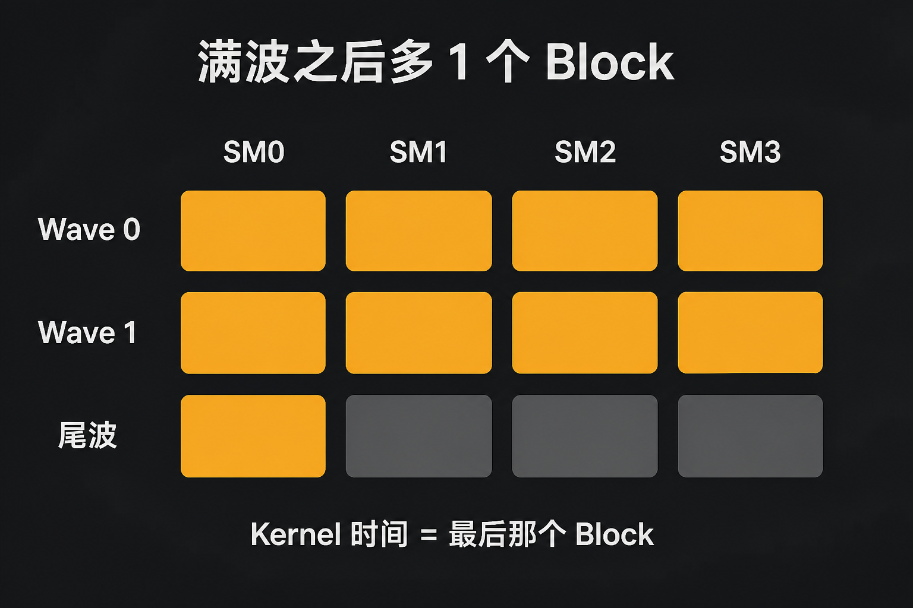

# A-03. CUDA 编程模型：GridBlockWarp 的物理映射与调度原理



> A-02 把 SM 切成 4 个 SMSP，TMA 门槛钉在 sm_90。  
> 本章只回答：**Grid 怎么变成驻留、occupancy 卡的是什么、尾波从哪来**。  
> Divergence / Replay 去 A-04。本章 tracer 不是 kernel 计时。

**配套可复现**：[Yapeng-Gao/AI-System-Performance-Lab](https://github.com/Yapeng-Gao/AI-System-Performance-Lab)（文章 + `.cu` + 实测表）。有用请 Star。本章示例：[`examples/01_cuda_basics/03_grid_mapping.cu`](https://github.com/Yapeng-Gao/AI-System-Performance-Lab/blob/main/examples/01_cuda_basics/03_grid_mapping.cu)。

---

## TL;DR（工程结论）

1. **Grid 是工单堆，不是整张卡。** GigaThread Engine 把 Block 派到有容量的 SM；它不跑 Warp，也不保证 `blockIdx` 顺序等于执行顺序。
2. **Block 驻留某颗 SM 直到结束。** 不迁移、不抢占。同一 SM 通常同时驻多个 Block。`__syncthreads()` 只在 Block 内有效。
3. **Occupancy 是资源上限，不是分数越高越好。** 寄存器、SMEM、每 SM 最大 Block/Warp 谁先撞墙谁说了算。本机用 `cudaOccupancyMaxActiveBlocksPerMultiprocessor`，不要猜「每 SM 4 个 Block」。
4. **Kernel 时间 = 最慢那个 Block。** 满波之后多 1 个 Block，其余 SM 可能空转。Grid-stride 往往比硬凑整数波更省事。
5. **Warp（32）才是发射单位。** Thread 是 lane 上的寄存器状态，不是绑死一颗 CUDA Core。分支串行化去 A-04；双发射细节见 A-02。

---

## 1. 本章钉什么，不抢哪章

| 问题 | 本章 | 不在本章 |
|---|---|---|
| Grid / Block / Warp 对应谁？ | 图 1：工单 / 驻留 / 发射 | 异构与异步 launch（A-01） |
| 谁把 Block 派到 SM？ | 图 2：GTE；容量不够就不派 | SM 四分、TMA 门槛（A-02） |
| 为什么塞不进第二个 Block？ | 图 3：occupancy 资源墙 | 寄存器 spill 处方（B-03） |
| 为什么 Grid 大一点反而拖尾？ | 图 4：wave / 尾波 | 计时口径（A-08） |
| `if` 让一半线程闲着？ | 一句话：Warp 内串行 + mask | SIMT / Divergence / Replay（A-04） |
| L2 slice 挤在一起？ | 点名 partition camping | 合并访问、swizzle（B-01 / B-09） |

---

## 2. 映射：工单、驻留、发射

A-01 已经否定 1:1 接线。CUDA 让你按数据切 Grid / Block / Thread，是为了写得动；硬件要的是另一套单位。Grid 只是一次 launch 的工单堆，本身不占 SM。真正占资源的是 **Block**：它进了某颗 SM，就把该用的 SMEM 和寄存器预留到跑完。真正发射指令的是 **Warp（32 条线程）**：Scheduler 一次喂一条指令给 32 条 lane。Thread 是 lane 上的寄存器状态，不是绑死一颗 CUDA Core。

为什么要这么多层：HBM 延迟几十到上百 ns，一颗 SM 必须同时养很多 Warp，才能在有人等数据时换别人上去。养得下多少，就是 occupancy；派得进派不进，是 GTE 的事。后面只在这张表上长细节。



> 图 1：不要读成 Grid=GPU、Block=一颗 SM、Thread=一颗 CUDA Core。

| 软件 | 硬件 | 生命周期 |
|---|---|---|
| Grid | GigaThread Engine | 一次 launch 的 Block 集合；本身不占 SM |
| Block | 某颗 SM | **资源预留单位**：SMEM / 寄存器占到该 Block 结束 |
| Warp（32 threads） | Warp Scheduler / SMSP | **指令发射单位** |
| Thread | 一条 lane 的寄存器状态 | 不是「一线程绑死一颗 Core」 |

---

## 3. GigaThread Engine：只派 Block

GTE 是芯片级分发器，不属于任何一颗 SM。Kernel launch 之后，Host 侧的 Runtime 把这份 Grid 交给它。它做三件事：接 launch、维持还没驻留的 Block、在 SM **还有容量** 时把 Block 交出去。容量指的是那颗 SM 还剩的寄存器、SMEM、以及硬件允许的最大 Block / Warp 数——也就是下一节 occupancy 墙。墙没破口，工单就在 GTE 这边排队。



> 图 2：空槽才领下一张工单。工程模型是「有容量才派」；硬件内部是 push 还是 pull，**不是语义保证**。

它**不会**：看某个 Block 还要跑多久、做访存预测、在 SM 之间搬已经驻留的 Block、按 `blockIdx` 保证执行顺序。`blockIdx.x == 0` 不保证最先结束；只保证这个 Block 的逻辑坐标是 0。

多 Kernel 同时在飞时，不同 Grid 的 Block 可能交错进入 SM。具体策略未公开。不要写成「一个 kernel 跑完才下一个」，也不要写成公平调度器。

---

## 4. 驻留与 occupancy

Block 一旦进某颗 SM：不迁移、不抢占、跑完才释放资源。这是故意的：`__syncthreads()` 只在 Block 内有效，硬件不必在 SM 之间搬共享内存。代价是慢 Block 会拖住整次 kernel——结束时间 = 最慢那个 Block。

Occupancy 描述的是：**这颗 SM 此刻能同时驻留多少 Warp / Block**。HBM 一趟来回很慢，同时养着的 Warp 越多，越有人能在别人等数据时把管道填上。它不是「分数越高 kernel 越快」的 KPI：寄存器用满了，单线程可能更快，能驻的 Warp 却少了。被四类上限卡住——寄存器、SMEM、每 SM 最大 Block 数、每 SM 最大 Warp 数。任一撞墙，GTE 再有工单也派不进去。



> 图 3：occupancy 是约束，不是 KPI。寄存器换吞吐，账在 B-03。

本机不要手填「每 SM 4 个 Block」。对**即将 launch 的那个 kernel、那个 block size、那份动态 SMEM** 调：

```text
cudaOccupancyMaxActiveBlocksPerMultiprocessor(&blocks_per_sm, kernel, block_size, dyn_smem)
wave ≈ SM_count × blocks_per_sm
```

本章示例 `<<<N, 1>>>` 几乎不占 SMEM，`blocks_per_sm` 往往会顶到硬件最大 Block 数，**和热路径上 256 threads + 大 SMEM 的 occupancy 不是一回事**。

L2 是分片的。相邻 `blockIdx` 若打到同一 slice，会 **partition camping**。CUTLASS / 部分 GEMM 用 block swizzle 把并发 Block 打散。本章只点名；合并访问与布局去 B-01 / B-09。

---

## 5. Wave 与尾波

一波（wave）≈ 全卡当前能同时驻留的 Block 数，也就是「所有 SM 的 occupancy 加起来」。GTE 先把第一波派满；有人跑完腾出槽，再派下一波。Grid 不是这个数的整数倍时，最后一波可能只剩几个 Block，其余 SM 空转。这就是尾波。Kernel 墙钟跟着最后那个 Block 走，所以多 1 个 Block，可能多等将近一整波的时间。



> 图 4：Kernel 墙钟跟着最后那个 Block 走。图上没有 5090 加速比。

常用退法：

1. **Grid-stride loop**：Grid 固定在大约满波的规模，kernel 里 `for (i = gid; i < n; i += gridDim.x * blockDim.x)` 扫完数据。
2. **把工作量补到波的整数倍**：只在 Block 工作量均匀、又不能改成 stride 时才值得。

工作量严重不均时，尾波只是症状；根因是慢 Block 无法被抢占（§4）。

---

## 6. 怎么跑：调度示踪

前置与导读相同：官方 CUDA Toolkit，CMake ≥ 3.25。在 `build/` 里：

```bash
cmake .. -DCMAKE_BUILD_TYPE=Release -DCMAKE_CUDA_ARCHITECTURES=native
cmake --build . --parallel --target 01_cuda_basics_03_grid_mapping
./bin/01_cuda_basics_03_grid_mapping
```

`native` 失败时：Ada 写 `89`，5090 写 `120`。

示例做四件事，口径写在这里：

| 做法 | 本章为什么用 | 不是什么 |
|---|---|---|
| PTX `mov.u32 %smid` | 看 Block 落到哪颗物理 SM | 不是公开稳定 ABI；换架构以打印为准 |
| `atomicAdd` 编号 | 看 thread 0 谁先抢到序号 | **不是 GTE 派发日志** |
| `clock64` busy-wait | 把 Block 拉长，否则一闪而过 | 不是 event median；计时去 A-08 |
| occupancy API 定 Grid | 用本机 `blocks_per_sm` 造 5 波 + 1 尾 | 不是热路径 kernel 的 occupancy |

预期：打印 GPU 名、SM 数、CC、**该 kernel 的 blocks/SM 与 wave**；列出部分 SM 上经过的 Block 数；指出序号最大的那个 logical Block 落在哪颗 SM；前 64 个 Block 的 SM 号表。

不要从「SM 0 和 SM 1 的计数差不多」推出硬件一定 round-robin。

Windows 输出目录见 [`examples/01_cuda_basics/README.md`](https://github.com/Yapeng-Gao/AI-System-Performance-Lab/blob/main/examples/01_cuda_basics/README.md)。

---

## 7. 扩展阅读（不抢后续章）

1. CUDA C++ Programming Guide — Execution Model / Occupancy（见 §10-1）。对照本章 §2–§4。
2. 下一章 A-04：Warp 内 `if`、mask、Replay。不要在 `%smid` 输出里脑补 divergence。
3. Block swizzle / L2 slice：CUTLASS 文档（见 §10-3）；合并访问与布局正文在 B-01 / B-09。

---

## 8. SOP + 误区

1. 改 block size 或动态 SMEM 之后，重新跑 occupancy API，再谈波次。
2. 写「满利用率」之前：Grid 是不是只多了 1 个 Block？最慢 Block 是不是工作量不均？
3. 需要分支代价、Replay：停，去 A-04。
4. 需要寄存器 vs occupancy 数字：去 B-03。

| 误区 | 纠正 |
|---|---|
| Grid=GPU，Block=SM，Thread=Core | 图 1：工单 / 驻留 / 发射 / lane |
| `blockIdx` 小的先跑完 | 驻留后不抢占；顺序不是语义 |
| occupancy 越高越快 | 资源上限；寄存器换吞吐见 B-03 |
| 每张卡每 SM 都能塞 4 个 Block | 以 occupancy API 为准；本章 `<<<N,1>>>` 会偏大 |
| tracer 的 atomic 序号 = GTE 日志 | 只是 thread 0 抢序号 |
| 尾波靠把 Grid 凑成 432 的倍数就结束 | 5090 的 wave 随 kernel 变；优先 grid-stride |

---

## 9. 小结与下一章

GTE 按容量派工单；Block 进了 SM 就占着资源跑完。Occupancy 是墙，wave 是墙的周期，尾波是最后一截空转。Warp 才开始碰指令。

下一篇进 Warp 里的 `if`：[A-04 线程调度](https://github.com/Yapeng-Gao/AI-System-Performance-Lab/tree/main/article/01_cuda_basic)（SIMT、Divergence、Replay）。

---

> 本文配套代码与实测：[AI-System-Performance-Lab](https://github.com/Yapeng-Gao/AI-System-Performance-Lab)。觉得有用请 Star，后续章更新更好找。  
> 本章示例：[`examples/01_cuda_basics/03_grid_mapping.cu`](https://github.com/Yapeng-Gao/AI-System-Performance-Lab/blob/main/examples/01_cuda_basics/03_grid_mapping.cu)。下一篇：[A-04 线程调度](https://github.com/Yapeng-Gao/AI-System-Performance-Lab/tree/main/article/01_cuda_basic)。

## 10. 参考文献

**官方**

1. NVIDIA, *CUDA C++ Programming Guide*, Execution Model / Hardware Implementation / Occupancy. https://docs.nvidia.com/cuda/cuda-c-programming-guide/
2. NVIDIA, *CUDA C++ Best Practices Guide*, Occupancy / Launch Configuration. https://docs.nvidia.com/cuda/cuda-c-best-practices-guide/

**工程 / 实证**

3. NVIDIA, *CUTLASS* 文档（`GemmCoord` / threadblock swizzle）。L2 slice 与 block 重排；不抢 B-01。
4. Jia et al., *Dissecting the NVIDIA Volta GPU Architecture via Microbenchmarking*, arXiv:1804.06826. GTE / Warp 行为的历史对照；本仓库主测 sm_120，数字以本机为准。
