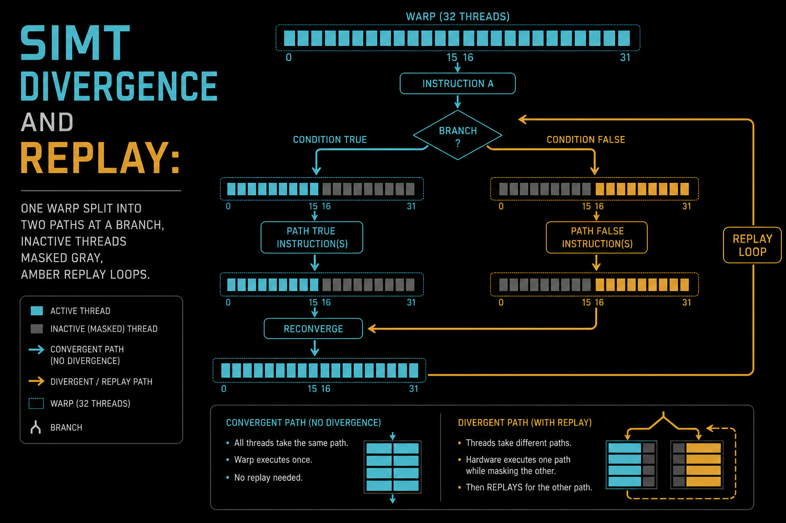
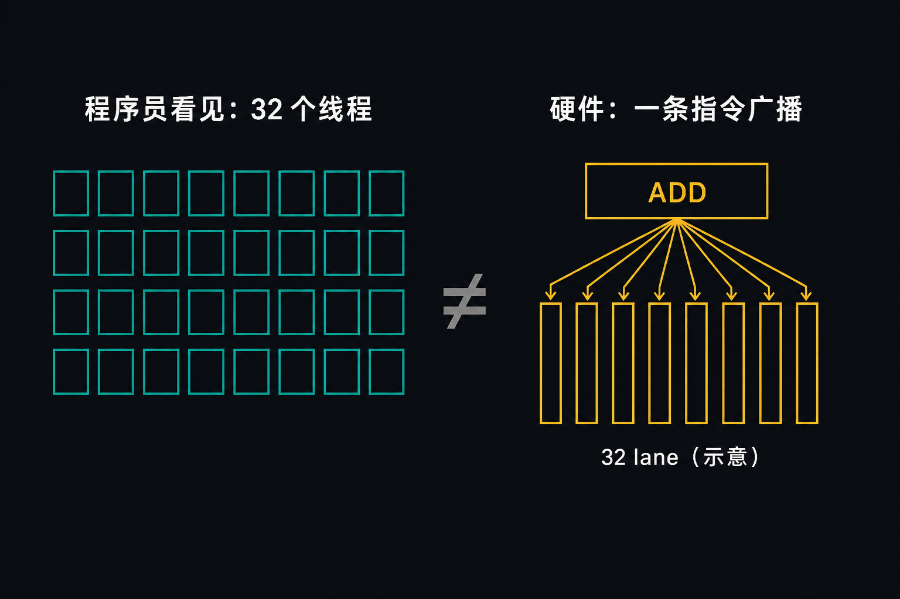
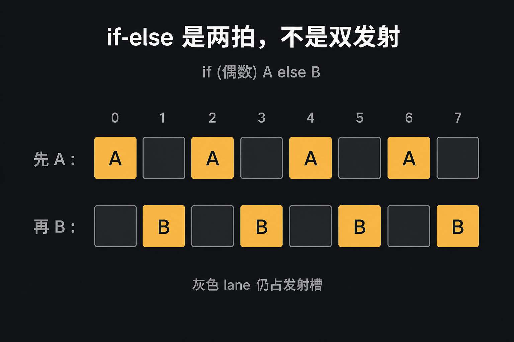
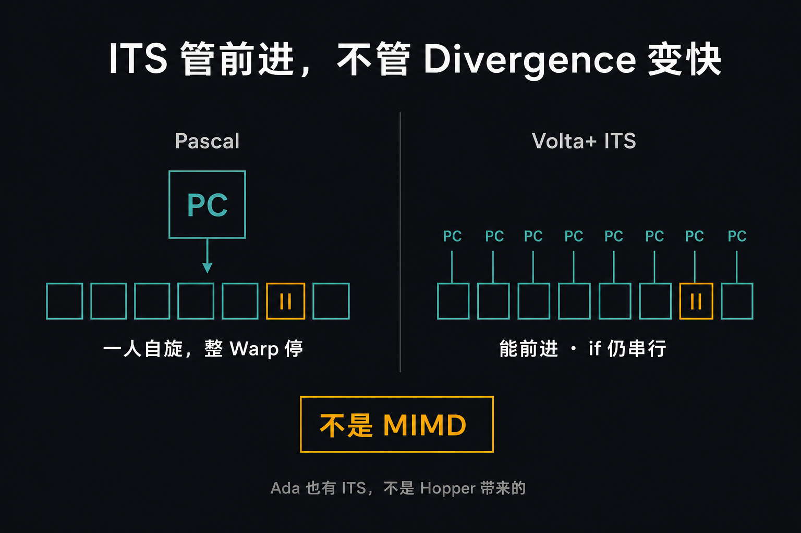
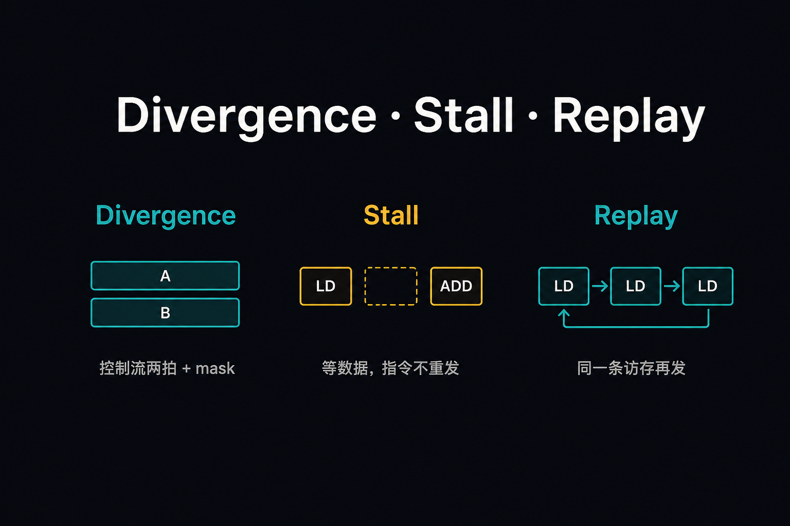

# A-04. 线程调度：SIMT、Divergence、Replay



> A-03 把 Block 塞进 SM，occupancy 是资源墙。  
> 本章进 Warp：**一条指令、32 条 lane、`if` 会串行、ITS 只管前进、Replay 不是 Divergence**。  
> Bank padding 去 B-02；合并访问去 B-01。本章 `clock64` 不是 event median。

**配套可复现**：[Yapeng-Gao/AI-System-Performance-Lab](https://github.com/Yapeng-Gao/AI-System-Performance-Lab)（文章 + `.cu` + 实测表）。有用请 Star。本章示例：[`examples/01_cuda_basics/04_warp_divergence.cu`](https://github.com/Yapeng-Gao/AI-System-Performance-Lab/blob/main/examples/01_cuda_basics/04_warp_divergence.cu)。

---

## TL;DR（工程结论）

1. **SIMT：程序员看见 32 个线程，硬件按 Warp 锁步发射。** 一条指令广播到 32 lane；寄存器仍是每线程一份。Thread ≠ 绑死一颗 CUDA Core。
2. **Warp 内 `if-else` 是两拍串行 + active mask，不是两路并行。** 教科书常写「约 2×」；本机看 `clock64` **median 比值**，流水线会藏掉一部分。
3. **ITS（Volta 起）解决前进，不解决 Divergence 性能。** 每线程有 PC，自旋不会把整个 Warp 冻死；`if` 该串行还是串行。Ada（RTX 40 / `sm_89`）也有 ITS，和 Hopper 无关。
4. **Replay ≠ Stall ≠ Divergence。** Stall 是等数据、指令不重发；Replay 是同一条访存指令因 bank / 分裂事务再发一遍。32-way SMEM 冲突是演示，消冲突去 B-02。
5. **口径：`<<<1, 32>>>`，lane0 `clock64` median（warmup 后 21 次）。** 单 Warp 更容易贴近教科书形状；这不是 kernel 墙钟。event 去 A-08。没有 `sink` 会被 DCE 成 1 cycle，不能当 2× / 32× 证据。

---

## 1. 本章钉什么，不抢哪章

| 问题 | 本章 | 不在本章 |
|---|---|---|
| 一条指令怎么打到 32 线程？ | §2 + 图 1：SIMT 锁步 | Occupancy / GTE（A-03） |
| `if` 为什么变慢？ | §3 + 图 2：串行 + mask | 手写 warp 原语（C-01） |
| ITS 是不是 MIMD？ | §4 + 图 3：前进 ≠ 性能 | 抢占、Block 迁移（A-03 已否） |
| 为什么 NCU 里 replay 很高？ | §5 + 图 4：同一指令再发 | SMEM padding / swizzle（B-02） |
| 访存各走各的地址？ | 点名 memory divergence | 合并访问正文（B-01） |
| 怎么量？ | §6：两组 `clock64` median | Host event 包 launch（A-08） |

---

## 2. SIMT：一条指令，32 条 lane

程序员写成 `a[i] = b[i] + c[i]`，像 32 个独立小 CPU 各算各的。SM 里不是这样。硬件把连续 32 条线程捆成一个 **Warp**（大小是架构钉死的，不是你能改的 launch 参数）。Warp Scheduler 取**一条**指令，广播到这个 Warp 的 32 条 lane；每条 lane 用自己的寄存器当操作数。锁步的是**发射**，数据是私有的。

这叫 SIMT（Single Instruction, Multiple Threads）。和 CPU 上的 SIMD 差在编程模型：SSE / AVX 要你显式写向量类型或 intrinsic；CUDA 让你写标量 C++，捆绑发生在硬件和编译器。和 MIMD 也差一截：32 路完全独立的取指 / 译码太贵，所以大家共享这一拍发出去的那条指令。

Thread ≠ 绑死一颗 CUDA Core。Core 是执行这条已发射指令的管道；同一条 lane 在不同周期可能用到不同管道。能同时养多少 Warp，是 occupancy（A-03），不是「32 线程占用 32 颗核」。



> 图 1：锁步的是**发射**；数据是私有的。不要把 lane 写成「一线程一颗 Core」。

代价在下一节：控制流必须用 **active mask**。某条 lane 不该执行时，不是去跑别的程序，而是这一拍被遮掉、不写结果。你不能假设 32 路独立分支像 32 个 CPU 那样便宜。

---

## 3. Divergence：串行 + mask

```cpp
if (threadIdx.x % 2 == 0) A();
else B();
```

32 条 lane 对条件的答案不一致，就是 **Warp divergence**。硬件不会让 A、B 同时铺满 32 lane——取指只有一份。它先让偶数 lane 跑 A（奇数 mask 掉），再让奇数跑 B（偶数 mask 掉），汇合之后 mask 恢复。两条路径的延迟**相加**。灰色 lane 仍占着这个 Warp 的发射槽，只是不写结果。

32 条 lane 走同一条路（uniform），通常没有这份额外串行。嵌套 `if`、按 `threadIdx` 散开的 `switch`，路径会多于两条；极端是 32 路各走各的。短条件编译器往往收成 predication（`@P` 修饰一条指令），比真的分叉再汇合便宜；长函数、两边访存模式完全不同，收不回去。



> 图 2：灰色 = mask 掉、不写结果；Warp 仍占着这一拍。

「约 2×」只在两条路径算力接近、又没有别的 Warp 把延迟藏住时像教科书。示例故意 `<<<1, 32>>>`（一个 Warp），比值更容易贴近形状；热路径上 SM 里还有别的就绪 Warp 时，墙钟比会被藏掉一块。本机以打印的 median 比为准，**不要把 2.0× 写进结论当实测**。

热路径上：能让同一 Warp 走同一支就走同一支（数据按 Warp 对齐更好）；短条件交给编译器；长的、不可对齐的分叉，先量再改。别在 Hello 里上全套 branchless。手写 warp 原语去 C-01。

---

## 4. ITS：活得下去，不是跑得更快

Pascal 及更早，一个 Warp 基本上共用一个 PC。某条线程卡在自旋上，整个 Warp 的 PC 可能一起停。典型事故：同一 Warp 里一部分人拿到锁、走到 `__syncthreads()`，另一部分人还在 `while (!lock)` 里转——屏障的对侧永远走不到，死锁。这不是「分支慢」，是**前进语义**不够。

Volta 起 Independent Thread Scheduling：Warp 内每条线程有自己的 PC，汇合点显式化。等锁的人不必把已经走完分支的人冻死；调度器可以在不同 PC 的子集之间切换前进。Ada（RTX 40 / `sm_89`）也有 ITS，因为它从 Volta 继承，**和 Hopper 无关**。



> 图 3：右边不是 MIMD。Ada / Hopper / Blackwell 都从 Volta 继承 ITS。

ITS **没有**把 Divergence 的两拍变成一拍。`if-else` 该串行还是串行，mask 该遮还是遮。它只保证：活得下去，不是跑得更快。也不要把它读成 MIMD：取指仍然按 Warp、按 mask 发射，不是 32 套独立流水线。

不要从网上抄「Warp 内 mutex + `__syncthreads`」当教材示例去跑。正确性用 lock-free / 明确的 warp 原语（C-01），不要靠 ITS 当设计目标。CC < 7.0 的卡谈 ITS 救命没有意义。

---

## 5. Replay：同一条指令再发一遍

Nsight 里能看到 stall，也能看到 replay。两个词经常被当成「又 divergence 了」。不是。

| | Divergence | Stall | Replay |
|---|---|---|---|
| 触发 | 控制流分叉 | 操作数没到 | 一次发射没做完（bank、部分内存分裂） |
| 硬件 | 两拍 mask | 等，指令不重发 | **同一条指令再 issue** |
| 本章演示 | 奇偶 `if` | 不测 | stride-32 SMEM |

**Stall**：指令已经发出去了，scoreboard 说数据还没来（HBM、依赖、管道满）。Scheduler 换别的 Warp；这条指令**不必再译一遍**。等数据到了，从停住的地方继续。

**Replay**：指令发出去了，这一拍物理上没做完。典型是 SMEM bank 冲突：32 个线程打同一个 32-bit bank，SRAM 一拍只能服务其中一个，硬件把这一拍拆成最多 32 次发出。全局访存分裂成很多事务时，也可能让同一条 load 再发。计数器上看就是 replay。



> 图 4：Nsight 里的 replay 计数不是「又 divergence 了一次」。

32-way bank：教科书写 32×；流水线会藏掉一块，本机常见远小于 32。示例同样是单 Warp，形状更容易看清。怎么 padding / swizzle 去 **B-02**，本章只证明「冲突会重放」。

还有一种常跟 Replay 一起出现、但不是一回事的：**memory divergence**。Warp 还在锁步发射，32 个地址却散到很多缓存行 / 事务。控制流可以完全 uniform。合并规则正文在 B-01。

---

## 6. 怎么跑

前置与导读相同：官方 CUDA Toolkit，CMake ≥ 3.25。在 `build/` 里：

```bash
cmake .. -DCMAKE_BUILD_TYPE=Release -DCMAKE_CUDA_ARCHITECTURES=native
cmake --build . --parallel --target 01_cuda_basics_04_warp_divergence
./bin/01_cuda_basics_04_warp_divergence
```

`native` 失败时：Ada 写 `89`，5090 写 `120`。

两组实验都是 `<<<1, 32>>>`，warmup 后 **median of 21** 次 lane0 `clock64`（`iters=4096`）：

| 对比 | 看什么 | 不要读成 |
|---|---|---|
| 无分支 vs 奇偶 `if` | Divergence 形状（常近 2×，以打印为准） | kernel 墙钟、2.0× 账单 |
| SMEM stride=1 vs stride=32 | Replay 形状（常远小于 32×） | 已做完 B-02；32.0× 账单 |

结果写回 `sink`，避免再被 DCE 成 1 cycle。打印 GPU 名、CC、`sm_XX`。数字以本机为准；**没有**把某次 ratio 写死进 TL;DR。

Windows 输出目录见 [`examples/01_cuda_basics/README.md`](https://github.com/Yapeng-Gao/AI-System-Performance-Lab/blob/main/examples/01_cuda_basics/README.md)。

---

## 7. 扩展阅读（不抢后续章）

1. CUDA C++ Programming Guide — SIMT Architecture（见 §10-1）：mask / predication。对照本章 §2–§3。
2. 下一章 A-05：Kernel ABI、参数怎么进 Device。本章停在 Warp 调度，不进调用约定。
3. Volta 白皮书 ITS（见 §10-3）：前进语义；性能数字以本机 median 为准。

---

## 8. SOP + 误区

1. 先跑示例，看 CC ≥ 7.0（有 ITS）。更老的卡只谈 Divergence / Replay，别谈 ITS 救命。
2. 比值远小于 2 或远小于 32：先查有没有 DCE、有没有 warmup，再谈「硬件藏延迟」。
3. 要消 bank：停，去 B-02。要合并访问：去 B-01。
4. 热路径计时改 CUDA event（A-08），不要把 `clock64` 包住一次 launch。

| 误区 | 纠正 |
|---|---|
| 32 线程 = 32 颗独立 CPU | SIMT 锁步发射；见图 1 |
| ITS 让 `if-else` 并行 | 只保证前进；性能仍两拍 |
| RTX 40 的 ITS 来自 Hopper | Volta 起；Ada `sm_89` |
| replay 高 = divergence | 图 4；bank 演示 ≠ 分支 |
| 测到 1 cycle 所以没代价 | 旧代码被优化光了；看 sink + median |
| 32-way 必须是 32× | 形状对即可；处方在 B-02 |

---

## 9. 小结与下一章

Warp 用一条指令喂 32 lane；分叉就 mask 着串行。ITS 让人别互相卡死，不让人白得并行。Replay 是访存没一次做完时的重发。

下一篇拉到 Host/Device 边界：[A-05 Kernel 结构与 ABI](https://github.com/Yapeng-Gao/AI-System-Performance-Lab/tree/main/article/01_cuda_basic)（调用约定、对齐、launch bounds）。

---

> 本文配套代码与实测：[AI-System-Performance-Lab](https://github.com/Yapeng-Gao/AI-System-Performance-Lab)。觉得有用请 Star，后续章更新更好找。  
> 本章示例：[`examples/01_cuda_basics/04_warp_divergence.cu`](https://github.com/Yapeng-Gao/AI-System-Performance-Lab/blob/main/examples/01_cuda_basics/04_warp_divergence.cu)。下一篇：[A-05 Kernel 结构与 ABI](https://github.com/Yapeng-Gao/AI-System-Performance-Lab/tree/main/article/01_cuda_basic)。

## 10. 参考文献

**官方**

1. NVIDIA, *CUDA C++ Programming Guide*, SIMT Architecture / Independent Thread Scheduling. https://docs.nvidia.com/cuda/cuda-c-programming-guide/
2. NVIDIA, *CUDA C++ Best Practices Guide*, Branching / Shared Memory. https://docs.nvidia.com/cuda/cuda-c-best-practices-guide/

**架构 / 实证**

3. NVIDIA, *NVIDIA Tesla V100 GPU Architecture*（Volta 白皮书）。ITS 的前进语义；不是 Divergence 加速比来源。
4. NVIDIA Developer Blog, *Inside Volta*. ITS 编程模型；死锁叙事以官方为准。
5. Jia et al., *Dissecting the NVIDIA Volta GPU Architecture via Microbenchmarking*, arXiv:1804.06826. Replay / 缓存对照；本仓库数字以本机 `clock64` median 为准。
