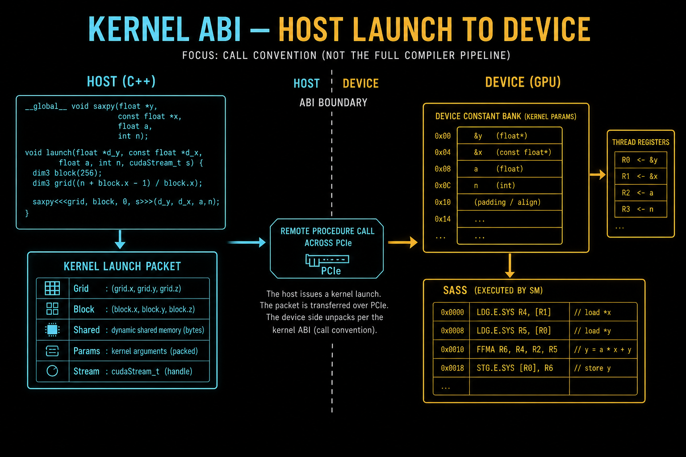

>在 C++ 语法层面，`__global__ void kernel(int a, float* b)` 看起来只是一个普通的函数定义。但在系统层面，这是一个跨越了 PCIe 总线、涉及 CPU 与 GPU 两种截然不同架构的远程过程调用（RPC）。
>本章我们将拆解 CUDA 的 **ABI (应用程序二进制接口)**。我们将追踪一个参数是如何从 Host 端的 CPU 寄存器，一路“偷渡”到 Device 端的 **Constant Memory Bank 0**；我们将对比 **PTX** 虚拟指令与 **SASS** 物理指令的差异；并探讨 **Inlining (内联)** 与 **Launch Bounds** 对寄存器压力（Register Pressure）的决定性影响。


## 1.Host / Device / Global 的本质 —— 它们不是“三个地方”，而是**三个世界**
### 1.1 先给一句“反直觉但正确”的结论

> **Host / Device / Global 不是 CUDA 的概念本质
> 而是“物理执行域 + 物理可见性”的划分**

很多人脑子里是这样想的（这是错的）：

```
Host Memory   ←→   Device Memory   ←→   Shared / Register
```

但真实世界是：

```
CPU 世界        GPU 世界
(Host)         (Device)
```

**Global 不是“第三个世界”**
它只是 **GPU 世界里的一种“跨 SM 可见的存储”**

---

### 1.2 Host（主机）的本质：CPU 的执行与内存一致性世界

#### 1.2.1 Host 到底是什么？

> **Host = CPU + CPU 内存系统 + CPU 的一致性与调度规则**

```
Host World:
┌──────────────────────────────┐
│ CPU Cores                    │
│ L1/L2/L3 Cache               │
│ DRAM                         │
│ OS Scheduler                 │
│ Cache Coherence              │
└──────────────────────────────┘
```

#### 1.2.2 Host 的核心特性

* 强一致性（Cache Coherence）
* 指针语义真实
* 同步 = 线程级语义
* 延迟优先，吞吐其次

👉 **这是一个“控制流主导”的世界**

---

### 1.3 Device（设备）的本质：GPU 的吞吐执行域

#### 1.3.1 Device 到底是什么？

> **Device = GPU 芯片上的所有执行资源 + 调度逻辑**

```
Device World:
┌────────────────────────────────────┐
│ GigaThread Engine                  │
│ SM × N                             │
│ Warp Scheduler                     │
│ Register File                      │
│ Shared Memory                      │
│ L1/L2 Cache                        │
│ Memory Fabric                      │
└────────────────────────────────────┘
```

#### 1.3.2 Device 的核心特性

* 没有全局一致性（弱一致 / 显式同步）
* 执行单位是 Warp
* SIMT / 锁步
* 吞吐优先，延迟隐藏

👉 **这是一个“数据并行主导”的世界**

---

### 1.4 Global 的本质：GPU 世界里的“公共公告板”

这是**最多人误解的地方**。

---

#### 1.4.1 Global 不是“主存”

> **Global Memory ≠ DRAM 本身**

Global 是一个**逻辑可见性层级**：

```
Global Memory (逻辑)
┌───────────────────────────┐
│ 所有 SM 可寻址             │
│ 所有 Kernel 可访问         │
│ 生命周期 ≥ Kernel          │
└───────────────────────────┘
```

#### 1.4.2 Global 的物理现实

```
物理路径：
SM → L1 → L2 → DRAM (HBM/GDDR)
```

* L2 是 **Global 一致性锚点**
* SM 的 L1 是私有的
* **Global 的一致性不是自动的**

---

#### 1.4.3 Global 为什么慢？

不是因为“在显存里”，而是因为：

* 跨 SM
* 需要 Fabric
* 延迟巨大
* 同步语义弱

👉 **慢的是“可见性半径”，不是介质**

---

### 1.5 用一张“世界边界图”压缩理解

```
                Host World
┌────────────────────────────────────┐
│ CPU + DRAM                         │
│ 强一致性 / 线程语义               │
└───────────────▲────────────────────┘
                │ PCIe / NVLink
                ▼
┌────────────────────────────────────┐
│            Device World             │
│                                    │
│   ┌──────────────┐                 │
│   │  SM0          │                 │
│   │  Reg / Shared │                 │
│   └──────────────┘                 │
│          ...                        │
│   ┌──────────────┐                 │
│   │  SMN          │                 │
│   │  Reg / Shared │                 │
│   └──────────────┘                 │
│                                    │
│   Global Memory (逻辑层)            │
│   ↳ L2 + DRAM                      │
└────────────────────────────────────┘
```

---

### 1.6 为什么 Global 无法当“同步原语”？

这是前面所有 Warp / Divergence 内容的**哲学落点**。

#### 1.6.1 错误直觉

```cpp
global_array[x] = 1;
// 另一个 block 马上能看到？
```

❌ **不保证**

原因不是 CUDA “不人性化”，而是：

* Block 不同步
* SM 不一致
* Global 不是强序

---

#### 1.6.2 正确模型

> **Global = 可见，但不同步**

你必须显式：

* `__threadfence()`
* kernel boundary
* stream / event

---

### 1.7 Host / Device / Global 对性能模型的终极影响

 1. 控制流问题（Warp / Divergence):只存在于 Device 世界  Instruction Replay / Bank
  2.  Conflict:发生在 SM 内部  Memory Divergence:发生在 Global 可见路径上 Tail
   3. Latency:Global + Block 不可抢占 的联合产物


## 2.参数传递的黑盒 & UVA—— Host 如何“把东西交给 GPU”，而不是“拷给 GPU”


### 2.1 为什么参数传递是一个“黑盒”

大多数人看到的是：

```cpp
kernel<<<grid, block>>>(a, b, c);
```

但你真正关心的是：

> **这些参数什么时候变成 GPU 能用的？
> 放在哪？
> 以什么形式？
> 谁来读？**

CUDA 把这一步**刻意做成了黑盒**，因为：

* 它跨越 **Host / Device 世界边界**
* 它涉及 **地址重映射**
* 它与 **UVA 深度绑定**

---

### 2.2 Kernel 参数并不是“直接传给线程”

#### 2.2.1 真正的路径（逻辑）

```
Host Stack / Heap
      │
      ▼
CUDA Runtime
      │  打包参数
      ▼
Kernel Parameter Buffer   ←← 关键
      │
      ▼
Device Launch Descriptor
      │
      ▼
SM 在启动 Warp 时读取
```

---

#### 2.2.2 Kernel Parameter Buffer 是什么？

> **它是一个只读、小容量、按 launch 固定的参数区**

特性：

* 生命周期 = kernel 生命周期
* 对所有 Warp 可见
* 只读
* **不是 global memory**
* 有独立访问路径（常量/参数通路）

👉 这就是为什么**参数访问很快**，也不会 Bank Conflict。

---

### 2.3 那指针参数呢？（黑盒的核心）

```cpp
kernel<<<>>>(float* p);
```

你以为传的是：

> “一个指向 global memory 的指针”

但真实是：

> **一个已经过 UVA 映射的“设备侧虚拟地址”**

---

### 2.4 UVA 的本质（不是“共享内存”）

#### 2.4.1 一句话结论

> **UVA = Host 和 Device 使用“同一套虚拟地址编码规则”
> 但不是同一个物理内存**

---

#### 2.4.2 没有 UVA 的世界（旧模型）

```
Host ptr:   0x7f12....
Device ptr: 0x3a000...
```

* 完全不同
* Runtime 必须翻译
* 指针不能透明传递

---

#### 2.4.3 有 UVA 的世界

```
Host ptr == Device ptr （虚拟地址）
```

但注意：

```
┌─────────────┐        ┌─────────────┐
│ Host Page   │        │ Device Page │
│ Table       │        │ Table       │
└──────▲──────┘        └──────▲──────┘
       │                       │
       └───── 虚拟地址相同 ────┘
```

👉 **地址一样，页表不同**

---

### 2.5 参数传递 + UVA 的真正意义

#### 2.5.1 Runtime 在 launch 时做了什么？

* 把参数值写入 Parameter Buffer
* 如果是指针：

  * 确保是 **Device 可解析的 UVA**
  * 或触发隐式迁移（Unified Memory）

#### 2.5.2 SM 在执行时看到什么？

* 一个 **已经合法的 device VA**
* 不知道它来自 Host 还是 Device
* 不关心你怎么 malloc 的

👉 **这就是“黑盒”的意义：隔离世界**

---

## 3、PTX 与 SASS 解剖 —— GPU 真正“执行的是什么”


### 3.1执行黑盒：你写的 CUDA ≠ GPU 执行的代码

你写的是：

```
CUDA C++
```

你看到的可能是：

```
PTX
```

但 GPU **真正执行的是**：

> **SASS（机器码）**

---

### 3.2 PTX 的本质：虚拟 ISA

#### 3.2.1 PTX 是什么？

> **PTX = NVIDIA 的“GPU 汇编中间表示”**

* 类似 LLVM IR
* 面向 Warp / SIMT
* 架构无关（部分）

---

#### 3.2.2 PTX 不会被 GPU 执行

```
CUDA C++
   ↓ nvcc
PTX
   ↓ JIT / ptxas
SASS
   ↓
GPU 执行
```

👉 **PTX 是给“编译器”和“驱动”看的，不是给 SM 看的**

---

### 3.3 SASS 的本质：Warp 级机器码

#### 3.3.1 SASS 才是真正的“指令”

* 固定长度
* 绑定具体架构（Ampere / Hopper / Blackwell）
* 明确：

  * 寄存器
  * Pipeline
  * Barrier
  * Memory Space

---

#### 3.3.2 一条 SASS 指令，Warp 级含义

> **一条 SASS = 32 个线程同时执行**

这就是 SIMT 的物理体现。

---

### 3.4 为什么理解 SASS 才能理解你前面所有问题？

 1.Divergence 在哪发生？

👉 **SASS 层的 Predicate Mask**

2. Instruction Replay 为什么发生？

👉 **SASS 指令发现部分线程未完成**


3. Bank Conflict 为什么导致 Replay？

👉 **SASS 发现单条指令无法完成所有 Lane**

4. ITS 解决了什么？

👉 **SASS 允许不同 Lane 拥有不同 PC**

---
### 3.5 SASS 级性能诊断：从 Stall 到 Replay

> CUDA 性能问题，**80% 不在算法，而在 SASS 的“停”和“重来”**。

---

#### 3.5.1 Stall：Warp 已就绪，但“不能发射”

**定义（硬件语义）**
Stall = Warp Scheduler **选择了你，但你当前指令无法 issue**。

##### 常见 Stall 类型（Nsight Compute 里的真因果）

| Stall 原因                | 本质资源                      |
| ------------------------- | ----------------------------- |
| `Stall Memory Dependency` | 数据没回来（global / shared） |
| `Stall Long Scoreboard`   | L2 / DRAM 未返回              |
| `Stall Short Scoreboard`  | Shared / LSU pipeline 冲突    |
| `Stall Pipe Busy`         | 对应执行单元满了              |
| `Stall Barrier`           | `__syncthreads()`             |
| `Stall Not Selected`      | Warp 不够多，隐藏不了延迟     |

##### SASS 视角下 Stall 长什么样

```sass
LDG.E.128 R8, [R2];   // 发射
...
// 后续依赖 R8
FMA R12, R8, R10;    // scoreboard 未清 → Stall
```

⚠️ **关键点**

* Stall 是**调度失败**，不是“算慢”
* Warp 是活的，但 pipeline 不给你走

---

#### 3.5.2 Replay：Warp 发射了，但“被迫重放”

**定义（硬件语义）**
Replay = 指令**已经 issue**，但由于 **lane 级条件不一致**，硬件必须拆成多次执行。

##### 典型 Replay 根因

| Replay 来源                 | 发生层              |
| --------------------------- | ------------------- |
| Global Memory 非对齐        | Memory Coalescer    |
| Shared Memory Bank Conflict | Shared LSU          |
| Predicate 分歧              | Warp Execution Mask |
| 原子操作冲突                | Atomic Unit         |

##### SASS 中 Replay 的真实位置

```sass
LDG.E.32 R8, [R2 + lane_offset];
```

* 指令 **只看到一条**
* Replay 次数 **不在 SASS**
* 只能在 **硬件事件计数器**看到

👉 **这也是为什么“看 PTX / SASS 看不出慢在哪”**

---

#### 3.5.3 Stall vs Replay 的本质差异

| 维度          | Stall               | Replay        |
| ------------- | ------------------- | ------------- |
| 是否发射      | ❌                   | ✅             |
| Warp 状态     | Ready 但阻塞        | Active 但分裂 |
| Nsight 可见性 | 明确                | 需事件推断    |
| 优化手段      | 增加并行度 / 减延迟 | 改访问模式    |

> **口诀**
> **Stall 是“你不能走”，Replay 是“你走了很多遍”**

---

### 3.6 PTX vs SASS 的“认知陷阱”

❌ 错误理解

> “我看 PTX 就知道性能了”

 ✅ 正确理解

> **PTX 决定“可能性”
> SASS 决定“现实”**

---

### 3.7“终极黑盒拆解图”

```
Host World
┌──────────────────────┐
│ CUDA C++             │
│ Kernel Launch        │
└─────────▲────────────┘
          │ 参数打包 / UVA
          ▼
Device World
┌──────────────────────┐
│ Kernel Param Buffer  │
│ PTX (逻辑程序)       │
│ SASS (真实指令)      │
│ Warp / Replay / ITS  │
└──────────────────────┘
```


> **UVA 解决的是“你能不能把东西交给 GPU”
> PTX/SASS 决定的是“GPU 到底怎么把活干完”**

---
## 4.GPU 执行全景图

> Host → Launch → Warp → 指令 → 内存 → Stall → Replay → Forward Progress


```
┌──────────────────────────────────────────────────────────────┐
│                          HOST WORLD                           │
│                                                              │
│  CUDA C++ / Kernel<<<>>>                                     │
│        │                                                     │
│        │ 参数打包（by Runtime）                               │
│        ▼                                                     │
│  Kernel Parameter Buffer  ←← 只读 / 小容量 / 全 Warp 可见     │
│        │                                                     │
│        │ 指针 = UVA 虚拟地址                                  │
│        ▼                                                     │
├───────────────────────── Host / Device 边界 ─────────────────┤
│                                                              │
│                         DEVICE WORLD                          │
│                                                              │
│  ┌────────────────────────────────────────────────────────┐  │
│  │                GigaThread Engine (Chip级)               │  │
│  │                                                        │  │
│  │   Grid → Block → SM 分发                               │  │
│  │   · 不看 Warp                                          │  │
│  │   · 只管 Block 生命周期                                │  │
│  └───────────────┬────────────────────────────────────────┘  │
│                  │ Block 派发                                │
│                  ▼                                          │
│  ┌────────────────────────────────────────────────────────┐  │
│  │                      SM 内部                             │  │
│  │                                                        │  │
│  │  ┌─────────────────────────────────────────────────┐  │  │
│  │  │            Block Residency / Resources           │  │  │
│  │  │  Reg / Shared / Warp Slots                       │  │  │
│  │  └───────────────┬─────────────────────────────────┘  │  │
│  │                  │ Warp 切分 (32 threads)             │  │
│  │                  ▼                                    │  │
│  │  ┌─────────────────────────────────────────────────┐  │  │
│  │  │                    Warp                          │  │  │
│  │  │                                                 │  │  │
│  │  │  SIMT 物理本质：One PC + 32 Lanes                 │  │  │
│  │  │                                                 │  │  │
│  │  │  Active Mask (32-bit)                            │  │  │
│  │  │  Predicate Registers (P0–P6)                     │  │  │
│  │  └───────────────┬─────────────────────────────────┘  │  │
│  │                  │ Warp Scheduler                     │  │
│  │                  ▼                                    │  │
│  │  ┌─────────────────────────────────────────────────┐  │  │
│  │  │      Warp Scheduler × Issue Logic                │  │  │
│  │  │                                                 │  │  │
│  │  │  · Select Ready Warp                             │  │  │
│  │  │  · Dual / Multiple Issue                         │  │  │
│  │  │  · Hide Latency                                  │  │  │
│  │  └───────────────┬─────────────────────────────────┘  │  │
│  │                  │ 发射 SASS 指令                     │  │
│  │                  ▼                                    │  │
│  │  ┌─────────────────────────────────────────────────┐  │  │
│  │  │               SASS 执行 (Warp级)                  │  │  │
│  │  │                                                 │  │  │
│  │  │  ALU / LDST / SFU                                │  │  │
│  │  │                                                 │  │  │
│  │  │  ▸ Predicated Execution                          │  │  │
│  │  │    - 所有 Lane 通电                              │  │  │
│  │  │    - Mask=0 → 写回被抑制                         │  │  │
│  │  │                                                 │  │  │
│  │  │  ▸ Branch Divergence                              │  │  │
│  │  │    - Serialize Path A / Path B                   │  │  │
│  │  │    - Reconverge at IPDOM                         │  │  │
│  │  └───────────────┬─────────────────────────────────┘  │  │
│  │                  │                                   │  │
│  │                  │ Memory Instruction                │  │
│  │                  ▼                                   │  │
│  │  ┌─────────────────────────────────────────────────┐  │  │
│  │  │           Memory Subsystem                       │  │  │
│  │  │                                                 │  │  │
│  │  │  Global / Shared / L1 / L2                       │  │  │
│  │  │                                                 │  │  │
│  │  │  ▸ Memory Coalescing                             │  │  │
│  │  │  ▸ Bank Mapping (Shared)                         │  │  │
│  │  │                                                 │  │  │
│  │  │  Bank Conflict?                                  │  │  │
│  │  │    → Instruction Replay                          │  │  │
│  │  │                                                 │  │  │
│  │  │  Memory Divergence?                              │  │  │
│  │  │    → Partial Lane Completion                     │  │  │
│  │  └───────────────┬─────────────────────────────────┘  │  │
│  │                  │                                   │  │
│  │                  ▼                                   │  │
│  │  ┌─────────────────────────────────────────────────┐  │  │
│  │  │         Instruction Replay Engine                │  │  │
│  │  │                                                 │  │  │
│  │  │  同一 SASS 指令                                  │  │  │
│  │  │  多次执行 / 分批完成                             │  │  │
│  │  └───────────────┬─────────────────────────────────┘  │  │
│  │                  │                                   │  │
│  │                  ▼                                   │  │
│  │  ┌─────────────────────────────────────────────────┐  │  │
│  │  │       ITS (Independent Thread Scheduling)        │  │  │
│  │  │                                                 │  │  │
│  │  │  Lane-level PC                                  │  │  │
│  │  │  Lane-level Stall / Resume                      │  │  │
│  │  │                                                 │  │  │
│  │  │  ✔ Forward Progress                             │  │  │
│  │  │  ✘ Divergence 吞吐损失仍存在                    │  │  │
│  │  └─────────────────────────────────────────────────┘  │  │
│  └────────────────────────────────────────────────────────┘  │
└──────────────────────────────────────────────────────────────┘
```

 这张图里，已经**完整覆盖**了：

* ✔ SIMT 物理本质
* ✔ Warp / Active Mask / Predicate
* ✔ Divergence（控制 + 内存）
* ✔ Warp Scheduler / Issue
* ✔ Bank Conflict → Instruction Replay
* ✔ ITS：解决 Forward Progress，不解决吞吐
* ✔ GigaThread vs SM vs Warp 职责边界
* ✔ Host / Device / UVA / 参数黑盒
* ✔ PTX（逻辑）vs SASS（现实）


> **性能 = Warp 在时间轴上“有效 Lane × 有效 Issue × 有效 Memory 完成”的积分**


## 4. 资源控制：

编译器（NVCC）的目标通常是**减少指令数**，而开发者的目标是**最大化吞吐量**。这两者有时是矛盾的。


### 4.1 寄存器分配的博弈
编译器为了减少指令数，倾向于使用更多的寄存器来缓存中间变量（避免 Spilling 到 Local Memory）。
然而，SM 上的物理寄存器总数是固定的（64K 个）。如果一个线程用的寄存器太多，SM 能同时驻留的线程块（Block）就会变少。
*   **后果**：Occupancy（占用率）下降，导致 Active Warps 不足以掩盖 Global Memory 的访问延迟。

### 4.2 开发者契约
`__launch_bounds__(max_threads_per_block, min_blocks_per_multiprocessor)` 是开发者与编译器之间的一纸契约。

*   **开发者承诺**：我这个 Kernel 的 Block Size 不会超过 `max_threads_per_block`。
*   **编译器承诺**：我会限制每个线程使用的寄存器数量，确保每个 SM 至少能塞进去 `min_blocks_per_multiprocessor` 个 Block。

**典型用法**：
```cpp
// 强制编译器将寄存器压到一定程度，保证每个 SM 至少跑 2 个 Block
__global__ void __launch_bounds__(256, 2) my_kernel(...) { ... }
```
如果不加这个修饰符，编译器可能会为了省几条指令，把寄存器用到极致，结果导致每个 SM 只能跑 1 个 Block，整体性能反而崩盘。

---

## 5. 工程实战：Kernel 结构分析

本章的配套代码将展示如何编写测试用例来验证上述理论。我们将构建不同的 Kernel，分别测试参数容量极限、内联行为对 SASS 的影响，以及 Launch Bounds 对寄存器使用量的控制。

> **[💻 项目 `examples/01_cuda_basics/05_kernel_structure.cu`]**
> *   *代码包含：参数传递压力测试、`__forceinline__` 效果验证、`__launch_bounds__` 寄存器限制演示。*
> * 地址:https://github.com/Yapeng-Gao/AI-System-Performance-Lab
> 欢迎打击多多建议,多多star

---

## 📚 参考文献与延伸阅读

1.  **NVIDIA CUDA Binary Utilities**
    *   *工具手册：如何使用 `cuobjdump` 和 `nvdisasm` 提取和分析 SASS 代码。*
    *   [Link](https://docs.nvidia.com/cuda/cuda-binary-utilities/index.html)
2.  **PTX ISA Specification (v8.3)**
    *   *查询 PTX 指令含义的字典，理解 `.param` 空间和 `.reg` 空间的定义。*
3.  **CUDA ABI (Application Binary Interface)**
    *   *虽然 NVIDIA 未完全公开 ABI 文档，但 GTC 演讲 "CUDA Under the Hood" 提供了关于 Parameter Bank 和 Stack Frame 的宝贵细节。*