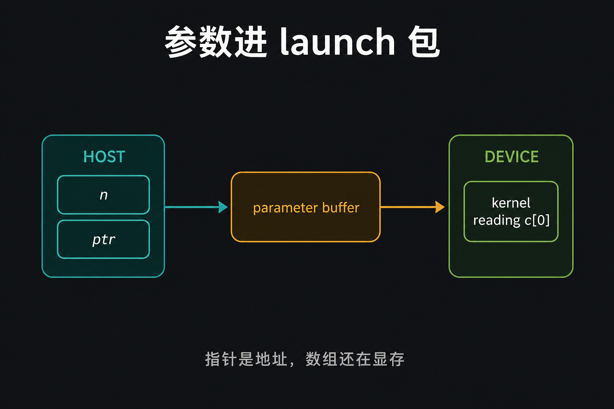
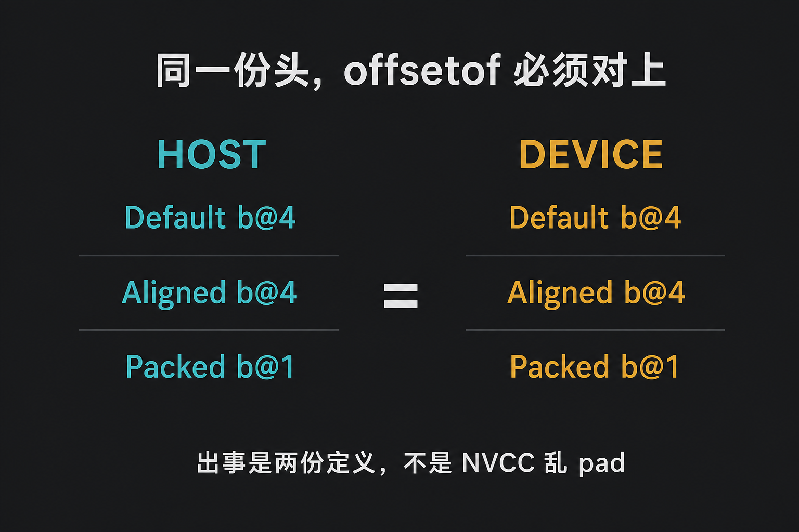
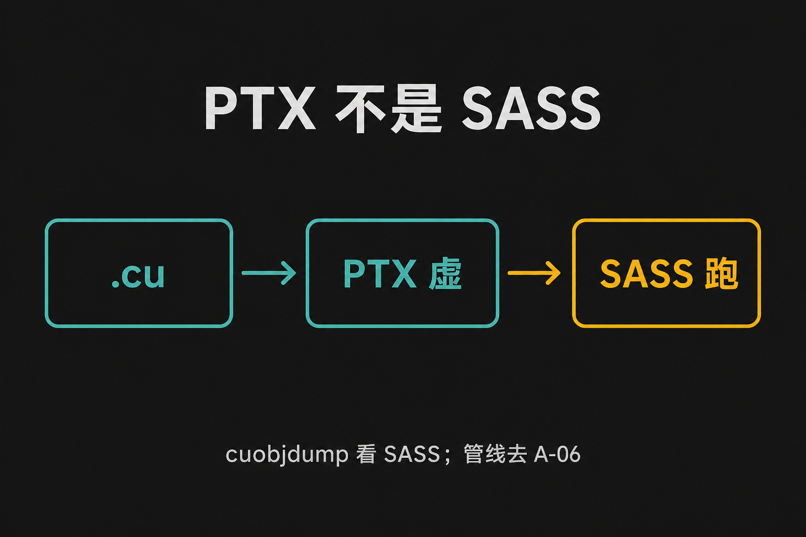
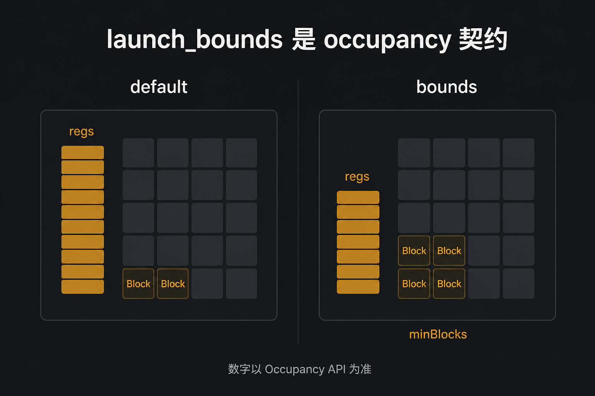

# A-05. Kernel 结构与 ABI：参数怎么进 Device

![A-05 封面：Host 把 launch 包交给 Device，参数走 c[0]](assets/A-05-kernel-abi-cover.png)

> A-04 停在 Warp：一条指令、mask、Replay。  
> 本章进 Host/Device 边界：**参数怎么进 kernel、对齐对不对、PTX 不是 SASS、`launch_bounds` 是 occupancy 契约**。  
> 工具链拆分去 A-06；UVA 去 A-07；spill 处方去 B-03。Replay 不在本章重讲。

**配套可复现**：[Yapeng-Gao/AI-System-Performance-Lab](https://github.com/Yapeng-Gao/AI-System-Performance-Lab)（文章 + `.cu` + 实测表）。有用请 Star。本章示例：[`examples/01_cuda_basics/05_kernel_structure.cu`](https://github.com/Yapeng-Gao/AI-System-Performance-Lab/blob/main/examples/01_cuda_basics/05_kernel_structure.cu)。

---

## TL;DR（工程结论）

1. **`kernel<<<>>>` 是 launch 包，不是 C++ 函数调用。** 参数被拷进 parameter buffer；常见实现落到常量内存 bank 0，SASS 里看见 `c[0x0][…]`。
2. **指针参数传的是地址，不是把数组搬过去。** 数据还在你 `cudaMalloc` / UM 的那块。UVA 怎么解释地址去 A-07。
3. **对齐用同一份头 + 显式 `alignas` / `#pragma pack`。** Host 和 Device 对一下 `offsetof` / `sizeof`。不要写「NVCC 会自己乱 pad」。出事是两份定义、一边 pack 一边没 pack。
4. **PTX 是虚拟 ISA，SASS 才跑。** 看内联、看参数加载，用 `cuobjdump -sass`。完整 nvcc / Fatbin / NVRTC 去 A-06。
5. **`__launch_bounds__(maxThreads, minBlocks)` 是 occupancy 契约。** 本机用 `cudaFuncGetAttributes` + `cudaOccupancyMaxActiveBlocksPerMultiprocessor` 看 regs / local / blocks/SM。数字以打印为准，不要先写「default 一定更多寄存器」。spill 去 B-03。

---

## 1. 本章钉什么，不抢哪章

| 问题 | 本章 | 不在本章 |
|---|---|---|
| 参数怎么进 kernel？ | 图 1：launch 包 / `c[0]` | Stream / Event 计时（A-08） |
| 结构体两边对得上吗？ | 图 2：同一份头，打印 offsetof | 空间名字、UVA（A-07） |
| 我写的 C++ 就是机器码吗？ | 图 3：PTX ≠ SASS | nvcc 驱动器、Fatbin、NVRTC（A-06） |
| 为什么有 `CALL`？ | `__noinline__`；`cuobjdump` | Replay / Divergence（A-04） |
| 怎么压 occupancy？ | 图 4：`launch_bounds` + Occupancy API | 寄存器处方、spill 怎么改（B-03） |
| Host / Device 为何分家？ | 一句：调用约定跨世界 | 延迟 vs 吞吐正文（A-01） |

---

## 2. 参数：拷的是包，不是数组

CPU 上 `foo(n, ptr)` 按 C/C++ ABI：参数进寄存器或栈，被调函数用同一套约定去拆。GPU 上没有这条栈。写下 `foo<<<grid, block>>>(n, ptr)` 时，Host 不会按 C 的 calling convention 把东西推进 GPU 栈。Runtime 组一份 **launch 描述**：grid/block、stream、**参数字节**。这份字节进 **parameter buffer**，所有即将开跑的 Warp 只读可见。

SIMT 也决定了不能按线程压栈：32 条 lane 共享这一拍指令，参数必须是「这次 launch 一份」，不是「每条线程一份 CPU 栈帧」。

```text
Host 栈 / 堆上的实参
        │  Runtime 打包
        ▼
parameter buffer（本次 launch 一份，只读）
        │  现行实现常落到常量通路
        ▼
SASS：MOV R…, c[0x0][0x…]
        │
        ▼
各 Warp 启动时自己读，不是「按线程压栈」
```

这块缓冲的工程性质：

| 性质 | 含义 |
|---|---|
| 生命周期 = 这次 launch | kernel 结束就没了，不要当全局表 |
| 所有 Warp 只读可见 | 当查找表可以，当可写共享不行 |
| 不是 Global Memory | 走参数 / 常量通路；别按 GMEM 合并规则去优化它 |
| 容量小 | 编程指南写 **约 4 KiB**；塞爆了改传指针 |

现行实现里，kernel 开头常从常量内存 bank 0 读出来，SASS 是 `MOV R…, c[0x0][0x…]`。`05_inspect_asm.sh` / `cuobjdump` 搜 `c[0x0]` 就是在看这件事。



> 图 1：`int n` 拷的是 4 个字节；`float* ptr` 拷的是指针宽度。数组本体另走显存。

指针参数在包里只有一个 **Device 能解析的虚拟地址**。Runtime 在 launch 时保证这个地址对 GPU 合法（普通 `cudaMalloc` 指针、或 UM 触发迁移后的地址）。SM 执行时看见的就是这个 VA，不管你 Host 上怎么 `malloc` 的。

UVA 是「同一套虚拟地址编码，两套页表」，**不是**共享一块物理内存。空间与 Zero-Copy 去 **A-07**。本章只记：参数包里没有数组本体。

热路径上不要每次 launch 搬一大坨值结构体。超过 4 KiB 上限会直接 launch 失败。

---

## 3. 对齐：对 offsetof，不要猜

Host 编译器（MSVC / gcc）和 Device 前端会**各解一次**结构体布局。同一份定义通常得到同一套 `offsetof` / `sizeof`：两边都按 C++ ABI 的对齐规则 pad。都市传说是「NVCC 会自己乱 pad」「Host pad 0、Device pad 3」。现代默认 ABI 常常两边都是 4。真出事的是：两份头各写各的、一边 `#pragma pack` 一边没有、C 和 C++ 混编、或 Host 塞了一个 Device 看不见的虚函数指针。

所以处方不是「相信 NVCC」，是**同一份头 + 显式布局 + 两边打印核对**。示例里三个结构体共用同一份定义：

```cpp
struct DefaultLayout { char a; int b; };
struct AlignedLayout { alignas(4) char a; int b; };
#pragma pack(push, 1)
struct PackedLayout { char a; int b; };
#pragma pack(pop)
```

同一 `.cu` 里，Host `offsetof` 和 Device `offsetof` **应当一致**。`PackedLayout` 的 `b` 一般在偏移 1；另外两个一般在 4。值能对上，说明这份布局真的进了 launch 包。



> 图 2：都市传说是「Host pad 0、Device pad 3」。现代默认 ABI 常常两边都是 4。真 bug 是 Host 单独 `#pragma pack`、两份头、或 C 和 C++ 混编。

工程习惯：跨边界的结构体写进公共头，需要稳定布局就 `alignas` 或显式 pad 字段。不要靠「我这台机器碰巧一样」。

---

## 4. PTX 不是 SASS

A-01 图 6 已经画过 nvcc 分流。本章把中间两层钉死，因为 ABI 上的证据都在 SASS，不在你写的 C++，也不在 PTX。

```text
CUDA C++     你写的
   ↓ nvcc frontend
PTX          虚拟 ISA，给编译器 / 驱动看
   ↓ ptxas 或驱动 JIT
SASS         该 sm_XX 的机器码，SM 真正执行
```

**PTX** 类似 LLVM IR：面向 SIMT、相对架构无关、可以 JIT。GPU **不执行** PTX。同一份 PTX 落到 Ada 和 Hopper 上会变成两套 SASS。

**SASS** 绑具体架构：寄存器编号、管道、访存空间、barrier 都在这一层写死。固定字长，`cuobjdump -sass` 看到的就是它。锁步 / mask 的执行语义见 A-04。



> 图 3：Fatbin 里常有多份 SASS。怎么拆、怎么 JIT，去 A-06。

本章用 SASS 只看两件 ABI 的事：

1. 参数：`c[0x0][…]` 证实 launch 包进了常量通路。
2. 调用约定：`__noinline__` 通常留下 `CALL`（老文档写 `CAL`），参数可能进 Local；`__forceinline__` 把函数体摊进调用点，体积涨、调用没了。

看一眼就够，不必为此包一次 event。

```bash
# Linux / macOS
cuobjdump -sass ./bin/01_cuda_basics_05_kernel_structure | grep -E 'CALL|c\[0x0\]'
# Windows
cuobjdump -sass ./bin/01_cuda_basics_05_kernel_structure.exe | findstr CALL
cuobjdump -sass ./bin/01_cuda_basics_05_kernel_structure.exe | findstr c[0x0]
```

仓库里还有 `examples/01_cuda_basics/05_inspect_asm.sh`，会搜 `CAL` / `c[0x0]`。

**PTX 看不出性能。** PTX 里的寄存器是虚拟的，指令条数和最终 SASS 也对不齐；`ptxas` 会重排、折叠、改成架构专有指令。PTX 决定「能编成什么」，SASS 决定「这张卡上到底发出去什么」。Nsight 里的 stall / replay 用 A-04 的三列去读，本章不重开那张表。

---

## 5. 寄存器博弈和 launch_bounds

编译器默认倾向：**能放寄存器就放寄存器**。单线程变快，但这颗 SM 的寄存器总量是死的（A-02：常见说法每 SMSP 16K 个 32-bit）。每线程多拿一倍，能同时驻留的 Warp 可能腰斩，延迟掩盖变差。这就是 occupancy 墙，公式在 A-03。

`__launch_bounds__(maxThreadsPerBlock, minBlocksPerMultiprocessor)` 是你跟 `ptxas` 签的契约，不是加速开关：

- 第一元：这个 kernel 按多大 Block 来编（超过就编不进去或警告）。
- 第二元：每 SM **至少**要能同时驻这么多个 Block。编译器必须把每线程寄存器压到这个目标下面；压不住就 spill 到 Local（物理上是 HBM，SASS 里是 `LDL` / `STL`）。



> 图 4：本机打印 `regs` / `local` / `blocks/SM`。两边数字可能很接近——ptxas 已经压过了。以打印为准。

示例用 `cudaFuncGetAttributes` 和 occupancy API，不靠你去翻 Ninja 日志里的 `ptxas info`。`-Xptxas=-v` 仍可作旁证。

`launch_bounds` 保的是驻留下限，**不保证更快**。regs 下去了、local 上去了，热路径可能更慢。怎么减 spill、怎么换 occupancy，处方在 **B-03**。本章只证明：契约会改变 `numRegs` / `localSizeBytes` / `blocks/SM` 这三列。

---

## 6. 怎么跑

前置与导读相同：官方 CUDA Toolkit，CMake ≥ 3.25。在 `build/` 里：

```bash
cmake .. -DCMAKE_BUILD_TYPE=Release -DCMAKE_CUDA_ARCHITECTURES=native
cmake --build . --parallel --target 01_cuda_basics_05_kernel_structure
./bin/01_cuda_basics_05_kernel_structure
```

三组输出，都不是 kernel 墙钟：

| 对比 | 看什么 | 不要读成 |
|---|---|---|
| Default / Aligned / Packed | Host 与 Device 的 offsetof、sizeof、字段值 | 「NVCC 一定会和 MSVC 不一致」 |
| noinline vs forceinline | SASS 有没有 `CALL` | 一次 launch 的 ms |
| default vs `launch_bounds` | regs / local / blocks/SM | 已经做完 B-03；加速比账单 |

打印 GPU 名和 `sm_XX`。看 SASS 用 §4 的 `cuobjdump`（Linux `grep`，Windows `findstr`）。Windows 输出目录见 [`examples/01_cuda_basics/README.md`](https://github.com/Yapeng-Gao/AI-System-Performance-Lab/blob/main/examples/01_cuda_basics/README.md)。

---

## 7. 扩展阅读（不抢后续章）

1. CUDA C++ Programming Guide — kernel 参数与执行空间（见 §10-1）：4 KiB 上限、`__global__`。对照本章 §2。
2. 下一章 A-06：nvcc 驱动器、Fatbin、NVRTC。本章只看到 SASS 这一层。
3. CUDA Binary Utilities（见 §10-3）：`cuobjdump` / `nvdisasm`。不要在这里展开整条工具链。

---

## 8. SOP + 误区

1. 先跑示例，对 Host/Device 三行 offsetof。对不上先查是不是两份头、一边 pack。
2. 结构体当参数：先看 `sizeof` 是否接近 4 KiB；大了改传指针。
3. 要看内联或 `c[0]`：`cuobjdump -sass`，不要包 event。
4. occupancy 数字用 API；要减 spill：停，去 B-03。

| 误区 | 纠正 |
|---|---|
| kernel 调用 = C ABI | launch 包 + parameter buffer；见图 1 |
| 指针参数会把数组拷进常量内存 | 只拷地址 |
| Host 和 Device 默认一定对不齐 | 同一份头通常齐；对 offsetof |
| PTX 就是 GPU 在跑的东西 | SASS 才跑；见图 3 |
| `launch_bounds` 一定更快 | 契约是驻留；可能换来 spill |
| 本章在讲 Replay | 回 A-04 |

---

## 9. 小结与下一章

参数走 launch 包，指针只带地址。布局用同一份头核对。PTX 是中间层，SASS 才是机器码。`launch_bounds` 跟编译器谈 occupancy，不跟你谈加速比。

下一篇拆编译器驱动器：[A-06 CUDA 工具链](https://github.com/Yapeng-Gao/AI-System-Performance-Lab/tree/main/article/01_cuda_basic)（nvcc、Fatbin、NVRTC）。

---

> 本文配套代码与实测：[AI-System-Performance-Lab](https://github.com/Yapeng-Gao/AI-System-Performance-Lab)。觉得有用请 Star，后续章更新更好找。  
> 本章示例：[`examples/01_cuda_basics/05_kernel_structure.cu`](https://github.com/Yapeng-Gao/AI-System-Performance-Lab/blob/main/examples/01_cuda_basics/05_kernel_structure.cu)。下一篇：[A-06 CUDA 工具链](https://github.com/Yapeng-Gao/AI-System-Performance-Lab/tree/main/article/01_cuda_basic)。

## 10. 参考文献

**官方**

1. NVIDIA, *CUDA C++ Programming Guide*, Execution Space Specifiers / `__global__` function parameters（约 4 KiB）. https://docs.nvidia.com/cuda/cuda-c-programming-guide/
2. NVIDIA, *CUDA C++ Best Practices Guide*, Occupancy / `__launch_bounds__` / register usage. https://docs.nvidia.com/cuda/cuda-c-best-practices-guide/

**工具**

3. NVIDIA, *CUDA Binary Utilities*, `cuobjdump` / `nvdisasm`. https://docs.nvidia.com/cuda/cuda-binary-utilities/
4. NVIDIA, *CUDA Compiler Driver NVCC*. 分流与 Fatbin 正文在 A-06。 https://docs.nvidia.com/cuda/cuda-compiler-driver-nvcc/
