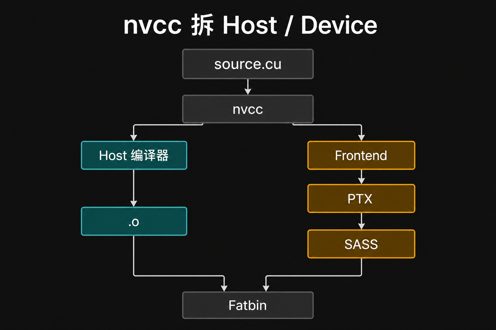
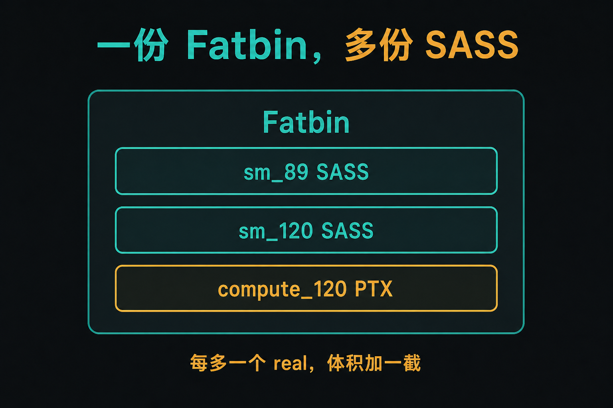
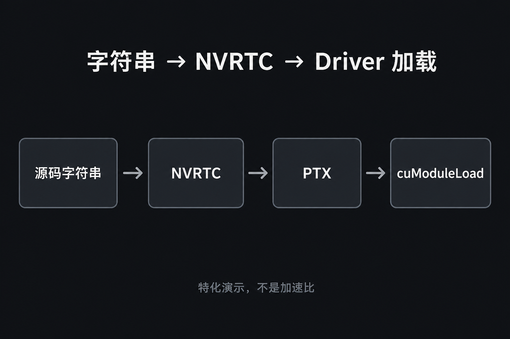

# A-06. CUDA 工具链：nvcc 拆包、Fatbin、NVRTC


> A-05 停在 launch 包和 SASS 这一层。  
> 本章进工具链：**nvcc 是驱动器、`arch`/`code` 决定 Fatbin 里有什么、NVRTC 在运行时特化**。  
> 参数 ABI 回 A-05；UVA 去 A-07；launch 税数字去 C-06。仓库里没有 Triton，不当已开课。

**配套可复现**：[Yapeng-Gao/AI-System-Performance-Lab](https://github.com/Yapeng-Gao/AI-System-Performance-Lab)（文章 + `.cu` + 实测表）。有用请 Star。本章示例：[`examples/01_cuda_basics/06_nvrtc_jit.cpp`](https://github.com/Yapeng-Gao/AI-System-Performance-Lab/blob/main/examples/01_cuda_basics/06_nvrtc_jit.cpp)。

---

## TL;DR（工程结论）

1. **`nvcc` 是驱动器，不是「一个编译器吃掉整个 `.cu`」。** Host 交给系统 C++（MSVC / gcc / clang）；Device 走 NVIDIA frontend → PTX → `ptxas` → SASS，最后打进 Fatbin。
2. **`CMAKE_CUDA_ARCHITECTURES` 决定包里有哪些 SASS / PTX。** 本仓库按导读 **CMake ≥ 3.25**，本机开发用 `native`；5090 探测失败写 `120`。标志门槛：数字 `89` / `120` 从 3.18 就能写；`native` 与 `*-real` / `*-virtual` 要 **3.24+**。发行再写多份 real 加一份最高 virtual。
3. **Fatbin 胀，是因为你装了多份机器码。** 每多一个 `sm_XX` 的 SASS 就多一份体积。不要把「某 PyTorch 扩展几百 MB」写进本章当实测。
4. **只有 PTX、没有匹配 SASS 时，驱动会现场 JIT。** 第一次启动会卡；缓存命中就不再编。这是驱动行为，不是 kernel 算法。
5. **NVRTC = 运行时特化 + Driver API 加载。** 示例把 `scale` 写进源码字符串，按本机 `compute_XY` 出 PTX，`cuModuleLoadData` 再 launch。打印 GPU、PTX 字节、**编译墙钟**（`nvrtcCompileProgram`，不是 event）。正确性看 `5*1+2=7`。

---

## 1. 本章钉什么，不抢哪章

| 问题 | 本章 | 不在本章 |
|---|---|---|
| `.cu` 怎么拆成两边？ | §2 + 图 1：nvcc 驱动器 | Host/Device 为何分家（A-01） |
| PTX 和 SASS 谁在跑？ | §2 右路：PTX 可 JIT，SASS 才执行 | `c[0]` / `CALL` / `launch_bounds`（A-05） |
| 为什么二进制那么大？ | 图 2：多份 SASS | 发行打包、conda 体积审计 |
| 第一次跑为什么慢？ | 驱动 JIT / 缓存 | Graph replay 税（C-06） |
| 运行时才能定常量？ | 图 3：NVRTC | Triton / 生产 JIT 服务 |
| Runtime 和 Driver 怎么混？ | §5：NVRTC 加载走 Driver，内存可走 Runtime | launch 税数字（C-06） |
| 参数怎么进 kernel？ | 回 A-05 | 再讲一遍 parameter buffer |

---

## 2. nvcc：拆包，不是一个人编译

`.cu` 看起来像一份 C++，里面其实是**两套程序**：Host 上的 `main`、`cudaMalloc`、`<<<>>>`；Device 上的 `__global__` / `__device__`。CPU 有操作系统、栈、C ABI；GPU 是 SIMT，没有 syscall，调用约定也不是 C（A-05）。没有哪个编译器能同时按两种语义吃完整份文件。

`nvcc` 的第一件事是找到这条边界。它认出执行空间说明符，把 Host 片段交给系统 C++ 编译器（MSVC / gcc / clang），把 Device 片段交给 NVIDIA frontend。两边各自变成目标码，最后再缝进同一个可执行文件。所以说它是**驱动器**：决定谁编哪一段、中间表示叫什么、何时打包——它自己不是「CUDA 版 gcc」。



> 图 1：左边系统 C++ 编译器；右边 Frontend → PTX → ptxas → SASS。你在 CMake 里写的架构标志，管的是右边那条路。

右边那条路还要再冻两次。Frontend 先吐 **PTX**：面向 SIMT 的虚拟 ISA，相对架构无关，可以带进包里以后再编。`ptxas` 或驱动 JIT 再冻成 **SASS**：绑死 `sm_XX` 的寄存器、管道、访存空间。GPU 只执行 SASS。A-05 用 SASS 看 `c[0]` 和 `CALL`；本章管的是「这两层怎么被放进二进制」。

`<<<>>>` 是 Host 侧语法糖，展开成 Runtime 的 launch 调用。Device 侧看不到 `main`，也不能按 CPU 的方式 `malloc`。同一份文件、两套语义，这就是为什么跨边界的结构体必须共用头文件（A-05）：Host 编译器和 Device 前端会各解一次布局。

---

## 3. Fatbin：`arch` 是虚的，`code` 是实的

GPU 的机器码几乎一代一换。你不可能为用户可能插上的每张卡都只留一份 SASS，又不能强迫所有人现场从源码编译。NVIDIA 的折中是 **Fatbin**：一个容器里同时放「已经冻好的 SASS」和「还能再冻的 PTX」。

老的 `nvcc -gencode` 把这层写得很直白：

```text
-gencode=arch=compute_89,code=sm_89     # 这份 SASS，只跑 Ada
-gencode=arch=compute_120,code=sm_120   # 这份 SASS，只跑 5090 这类
-gencode=arch=compute_120,code=compute_120  # 只带 PTX，驱动可 JIT
```

`arch=compute_XX` 是虚拟架构，决定 PTX 长什么样；`code=sm_XX` 是真实架构，决定打进去的是哪份 SASS。`code=compute_XX` 则只放 PTX。一份 Fatbin 可以同时装好几对。

**向前兼容靠 PTX。** 二进制里有足够新的 PTX、没有这张卡的 SASS 时，驱动会在加载时编出 SASS。新卡能跑旧包，前提是包里真有 PTX。**向后不兼容。** 5090 的 `sm_120` SASS 不能拿去 Ada 上执行；旧卡既没有这份 SASS、PTX 的虚拟架构又过高，就会加载失败。

这就是「第一次启动卡住」的常见来源之一：不是 kernel 算法慢，是驱动在 JIT。编完的结果进驱动缓存，下次命中就不再编；清缓存、换驱动、换用户目录，又会再编一次。C-06 量的是 Graph replay 税，不要和这段 JIT 墙钟混在一张表里。

本仓库按导读 **CMake ≥ 3.25**，不必手写 `-gencode`，用 `CMAKE_CUDA_ARCHITECTURES`。下面的 3.18 / 3.24 是**标志门槛**（看别人的老 CMakeLists 时用），不是叫你把本仓库降回去。数字 `89` / `120` 从 3.18 就能写；`native` 和 `*-real` / `*-virtual` 是 **3.24+**：

| 你想要 | 写法 | 门槛 |
|---|---|---|
| 本机开发 | `native`（探测失败再写死 `89` / `120`） | 3.24 才有 `native`；更早写死数字 |
| 只给 5090 的 SASS | `120`；或 3.24+ 的 `120-real` | 3.18 写 `120` 即可 |
| 发行多卡 + 给更新卡留 JIT | 3.24+：`89-real;120-real;120-virtual`；更早等价于多份 `-gencode` | 不要在 3.18 上抄 `-real` 后缀 |



> 图 2：每多一个 `*-real`，体积加一截。只留最高 PTX，新卡能 JIT，旧卡没有 SASS 就跑不了。

体积来自「装了几份机器码」，不是「算法有多复杂」。每多一个 `sm_XX` 的 SASS，包就大一截。只留一份最高 PTX，包小、新卡能 JIT、旧卡可能直接不能跑。发行前用 `cuobjdump -lelf` / `-ptx` 看 Fatbin 里到底有哪些段；A-01 示例旁的 `01_fatbin_inspect.sh` 就是干这个。不要把「某 PyTorch 扩展几百 MB」写进本章当实测。

选 `CMAKE_CUDA_ARCHITECTURES` 时：Ada 写 `89`，不是 Hopper 的 `90`。本仓库 5090 写 `120`，不要把 B200 的 `sm_100` 整份扣过来。TMA 有无是 ISA 门槛，见 A-02 / B-08。

---

## 4. NVRTC：运行时才定下来的常量

静态 `nvcc` 在 `cmake --build` 时就把 Device 侧冻进 Fatbin。尺度、dtype、tile 若要到运行时才知道，静态包里只能当**参数**传进去——走 A-05 的 parameter buffer，`c[0x0][…]` 读出来。编译器看见的是「一个变量」，不能当成立即数去折。

另一条路是**现场再编一次**：把已经确定的数字写进源码字符串，让这次编译按常量处理。这就是特化。它**可能**让 `ptxas` 生成立即数运算，少一次常量内存读；本章示例**不证明**一定更快，只证明这条路能编、能加载、能跑出 `7.0`。SASS 长什么样，用 `cuobjdump`，不要在 C++ 注释里写死 `FMUL`。

NVRTC 是「只要 Device 前端、不要整份 nvcc 驱动器」：输入是 C++ 字符串，输出是 PTX（也可以要 cubin）。它不会替你扫 `.cu` 里的 `main`，也不会把系统 C++ 编译器叫来。所以头文件、`--std`、`--gpu-architecture`、编译日志都要自己管。架构必须写成**这张卡**的 `compute_XY`，否则 `cuModuleLoadData` 报 `CUDA_ERROR_INVALID_PTX`——旧卡示例里常见的坑，不是「NVRTC 坏了」。

加载和 launch 必须走 **Driver API**：`cuModuleLoadData`、`cuModuleGetFunction`、`cuLaunchKernel`。这份 kernel 不在当前可执行文件的 Fatbin 里，Runtime 的 `<<<>>>` 找不到它。



> 图 3：示例把 `5.0f` 写进源码。特化演示，不是加速比账单。

工程代价：

- **Host 墙钟**在 `nvrtcCompileProgram`。示例会打印。这不是 kernel event（A-08），也不是 C-06 的 Graph 税。
- 缺头文件、架构写错、日志非空就 launch，都会在这一层爆，不会在 SAXPY 里默默算错。
- 生产还要管缓存、并发、磁盘上的 cubin。本章不做服务。

Triton / 推理框架的 JIT 是另一条栈：它们也是「运行时出 PTX/SASS」，但前端不是你手写的 CUDA 字符串。仓库里没有，规划在 Module D/E。

---

## 5. Runtime 和 Driver 可以混

CUDA 对外其实是两套 C API。**Driver API**（`cu*`）更靠近驱动：你要自己 `cuInit`、建 context、加载 module、准备 `void*` 参数再 `cuLaunchKernel`。**Runtime API**（`cuda*`、`<<<>>>`）是盖在上面的便利层：第一次碰到 CUDA 调用时，它替你把默认 context 拉起来，把链进可执行文件的 Fatbin 当模块加载，默认 stream 也替你建好。

所以日常写 `cudaMalloc` / `hello<<<>>>` 的人可以一辈子不碰 `cuModuleLoadData`。代价是：你看不清「模块是什么时候进 GPU 的」。第一次 CUDA 调用的 Host 时间里，常常包括建上下文、映射 Fatbin、偶尔还有 PTX JIT。这段很容易被误读成 kernel 慢。量 kernel 用 event（A-08）；量 launch 税去 C-06。

NVRTC 这条路**必须露出 Driver**：现场编出来的 PTX 还不在当前进程的静态 Fatbin 里，Runtime 没有符号可以 `<<<>>>`。加载协议是 `cuModuleLoadData` → `cuModuleGetFunction` → `cuLaunchKernel`，参数是 `void*` 数组，没有语法糖。

内存对象是设备上的 buffer，不归哪一套 API 私有。示例因此混用：Driver 负责加载和 launch，Runtime 负责 `cudaMalloc` / `cudaMemcpy`。这是同一块 GPU、同一个 context，不是两张卡。不要写成「上了 Driver 就更快」——更快的是少一层包装，还是多一次 JIT，本章都没有账单。

---

## 6. 怎么跑

前置与导读相同：官方 CUDA Toolkit，CMake ≥ 3.25。在 `build/` 里：

```bash
cmake .. -DCMAKE_BUILD_TYPE=Release -DCMAKE_CUDA_ARCHITECTURES=native
cmake --build . --parallel --target 01_cuda_basics_06_nvrtc_jit
./bin/01_cuda_basics_06_nvrtc_jit
```

看这几行：GPU / `compute_XY`、特化后的源码、`compile host-ms`、`PTX bytes`、`verify PASS`。数字以本机打印为准。

| 对比 | 看什么 | 不要读成 |
|---|---|---|
| 特化字符串 | `5.0f` 写进源码 | 已经量过比参数 launch 更快 |
| `compile host-ms` | NVRTC 编译墙钟 | kernel 时间、C-06 Graph 税 |
| PTX 字节 | 这份 demo 很小 | Fatbin 发行体积 |
| PASS 7.0 | 加载 + launch 通了 | 加速比 |

Windows 输出目录见 [`examples/01_cuda_basics/README.md`](https://github.com/Yapeng-Gao/AI-System-Performance-Lab/blob/main/examples/01_cuda_basics/README.md)。

---

## 7. 扩展阅读（不抢后续章）

1. CUDA Compiler Driver NVCC（见 §10-1）：`-gencode` / Fatbin。对照本章 §2–§3。
2. 下一章 A-07：内存空间与 UVA。工具链到此停。
3. NVRTC User Guide（见 §10-3）：选项与日志。不要在这里展开生产 JIT 服务。

---

## 8. SOP + 误区

1. 本机先 `native`。探测失败再写死：Ada `89`，5090 `120`。
2. 发行包用 `cuobjdump -lelf` 对一下有哪些 `sm_`，再谈体积。
3. NVRTC 的 `--gpu-architecture` 必须对上这张卡；日志非空先读完再 launch。
4. 要量 kernel：停，去 A-08。要量 launch 税：去 C-06。

| 误区 | 纠正 |
|---|---|
| nvcc = CUDA 编译器 | 驱动器；见图 1 |
| RTX 40 用 Hopper 的 gencode | Ada `sm_89`，无 TMA |
| Fatbin 大 = 算法复杂 | 多份 SASS；见图 2 |
| 第一次慢 = kernel 慢 | 驱动 JIT / 缓存 |
| NVRTC 已经证明立即数更快 | 示例只证明能编、能跑 |
| 上了 Driver API 就更快 | 混用是加载需要；税去 C-06 |
| 本章在讲参数怎么进 Device | 回 A-05 |

---

## 9. 小结与下一章

`nvcc` 拆两路、缝一个 Fatbin。你往包里塞几份 SASS，体积和 JIT 次数就定了。运行时才能定的常量，用 NVRTC + Driver API；这是正确性演示，不是加速比。

下一篇进空间：[A-07 内存模型](https://github.com/Yapeng-Gao/AI-System-Performance-Lab/tree/main/article/01_cuda_basic)（UVA、Local/SMEM、谁在控制这次访问）。

---

> 本文配套代码与实测：[AI-System-Performance-Lab](https://github.com/Yapeng-Gao/AI-System-Performance-Lab)。觉得有用请 Star，后续章更新更好找。  
> 本章示例：[`examples/01_cuda_basics/06_nvrtc_jit.cpp`](https://github.com/Yapeng-Gao/AI-System-Performance-Lab/blob/main/examples/01_cuda_basics/06_nvrtc_jit.cpp)。下一篇：[A-07 内存模型](https://github.com/Yapeng-Gao/AI-System-Performance-Lab/tree/main/article/01_cuda_basic)。

## 10. 参考文献

**官方**

1. NVIDIA, *CUDA Compiler Driver NVCC*, `-gencode` / fatbin / virtual vs real architecture. https://docs.nvidia.com/cuda/cuda-compiler-driver-nvcc/
2. NVIDIA, *CUDA C++ Programming Guide*, compilation / fatbin. https://docs.nvidia.com/cuda/cuda-c-programming-guide/

**工具 / JIT**

3. NVIDIA, *NVRTC User Guide*. https://docs.nvidia.com/cuda/nvrtc/
4. NVIDIA, *CUDA Driver API*, `cuModuleLoadData` / `cuLaunchKernel`. https://docs.nvidia.com/cuda/cuda-driver-api/
