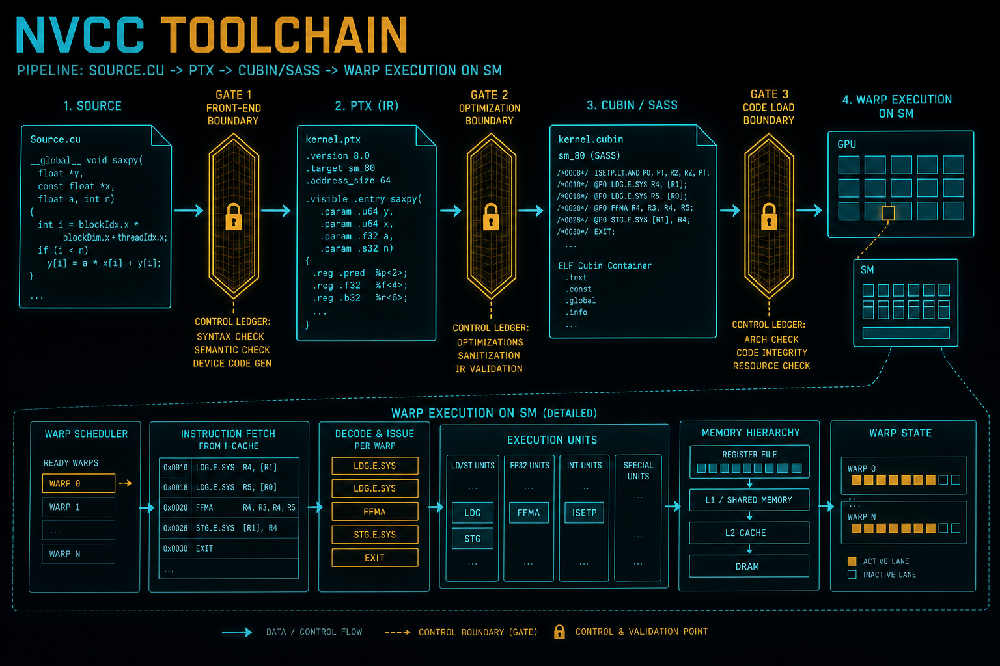

>在编写 CUDA 程序时，我们表面上是在写 C++，实际上是在与一套高度分层、强约束、跨 CPU / GPU 世界的编译器工具链打交道。
>nvcc 并不是一个“CUDA 编译器”，而是一个 编译器驱动程序（Compiler Driver）：
>它负责拆分代码、调度多个编译器、管理中间表示，并最终生成 GPU 能执行的机器码。
>理解这个工具链的工作原理，是解决以下工程问题的关键：
>1.  **二进制膨胀**：为什么一个简单的 PyTorch 扩展编译出来有几百 MB？
>2.  **JIT 开销与抖动**：为什么大模型推理服务第一次启动时会卡顿很久？缓存满了怎么办？
>3.  **动态优化**：Triton 如何在 Python 运行时生成比手写 CUDA 更快的代码？


**配套可复现**：[Yapeng-Gao/AI-System-Performance-Lab](https://github.com/Yapeng-Gao/AI-System-Performance-Lab)（文章 + `.cu` + 实测表）。有用请 Star。 本章示例：[`examples/01_cuda_basics/06_nvrtc_jit.cpp`](https://github.com/Yapeng-Gao/AI-System-Performance-Lab/blob/main/examples/01_cuda_basics/06_nvrtc_jit.cpp)。

## 1. CUDA 工具链的全局视角

先给**全链路鸟瞰图**，后面所有细节都能对号入座。

```
CUDA C++ Source (.cu)
│
│  nvcc（驱动器，不是真编译器）
│
├── Host Path ──► Host Compiler (gcc / clang / msvc)
│                   │
│                   └──► CPU Object (.o)
│
└── Device Path ─► Device Compilation Pipeline
                    │
                    ├── Frontend: CUDA → PTX
                    │
                    ├── (Optional) Embed PTX
                    │
                    ├── Backend: PTX → SASS
                    │
                    └── Fatbin / Cubin
                             │
                             ▼
                     Device Binary
```


> NVCC 不“编译代码”，
> 它决定：哪段代码，由谁，在什么时候，被编译成什么。

---

## 2. NVCC 的真实角色：一个"编译流程编排器"

### 2.1 一个必须先打破的误解

很多人以为：

> “NVCC 就是 CUDA 编译器”

这是一个工程级误解。

更准确的说法是：

> **NVCC 是一个“多编译器前端 + 规则引擎”。**

它做三件事：

1. **解析 `.cu`，拆分 Host / Device 代码**
2. **分别调用不同的编译器**
3. **把结果重新打包**

---

### 2.2 NVCC 的第一性动作：前端分裂（The Split）

从 NVCC 眼里看，一个 `.cu` 文件天然包含两个世界：

```
.cu 文件
├── Host Code (CPU 语义)
│     ├── main()
│     ├── cudaLaunchKernel()
│     └── <<<>>> 语法糖
│
└── Device Code
      ├── __global__
      ├── __device__
      └── __shared__
```


NVCC 的第一步是调用 CUDA 前端，对源码进行语义切分：
```
Split
│
├── Host Translation Unit
└── Device Translation Unit
```
`nvcc` 首先调用预处理器，识别代码中的 CUDA 扩展语法（`__global__`, `<<<...>>>` 等）：
*   **Host Code (CPU)**：剔除所有 CUDA 关键字，转换为标准的 C++ 代码。这部分被移交给系统的宿主编译器（Linux 上是 `gcc/g++`，Windows 上是 `cl.exe`）处理。
*   **Device Code (GPU)**：提取出所有 Device 函数，保留 SIMT / Warp 语义,移交给 NVIDIA 自己的编译器前端 (`nvccfe`)。

⚠️ **这是 CUDA 能和任何 C++ 编译器共存的根本原因。**

---

## 3. Device 编译链路：CUDA → PTX → SASS

### 3.1 第一阶段：CUDA Frontend → PTX:语义层冻结

```
CUDA C++ (Device)
│
│  nvcc + CUDA Frontend
│
▼
PTX (Parallel Thread eXecution)
```

#### PTX 是什么？

你要牢牢记住这句话：

> **PTX 是“虚拟 ISA”，不是硬件指令。**

它的角色是：

* 描述 Warp / SIMT 语义
* 抽象寄存器、内存空间、控制流
* 与具体 GPU 架构解耦
* 为未来架构保留优化空间


你在 PTX 里看到的：

```
add.f32
ld.global
@p bra
```

👉 这是语义描述，不是物理执行方式。

---

### 3.2 第二阶段：PTX → SASS:物理执行语义冻结

```
PTX
│
│ ptxas（离线） / Driver JIT（运行时）
│
▼
SASS (GPU Machine Code)
```

#### SASS 才是GPU 真正执行的东西：

* Warp Scheduler 发射的指令
* 已完成寄存器分配
* 已绑定 Pipeline / Memory Path
* Replay / Stall / Barrier 都在这里发生

前面讲的 **Warp / ITS / Replay / Bank Conflict**
👉 **全部发生在 SASS 这一层**

---

## 4. Fatbin / Cubin：一次编译，多种命运


在 `CMakeLists.txt` 或 `setup.py` 中，我们经常看到 `-gencode arch=compute_80,code=sm_80` 这样的配置。理解它的含义对于发布商业软件至关重要。


### 4.1 `arch` (Virtual) vs `code` (Real)
*   **`arch=compute_XY`**：指定前端生成的 **PTX 版本**。这决定了你能使用哪些 CUDA 虚拟指令（例如 `compute_80` 才能使用 `cp.async`）。
*   **`code=sm_XY`**：指定后端生成的 **SASS 版本**。

运行时：

```
Driver:
1. 有匹配 SASS → 直接用
2. 没有 → PTX JIT → SASS
```

👉 这就是 **Forward Compatibility** 的核心
Forward Compatibility 的代价 = 启动时间 + 不确定性
### 4.2 Fatbinary  策略
为了让一个 `.exe` 或 `.so` 既能在当前主流显卡上跑得快（无需 JIT），又能兼容未来显卡，标准的工程实践是构建 **Fatbinary**。它是一个容器，内部包裹了多个版本的二进制。

**推荐配置策略 ：**
```cmake
# 1. 存量市场 (Ampere & Ada) - 保证兼容性
-gencode arch=compute_80,code=sm_80  # A100 / A800
-gencode arch=compute_86,code=sm_86  # RTX 3090 / 4090 (Ada 兼容 8.6+ PTX)
-gencode arch=compute_89,code=sm_89  # L40 / Ada 专用优化

# 2. 主流市场 (Hopper) - 极致性能
-gencode arch=compute_90,code=sm_90  # H100 / H800 (开启 TMA)

# 3. 旗舰市场 (Blackwell) - 原生支持
# 必须包含 sm_100 SASS，否则无法调用原生 FP4 Tensor Core
-gencode arch=compute_100,code=sm_100 # B100 / B200

# 4. 面向未来 (Rubin / Next-Gen) - PTX 保底
# 保留最高版本的 PTX，为下一代架构 (R100?) 提供 JIT 路径
-gencode arch=compute_100,code=compute_100
```

### 4.3 驱动程序的 JIT 行为与缓存管理
当你分发一个只包含 PTX 的程序给用户时：
1.  **JIT Trigger**：用户运行程序，CUDA Driver 检测到当前 GPU 架构没有匹配的 SASS，触发内置 JIT 编译器。
2.  **Startup Lag**：这个过程可能持续数秒甚至数分钟（取决于 Kernel 数量），导致服务启动卡顿。
3.  **Compute Cache**：编译结果会被缓存。
    *   *默认位置*：`~/.nv/ComputeCache`。
    *   *运维陷阱*：在容器化环境（Docker/K8s）中，如果该目录不可写或重置，每次启动都会触发 JIT。
    *   *解决方案*：设置环境变量 `CUDA_CACHE_PATH` 指向持久化存储，并调整 `CUDA_CACHE_MAXSIZE`。
---


## 5. Runtime API vs Driver API：控制权的分水岭

这是很多人**一辈子模糊**的地方。

---

### 5.1 Runtime API（99% 的人用的）

```
cudaLaunchKernel()
│
└── Runtime
      └── Driver API
            └── GPU
```

特点：

* 自动上下文
* 自动模块加载
* 参数打包是“黑盒”
* 易用，但不可控


### 5.2、CUDA Runtime 的隐性成本模型

> **一句话总纲**
> CUDA Runtime = **你没看到的控制逻辑 + 你以为免费的抽象**。

---

##### 5.2.1 Kernel Launch 不是一条指令

你写的：

```cpp
kernel<<<grid, block>>>(a, b);
```

真实路径：

```
Host Thread
│
├─ 参数 pack（host）
├─ Kernel stub
├─ Runtime API
│   ├─ Context 检查
│   ├─ Module 是否加载
│   ├─ Function handle 查找
│   ├─ 参数内存布局
│
└─ Driver API
    └─ Launch Descriptor → GPU
```

 隐性成本拆解

| 成本项                    | 是否可见         |
| ------------------------- | ---------------- |
| 参数 pack / copy          | ❌                |
| Kernel 元数据解析         | ❌                |
| Context 锁                | ❌                |
| Launch latency (~5–10 μs) | 只在 profiler 里 |

---

#### 5.2.2 Runtime 自动做的“好事”，也是成本

| 自动行为          | 成本         |
| ----------------- | ------------ |
| 自动 Context 创建 | 首次调用极慢 |
| 自动 Module 加载  | JIT / IO     |
| 自动 Stream 管理  | 同步点       |
| 自动 Error Check  | Host Stall   |

👉 **这就是为什么小 kernel 会被 launch 吃死**

---

#### 5.2.3 Runtime 成本的真实“付费点”

你以为的时间线：

```
[ Kernel 执行 ]
```

真实时间线：

```
[ Launch ][ Stall ][ Kernel ][ Replay ][ Sync ]
```

而你只看到了中间那一段。

---

### 5.3 Driver API:你必须“自己负责一切”

```
cuModuleLoadData()
cuModuleGetFunction()
cuLaunchKernel()
```

你必须显式管理：

  * Context
  * Module
  * Function
  * Parameter Layout

👉 **NVRTC 只能走 Driver API**
### 5.4 Runtime vs Driver 的性能分界线

| 场景            | Runtime | Driver |
| --------------- | ------- | ------ |
| 易用性          | ✅       | ❌      |
| Launch overhead | 高      | 低     |
| NVRTC           | ❌       | ✅      |
| 精细控制        | ❌       | ✅      |

> **结论**
> 当 kernel < 10μs，**Runtime 成为瓶颈本身**
---

## 6. NVRTC：运行时编译 = 把“不确定性”变成“特化”

为什么 PyTorch 2.0 的 `torch.compile` (Inductor) 和 OpenAI 的 Triton 编译器能比手写 CUDA 更快？秘密在于 **Runtime Compilation (运行时编译)**。

### 6.1 静态编译 (NVCC) 的局限性
在静态编译中，我们必须处理通用的情况：
*   **模板爆炸**：为了支持 FP32/FP16/BF16 和不同的 BlockSize，我们不得不预编译成千上万个模板实例，导致二进制体积激增。
*   **常量折叠失效**：对于线性层 `Y = alpha * X + beta`，如果 `alpha` 是运行时传入的标量，编译器必须生成一条乘法指令。
*  通用 Kernel 的性能上限

### 6.2 NVRTC 的核心价值：特化（Specialization）
**NVRTC (CUDA C++ Runtime Compilation)** 允许我们在程序运行时，将一串 C++ 源代码字符串编译成 PTX。
#

> **NVRTC = 把 Device 编译从“构建期”推迟到“运行期”
#### 6.2.1 NVRTC 的真实流程

```
CUDA Source (string)
│
│ nvrtcCompileProgram
│
▼
PTX
│
│ cuModuleLoadData
│
▼
SASS (JIT)
│
▼
Kernel Launch
```

⚠️ 注意：
**NVRTC 不生成 SASS，只生成 PTX**

---
#### 6.2.2**优势：特化 (Specialization)**
如果形状、参数在运行时已知：
* 常量可以直接硬编码
* 循环可以完全展开
* 分支可以被消除

👉 这是 Triton / Inductor 性能超过手写 CUDA 的根本原因

举个例子:
如果运行时已知 `alpha = 1.0`，我们可以生成一份硬编码了 `const float alpha = 1.0;` 的源码。NVRTC 会直接优化掉乘法指令（`1.0 * X = X`）。
对于矩阵乘法，如果运行时已知 $M=12, N=32, K=64$，我们可以生成针对这个小形状极致优化的 Kernel（完全展开循环），而不是调用一个通用的 GEMM。
### 6.3 NVRTC 的工程代价

NVRTC 并不“免费”：
* 编译慢
* Debug 困难
* 结果不可完全复现
* 头文件管理复杂

>你不是在“写代码”，
>而是在“实现一个小型编译系统”。
### 6.4 挑战：头文件管理
NVRTC 最大的工程痛点在于它**看不到文件系统**。你不能简单地在字符串里写 `#include <cuda_fp16.h>`，因为 NVRTC 不知道去哪里找这个文件。
*   **解决方案**：必须读取头文件的内容，并通过 `nvrtcCreateProgram` 的 headers 参数显式传递给编译器。这也是 Triton 等编译器后端最复杂的逻辑之一。


### 6.4 NVRTC 解决了什么问题？

✔ 动态形状
✔ JIT 融合
✔ 自动生成 Kernel
✔ DSL / 编译型框架（TensorRT / Triton / TVM）

---

### 6.5 NVRTC 没解决什么？

❌ 编译慢
❌ Debug 困难
❌ 性能不可预测
❌ 与离线编译结果不完全一致

---

## 7. 参数传递黑盒：工具链与执行层的交汇点

把上一章自然接上：

```
Host Code
│
│ <<<>>>
│
▼
Runtime
│
│ pack parameters
│
▼
Kernel Parameter Buffer
│
│ (UVA device virtual address)
│
▼
SASS: LD.PARAM
```


👉 参数不是通过寄存器传递的
👉 而是通过一个独立的参数内存空间

这是 Host / Device 世界真正的“接口层”。

---

## 8. PTX vs SASS：能力边界总结表

```
┌────────────┬──────────────┬──────────────┐
│            │ PTX          │ SASS         │
├────────────┼──────────────┼──────────────┤
│ 抽象级别   │ 高           │ 低           │
│ 架构相关   │ 否           │ 是           │
│ Warp语义   │ 描述         │ 实现         │
│ Replay     │ 看不到       │ 明确存在     │
│ ITS细节    │ 看不到       │ 可观察       │
│ 性能分析   │ 不可靠       │ 真实         │
└────────────┴──────────────┴──────────────┘
```

---
## 9、GPU 软件栈控制边界图

> **这一张图，决定你“该在哪一层优化”**

```
┌────────────────────────────────────────────┐
│               用户代码 / DSL               │
│  PyTorch / Triton / TVM / CUDA C++          │
│  ────────────────────────────────────────  │
│  控制权：❌                                 │
│  成本感知：❌                               │
└───────────────▲────────────────────────────┘
                │
┌───────────────┴────────────────────────────┐
│            CUDA Runtime API                 │
│  <<<>>> / cudaLaunchKernel                  │
│  ────────────────────────────────────────  │
│  隐性成本：参数 pack / context / module     │
│  控制权：⚠️                                │
└───────────────▲────────────────────────────┘
                │
┌───────────────┴────────────────────────────┐
│             CUDA Driver API                 │
│  cuModule / cuLaunchKernel                  │
│  ────────────────────────────────────────  │
│  JIT / NVRTC / Module Cache                 │
│  控制权：✅                                │
└───────────────▲────────────────────────────┘
                │
┌───────────────┴────────────────────────────┐
│                 PTX 层                      │
│  虚拟 ISA / Warp 语义                       │
│  ────────────────────────────────────────  │
│  看不到：Replay / Bank / Pipe               │
│  控制权：⚠️                                │
└───────────────▲────────────────────────────┘
                │
┌───────────────┴────────────────────────────┐
│                 SASS 层                     │
│  真指令 / 真调度 / 真冲突                   │
│  ────────────────────────────────────────  │
│  Stall / Replay / Pipe Busy / Bank Conflict │
│  控制权：❌（但可诊断）                     │
└───────────────▲────────────────────────────┘
                │
┌───────────────┴────────────────────────────┐
│                GPU 硬件                     │
│  Warp Scheduler / SM / Memory               │
└────────────────────────────────────────────┘
```

---


> **CUDA 性能优化不是“写得更像数学”，
> 而是“让 SASS 少停、少重来、少白跑”。**


## 10. 总结成一句话

> **CUDA 工具链的本质，是把“看似并行的 CUDA C++”，
> 逐层翻译成“Warp 可被调度的、可被重放的、资源受限的 SASS 指令流”。**

---


## 11. 工程实战：现代构建系统

本章配套代码将演示两种极端：**最规范的静态构建** 与 **最灵活的动态编译**。

### 11.1 CMake 现代用法
忘掉 `find_package(CUDA)`。

```cmake
project(MyProject LANGUAGES CXX CUDA)
set(CMAKE_CUDA_ARCHITECTURES "80;86;90") 
# 自动处理了分离编译、架构标志和运行时库链接
```

### 11.2 NVRTC JIT Loader Demo
我们将编写一个 C++ 程序，它在运行时读取一段文本形式的 CUDA Kernel 源码，编译并执行它。这正是构建高性能推理引擎（如 TensorRT-LLM）的核心技术。
examples/01_cuda_basics/06_nvrtc_jit.cpp

---

## 📚 参考文献与延伸阅读

1.  **NVIDIA CUDA Compiler Driver NVCC Guide**
    *   *官方手册：详细解释了 `-dc`, `-gencode`, `-Xptxas` 以及 `-dlto` 等编译选项的含义。*
    *   [Link](https://docs.nvidia.com/cuda/cuda-compiler-driver-nvcc/index.html)
2.  **NVRTC - CUDA Runtime Compilation User Guide**
    *   *NVRTC 的 API 文档与使用限制（如不支持 Host 代码）。*
    *   [Link](https://docs.nvidia.com/cuda/nvrtc/index.html)
3.  **Triton: An Intermediate Language and Compiler for Tiled Neural Network Computations**
    *   *Philippe Tillet 的经典论文，展示了如何利用运行时编译超越手写库的性能。*
4.  **CUDA Binary Utilities**
    *   *了解 `cuobjdump` 和 `nvdisasm` 工具，这是检查 Fatbinary 内容的神器。*

---

👉 **下一章：[Module A] 07. 内存模型全景（UVA + Memory Spaces）**
搞定了计算（Kernel）和构建（Compiler），下一章我们将正式面对最复杂的“拦路虎”——**内存**。我们将绘制一张包含 Register, L1/L2, HBM, System RAM 的完整地图，并揭示 UVA 是如何骗过你的眼睛的。
---

> 本文配套代码与实测：[AI-System-Performance-Lab](https://github.com/Yapeng-Gao/AI-System-Performance-Lab)。觉得有用请 Star，后续章更新更好找。
