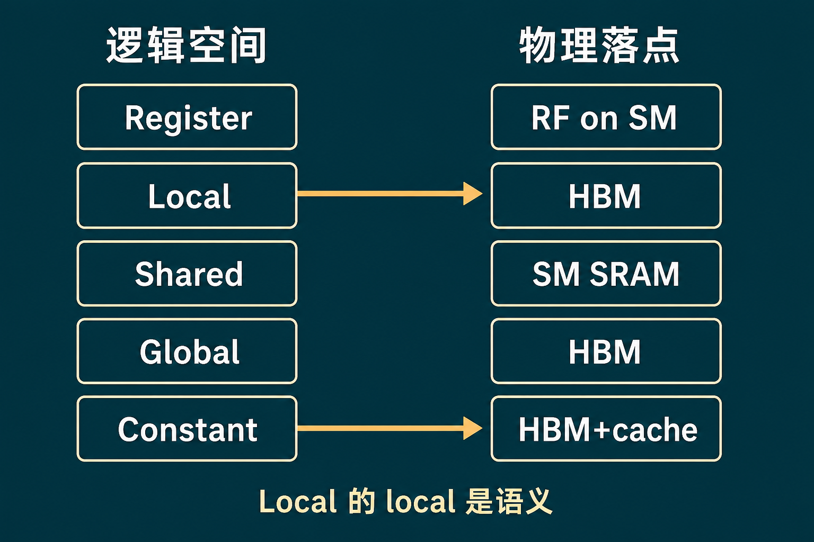
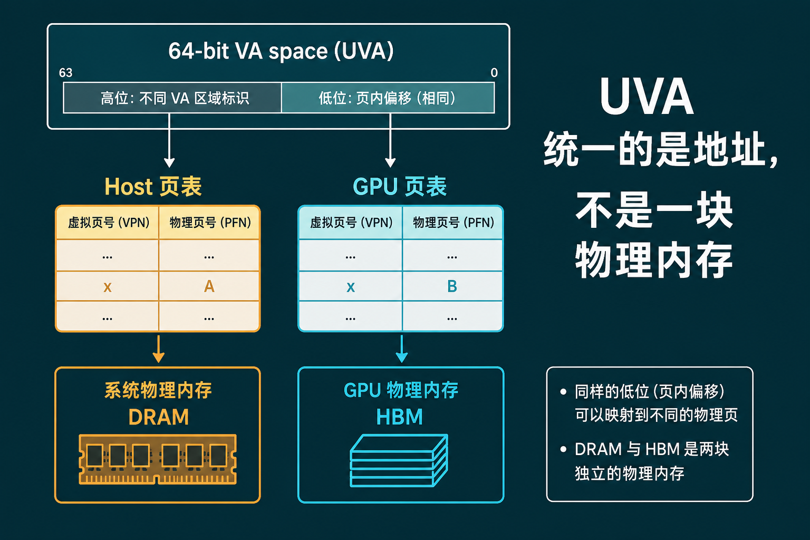
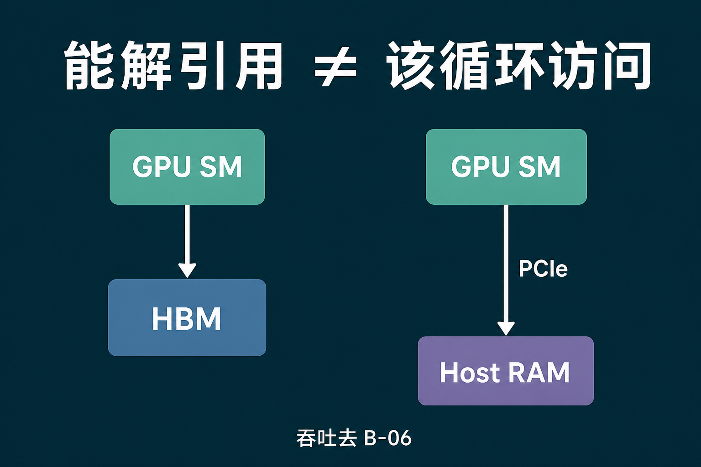

# A-07. 内存空间：谁在控制这次访问


> A-06 停在工具链：nvcc 拆包、Fatbin、NVRTC。  
> 本章进空间：**逻辑空间不是物理芯片、UVA 统一的是地址、mapped 能解引用不等于该扫 Host**。  
> 合并访问去 B-01；bank 去 B-02；spill 处方去 B-03；UM 迁页去 B-05；pinned 吞吐去 B-06。

**配套可复现**：[Yapeng-Gao/AI-System-Performance-Lab](https://github.com/Yapeng-Gao/AI-System-Performance-Lab)（文章 + `.cu` + 实测表）。有用请 Star。本章示例：[`examples/01_cuda_basics/07_memory_spaces.cu`](https://github.com/Yapeng-Gao/AI-System-Performance-Lab/blob/main/examples/01_cuda_basics/07_memory_spaces.cu)。

---

## TL;DR（工程结论）

1. **逻辑空间 ≠ 物理芯片。** Register 在 RF；`__shared__` 在 SM SRAM；Global / Local / Constant 的数据本体都可以在板载显存。Local 的「local」是线程私有语义，不是靠近 ALU 的小 SRAM。
2. **UVA 统一的是 64 位虚拟地址，不是一块物理内存。** Host 与每张 GPU 各有一段 VA、各有页表。`cudaMemcpy` 可以 `cudaMemcpyDefault`。**不是** UM：没有自动迁页。
3. **Mapped / Zero-Copy：能解引用 ≠ 该循环访问。** UVA 下 `cudaMallocHost` / `cudaHostAlloc` 常常同一指针就能进 kernel。示例只证明读一个 `int` 通。反复扫大缓冲去 **B-06**。
4. **这次访问谁说了算。** 你能布置 Global 指针、`__shared__`、映射哪块 Host。Register vs Local 是编译器；L1/L2 命中是硬件。对自动变量取地址，会进 Local。
5. **本机（RTX 5090 / `sm_120`）。** `UnifiedAddressing: yes`；mapped 读 **PASS**（`999`）；`force_local_memory_spill` 的 `localSizeBytes=1024`、`regs=255` → spill **PASS**。`ptxas` 的「0 spill stores」和「1024 bytes stack frame」不是一回事：大数组进 Local 看 `localSizeBytes` / `STL`。**没有** mapped vs device event 比（B-06）。`__restrict__` 不报 `LDG.128`。

---

## 1. 本章钉什么，不抢哪章

| 问题 | 本章 | 不在本章 |
|---|---|---|
| 名字对应哪块硅？ | §2 + 图 1：逻辑 vs 物理 | 异构 / 异步 launch（A-01） |
| 这次访问谁决定？ | §3 + 图 2 | bank 怎么消（B-02）；spill 怎么减（B-03） |
| 为什么 Host 指针能进 kernel？ | §4 + 图 3：UVA | UM 缺页 / prefetch（B-05） |
| Zero-Copy 是不是免费？ | §5：能读 ≠ 该扫 | PCIe / overlap 账单（B-06） |
| 参数包在哪？ | 回 A-05 | 再讲 `c[0]` |
| 怎么量 kernel？ | 不去量 | Event（A-08） |

---

## 2. 逻辑空间不是物理落点

CUDA 给你一套**名字**：Register、Local、Shared、Global、Constant。名字说的是**谁看得见、活多久**，不是「离 ALU 有几毫米」。同一份 HBM 上，可以同时住着 Global 数组、溢出的 Local、以及 Constant 的本体。

| 名字 | 谁看得见 | 寿命 | 物理上常见落点 | SASS 线索 |
|---|---|---|---|---|
| Register | 一条线程 | kernel | SM 上的 RF | `R0`… |
| Local | 一条线程 | kernel | **板载显存**（经 L1/L2） | `LDL` / `STL` |
| Shared | 一个 Block | Block | SM SRAM（常与 L1 分区） | `LDS` / `STS` |
| Global | 整个 Grid | 直到你 `cudaFree` | 板载显存 | `LDG` / `STG` |
| Constant | Grid，Device 只读 | 上下文 | 显存 + 每 SM 的 constant cache | `LDC` |
| Param | 这次 launch | launch | parameter buffer；常见 `c[0]` | 回 A-05 |
| Texture | 只读路径 | 应用 | 显存 + 纹理/只读缓存 | 本章只留名字 |



> 图 1：Local 的箭头指向 HBM，不是指向一块「线程私有 SRAM」。

**Register** 是你唯一可以当成「这一拍就在」的存储。每条线程一份，无一致性协议。GPU 能同时挂住大量 Warp，是因为上下文已经摊在 RF 里，换 Warp 不必把整份状态写回 DRAM。RF 总量有上限（A-02）；用超了，编译器把一部分变量**溢出**成 Local。

**Local** 是最容易读错的名字。逻辑上它和寄存器一样是线程私有；物理上它在 Global 那一类的板载显存里，走类似的缓存路径，也受合并访问约束（处方在 B-01）。触发很常见：对自动变量取地址、线程私有大数组、动态索引、寄存器压力顶满。SASS 里看见 `LDL` / `STL`，就是这件事。怎么少 spill，去 **B-03**。本章只证明：示例 kernel 的 `localSizeBytes > 0`。

对自动变量写 `&x`，编译器通常不敢再把它留在纯寄存器里——指针要有一个可寻址的家，那个家就是 Local。示例地址图里那一行不是「栈在片上」。

**Shared** 是 Block 内你还能亲手布置的那一层。物理上是 SM 里的 SRAM，常常和 L1 抢同一块。它快，是因为近、而且你知道数据此刻在哪。Bank 冲突会 Replay（A-04 演示过），怎么 padding / swizzle 去 **B-02**。Hopper 起 TMA 的目的地也是它（B-08），本章不写搬运。

**Global** 就是 `cudaMalloc` 出来的那块，Grid 里大家都看得到。容量大、远。优化手段是合并、向量化、异步拷进 SMEM，全部在 Module B。

**Constant** 本体也在显存，每颗 SM 有一份小的只读缓存。Warp 内 32 条 lane 读**同一个地址**时，一次广播就够；各读各的地址就会串行。它不是「64 KB 所以快」，是「统一才快」。本章不测 32-way 串行。

Texture / 表面是另一条只读寻址路径（过滤、边界模式）。名字记下，课不在这里。

---

## 3. 谁在控制这次访问

不是每一层你都能调。


> 图 2：carveout API 只是偏好，不扫；Hopper 以后 SMEM 与 L1 更解耦，不要写死 5090 的分区比。

| 谁 | 管什么 | 你怎么说话 |
|---|---|---|
| 你 | 数据放 Global 还是 `__shared__`；Host 要不要 mapped | 分配 API、kernel 里的声明 |
| 编译器 | 自动变量进寄存器还是 Local；能不能当立即数 | 别乱取地址；别塞超大线程私有数组；特化去 A-06 |
| 硬件 | L1 / L2 命不中；bank 要不要 Replay | hint 很弱；布局去 B-01 / B-02 / B-04 |

`cudaFuncSetAttribute(..., cudaFuncAttributePreferredSharedMemoryCarveout, ...)` 能表达「我想多给 SMEM」或「多给 L1」。这是偏好，不是契约。Ampere 上两者常是同一块 SRAM 的分区；Hopper 以后为了 TMA，硬件更拆得开。本章不扫 carveout，也不写 5090 的百分比。

L2 是芯片级的一致性边界（A-02）：跨 SM 的可见性、原子汇合，往往在这里碰头。驻留控制去 B-04。

---

## 4. UVA：统一的是地址

64 位进程里，CUDA 把 Host 内存和每张 GPU 的 Global 都放进**同一套虚拟地址编码**。CPU 有一段，GPU0 有一段，GPU1 另有一段。驱动看指针值，就知道该走哪张页表。

所以 `cudaMemcpy` 可以写 `cudaMemcpyDefault`：不必你自己标注 Host 还是 Device。Kernel 参数里的指针，也是这个 VA（A-05：包里只有地址，没有数组本体）。



> 图 3：同一串地址比特，翻译成的物理页可以在系统内存，也可以在 HBM。

这**不是** Unified Memory。UVA 不负责把页从 Host 迁到 HBM。`cudaMallocManaged`、缺页、prefetch、advise 是 **B-05**。本章示例不用 `__managed__`。

多卡时，另一张 GPU 的 VA 也可能被解引用（P2P / NVLink）。那仍然是「地址够得到」，不是「本地 HBM」。本章不测。

示例会打印 `cudaDevAttrUnifiedAddressing`。本仓库目标机应当是 yes。

---

## 5. Mapped：能读，不代表该扫

Pinned Host 内存可以再映射进 GPU 的页表。Kernel 里解引用这个指针，数据仍在系统内存，访问走 CPU–GPU 互连（消费卡上通常是 PCIe）。旧文档叫 Zero-Copy。

UVA 下，`cudaMallocHost` / `cudaHostAlloc` 分配的 pinned，**常常** Host 指针和 Device 指针是同一个值，不必再 `cudaHostGetDevicePointer`。例外：`cudaHostRegister`、`cudaHostAllocWriteCombined` 等，两边地址可能不同，那时才要查询 Device 指针。

「仅 pinned、给 Copy Engine 做 `cudaMemcpyAsync`」是另一件事：数据还是要搬进 HBM，只是 DMA 能直达。Overlap 和吞吐在 **B-06**。



> 图 4：本章示例只读一个 `int`。热循环扫 Host 指针，去 B-06 看账单。

工程禁令：

- 不要在 kernel 热循环里扫 mapped Host，当它是 Global。
- 不要把 Zero-Copy 写成「省掉了 PCIe」。省掉的是一次显式 memcpy launch，不是物理距离。
- 不要把 P2P 指针当本地 HBM。

`__restrict__` 是给编译器的别名契约：这几个指针互不重叠。编译器**可能**更敢向量化、把值留在寄存器。违约的结果可以是算错，不只是变慢。示例编了两个 add kernel，**不报**加速比，也不保证 SASS 一定出现 `LDG.128` 或 `LDG.NC`。

---

## 6. 怎么跑

前置与导读相同：官方 CUDA Toolkit，CMake ≥ 3.25。在 `build/` 里：

```bash
cmake .. -DCMAKE_BUILD_TYPE=Release -DCMAKE_CUDA_ARCHITECTURES=native
cmake --build . --parallel --target 01_cuda_basics_07_memory_spaces
./bin/01_cuda_basics_07_memory_spaces
```

`native` 失败时：Ada 写 `89`，5090 写 `120`。

看这几行：GPU / `sm_XX` / `UnifiedAddressing`、地址图、`mapped read: PASS`、`localSizeBytes` > 0、`spill: PASS`。本机 RTX 5090：`sm_120`、`localSizeBytes=1024`、`regs=255`。

| 对比 | 看什么 | 不要读成 |
|---|---|---|
| 地址图 | 不同空间的 VA 不同；取地址的 local 不是片上栈 | 物理拓扑接线图 |
| mapped PASS | UVA 下这个 Host 指针能解引用 | 已经量过比 HBM 更快/更慢 |
| `localSizeBytes` | Local 真的占用了（本机 1024 B） | 已做完 B-03；也不要和 `ptxas` 的「0 spill stores」混为一谈 |
| restrict 两个 kernel | 契约编进包了 | `LDG.NC` 加速比 |

SASS（可选）：

```bash
# Linux / macOS
cuobjdump -sass ./bin/01_cuda_basics_07_memory_spaces | grep -E 'LDL|STL'
# Windows
cuobjdump -sass ./bin/01_cuda_basics_07_memory_spaces.exe | findstr LDL
cuobjdump -sass ./bin/01_cuda_basics_07_memory_spaces.exe | findstr STL
```

仓库里还有 `examples/01_cuda_basics/07_inspect_sass.sh`（Linux `grep`）。它会搜 `LDL`/`STL`，也会列出 `add_*`。**不要**把脚本说明里的 `LDG.NC` 当结论。

Windows 输出目录见 [`examples/01_cuda_basics/README.md`](https://github.com/Yapeng-Gao/AI-System-Performance-Lab/blob/main/examples/01_cuda_basics/README.md)。

---

## 7. 扩展阅读（不抢后续章）

1. CUDA Programming Guide — memory types（见 §10-1）：Local 物理在 device memory。对照本章 §2。
2. 下一章 A-08：Stream / Event。空间课到此停，开始让拷贝和计算重叠。
3. Unified / mapped 吞吐：B-05（UM）、B-06（pinned / mapped 账单）。不要在地址图上脑补 GB/s。

---

## 8. SOP + 误区

1. 先跑示例，确认 `UnifiedAddressing: yes`、mapped PASS、`localSizeBytes > 0`。
2. 热路径还在扫 Host 指针：停，去 B-06，改 memcpy + HBM。
3. 看见 `LDL`/`STL`：去 B-03，不要在 Hello 里调 carveout。
4. 要合并访问或 bank：去 B-01 / B-02。要 UM 迁页：去 B-05。

| 误区 | 纠正 |
|---|---|
| Local = 片上小栈 | 线程私有语义，数据在 HBM；见图 1 |
| UVA = UM | 统一 VA，不迁页；迁页是 B-05 |
| mapped 省掉了 PCIe | 省的是显式 memcpy；数据仍在 Host |
| 取地址的变量还在寄存器 | 通常进 Local |
| `__restrict__` 一定出 `LDG.128` | 契约，不是加速开关 |
| 本章在测带宽 | 回 B-06 |

---

## 9. 小结与下一章

空间名字管的是可见性和寿命；快慢取决于物理落点和谁在控制。UVA 让指针能跨界解释，不让距离消失。Mapped 能读通，热循环仍该待在 HBM。

下一篇让这些空间动起来：[A-08 异步执行](https://github.com/Yapeng-Gao/AI-System-Performance-Lab/tree/main/article/01_cuda_basic)（Stream、Event、拷贝与计算怎么重叠）。

---

> 本文配套代码与实测：[AI-System-Performance-Lab](https://github.com/Yapeng-Gao/AI-System-Performance-Lab)。觉得有用请 Star，后续章更新更好找。  
> 本章示例：[`examples/01_cuda_basics/07_memory_spaces.cu`](https://github.com/Yapeng-Gao/AI-System-Performance-Lab/blob/main/examples/01_cuda_basics/07_memory_spaces.cu)。下一篇：[A-08 异步执行](https://github.com/Yapeng-Gao/AI-System-Performance-Lab/tree/main/article/01_cuda_basic)。

## 10. 参考文献

**官方**

1. NVIDIA, *CUDA Programming Guide*, Writing CUDA Kernels / memory types（Local 物理在 device memory）. https://docs.nvidia.com/cuda/cuda-programming-guide/02-basics/writing-cuda-kernels.html
2. NVIDIA, *CUDA Programming Guide*, Unified and System Memory（UVA ≠ UM；mapped 曾称 zero-copy）. https://docs.nvidia.com/cuda/cuda-programming-guide/02-basics/understanding-memory.html
3. NVIDIA, *CUDA Programming Guide*, C/C++ Language Extensions — memory space specifiers. https://docs.nvidia.com/cuda/cuda-programming-guide/05-appendices/cpp-language-extensions.html
4. NVIDIA, *CUDA Runtime API*, unified addressing / `cudaHostGetDevicePointer`. https://docs.nvidia.com/cuda/cuda-runtime-api/group__CUDART__UNIFIED.html
5. NVIDIA, *CUDA C++ Best Practices Guide*, Memory Optimizations（处方索引：B-01 / B-02）. https://docs.nvidia.com/cuda/cuda-c-best-practices-guide/

**工程 / 实证**

6. 本仓库 B-06：mapped 省 launch，不省 PCIe。
7. Jia et al., *Dissecting the NVIDIA Volta GPU Architecture via Microbenchmarking*, arXiv:1804.06826. 层次延迟对照；本仓库数字以本机打印为准。
8. Abdelkhalik et al., *Low Overhead Instruction Latency Characterization for NVIDIA GPGPUs*, arXiv:1905.08778. Local 与 Global 同类缓存路径。

**扩展（不进 MVP）**

9. Mei & Chu, *Dissecting GPU Memory Hierarchy through Microbenchmarking*, IEEE TPDS 2017 / arXiv:1503.03832. 历史微基准；驻留正文在 B-04。
10. RegDem, arXiv:1907.02894. 有人把 spill 改倒 SMEM；不是 nvcc 默认。
