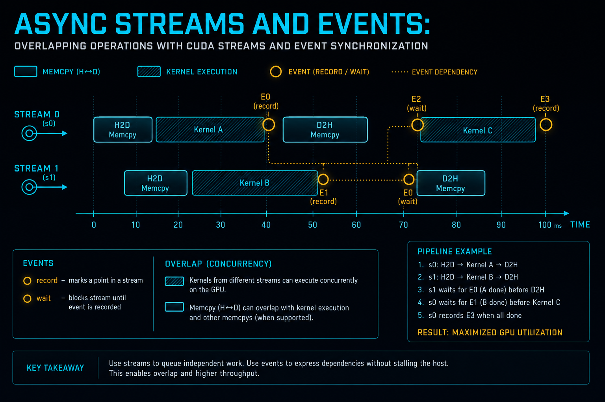

>在高性能计算中，**“等待”是最大的罪恶**。
>当 CPU 阻塞等待 GPU 计算完成时，或者 GPU 的计算单元（SM）在等待数据通过 PCIe 总线传输时，都是对系统资源的极度浪费。CUDA 编程的一个核心目标，就是通过**异步并发（Asynchronous Concurrency）**，让 CPU、GPU 计算引擎、GPU 拷贝引擎这三者在时间轴上尽可能重叠。
>本章将揭示 **Stream（流）** 的物理本质，剖析 **Legacy Default Stream** 如何像红绿灯一样阻塞交通，并展示如何构建工业级的 **H2D $\to$ Compute $\to$ D2H** 三级流水线。

**配套可复现**：[Yapeng-Gao/AI-System-Performance-Lab](https://github.com/Yapeng-Gao/AI-System-Performance-Lab)（文章 + `.cu` + 实测表）。有用请 Star。 本章示例：[`examples/01_cuda_basics/08_async_pipeline.cu`](https://github.com/Yapeng-Gao/AI-System-Performance-Lab/blob/main/examples/01_cuda_basics/08_async_pipeline.cu)。

```cpp
Time ─────────────────────────────────────>

Host:   Submit → Submit → Submit → Submit

Copy:        [H2D1]    [H2D2]    [H2D3]
Compute:           [K1]     [K2]     [K3]
D2H:                    [D2H1]   [D2H2]

Streams:   S0         S1         S2
Events:        E1         E2

```

## 1. Stream 的物理本质：软件队列与硬件引擎

在 CUDA 代码中，Stream 只是一个 `cudaStream_t` 对象，表现为一个按序执行的命令队列。但在硅片上，它对应着真实的、独立的硬件资源。
>Stream ≠ 执行单元
>Stream ≠ 硬件资源
>Stream = 提交顺序（Issue Order）


### 1.1 Stream 是什么
从系统角度看：
* Stream 是 Host → Driver → GPU 的一条命令队列
* 队列内命令 严格按序
* 不同 Stream 之间 默认无序

❌ 常见误解（脑补并发轨道）
```
Stream 0:  [Memcpy] [Kernel] [Memcpy]
Stream 1:  [Memcpy] [Kernel] [Memcpy]
            ↑ 并发轨道？

```
>这是错误心智模型：
>Stream 并不是“并行执行线”。

✅ 正确模型：Stream = Issue Order（提交顺序）
```
Host Thread
   |
   |  Stream 0:  A → B → C
   |  Stream 1:  D → E → F
   v
------------------------------------------------
GPU Driver / Scheduler（按顺序投递）
------------------------------------------------

```
关键点：

* Stream 只保证 “谁先被 GPU 看到”
* 不保证 “谁同时执行”
* 是否并发，取决于 GPU 是否有可并行的硬件引擎

一句话总结：

>Stream 决定顺序，硬件决定并发。


### 1.2 GPU 的物理执行单元：引擎解耦（Engine View）
现代 NVIDIA GPU（如 A100/H100）并非一个“统一执行体”，而是多个物理隔离的硬件引擎：擎：
*   **Compute Engine (EE)**：即我们在前几章讨论的 SM 阵列，负责执行 Kernel。
*   **Copy Engine (CE)**：负责通过 PCIe 或 NVLink 搬运数据（DMA）。
    *   *全双工特性*：企业级 GPU 通常配备 2 个甚至更多的 Copy Engines，允许 **Host-to-Device (H2D)** 和 **Device-to-Host (D2H)** 同时进行，甚至同时进行 Peer-to-Peer 传输。


```cpp
                ┌──────────────────┐
Memcpy (H2D) →  │                  │
Memcpy (D2H) →  │  Copy Engine(s)  │
                │   (DMA 单元)     │
                └──────────────────┘

                ┌──────────────────┐
Kernel Launch → │                  │
                │ Compute Engine   │
                │   (SM 阵列)      │
                └──────────────────┘

```
物理事实：

* Copy Engine ≠ Compute Engine
* 互不抢占电路
* 可以在同一时间片并行工作

这就是为什么 Memcpy + Kernel 能 overlap
### 1.3 为什么多个 Stream 才“真的有用”：Hyper-Q

❌ 没有 Hyper-Q（历史模型）

```cpp
GPU Hardware Queue (only 1)
--------------------------------
Stream 0: [Long Kernel ────────────────]
Stream 1:             [Short Kernel]

```
在早期的 Fermi 架构中，GPU 只有一个硬件工作队列（Hardware Work Queue）。即使你在软件上创建了多个 Stream，它们在硬件层面也会被强制串行化，导致**虚假依赖（False Dependencies）**。


✅ 有 Hyper-Q（现代 GPU）

```cpp
GPU Hardware Queues (×32)
--------------------------------
Queue 0: [Long Kernel ────────────────]
Queue 1:           [Short Kernel]
Queue 2:               [Memcpy]

```
从 Kepler 架构引入 **Hyper-Q** 技术开始，GPU 拥有了多个（通常是 32 个）硬件工作队列。
*   **映射机制**：Host 端的多个 Software Stream 可以直接映射到不同的 Hardware Work Queues。
*   **意义**：Stream A 中的长耗时 Kernel 不再阻塞 Stream B 中无关的小 Kernel。这使得 Kernel 级的并发执行成为可能。
现代意义：

>Hyper-Q 的价值，不是“让并发成为可能”，
>而是防止大 Kernel 吞噬小 Kernel 的调度机会。

这在推理服务、RPC 场景中，直接影响 尾部延迟（Tail Latency）。

---

## 2. 默认流 (Default Stream) :最隐蔽的全局同步源

如果说 Stream 是并发的工具，那么 Default Stream 是并发的天敌。

### 2.1 "Stop-the-World" 的 Legacy Default Stream
如果你在 Launch Kernel 或 Memcpy 时不指定 Stream（或者传入 `0`），操作会被提交到 **Legacy Default Stream**。
在默认编译选项下，这个流具有**“全局同步”**的霸权属性：
1.  **排他性执行**：它执行前，会强制等待所有其他非默认流挂起（Idle）。
2.  **屏障效应**：它执行后，所有其他非默认流才能恢复执行。

```cpp
Time ───────────────────────────────>

Stream 1: [Kernel A]        [Kernel C]
Stream 2:        [Kernel B]

Default:                [Memcpy D]

            ↑ 全部暂停     ↑ 全部恢复

```

它是 CUDA 中唯一一个“跨 Stream 的隐式全局同步源”。
**后果**：只要你的代码中夹杂了一个默认流操作，原本精心设计的并行流水线就会被瞬间打断，GPU 退化为串行设备。

### 2.2 现代解法：Per-Thread Default Stream
为了解决这个问题，CUDA 7.0 引入了 **Per-Thread Default Stream** 模式。
通过在编译时添加标志 `--default-stream per-thread`，或者在代码中定义宏 `CUDA_API_PER_THREAD_DEFAULT_STREAM`：

```cpp
Thread 0 Default: [Kernel A] [Memcpy B]
Thread 1 Default:       [Kernel C]

```

*   **行为变更**：
	* 每个 Host 线程拥有独立默认流
	* 默认流不再具备全局屏障语义
	* 行为等同于普通 Stream
*   **工程价值**：这允许库开发者（如编写一个 .dll 或 .so）安全地使用默认流，而不用担心阻塞调用者的流。


---

## 3. 流水线设计模式：隐藏通信延迟的唯一正确姿势

并发的终极目标不是“同时发生”，而是：让数据传输的时间在时间轴上“消失”。

### 3.1 错误模式：广度优先 (Breadth-First)
很多开发者直觉上会这样写代码：
```cpp
// 错误示范
for (int i = 0; i < n_chunks; ++i) cudaMemcpyAsync(..., stream[i]); // 先发所有 Copy
for (int i = 0; i < n_chunks; ++i) kernel<<<..., stream[i]>>>(...); // 再发所有 Kernel
```

```cpp
Time ─────────────────────────────>

Copy Engine:    [H2D1][H2D2][H2D3]
Compute Engine:             [K1][K2][K3]

```

**后果**：由于 PCIe 带宽是有限资源，前 N 个 Copy 指令会迅速占满 Copy Engine 的队列。Compute Engine 处于饥饿状态，直到第一个 Copy 完成。这导致了 Copy 和 Compute 在时间上依然是串行的。

### 3.2 正确模式：深度优先 (Depth-First)
```cpp
// 正确示范：Loop over operations
for (int i = 0; i < n_chunks; ++i) {
    cudaMemcpyAsync(..., stream[i]); // H2D
    kernel<<<..., stream[i]>>>(...); // Compute
    cudaMemcpyAsync(..., stream[i]); // D2H
}
```


**原理**：CUDA Driver 会按照 Issue Order 将命令推入硬件队列。
1.  Stream 0 的 Copy H2D 开始执行。
2.  Stream 1 的 Copy H2D 等待 PCIe，但 Stream 0 的 Kernel 已经就绪。
3.  一旦 Stream 0 的 Copy 完成，Stream 0 的 Kernel 立即在 Compute Engine 上启动，同时 Stream 1 的 Copy H2D 抢占 PCIe。

```cpp
Time ─────────────────────────────>

Copy Engine:    [H2D1]   [H2D2]   [H2D3]
Compute Engine:      [K1]   [K2]   [K3]
D2H Engine:               [D2H1]  [D2H2]

```
效果：

* Copy / Compute / D2H 稳态重叠
* PCIe / NVLink 延迟被“时间轴吃掉”
* 吞吐最大化

一句话总结：
>流水线的核心不是 Async，
>而是“尽早让不同引擎同时忙起来”。
### 3.3 硬性前置条件：Pinned Memory
**这是实现异步传输的物理前提。**
*   **Pageable Memory (分页内存)**：如果是普通的 `malloc/new` 分配的内存，`cudaMemcpyAsync` 会退化为同步操作。因为驱动程序必须先在 CPU 端分配一块临时的 Pinned Buffer，将数据拷贝过去（CPU 参与），然后再由 DMA 搬运。
*   **Pinned Memory (页锁定内存)**：物理地址固定，GPU 的 DMA 引擎可以直接读取。只有这样，CPU 发完命令才能立即返回。


---

## 4. Event：GPU 侧的红绿灯

在复杂的依赖图中，`cudaDeviceSynchronize()` 是粗暴的 CPU 侧同步（Host 等待 Device）。

```cpp
CPU:   ─────── WAIT ───────
GPU:   [Kernel][Kernel]

```

我们需要更精细的 GPU 侧同步（Device 等待 Device）。

```cpp
Stream 0: [Kernel A] [Event E]
Stream 1:                 [Wait E] [Kernel B]

```

### 4.1 独立于 CPU 的调度
`cudaStreamWaitEvent(stream, event)` 是构建 **DAG (有向无环图)** 的神器。
*   **语义**：让 `stream` 暂停执行后续命令，直到 `event` 被触发。
*   **关键点**：这个等待动作完全在 GPU 硬件调度器中完成，**CPU 不参与等待**。CPU 发送完这条“等待指令”后，可以立即去处理网络请求或磁盘 I/O。

### 4.2 典型场景：多流汇聚
假设我们用 4 个 Stream 分别计算矩阵的 4 个部分，最后需要用第 5 个 Stream 进行汇总。
*   **做法**：前 4 个 Stream 结束时分别 Record 一个 Event。第 5 个 Stream 分别 Wait 这 4 个 Event。
*   **收益**：CPU 零开销，GPU 自动流水线化。


---

## 5. 工程实战：构建三级流水线

本章配套代码将实现一个经典的 **Double Buffering (双缓冲)** 或多缓冲流水线。

我们将把一个大任务切分为 $N$ 个小块（Chunk），使用 $S$ 个 Stream 循环处理。
### 核心逻辑
1.  **资源分配**：分配 Host Pinned Memory 和 Device Memory。
2.  **流池管理**：创建高优先级的计算流和低优先级的传输流（可选）。
3.  **调度循环**：
    *   `Chunk[i]` 进入 `Stream[i % S]`。
    *   H2D -> Kernel -> D2H 依次入队。
4.  **可视化验证**：通过 Nsight Systems 观察 PCIe 通道和 SM 通道的占空比。

> **[💻 代码占位符：参见项目 `examples/01_cuda_basics/08_async_pipeline.cu`]**
> *   *代码包含：Pinned Memory 对比 Pageable Memory 的性能测试，以及 Multi-Stream Pipeline 的完整实现。*

---

## 📚 参考文献

1.  **NVIDIA Best Practices Guide - Asynchronous Concurrent Execution**
    *   *官方权威指南，详细列出了实现 Overlap 必须满足的硬件与驱动条件（如 WDDM 模式下的限制）。*
2.  **How to Overlap Data Transfers in CUDA C++ (NVIDIA Technical Blog)**
    *   *经典的流水线设计教程，通过动图形象展示了 Depth-First Launch 的优势。*
3.  **Hyper-Q Whitepaper**
    *   *深入理解 Kepler 架构引入的硬件队列机制，以及它如何从根本上消除了虚假依赖。*

---

👉 **下一章：[Module A] 09. 调试与错误诊断：Compute Sanitizer 实战**
至此，我们已经掌握了让代码“跑得快”的秘诀。但系统工程中更重要的是“跑得稳”。下一章，我们将学习如何用 **Compute Sanitizer** 抓出那些隐蔽的 Race Condition 和非法内存访问，让你的代码坚如磐石。
---

> 本文配套代码与实测：[AI-System-Performance-Lab](https://github.com/Yapeng-Gao/AI-System-Performance-Lab)。觉得有用请 Star，后续章更新更好找。
