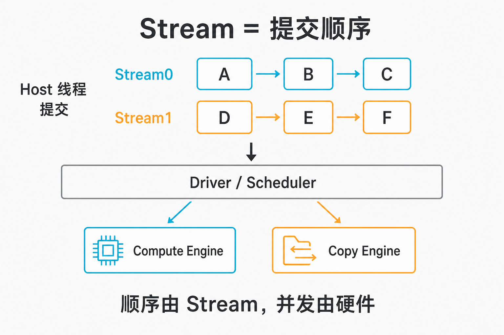
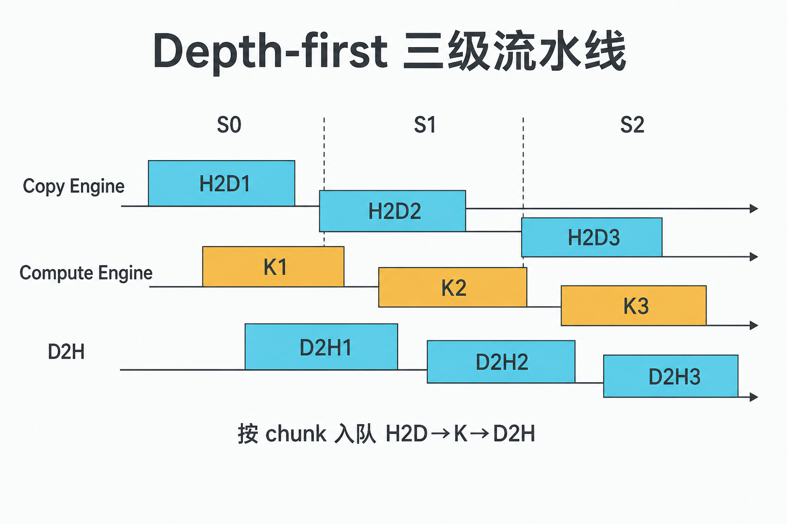

# A-08. Stream 与 Event：让拷贝和计算重叠


> A-07 停在空间：谁控制这次访问。  
> 本章让工作动起来：**Stream 管提交顺序，硬件引擎决定能不能叠；Event 负责计时和跨流依赖**。  
> Pinned 吞吐扫、CE 饱和去 B-06；设备内 async / TMA 去 B-07 / B-08；Graph 去 C-06。

**配套可复现**：[Yapeng-Gao/AI-System-Performance-Lab](https://github.com/Yapeng-Gao/AI-System-Performance-Lab)（文章 + `.cu` + 实测表）。有用请 Star。本章示例：[`examples/01_cuda_basics/08_async_pipeline.cu`](https://github.com/Yapeng-Gao/AI-System-Performance-Lab/blob/main/examples/01_cuda_basics/08_async_pipeline.cu)。

---

## TL;DR（工程结论）

1. **Stream = 提交顺序（issue order），不是一条物理执行轨道。** 同流严格有序；异流默认可并发。能否真叠在一起，看 Compute Engine 与 Copy Engine 是否同时有活干。
2. **Legacy default stream（stream 0）会跟几乎所有 blocking stream 隐式同步。** 流水线里夹一次默认流操作，时间轴会被拉直。工程默认：`cudaStreamCreateWithFlags(..., cudaStreamNonBlocking)`。
3. **真 overlap 三条件（概念层）：** pinned Host + 非默认 stream + `asyncEngineCount ≥ 1`。缺一条，`cudaMemcpyAsync` 仍可能叠不上。完整 GB/s / CE 账单 → **B-06**。
4. **Depth-first 按 chunk 入队（H2D→K→D2H）**，比「先发完所有 H2D 再发 Kernel」更容易让 CE 与 SM 同时忙。
5. **量墙钟用 `cudaEventElapsedTime`（warmup + median）。** 禁止把 Host `chrono` 当 kernel/流水线结论。本机（RTX 5090 / `sm_120`，`asyncEngineCount=2`）：A **11.825 ms** / B **1.408 ms** / C **1.835 ms** → **A/B ≈ 8.40×**，**C/B ≈ 1.30×**。`clock64` 人造负载下的形状课，不报 PCIe GB/s。

---

## 1. 本章钉什么，不抢哪章

| 问题 | 本章 | 不在本章 |
|---|---|---|
| Stream 是什么？ | §2：issue order + 引擎 | Grid/Block 映射（A-03） |
| 为什么流水线突然串行？ | §3：legacy default stream | WDDM 长文 |
| 怎么计时 / 跨流等？ | §4：Event | Graph capture（C-06） |
| H2D→K→D2H 怎么入队？ | §5：depth-first vs breadth-first | chunk / stream 数扫参 |
| Pinned 为什么必须？ | §5 一句硬前置 | pageable vs pinned GB/s（B-06） |
| 设备内 async copy？ | 一句对照 | B-07 / B-08 |

---

## 2. Stream：顺序归你，并发归硬件

`cudaStream_t` 在 Host 侧看起来像一条命令队列：同一条流里，后发的活要等先发的做完。不同流之间，运行时**默认**不保证顺序——这只表示「可以并发」，不表示「一定并排跑」。



> 图 1：Stream 决定谁先被 GPU 看到；Copy Engine 与 Compute Engine 决定能不能同时干活。

现代 NVIDIA GPU 至少拆开两类引擎：

- **Compute Engine**：SM 跑 kernel。
- **Copy Engine（CE）**：DMA 做 H2D / D2H（以及部分 D2D）。企业级卡常见多个 CE，消费卡也至少要能 concurrent copy and execute 才谈得上 copy∥compute。

属性打印看 `asyncEngineCount`。为 0 时，不要指望拷贝和计算重叠。为 1 时，通常仍可 copy∥compute；H2D∥D2H 双向打满往往要更多 CE——那是 **B-06** 的矩阵，本章不扫。

一句话：**Stream 决定顺序，硬件决定并发。**

---

## 3. Default stream：流水线里的隐式屏障

不写 stream 参数的 launch / 部分同步 `cudaMemcpy`，走的是 **legacy default stream**（常叫 stream 0）。它是 blocking stream：往里面塞活时，会先等其它 **blocking** stream 做完；其它 blocking stream 也要等它。

```text
Stream A:  [Kernel] ........
Stream B:         [Kernel] .
Default:               [Memcpy]   ← 前后 blocking 流都被卡住
```

`cudaStreamCreate()` 默认创建的是 blocking stream，照样卷进这套同步。流水线要用：

```cpp
cudaStreamCreateWithFlags(&s, cudaStreamNonBlocking);
```

`NonBlocking` 流**不**跟 legacy default 做那套隐式同步。库代码若必须用「默认流」语义，可看 `--default-stream per-thread` / `CUDA_API_PER_THREAD_DEFAULT_STREAM`：每 Host 线程一条独立默认流，行为更接近普通流。本章示例不用 per-thread，直接显式 `NonBlocking`。

---

## 4. Event：计时与跨流依赖

### 4.1 计时口径（本章钉死）

```cpp
cudaEventRecord(start);
// enqueue work…
cudaDeviceSynchronize();   // NonBlocking 流必须等到齐，再 record stop
cudaEventRecord(stop);
cudaEventSynchronize(stop);
cudaEventElapsedTime(&ms, start, stop);
```

示例对整段 workload 做 **warmup + 多次 run → median**。Host `chrono` 可以对照，**不当结论**。

注意：只把 `stop` 记在 default stream 上、中间却不 `cudaDeviceSynchronize` / 不按流 wait，`NonBlocking` 上的活可能还没跑完，`ElapsedTime` 就会偏短。示例代码按上面口径写。

### 4.2 跨流 Wait（机制课，无独立 binary）

`cudaEventRecord(streamA)` + `cudaStreamWaitEvent(streamB, event)`：让 B 里后续命令等到 A 上的事件触发。等待发生在 GPU 侧，Host 发完命令可以去干别的。多流算完再汇聚，这是常见写法。

`cudaDeviceSynchronize()` 是粗粒度：Host 等整卡。能用 Event 收窄依赖，就不要动不动全设备同步。

更重的 launch 图、capture、回放是 **C-06**。本章不 `BeginCapture`。

---

## 5. 三级流水线：Depth-first 与 Breadth-first

目标不是「同时发生」四个字，而是让 **拷贝时间在时间轴上被计算盖住**。

硬前置：**Host 缓冲必须是 pinned**（`cudaMallocHost` / `cudaHostAlloc`）。Pageable 上的 `cudaMemcpyAsync` 往往会先被驱动 stage 进临时 pinned，Host 侧像同步，也很难和别的流真正重叠。为什么伪异步、扫 size、双向 CE——整章 **B-06**。

### 5.1 Depth-first（推荐默认）

按 chunk 循环：对该 chunk 依次 H2D → Kernel → D2H，stream 用 `i % N`。

```cpp
for (int i = 0; i < n_chunks; ++i) {
    int s = i % n_streams;
    cudaMemcpyAsync(..., streams[s]);          // H2D
    kernel<<<..., streams[s]>>>(...);
    cudaMemcpyAsync(..., streams[s]);          // D2H
}
```



> 图 2：稳态下 CE 与 SM 交错忙；chunk / stream 数本章不扫参。

### 5.2 Breadth-first（反例对照）

先发完所有 H2D，再发所有 Kernel，再发所有 D2H。CE 队列可能被拷贝占满，SM 长时间饿着——即使你用了 pinned 和多流。Kepler 起的 Hyper-Q 减少了假依赖，**深度优先仍是更稳妥的默认写法**。示例 mode C 就是这个对照。

### 5.3 人造负载

Kernel 里用 `clock64` busy-wait 把计算拉长，好让 overlap 在墙上钟看起来出来。这是教学用负载，**不是**真实算子的 arithmetic intensity。换真实 kernel 后，比值会变；判停仍看 NSYS 时间轴是否真有 copy∥compute。

---

## 6. 怎么跑

前置：官方 CUDA Toolkit，CMake ≥ 3.25。在 `build/` 里：

```bash
cmake .. -DCMAKE_BUILD_TYPE=Release -DCMAKE_CUDA_ARCHITECTURES=native
cmake --build . --parallel --target 01_cuda_basics_08_async_pipeline
./bin/01_cuda_basics_08_async_pipeline
```

`native` 失败时：Ada 写 `89`，5090 写 `120`。

看这几行：GPU / `sm_XX` / `asyncEngineCount`，以及：

```text
GPU: NVIDIA GeForce RTX 5090
sm_120  asyncEngineCount=2
mode,median_ms
A_serial_pageable_default,11.825
B_depth_first_pinned,1.408
C_breadth_first_pinned,1.835
ratio A/B (serial / depth-first): 8.40x
ratio C/B (breadth / depth-first): 1.30x
```

| 对比 | 本机形状 | 不要读成 |
|---|---|---|
| A vs B | **8.40×**（11.825 → 1.408 ms） | 已测完 PCIe GB/s（那是 B-06） |
| C vs B | **1.30×**（1.835 → 1.408 ms） | 「多流一定更快」——入队顺序也会毁 overlap |
| `asyncEngineCount` | 本机 **2** | 已经双向打满 |
| `clock64` load | 为了看得见重叠 | 真实模型 AI |

可选旁证（Linux / WSL）：`examples/01_cuda_basics/08_profile_nsys.sh`。NSYS 时间轴应看到 Memcpy 与 Kernel 交错。Windows WDDM 有时弱化 overlap——若比值不佳，先换 TCC / Linux 再下结论，不要先怪 API。

Windows 输出目录见 [`examples/01_cuda_basics/README.md`](https://github.com/Yapeng-Gao/AI-System-Performance-Lab/blob/main/examples/01_cuda_basics/README.md)。

---

## 7. 扩展阅读（不抢后续章）

1. CUDA Programming Guide — Asynchronous Execution（见 §10-1）：default / NonBlocking 语义。
2. Overlap 条件与 pinned 账单：**B-06**。设备内 `memcpy_async` / TMA：**B-07** / **B-08**。
3. Launch 墙与 Graph：**C-06**。本章 Event Wait 只到机制课。
4. 下一章 A-09：异步路径上的非法访问 / race，用 Compute Sanitizer 抓。

---

## 8. SOP + 误区

1. 先跑示例，确认 `asyncEngineCount`、A/B/C 的 median 形状。
2. 看不到 overlap：查是否 pageable、是否掉进 default stream、是否 breadth-first 入队、WDDM 是否搅局。
3. 要 GB/s / 双向 CE / chunk 粒度：去 **B-06**，不要在本章加扫参。
4. 要设备内流水线：去 **B-07**；要 Graph：去 **C-06**。

| 误区 | 纠正 |
|---|---|
| 多 Stream = 多条物理执行线 | Stream 是 issue order；并发看引擎 |
| 写了 `MemcpyAsync` 就一定异步 | pageable 常退化；要 pinned + 非默认流 |
| `cudaStreamCreate` 足够做流水线 | 默认 blocking，易被 legacy default 拖死；用 `NonBlocking` |
| Host `chrono` = kernel 时间 | 用 Event + median；见 §4 |
| Breadth-first 也一样 | 入队顺序会饿 SM；对照 mode C |
| 本章在测 PCIe 峰值 | 回 B-06 |

---

## 9. 小结与下一章

Stream 管谁先提交；引擎管能不能叠。Default stream 是隐式屏障；Pinned + NonBlocking + 合理入队，才谈得上 H2D∥Compute∥D2H。Event 用来计时和收窄依赖，不是装饰 API。

下一篇抓异步下的正确性：[A-09 调试与 Sanitizer](https://github.com/Yapeng-Gao/AI-System-Performance-Lab/tree/main/article/01_cuda_basic)。

---

> 本文配套代码与实测：[AI-System-Performance-Lab](https://github.com/Yapeng-Gao/AI-System-Performance-Lab)。觉得有用请 Star，后续章更新更好找。  
> 本章示例：[`examples/01_cuda_basics/08_async_pipeline.cu`](https://github.com/Yapeng-Gao/AI-System-Performance-Lab/blob/main/examples/01_cuda_basics/08_async_pipeline.cu)。下一篇：[A-09 调试与 Sanitizer](https://github.com/Yapeng-Gao/AI-System-Performance-Lab/tree/main/article/01_cuda_basic)。

## 10. 参考文献

**官方**

1. NVIDIA, *CUDA Programming Guide*, Asynchronous Execution（streams、blocking / NonBlocking、default stream）. https://docs.nvidia.com/cuda/cuda-programming-guide/02-basics/asynchronous-execution.html
2. NVIDIA, *CUDA Runtime API*, Stream Management. https://docs.nvidia.com/cuda/cuda-runtime-api/group__CUDART__STREAM.html
3. NVIDIA, *CUDA Runtime API*, Event Management. https://docs.nvidia.com/cuda/cuda-runtime-api/group__CUDART__EVENT.html
4. NVIDIA, *CUDA C++ Best Practices Guide*, overlapping transfers（pinned + 非默认流 + concurrent copy/exec）. https://docs.nvidia.com/cuda/cuda-c-best-practices-guide/

**工程**

5. NVIDIA Technical Blog, *How to Overlap Data Transfers in CUDA C/C++*（depth-first vs 错误入队顺序）. https://developer.nvidia.com/blog/how-overlap-data-transfers-cuda-cc/
6. NVIDIA, *Nsight Systems Analysis Guide*（pageable 上 Async 退化为 sync 等规则提示）. https://docs.nvidia.com/nsight-systems/AnalysisGuide/index.html
7. 本仓库 B-06：pinned + 多非默认 stream 才贴 overlap 上限；本章不复测 GB/s。

**扩展（不进 MVP）**

8. SET: Stream-Event-Triggered Scheduling for Efficient CUDA Graph Pipelines, https://arxiv.org/html/2606.05495v1 → 出口 C-06。
9. Hyper-Q / 多硬件队列（Kepler 起）：减少跨流假依赖；现代默认仍建议 depth-first。
