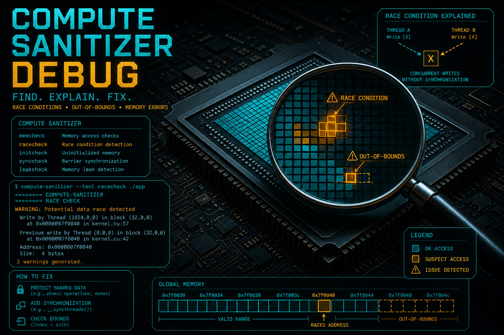

>在 GPU 上调试代码比在 CPU 上难一个数量级。这不仅是因为成千上万个线程并发难以追踪，更因为 GPU 的**异步执行模型**导致了错误报告的严重滞后。
>很多初学者都有过这样的困惑：明明是 Kernel 里的数组越界，为什么程序却崩在了后续的 `cudaMemcpy` 甚至 `cudaFree` 上？当 Host 端捕获到 `cudaErrorIllegalAddress` 时，肇事的 GPU 线程可能早就退出了。
>本章将构建一套工业级的调试方法论。我们将全面拥抱 **Compute Sanitizer**，掌握生产环境下的 **GPU Core Dump** 分析技术，并解读 **CUDA 13** 引入的 **Green Contexts** 如何通过故障隔离（Fault Isolation）改变了高可用服务的架构设计。

## 1. 同步 vs 异步

理解错误的传播机制，是快速定位 Bug 的前提。

### 1.1、同步 API（Synchronous）


```
时间 ─────────────────────────────────────────▶

CPU:  | launch kernel | █████████ 等 GPU 完成 █████████ | 继续执行 |

GPU:                 |==== kernel running ====|
```

 关键特征（从图里看）：

* CPU **调用 API 后被阻塞**
* CPU **什么也干不了**
* GPU 没算完，CPU **绝不往下走**

👉 本质：

> **CPU 等 GPU**

---

### 1.2、异步 API（Asynchronous）

时间轴示意图（单 Stream）

```
时间 ─────────────────────────────────────────▶

CPU:  | launch kernel | launch memcpy | launch next kernel | 继续干活 |

GPU:        |==== kernel ====|== memcpy ==|==== kernel ====|
```

你看到的变化：

* CPU **不等**
* GPU 任务被**排队**
* CPU 可以继续：

  * 提交更多 kernel
  * 做 CPU 计算
  * 准备下一批数据

👉 本质：

> **CPU 和 GPU 并行推进**

---

### 1.3、异步真正牛逼的地方：**重叠（Overlap）**


 CPU ↔ GPU ↔ PCIe 并发重叠

```
时间 ─────────────────────────────────────────▶

CPU:    | submit K1 | submit H2D | submit K2 | submit D2H |

GPU SM:        |==== K1 compute ====|==== K2 compute ====|

PCIe:              |=== H2D ===|        |=== D2H ===|
```
 条件（缺一不可）：

1. 使用 **cudaMemcpyAsync**
2. 使用 **非默认 stream**
3. 使用 **pinned memory（页锁定内存）**
4. GPU 支持 copy engine（现代卡都支持）

👉 一旦满足：

> **算力 + 带宽同时跑**


## 2.错误的本质

> **在 GPU 上调试代码比在 CPU 上难一个数量级**

真正原因 **不是**：

* 线程多（这只是表象）
* kernel 复杂

而是这件事：

> **你看到错误的地方，几乎从来不是错误发生的地方。**

CPU 世界里：

> **因果 = 同步 = 线性**

GPU 世界里：

> **因果 = 异步 = 延迟显现**

---

### 2.1、CPU 调试：错误 = 发生点 = 报告点（同步因果）

 CPU 时间线（同步）

```
时间 ─────────────────────────▶

CPU:
| 指令 A | 指令 B | 💥 非法访问 | ❌ SIGSEGV | 程序终止 |
                      ↑
                 错误发生点
```

 特点

* **错误发生即报告**
* 调试器能精确定位
* Call stack 是“真的”

👉 **调试是“考古学”，但现场还在**

---

### 2.2、GPU 调试：错误 ≠ 报告点（异步因果断裂）

GPU 时间线（异步 + 延迟）

```
时间 ─────────────────────────────────────────▶

CPU:
| launch kernel K1 | launch K2 | cudaMemcpy | cudaDeviceSynchronize | ❌ error |

GPU:
        |==== K1 running ====💥 非法访问 ====|
                         （错误发生）
```

⚠️ **注意这里的断裂：**

* 错误 **发生在 K1**
* 错误 **报告在 cudaDeviceSynchronize**
* CPU 完全不知道 K1 里已经“出事了”

👉 **你在“同步点”看到的错误，可能来自几毫秒前的某个 kernel**

---

### 2.3、错误滞后的真正原因（核心机制）

#### 2.3.1 Kernel launch 本身是异步的

```cpp
kernel<<<grid, block>>>(...);  // ❌ 不会立刻报错
```

* CPU 只是 **“提交任务”**
* GPU **稍后执行**
* 错误被 **缓存** 在 GPU runtime 状态里

---

#### 2.3.2 错误只在“同步点”被“结算”

常见“结算点”：

```cpp
cudaDeviceSynchronize();
cudaMemcpy(...);          // 同步版本
cudaMemcpyAsync + sync
```

### 错误模型图

```
GPU 内部：
[ kernel 执行 ] → [ 产生 error flag ] → [ 挂起 ]

CPU 世界：
直到某个 sync API
才会：
[ 查询 GPU 状态 ] → [ 返回 error ]
```

👉 **GPU 像是“账单月底才结算”**

---

### 2.4、为什么并发线程让问题指数级变难？


 Warp 内非法访问（你永远不知道是哪一个线程）

```
Warp 0 (32 threads):

T0: 正常
T1: 正常
T2: 正常
...
T17: 💥 越界访问
...
T31: 正常
```

结果是：

* **整个 kernel 被标记失败**
* 没有“线程 17 崩了”的精确信息
* 只知道：**这个 kernel 不行了**

👉 GPU 错误是：

> **“群体责任制”**

---

### 2.5、错误的“本质图”（重点）

#### 2.5.1CPU 错误模型（因果闭环）

```
Cause ──▶ Effect ──▶ Report
  |        |           |
 同步     同步        同步
```

---

#### 2.5.2 GPU 错误模型（因果断裂）

```
Cause ──▶ Effect ──▶ (延迟) ──▶ Report
  |        |
 GPU 执行  GPU 状态
```

或者一句话版本：

```
错误发生在 GPU，
暴露在 CPU，
中间隔着一个异步深渊。
```

---


## 3. 调试核武器：Compute Sanitizer

### 3.1、正常 CUDA 运行模型（无 Sanitizer）——错误会“潜伏”

 原始执行时间线（异步、不可追踪）

```
时间 ─────────────────────────────────────────▶

CPU:
| launch K1 | launch K2 | launch K3 | cudaMemcpy | ❌ error |

GPU:
        |==== K1 ====💥|==== K2 ====|==== K3 ====|
              ↑
        非法访问发生
```

 问题

* 错误发生在 **K1**
* 报告发生在 **cudaMemcpy**
* K2、K3 可能已经 **污染了内存**
* 你完全失去“第一现场”

---

### 3.2、Compute Sanitizer 干了什么？——**强制插桩 + 强制同步**
插桩同步模型

```
时间 ─────────────────────────────────────────────────▶

CPU:
| launch K1 |
| ──(等待)── |
| report error |
| launch K2 |

GPU:
        |== K1 (instrumented) ==💥|
              ↑
        立刻捕获并上报
```

 发生了什么？

1. **每一条可能非法的指令被插桩**
2. **每一次内存访问都被检查**
3. **kernel 结束即强制同步**
4. **错误在“最近 kernel”被结算**

👉 **异步世界被“压扁”为同步世界**

---

### 3.3、插桩到底插在哪？

#### 普通 kernel（无插桩）

```
LD global [addr]
```

#### 插桩后的 kernel（逻辑模型）

```
check(addr)
if (invalid):
    report(thread, PC, addr)
LD global [addr]
```

📌 结果：

* 指令数 × 几倍
* 每个线程都被“监视”

---

### 3.4、错误报告模型对比（关键）

无 Sanitizer（延迟聚合）

```
GPU:
[ error flag ] → [ runtime cache ] → (sync point) → CPU
```

---

Compute Sanitizer（即时结算）

```
GPU:
[ error detected ] → [ sanitizer handler ] → [ kernel abort ] → CPU
```

👉 **错误从“账单制”变成“现结制”**

---

### 3.5、为什么它能“精确定位线程”？

### 报告内容来源图

```
Warp
 ├─ threadIdx.x = 17  💥
 │   ├─ PC (指令地址)
 │   ├─ Access type (load/store)
 │   ├─ Address
 │   └─ Size
 └─ 其他线程
```

这在正常 CUDA 里是 **不可能拿到的**。

---

### 3.6、为什么 Sanitizer 会“改变程序行为”？

#### 原因一：强制同步

```
原始：
K1 ─▶ K2 ─▶ K3

Sanitizer：
K1 ─▶ sync ─▶ K2 ─▶ sync ─▶ K3
```

#### 原因二：时间被拉长，竞态暴露

* 原本的 race condition
* 因为指令顺序变化
* **更容易复现**

👉 这也是：

> **“加 sanitizer 后 bug 消失 / 出现”的原因**

---

## 4.Compute Sanitizer 的三枚“战术核弹”——Memcheck / Racecheck / Synccheck

### 4.1 总览：三种错误，其实是三种“秩序崩坏”

```
┌─────────────┬───────────────┬────────────────────────┐
│ 工具        │ 主要抓什么错  │ 错误本质               │
├─────────────┼───────────────┼────────────────────────┤
│ Memcheck    │ 非法内存访问  │ 空间秩序崩坏           │
│ Racecheck   │ 数据竞争      │ 时间秩序崩坏           │
│ Synccheck   │ 同步错误      │ 执行秩序 / 协议崩坏    │
└─────────────┴───────────────┴────────────────────────┘
```

一句话记忆法：

> **Memcheck 管“你摸哪儿”
> Racecheck 管“你什么时候摸”
> Synccheck 管“你该不该一起等”**

---

### 4.2、Memcheck —— 空间秩序崩坏（你摸了不该摸的内存）

#### 4.2.1 它在抓什么？

* 越界访问
* use-after-free
* misaligned access
* 非法 global / shared / local 访问

---

#### 4.2.2 事故现场图（空间错误）

 Kernel 中的真实情况

```
Global memory:

| valid | valid | valid | valid |
                     ↑
                💥 thread 17
                越界访问
```

时间线（插桩同步模型）

```
时间 ─────────────────────────────────▶

CPU:
| launch K1 |
| wait |
| ❌ memcheck report |

GPU:
        |== K1 (instrumented) ==💥|
```

 Memcheck 的“核能力”

* 精确到：

  * threadIdx / blockIdx
  * 访问地址
  * 访问大小
  * load / store
* **在错误发生的那条指令上结案**

👉 本质：

> **内存空间边界被破坏**

---

### 4.3、Racecheck —— 时间秩序崩坏（你们同时动手了）

#### 4.3.1 它在抓什么？

* 共享内存 race
* 全局内存 race
* 缺失同步导致的非确定性写读

---

#### 4.3.2 事故现场图（时间错误）

 两个线程，对同一地址，无同步

```
Shared memory addr X

T0: write X = 1   ────────┐
                          ├─ 💥 race
T1: read  X       ────────┘
```

 Warp / Block 级时间线

```
时间 ─────────────────────────▶

T0: | write X |
T1:       | read X |
```

**没有 happens-before 关系**

---

#### 4.3.3 Racecheck 的工作模型

```
每个内存访问：
  ├─ 记录线程ID
  ├─ 记录访问时间
  ├─ 记录读 / 写
  └─ 分析是否存在未同步冲突
```

 报告不是“崩溃”，而是“因果警告”

👉 本质：

> **结果不可靠，但不一定立刻炸**

这是 GPU 调试里**最阴险的一类 bug**。

---

### 4.4、Synccheck —— 执行协议崩坏（你们没按规则一起等）

#### 4.4.1 它在抓什么？

* `__syncthreads()` 分支不一致
* warp-level primitive 使用错误
* barrier 使用违规

---

#### 4.4.2 经典事故现场：条件分支里的 syncthreads

```cpp
if (threadIdx.x < 16) {
    __syncthreads();  // 💥
}
```

### Block 内真实情况

```
Threads 0–15:  到达 barrier
Threads 16–31: 直接跳过

→ 一半在等，一半永远不来
```

---

#### 4.4.3 死锁模型图

```
Block barrier:

[ wait ] [ wait ] [ wait ] ...
[ skip ] [ skip ] [ skip ] ...

💀 永远无法释放
```

Synccheck 的能力

* 检测：

  * barrier 发散
  * warp 原语调用不一致
* 报告 **“哪些线程没遵守同步协议”**

👉 本质：

> **并行程序的“契约被撕毁”**

---

### 4.5、三者放在同一条因果轴上

```
错误维度：

空间 ─────────▶ Memcheck
时间 ─────────▶ Racecheck
协议 ─────────▶ Synccheck
```

或者用一句工程黑话：

> **Memcheck 找“凶器”
> Racecheck 找“作案时间冲突”
> Synccheck 找“谁没按剧本演”**

---

### 4.6、为什么三者必须一起用？

真实世界的连锁反应

```
Synccheck 错误
   ↓
Race condition
   ↓
写坏数据
   ↓
Memcheck 越界 / 非法访问
```

👉 **Memcheck 往往是“最后爆炸点”，而不是根因**

---


---

## 3. GPU Core Dump 分析


### 4.1、什么是 GPU Core Dump？

> **GPU Core Dump = GPU 在“已经死掉之后”，留下的最后一份现场快照。**

对比一下：

```
CPU Core Dump：进程崩溃瞬间的内存 + 寄存器快照
GPU Core Dump：GPU 发生致命错误后，设备侧执行状态的快照
```

⚠️ 关键区别：

* **CPU core dump：同步世界**
* **GPU core dump：异步世界 + 事后取证**

---

### 4.2、GPU 出事的“真实流程”（非常重要）

#### 4.2.1 没有 Core Dump 的世界（你现在熟悉的）

```
时间 ─────────────────────────────────────────▶

CPU:
| launch K1 | launch K2 | cudaMemcpy | ❌ illegal access |

GPU:
        |==== K1 ====💥|
```

你只知道：

* 有非法访问
* 但不知道：

  * 哪个 warp
  * 哪条指令
  * 当时寄存器是什么

---

#### 4.2.2 有 GPU Core Dump 的世界

```
时间 ─────────────────────────────────────────▶

CPU:
| launch K1 | launch K2 | cudaMemcpy | ❌ error | 读取 core dump |

GPU:
        |==== K1 ====💥|  →  [ dump device state ]
```

👉 **GPU 在“濒死瞬间”把内部状态“冻结”下来**

---

### 4.3、GPU Core Dump 到底“冻结”了什么？

这是理解它价值的关键。

```
GPU Core Dump 内容模型：

┌──────────────────────────────┐
│ Kernel 信息                  │
│  - kernel name               │
│  - grid / block 配置         │
├──────────────────────────────┤
│ Warp / Thread 状态           │
│  - warp id                   │
│  - thread mask               │
│  - program counter (PC)      │
├──────────────────────────────┤
│ 寄存器文件                   │
│  - R0..Rn                    │
├──────────────────────────────┤
│ 内存访问上下文               │
│  - fault address             │
│  - access type (LD/ST)       │
└──────────────────────────────┘
```

一句话总结：

> **Sanitizer 告诉你“谁犯错”
> Core Dump 告诉你“他当时在想什么”**

---

### 4.4、错误发生的“底层模型图”

#### 4.4.4GPU 致命错误（以非法内存访问为例）

```
Warp 执行：

PC = 0x7f1a
R3 = 0xdeadbeef   ← 作为地址
LD [R3]           ← 💥 非法
```

#### 4.4.2Core Dump 冻结的就是这一刻：

```
┌──────────────────────────┐
│ PC = 0x7f1a               │
│ R3 = 0xdeadbeef           │
│ threadIdx = (17,0,0)      │
│ blockIdx  = (3,2,0)       │
└──────────────────────────┘
```

👉 这就是**“第一现场”**

---

### 4.5、GPU Core Dump vs Compute Sanitizer（本质对比）

```
┌────────────────────┬───────────────────────┬───────────────────────┐
│ 维度               │ Compute Sanitizer      │ GPU Core Dump         │
├────────────────────┼───────────────────────┼───────────────────────┤
│ 触发时机           │ 错误发生时             │ 错误发生后             │
│ 执行方式           │ 插桩 + 强制同步         │ 原生执行               │
│ 性能影响           │ 极大                   │ 几乎无（仅 dump）      │
│ 是否改变时序       │ 是                     │ 否                     │
│ 是否能看寄存器     │ 否                     │ 是                     │
│ 是否适合线上       │ 否                     │ 是                     │
└────────────────────┴───────────────────────┴───────────────────────┘
```

一句工程真话：

> **Sanitizer 是“审讯”
> Core Dump 是“尸检”**

---

### 4.6、为什么线上只能靠 GPU Core Dump？

因为 Sanitizer **改变世界线**。

```
原始生产环境：
K1 ─▶ K2 ─▶ K3 ─▶ crash

Sanitizer：
K1 ─▶ sync ─▶ crash（或不 crash）
```

而 Core Dump：

* 不插桩
* 不同步
* **完整保留“事故前的真实执行状态”**

👉 这就是它在 **大模型训练 / 推理线上环境** 的意义。

---

### 4.7、GPU Core Dump 能解决什么级别的问题？

#### 它最擅长的三类问题

1️⃣ **极低概率 crash**

```
1 / 10^6 step 才炸一次
```

2️⃣ **Sanitizer 复现不了**

```
加 sanitizer 就不炸
```

3️⃣ **驱动 / SASS / 编译器级问题**

```
PC 对应的 SASS 异常
```

---

### 4.8、你该如何“读”一个 GPU Core Dump？

不是“看一堆寄存器”，而是：

```
1️⃣ 确认 kernel
2️⃣ 锁定 warp / thread
3️⃣ 看 PC → 对应哪条指令
4️⃣ 看地址寄存器来源
5️⃣ 反推：这个值从哪算出来的？
```

👉 **它是“反向执行推理”，不是日志分析**

---

### 4.9、GPU 调试工具链的完整分工

```
写代码阶段
   ↓
Compute Sanitizer
   ↓
Nsight Systems / Compute
   ↓
线上 / 低概率崩溃
   ↓
GPU Core Dump
```

一句话：

> **Sanitizer 找逻辑错误
> Profiler 找性能问题
> Core Dump 找“世界线级事故”**

---


## 5. CUDA 13 新特性：Green Contexts 与 Rich Errors

这是 2025 年 AI 基础设施工程师必须关注的架构级更新。

### 5.1 Green Contexts：故障隔离
在传统的 CUDA 编程中，Context 是很重的。如果一个进程内的某个 Kernel 触发了非法访问，整个 Context 会损坏，导致该进程内所有流、所有显存数据不可用。这对于**多租户推理服务（Multi-Tenant Inference）**是不可接受的。

**Green Context** 是一种轻量级的资源隔离机制：
*   它允许在同一个进程（和同一个地址空间）内创建多个故障隔离域。
*   **优势**：如果 Green Context A 中的 Kernel 崩溃，只有 Context A 会被终止，Context B 中的任务不受影响，服务主进程依然存活。
*   这将彻底改变 vLLM 或 Triton Inference Server 的异常处理架构。

### 5.2 Rich Error Reporting (增强错误报告)
长期以来，`cudaGetErrorString` 返回的 "Illegal memory access" 令人绝望——它没告诉我是读还是写，也没告诉我地址是多少。

CUDA 13 引入了结构化的错误报告接口。驱动程序现在可以返回一个 `CUcorruptStreamState` 对象，其中包含：
*   **Offending Address**：导致崩溃的具体内存地址（例如 `0x7f...`）。
*   **Access Type**：是 Read、Write 还是 Atomic。
*   **Instruction Offset**：崩溃指令在 Kernel 中的偏移量。

这使得自动化故障诊断系统成为可能。


---

## 6. 调试实战：从 Crash 到 Fix

本章的配套代码构造了几个经典的“必死”场景，用于演示调试工具的威力。

### 实验场景设计
1.  **OOB Write**：在一个简单的 Vector Add 中，故意让最后一个线程写入 `d_data[N]`（越界 1 个元素）。
2.  **Race Condition**：在 Shared Memory 直方图计算中，故意移除 `atomicAdd` 或同步屏障。
3.  **Deadlock**：在 `if (tid < 16)` 分支内调用 `__syncthreads()`。

我们将在代码中演示如何通过 `compute-sanitizer` 捕捉这些错误，而不是依赖运气。

> **[💻 代码占位符：参见项目 `examples/01_cuda_basics/09_debug_and_sanitizer.cu`]**
> *   *代码包含：由宏控制的错误注入 Kernel，以及配套的 sanitizer 运行脚本。*

---

## 📚 参考文献与延伸阅读

1.  **Compute Sanitizer User Guide**
    *   *NVIDIA 官方手册，详细列出了 memcheck, racecheck, initcheck 的命令行参数与原理。*
    *   [Link](https://docs.nvidia.com/compute-sanitizer/ComputeSanitizer/index.html)
2.  **CUDA-GDB: GPU Core Dump Support**
    *   *介绍了如何在无头节点（Headless Node）上配置和分析 GPU Core Dump。*
3.  **CUDA 13 Programming Guide - Green Contexts**
    *   *权威文档，解释了 Green Contexts 的生命周期管理与故障隔离边界。*

---

👉 **下一章：[Module A] 10. 性能建模第一性原理：Roofline Model 分析**
至此，我们已经解决了“跑得快”（异步）和“跑得对”（调试）的问题。
Module A 的最后一章，我们将学习如何**“算得准”**。我们将引入 Roofline Model，用数学公式告诉你，你的 Kernel 到底还能不能更快，瓶颈究竟是在算力还是带宽。这是性能优化的期末考试。