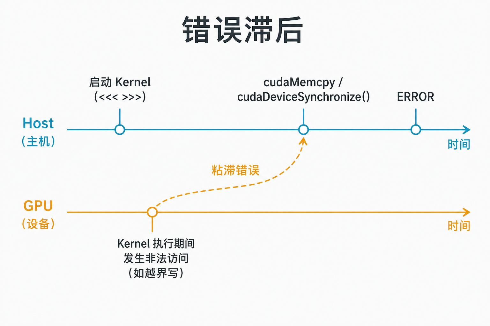
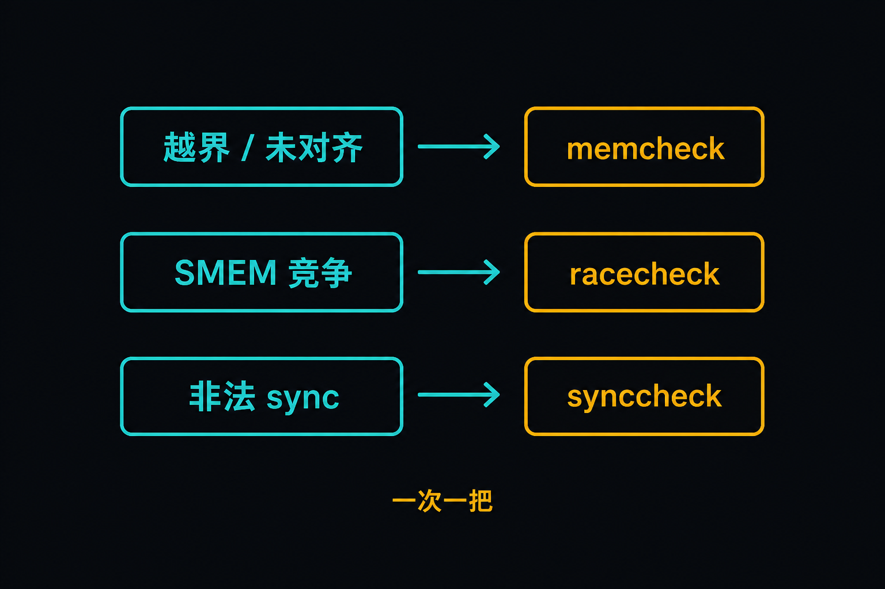

# A-09. Compute Sanitizer：异步错误怎么归因


> A-08 停在 Stream / Event：怎么叠拷贝与计算。  
> 本章抓正确性：**异步路径上的 OOB、SMEM race、非法 `__syncwarp` mask，为什么 Host 晚报、用哪把 Sanitizer 刀切开**。  
> 流水线课回 A-08；Roofline 去 A-10；CG 同步层去 C-02 / C-04。

**配套可复现**：[Yapeng-Gao/AI-System-Performance-Lab](https://github.com/Yapeng-Gao/AI-System-Performance-Lab)（文章 + `.cu` + 实测表）。有用请 Star。本章示例：[`examples/01_cuda_basics/09_debug_and_sanitizer.cu`](https://github.com/Yapeng-Gao/AI-System-Performance-Lab/blob/main/examples/01_cuda_basics/09_debug_and_sanitizer.cu)。

---

## TL;DR（工程结论）

1. **异步错误常滞后报告。** Kernel 里非法访问，Host 可能在后续 `cudaDeviceSynchronize` / `cudaMemcpy` / 退出时才看到 `cudaErrorIllegalAddress`。先怀疑「谁先 launch」，不要只盯崩溃那一行 API。
2. **Compute Sanitizer 四把刀：** `memcheck`（越界/未对齐/泄漏）· `racecheck`（SMEM 数据竞争）· `initcheck`（未初始化 Global）· `synccheck`（非法 `__syncthreads` / `__syncwarp` / CG 同步）。一次跑一把，对症选 `--tool`。
3. **本章三必做：** mode 0 OOB → memcheck；mode 1 SMEM 无原子累加 → racecheck；mode 2 非法 `__syncwarp` mask → synccheck。主证据是 sanitizer 的 **ERROR / Hazard**，不是墙钟。
4. **日常习惯：** 需要行号时加 `-lineinfo`（`-G` 更慢）；可疑点 `cudaDeviceSynchronize` + `cudaGetLastError`；生产路径勿默认挂 sanitizer（开销大）。
5. **本机（RTX 5090 / `sm_120`）。** memcheck：**PASS**（`oob_kernel` Invalid `__global__` write）。racecheck：**PASS**（`race_kernel` Hazard Warning）。synccheck：**PASS**（`illegal_sync_kernel` 上 `__syncwarp` **Invalid arguments**，含 thread 16；SUMMARY 17 errors）。半 Block `__syncthreads` 本机曾 0 errors，故 mode 2 改用非法 mask。`initcheck` / `-fdevice-sanitize` 见 §7。

---

## 1. 本章钉什么，不抢哪章

| 问题 | 本章 | 不在本章 |
|---|---|---|
| 为什么崩在 memcpy？ | §2：异步粘滞错误 | Stream overlap 课（A-08） |
| 用哪把 sanitizer？ | §3 工具表 | NCU / Roofline（A-10） |
| OOB / race / 非法 sync | §4 三例 | SIMT 全课（A-04） |
| 未初始化 Global | 工具表点名 | 本章无 mode 3 代码 |
| Green Contexts / core dump | §7 一行 | 生产 isolation 长文 |
| CG 同步原语细节 | synccheck 出口 | C-02 / C-04 |

---

## 2. 错误为什么晚到 Host

CUDA 多数 launch / `MemcpyAsync` 对 Host **立刻返回**：活进了 GPU 队列。非法地址、部分硬件异常，要等到某次**同步点**，Host 才通过返回码或 sticky error 看见。



> 图 1：肇事线程可能早已退场；崩溃 API 往往不是第一现场。

常用同步点：`cudaDeviceSynchronize`、`cudaStreamSynchronize`、默认同步的 `cudaMemcpy`、以及下一次会检查前错的 API。`cudaGetLastError` 取走并清除 sticky error；`cudaPeekAtLastError` 只看不取。调试时在可疑 kernel 后立刻 sync，比等程序末尾再查更省事。

裸跑本章 mode 0 / 2 时，有时 sync「看起来成功」、有时直接 `unspecified launch failure`——都正常。**归因靠 sanitizer**，不靠猜崩溃栈。

---

## 3. 四把刀

| tool | 查什么 | 本章 mode |
|---|---|---|
| `memcheck` | Global/Local/Shared 越界、未对齐；可选泄漏 | **0** |
| `racecheck` | Shared memory 数据竞争 | **1** |
| `synccheck` | 非法 `__syncthreads` / `__syncwarp` / CG 同步 | **2** |
| `initcheck` | 未初始化 Global 读 | 正文点名；**无独立 mode** |



> 图 2：越界走 memcheck，SMEM 竞争走 racecheck，非法 sync 走 synccheck。`initcheck` 见上表，本章无独立 mode。

通用形态：

```bash
compute-sanitizer --tool <memcheck|racecheck|synccheck|initcheck> ./app [args]
```

Sanitizer 是正确性工具，不是 profiler：变慢、改调度都正常。若加 compile-time instrumentation 后行为更怪，官方建议再跑 racecheck（见 §7）。

---

## 4. 三例故意 bug

示例：`09_debug_and_sanitizer.cu`。启动打印 GPU / `sm_XX`，并说明种了什么 bug、该用哪把刀。

| mode | 种下的错 | 期望 |
|---|---|---|
| 0 | `oob_kernel`：长度 `N` 的缓冲，thread0 写 `data[N]`；launch `<<<1,32>>>` | memcheck：`Invalid __global__ write` |
| 1 | `race_kernel`：32 线程对同一 `s_val` 做 `+= 1`，无 atomic | racecheck：Hazard（常为 Warning） |
| 2 | `illegal_sync_kernel`：线程 0..16 调用 `__syncwarp(0xffff)`（thread 16 不在 mask 里） | synccheck：`Barrier error` / **Invalid arguments** |

**坑：**

- 不要用 `<<<1, N+1>>>`（`N=1024`）种 OOB——先撞 blockDim 上限，看不到越界写。
- 半 Block `__syncthreads` 在本机 sm_120 上 synccheck 曾报 **0 errors**（仍是 UB，但工具没报）。mode 2 改用官方 sample 同类的 **非法 syncwarp mask**。
- OOB 之后 `cudaDeviceSynchronize` / `cudaFree` 的 sticky `launch failure` 是连带，不是「free 写错了」。

读报告时优先看：**kernel 名、源文件行（需 `-lineinfo`）、访问地址或同步原语**。不要只截 Host `main` 行。

正确写法提示（本章不展开成新课）：OOB → 收紧边界；SMEM 累加 → `atomicAdd` 或归约；`__syncwarp(mask)` → 到达该调用的线程必须都在 mask 里（半 Block `__syncthreads` 仍是 UB，见 A-04；本机 synccheck 可能报不出）。

---

## 5. 怎么跑

前置：CUDA Toolkit（含 `compute-sanitizer`），CMake ≥ 3.25。

```bash
cmake .. -DCMAKE_BUILD_TYPE=Release -DCMAKE_CUDA_ARCHITECTURES=native
cmake --build . --parallel --target 01_cuda_basics_09_debug_and_sanitizer

# 裸跑（可能不崩）
./bin/01_cuda_basics_09_debug_and_sanitizer 0

# 归因
compute-sanitizer --tool memcheck   ./bin/01_cuda_basics_09_debug_and_sanitizer 0
compute-sanitizer --tool racecheck  ./bin/01_cuda_basics_09_debug_and_sanitizer 1
compute-sanitizer --tool synccheck  ./bin/01_cuda_basics_09_debug_and_sanitizer 2
```

或：

```bash
cd examples/01_cuda_basics
bash 09_run_sanitizer.sh
```

Windows：把 binary 换成 `.\cmake-build-debug\bin\01_cuda_basics_09_debug_and_sanitizer.exe`；`compute-sanitizer` 仍须在 PATH。无 bash 时手跑上面三条即可。

需要源码行时，对目标加 `-lineinfo` 再编（本仓库默认 Release 可能没有行号——报告仍会给出 kernel 名与 PC）。

| 现象 | 怎么读 |
|---|---|
| memcheck：`Invalid __global__ write` at `oob_kernel` | **PASS**（本机已确认）；后面 sticky `cudaFree` 失败是连带 |
| memcheck 只报 blockDim / `invalid argument` | launch 非法，还没跑到 OOB |
| racecheck：Hazard / Warning | **PASS**（本机已确认） |
| synccheck：`Invalid arguments` at `__syncwarp` / `illegal_sync_kernel` | **PASS**（本机已确认；thread 0..16 均报） |
| synccheck：半 Block `__syncthreads` → 0 errors | 本机 sm_120 已观察到；勿当「没挂对 tool」 |
| 报告无行号 | 加 `-lineinfo` 重编 |

三 mode 本机均已 PASS；不必再贴。

---

## 6. 工程边界

- Sanitizer 开销大，CI 可抽样；热路径回归用小 reproducers（本章这种）。
- `racecheck` 主要盯 **shared memory**；Global 上的 race 不是它的主战场。
- `memcheck` 仍可能有假阴性（相邻分配等）；CUDA 13.1 起的 compile-time instrumentation 改善覆盖，见 §7。
- 不要把 sanitizer 当带宽/occupancy 证据。

---

## 7. 扩展阅读（不抢后续章）

1. Compute Sanitizer User Guide（见 §10-1）：四 tool 完整选项。
2. CUDA 13.1+：`-fdevice-sanitize=memcheck`（compile-time；见 §10-2 / NVIDIA blog）。工具链不够新就跳过，不影响本章三 mode。
3. NVTX memory pool 标注可帮 memcheck 看子分配（见 §10-5）。`cuda-gdb` / core dump / Green Contexts：生产调试出口，本章不展开。
4. 下一章 A-10：正确性过关后，用 Roofline / SOL 判断算力还是带宽墙。

---

## 8. SOP + 误区

1. 复现：固定 mode，先裸跑记症状，再挂对应 `--tool`。
2. 报告对上 planted kernel 名 → 归因完成；再改代码重跑确认 ERROR 消失。
3. 仍对不上：加 `-lineinfo`；确认没跑错 mode / 错 tool。
4. 要讲 overlap：回 **A-08**。要讲性能墙：去 **A-10**。

| 误区 | 纠正 |
|---|---|
| 崩在 `cudaMemcpy` = memcpy 写错了 | 常是更早的 kernel；看 sticky error / sanitizer |
| 一次挂上所有 tool | 一次一把 `--tool` |
| 裸跑不崩 = 没 bug | race / 部分 OOB 可以「看起来能跑」 |
| Sanitizer = 加速分析 | 正确性工具；性能去 NCU / A-10 |
| 必须上 Green Contexts | Module A 不需要；§7 一行即可 |

---

## 9. 小结与下一章

异步让错误离开现场；Sanitizer 把现场拉回来。memcheck / racecheck / synccheck 对应越界、SMEM 竞争、非法同步原语——先对症，再谈性能。

下一篇用第一性原理看吞吐天花板：[A-10 Roofline / SOL](https://github.com/Yapeng-Gao/AI-System-Performance-Lab/tree/main/article/01_cuda_basic)。

---

> 本文配套代码与实测：[AI-System-Performance-Lab](https://github.com/Yapeng-Gao/AI-System-Performance-Lab)。觉得有用请 Star，后续章更新更好找。  
> 本章示例：[`examples/01_cuda_basics/09_debug_and_sanitizer.cu`](https://github.com/Yapeng-Gao/AI-System-Performance-Lab/blob/main/examples/01_cuda_basics/09_debug_and_sanitizer.cu)。下一篇：[A-10 Roofline / SOL](https://github.com/Yapeng-Gao/AI-System-Performance-Lab/tree/main/article/01_cuda_basic)。

## 10. 参考文献

**官方**

1. NVIDIA, *Compute Sanitizer* User Guide（memcheck / racecheck / initcheck / synccheck）. https://docs.nvidia.com/compute-sanitizer/ComputeSanitizer/index.html
2. NVIDIA, *Compute Sanitizer Release Notes*（含 `-fdevice-sanitize=memcheck` 等）. https://docs.nvidia.com/compute-sanitizer/ReleaseNotes/index.html
3. NVIDIA, *CUDA Runtime API*, Error Handling（`cudaGetLastError` / sticky errors）. https://docs.nvidia.com/cuda/cuda-runtime-api/group__CUDART__ERROR.html

**工程**

4. NVIDIA Technical Blog, *Better Bug Detection: Compile-Time Instrumentation for Compute Sanitizer*. https://developer.nvidia.com/blog/better-bug-detection-how-compile-time-instrumentation-for-compute-sanitizer-enhances-memory-safety/
5. NVIDIA Technical Blog, *Efficient CUDA Debugging: Compute Sanitizer with NVTX*. https://developer.nvidia.com/blog/efficient-cuda-debugging-using-compute-sanitizer-with-nvtx-and-creating-custom-tools/

**扩展（不进 MVP）**

6. cuda-gdb / GPU core dump（生产调试路径）。
7. Green Contexts 故障隔离（服务端多租户；非本章必做）。
