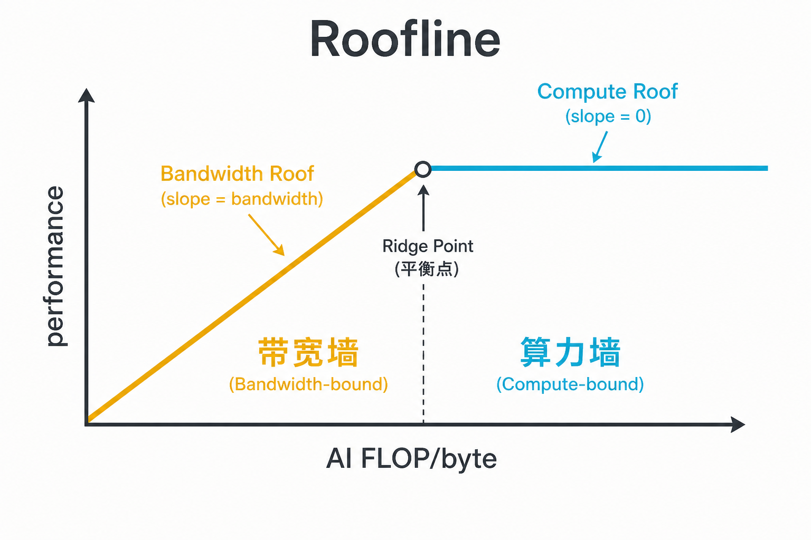
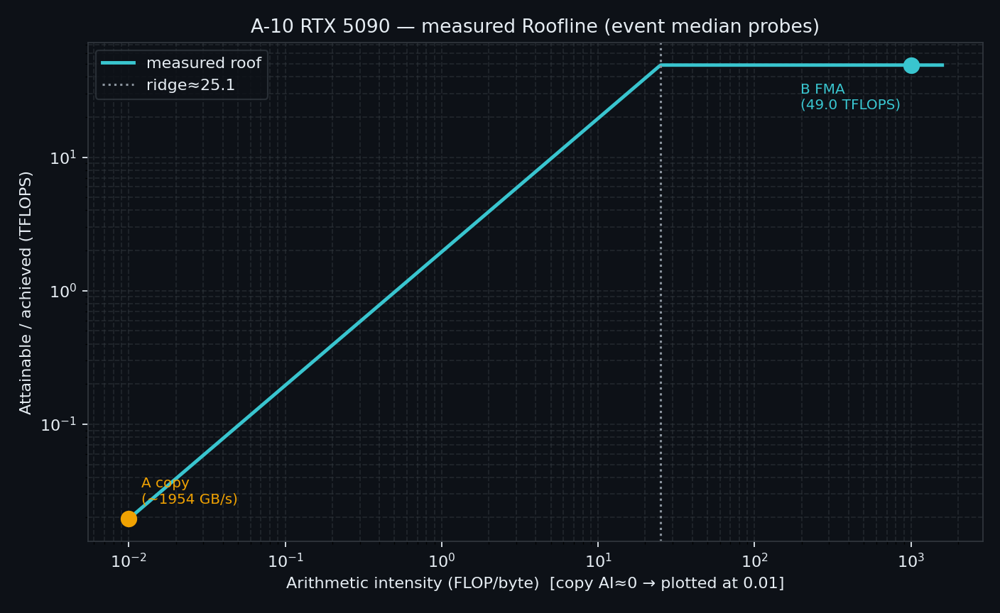

# A-10. Roofline：先分清带宽墙还是算力墙


> A-09 停在正确性：Sanitizer 把异步错误拉回现场。  
> 本章收束 Module A：**用 Roofline / SOL 先判断是带宽墙还是算力墙**，再决定去 Module B 还是继续算力侧。  
> 合并/bank/spill/TMA 处方去 Module B；症状总表去 **B-10**。

**配套可复现**：[Yapeng-Gao/AI-System-Performance-Lab](https://github.com/Yapeng-Gao/AI-System-Performance-Lab)（文章 + `.cu` + 实测表）。有用请 Star。本章示例：[`examples/01_cuda_basics/10_roofline_demo.cu`](https://github.com/Yapeng-Gao/AI-System-Performance-Lab/blob/main/examples/01_cuda_basics/10_roofline_demo.cu)。

---

## TL;DR（工程结论）

1. **Roofline：** 横轴 AI（FLOP/byte），纵轴可达性能。斜坡 ≈ 带宽 × AI；平台 ≈ 算力峰。ridge 以左偏带宽墙，以右偏算力墙。
2. **先分流再开刀。** 带宽侧 → 访存/布局/异步拷（Module B）；算力侧 → ILP/算法/Tensor。双低（Compute SOL 与 Memory SOL 都不高）常是 latency / 启动 / 同步——别先换 API（细表在 **B-10**）。
3. **实测屋顶比估 clock 管用。** CUDA 12+ `cudaDeviceProp` 已无时钟字段。本章用大缓冲 `float4` copy 与寄存器 FMA 探针，**event median** 给出本机 GB/s 与 FP32 TFLOPS。
4. **AI 要会算。** 纯 copy ≈ 0 FLOP/byte；本探针 compute ≈ `(2×4×iters)/8` FLOP/byte。ridge ≈ `测得 TFLOPS×1000 / 测得 GB/s`（用实测屋顶，不用瞎估理论峰）。
5. **本机（RTX 5090 / `sm_120`，170 SM，512-bit）。** copy：**1953.56 GB/s**（AI≈0，memory 侧）；FMA：**49.01 TFLOPS**（AI≈1000，compute 侧）；**ridge_AI ≈ 25.09 FLOP/byte**。绝对 GB/s 可能含 L2 / 短核计时噪声，主看分流形状。NCU 未跑。

---

## 1. 本章钉什么，不抢哪章

| 问题 | 本章 | 不在本章 |
|---|---|---|
| 什么是 Roofline / AI / ridge？ | §2 | SM 解剖（A-02） |
| 本机屋顶大概在哪？ | §4～5 双探针 | NVML 精确理论峰 |
| SOL 怎么读？ | §3 一句同构 | NCU metric 百科 |
| 带宽墙怎么治？ | 决策表出口 | coalescing 扫（B-01） |
| 症状→开哪章？ | 钩子 B-10 | Checklist 正文（B-10） |

---

## 2. Roofline：两堵墙，一个强度

任何 kernel 的上限，最终来自两样东西：算得有多快，数据喂得有多快。

- **算力平台（compute roof）**：峰值 FLOP/s（本章探针盯 FP32 FMA）。
- **带宽斜坡（bandwidth roof）**：峰值 Bytes/s × AI。

**算术强度**

\[
AI = \frac{\text{FLOPs}}{\text{Bytes moved}}
\]

AI 是**这次算法/实现**的属性，不是 GPU 型号写死的常数。纯 memcpy 的 AI≈0；大矩阵乘可以很高。



> 图 1：点落在 ridge 左侧 → 先怀疑带宽；右侧 → 先怀疑算力。距离屋顶的空隙才是「还有没有油水」。

**ridge**（用实测屋顶估）：

\[
AI_{\text{ridge}} \approx \frac{\text{achieved FLOP/s}}{\text{achieved Byte/s}}
\]

示例会打印：`ridge_AI ≈ TFLOPS×1000 / GB/s`（单位 FLOP/byte）。

---

## 3. Speed-of-Light：同一分流的工具语言

Nsight Compute 的 **GPU Speed Of Light** 把「相对理论最大吞吐的百分比」拆成 Compute / Memory 等。和 Roofline 是同一句话的两种画法：

- Memory SOL 很高、Compute 不高 → 常落在斜坡侧。
- Compute SOL 很高、Memory 不高 → 常落在平台侧。
- **两者都低** → 先查 latency、占用、同步、启动，不要先换 TMA。

读法细则与症状表在 **B-10**。本章可选跑 `10_profile_roofline.sh` 看 Roofline chart 上两个点（copy 靠斜坡、FMA 靠平台），**不强制**。

---

## 4. 探针怎么设计

| mode | 做什么 | 读什么 |
|---|---|---|
| A | 大缓冲 `float4` 读+写 copy | `achieved_bw` GB/s；AI≈0 |
| B | 多累加器寄存器 FMA，足够 `iters` | `achieved_fp32` TFLOPS；高 AI |
| C | 用 A/B 的实测屋顶算 ridge，并打印相对位置 | 心智闭环 |

要点：

- 工作集要大，否则 copy 测的是 **L2** 不是 HBM（B-04）。
- `float4` 只为生成宽 load/store；合并处方不在本章扫。
- FMA 用多条独立链，减轻依赖气泡；结果写回防 DCE。
- 计时：warmup + 多次 run → **median**（A-08 口径）。

---

## 5. 怎么跑

```bash
cmake .. -DCMAKE_BUILD_TYPE=Release -DCMAKE_CUDA_ARCHITECTURES=native
cmake --build . --parallel --target 01_cuda_basics_10_roofline_demo
./bin/01_cuda_basics_10_roofline_demo
```

`native` 失败时：Ada `89`，5090 `120`。

期望形状（本机 RTX 5090 / `sm_120` 参考）：

```text
GPU: NVIDIA GeForce RTX 5090
sm_120  SMs=170  memoryBusWidth=512-bit
[A] ... achieved_bw=1953.56 GB/s
[B] ... achieved_fp32=49.01 TFLOPS
[C] ridge_AI ≈ 25.09 FLOP/byte
    copy << ridge → memory-bound side
    compute >> ridge → compute-bound side
```

| 怎么读 | 不要读成 |
|---|---|
| A ≈ **1954 GB/s** | 已标定白皮书峰值；短核/L2 可使绝对数偏高 |
| B ≈ **49 TFLOPS** | Tensor Core 峰；也不是「FP32 理论峰已吃满」 |
| ridge ≈ **25** FLOP/byte | 用实测屋顶；copy/compute 分居两侧即课成 |
| 可选 NCU 图上两个点 | ncu 附着时程序自打的 ms |



> 图 2：屋顶用本章测得的 BW / TFLOPS；copy 的 AI≈0 在对数轴上画在 0.01。CSV：`docs/results/A-10_roofline_rtx5090.csv`。重画：`python scripts/plot_a10_roofline.py`。

可选旁证：

```bash
cd examples/01_cuda_basics
bash 10_profile_roofline.sh
```

打开 `.ncu-rep`，看 SpeedOfLight / Roofline。

---

## 6. 决策表（分流出口）

| 信号 | 建议 |
|---|---|
| AI 低 / 贴斜坡 / Memory SOL 高 | Module B：合并（B-01）、布局（B-09）、pinned overlap（B-06）、设备内 async（B-07/B-08） |
| AI 高 / 贴平台 / Compute SOL 高 | 查 ILP、算法强度、是否该上 Tensor；别先改 memcpy |
| 双低 | 同步过多、occupancy、启动墙（A-08 / C-06）；总表 **B-10** |
| 工作集很小却「带宽很美」 | 可能在测 L2；加大缓冲或去 B-04 |

---

## 7. 扩展阅读（不抢后续章）

1. Williams et al., Roofline（见 §10-4）：模型原文。
2. Nsight Compute Triage / SpeedOfLight（见 §10-1～2）：SOL 分流 → **B-10**。
3. Hierarchical Roofline（L1/L2/DRAM、Tensor roof）：见 §10-5～6；本章只钉 HBM + FP32。
4. Module A 到此收束。下一站系统治内存墙：从 [B-01 合并访问](https://github.com/Yapeng-Gao/AI-System-Performance-Lab/tree/main/article/02_memory_optim) 起。

---

## 8. SOP + 误区

1. 跑通示例，记下 BW、TFLOPS、ridge。
2. 对照你的真实 kernel：估 AI，看落在 ridge 哪侧。
3. 只改与那一侧相关的一处，再回归 median。
4. 需要症状总表：打开 **B-10**。

| 误区 | 纠正 |
|---|---|
| occupancy 高 = 已贴 roof | 仍可能双低或偏一侧 |
| 估 clock 理论峰 = 本机屋顶 | CUDA 12+ 无 prop clock；看实测 |
| 一张 Roofline 治好所有病 | 只负责分流 |
| NCU 附着 ms = 结论 | 只用 SOL/百分比；墙钟看裸跑 event |
| 本章在讲 TMA/合并处方 | 回 Module B |

---

## 9. 小结与下一章

Module A 从映射、调度、空间、异步、正确性走到这里：慢的时候先问「撞的是哪堵墙」。实测 copy 与 FMA 探针给出本机屋顶；AI 决定你站在斜坡还是平台。

下一篇进入内存墙主线：[B-01 Global Memory / Coalescing](https://github.com/Yapeng-Gao/AI-System-Performance-Lab/tree/main/article/02_memory_optim)。

---

> 本文配套代码与实测：[AI-System-Performance-Lab](https://github.com/Yapeng-Gao/AI-System-Performance-Lab)。觉得有用请 Star，后续章更新更好找。  
> 本章示例：[`examples/01_cuda_basics/10_roofline_demo.cu`](https://github.com/Yapeng-Gao/AI-System-Performance-Lab/blob/main/examples/01_cuda_basics/10_roofline_demo.cu)。下一篇：[B-01 合并访问](https://github.com/Yapeng-Gao/AI-System-Performance-Lab/tree/main/article/02_memory_optim)。

## 10. 参考文献

**官方**

1. NVIDIA, *Nsight Compute Profiling Guide* — SpeedOfLight / Roofline charts. https://docs.nvidia.com/nsight-compute/ProfilingGuide/
2. NVIDIA, *Nsight Compute Compute Triage Guide* — Compute vs Memory SOL. https://docs.nvidia.com/nsight-compute/ComputeTriage/index.html

**工程**

3. NERSC, Roofline on NVIDIA GPUs（含 hierarchical 说明）. https://docs.nersc.gov/tools/performance/roofline/

**实证 / 经典**

4. Williams, Waterman, Patterson, *Roofline: An Insightful Visual Performance Model…*, CACM 2009 / EECS-2008-134. https://www2.eecs.berkeley.edu/Pubs/TechRpts/2008/EECS-2008-134.pdf
5. 本章本机（RTX 5090）：BW ≈ 1954 GB/s，FP32 ≈ 49 TFLOPS，ridge ≈ 25 FLOP/byte。

**扩展**

6. Yang et al., *Hierarchical Roofline Performance Analysis for Deep Learning Applications*, arXiv:2009.05257. https://arxiv.org/abs/2009.05257
