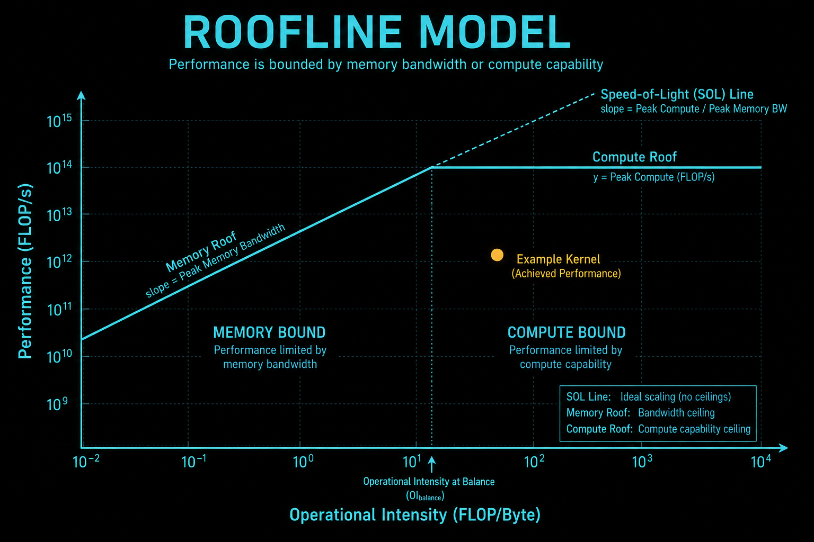

>在工程实践中，最令人迷茫的时刻莫过于：你的 Kernel 运行时间从 10ms 优化到了 5ms，老板问你“还能不能更快？”。你该如何回答？是凭感觉说“应该差不多了”，还是甩出一张图表，自信地说“我们已经达到了硬件物理极限的 92%，再优化边际效应极低”？
>为了回答这个问题，我们需要引入 **Speed-of-Light (SOL)** —— 光速的概念。在这里，光速指的不是物理常数，而是特定硬件在物理定律限制下的**理论性能上限**。

**配套可复现**：[Yapeng-Gao/AI-System-Performance-Lab](https://github.com/Yapeng-Gao/AI-System-Performance-Lab)（文章 + `.cu` + 实测表）。有用请 Star。 本章示例：[`examples/01_cuda_basics/10_roofline_demo.cu`](https://github.com/Yapeng-Gao/AI-System-Performance-Lab/blob/main/examples/01_cuda_basics/10_roofline_demo.cu)。

## 1. 第一性原理：算力墙与带宽墙
>任何程序的性能，上限只可能来自两件事：
>1️⃣ 你能多快地“算”
>2️⃣ 你能多快地“喂数据”

把这句话翻译成物理量：
| 维度 | 对应物理极限        |
| ---- | ------------------- |
| 计算 | 峰值算力（FLOPs/s） |
| 数据 | 内存带宽（Bytes/s） |


任何计算设备的性能上限，最终都受制于两堵“墙”。

### 1.1 算力墙 (Compute Roof)
这是由晶体管数量、频率和指令集决定的理论计算峰值。
*   **公式**：$P_{max} = \text{Clock} \times \text{NumSMs} \times \text{Cores/SM} \times \text{Ops/Cycle}$
*   **现状**：对于 H100，FP16 Tensor Core 的理论峰值高达近 1000 TFLOPS。这是一堵极高的墙，很难触顶。

### 1.2 带宽墙 (Bandwidth Roof)
这是由显存位宽、显存频率和通道数决定的数据传输峰值。
*   **公式**：$B_{max} = \text{Bus Width} \times \text{Memory Clock} \times \text{DDR Factor}$
*   **现状**：H100 的 HBM3 带宽约为 3.35 TB/s。虽然很快，但相对于算力的增长，带宽往往是更紧缺的资源。

### 1.3 核心变量：算术强度 (Arithmetic Intensity)
有了这两堵墙，什么决定了我们的 Kernel 会撞上哪一堵？答案是**算术强度 (AI)**。
$$ AI = \frac{\text{Floating Point Operations (FLOPs)}}{\text{Bytes Transferred (Bytes)}} $$

*   **AI 是算法的属性，而非硬件属性**。
    *   **Element-wise (如 VectorAdd)**：读 2 个数，写 1 个数，做 1 次加法。$AI \approx 1/12 < 1$。这注定是 **Memory Bound**。
    *   **Matmul (GEMM)**：对于 $N \times N$ 矩阵，计算量是 $O(N^3)$，访存量是 $O(N^2)$。随着 $N$ 增大，AI 线性增长。这注定在 $N$ 足够大时是 **Compute Bound**。
    


---
## 2、Roofline Model：二维物理约束图
### 2.1Roofline 的坐标轴（这是第一性原理）

```cpp
纵轴：性能 Performance (FLOPs/s)
↑
|
|
|
+------------------------------→ 横轴：算术强度 Arithmetic Intensity (FLOPs / Byte)

```
算术强度（AI） =每搬 1 Byte 数据，做多少次计算

这是 Roofline 的“灵魂变量”。
### 2.2两条“不可突破的物理天花板”
（1）内存带宽天花板（斜线）
性能 = 带宽 × 算术强度

```cpp
   |
   |          /
   |        /
   |      /
   |    /
   |  /
   |/
   +----------------→ AI

```
这条线的含义非常残酷：数据喂不够，再多计算单元也是饿着的
（2）峰值算力天花板（横线）

```cpp
   |
   |----------------------  ← 峰值 FLOPs
   |
   |
   |
   +----------------→ AI

```
算力已经满载，再高的算术强度也没用
3️⃣ Roofline 全图（核心认知）

```cpp
性能 ↑
      |                ───────────────  ← Compute Roof (算力上限)
      |               /
      |              /
      |             /
      |            /
      |           /
      |          /
      |         /
      |        /
      |       /
      |      /
      |_____/________________________→ 算术强度
           ↑
        Ridge Point（拐点）

```
拐点（Ridge Point） = 峰值算力 / 带宽

## 3、如何用 Roofline “一眼看穿”一个 Kernel？
判断规则（非常重要）
| 落在哪     | 结论              | 优化方向     |
| ---------- | ----------------- | ------------ |
| 左侧斜线区 | **Memory-bound**  | 提高数据复用 |
| 右侧横线区 | **Compute-bound** | 提高指令效率 |

举一个 CUDA Kernel 的真实判断过程

假设：
* HBM 带宽：1000 GB/s
* 峰值算力：100 TFLOPs
* Kernel 算术强度：2 FLOPs / Byte

理论性能上限：
>性能 = 1000 × 2 = 2000 GFLOPs = 2 TFLOPs

离 100 TFLOPs 还差 50 倍

结论：

>❌ 不要再做 FMA、unroll、指令级优化
>✅ 去做 shared memory、tiling、fusion、减少访存

这就是 Roofline 的“核武器级指导意义”。


## 4、Speed-of-Light (SoL) 分析：Roofline 的工程化版本

Roofline 是理论模型,SoL 是 NVIDIA 工程化落地版本

### 4.1 SoL 的定义

你的 Kernel，距离“理论物理极限”还差多少？

公式非常简单：

```cpp
SoL = 实际性能 / 理论上限性能
```
这个“理论上限”来自 Roofline。
### 4.2 SoL 的两种典型形态
#### （1）Memory SoL

```cpp
Memory SoL = 实际带宽 / 峰值带宽

```
例子：
* 实际：600 GB/s
* 峰值：1000 GB/s

 Memory SoL = 60%

含义：

>你已经把显存喂得不错了
>再压榨空间有限


#### 2）Compute SoL

```cpp
Compute SoL = 实际 FLOPs / 峰值 FLOPs

```
例子：

* 实际：30 TFLOPs
* 峰值：100 TFLOPs

Compute SoL = 30%


算力利用率低，可能是：
* 指令 mix 不理想
* Warp divergence
* pipeline stall
* issue 限制


## 5、Roofline + SoL 联合判案图

```cpp
              Compute SoL
                 ↑
        高        |   ❌ 计算没跑满
                 |
                 |
                 |
                 |
        低        +----------------→ Memory SoL
                     低            高

```

| 区域           | 诊断              |
| -------------- | ----------------- |
| Memory SoL 低  | 访存模式烂        |
| Compute SoL 低 | 指令/调度问题     |
| 两个都低       | 架构/算法选型错误 |
| 两个都高       | ✅ 已接近物理极限  |

## 6. 现代 GPU 的复杂性：Hierarchical Roofline

经典的 Roofline 模型诞生于 2009 年。在 2025 年的 Hopper/Blackwell 架构上，简单的“算力 vs HBM”模型已经失效。我们需要**分层 (Hierarchical)** 的视角。

### 6.1 存储的分层：L1/L2 的缓冲效应
FlashAttention 等算子之所以快，核心原因在于利用 SRAM (Shared/L1) 减少了对 HBM 的访问。在分析性能时，我们需要画出三条“屋顶”：
1.  **DRAM Roof**：基于 HBM 带宽（~3 TB/s）。
2.  **L2 Roof**：基于 L2 Cache 带宽（通常是 HBM 的 3-5 倍）。
3.  **L1 Roof**：基于 Shared Memory/L1 带宽（几十 TB/s）。

**诊断价值**：如果你的 Kernel 性能点位于 DRAM Roof 之上，但在 L2 Roof 之下，说明你的瓶颈在于 **L2 Bandwidth**。此时优化 HBM 合并访问已经无效，你需要考虑如何提升 L1 命中率。

### 6.2 计算的分层：CUDA Core vs Tensor Core
硬件拥有两套计算单元，对应两个不同的 Compute Roof：
1.  **FP32 Roof**：使用标准 CUDA Core 的极限。
2.  **Tensor Roof**：使用 Tensor Core 的极限（通常是 FP32 的 8-16 倍）。

**脊点右移 (Ridge Point Shift)**：
由于 Tensor Core 极大地推高了算力上限（分子变大），导致 Ridge Point 向右大幅移动。
*   **启示**：在 Tensor Core 时代，我们需要**极高**的算术强度才能喂饱计算单元。如果算法的 AI 值不够高，使用 Tensor Core 可能根本无法提升性能，因为瓶颈依然在带宽上。

---

## 7. Nsight Compute (NCU) 实战指南

手算理论值容易出错，我们应使用业界标准工具 **Nsight Compute** 进行测量。

### 7.1 关键指标：SOL (Speed of Light)
NCU 报告中最核心的指标是 `SOL %`。它表示当前 Kernel 的性能占硬件物理极限的百分比。
*   **`SOL Memory`**：当前显存吞吐 / 理论 HBM 带宽。
*   **`SOL Compute`**：当前计算吞吐 / 理论 SM 算力。

### 7.2 性能象限分析
拿到 SOL 数据后，我们可以将 Kernel 归入以下三个象限：

1.  **Memory Bound (高 SOL Memory)**：
    *   *特征*：`SOL Memory > 80%`，且显著高于 `SOL Compute`。
    *   *潜台词*：显存带宽已经吃满了，ALU 在等数据。
2.  **Compute Bound (高 SOL Compute)**：
    *   *特征*：`SOL Compute > 80%`。
    *   *潜台词*：SM 里的 ALU/Tensor Core 已经冒烟了，数据供过于求。
3.  **Latency Bound (双低)**：
    *   *特征*：`SOL Memory < 50%` 且 `SOL Compute < 50%`。
    *   *潜台词*：既没跑满带宽，也没跑满算力。说明**指令流水线有气泡**。这通常是由于 Occupancy 太低、指令依赖链太长、或者 Warp Divergence 导致的。
    


---

## 8. 优化决策树：从图表到行动

诊断只是第一步，处方才是关键。基于 Roofline 的分析结果，我们可以制定精准的优化策略。

### 8.1 场景 A：Memory Bound (斜线区)
*   **症状**：点贴着 HBM 带宽线。
*   **优化对策**：
    *   **IO 压缩**：使用 FP16/INT8 存储数据，减少传输量。
    *   **访存模式**：检查 Coalescing（第 11 章），确保没有浪费带宽。
    *   **算子融合 (Fusion)**：这是最有效的手段。将 `Add + Relu` 合并，消灭中间数据的读写，直接提升 AI 值，让点向右移动。

### 8.2 场景 B：Compute Bound (水平区)
*   **症状**：点贴着 FP32 算力线。
*   **优化对策**：
    *   **指令升级**：从 FP32 迁移到 TF32/FP16，利用 Tensor Core（跃迁到更高的 Tensor Roof）。
    *   **指令精简**：使用 `__fma_rn` 等专用指令，减少指令总数。
    *   **算法级优化**：如使用 Winograd 算法加速卷积。

### 8.3 场景 C：Latency Bound (双低区)
*   **症状**：点悬在半空中，离哪条线都远。
*   **优化对策**：
    *   **提升并行度**：调整 Launch Configuration，增加 Block 数量或线程数。
    *   **隐藏延迟**：展开循环 (Unroll)，增加指令级并行度 (ILP)。
    *   **预取 (Prefetch)**：使用 `cp.async` 手动管理数据流，提前发射加载指令。

---

## 9. 实战：手写 Micro-Benchmark 验证 Roofline

本章配套代码将构建一个可调节算术强度的 **Micro-Benchmark** 工具。我们将通过修改 Kernel 中的计算指令数量（FMAD 循环次数），观察其在 Roofline 图上的移动轨迹。

### 实验设计
1.  **Pure Bandwidth Kernel**：单纯的 `A[i] = B[i]`。预期触达 HBM 极限。
2.  **Pure Compute Kernel**：在寄存器内疯狂做 `FMA` (乘加)，不读内存。预期触达 SM 极限。
3.  **Mix Kernel**：可调节 AI 值的通用 Kernel。

> **[💻 代码占位符：参见项目 `examples/01_cuda_basics/10_roofline_demo.cu`]**
> *   *代码将包含：使用 `nvbench` 或手动计时实现的 Roofline 探针。*

---

## 10. Module A 总结与 Module B 预告

### Module A 毕业盘点
至此，我们完成了 CUDA 系统的基础构建：
*   我们理解了 **异构计算** 的本质 (Ch.1)。
*   我们解剖了 **SM 与 Tensor Core** 的微架构 (Ch.2)。
*   我们掌握了 **Grid 映射** 与 **Warp 调度** 的物理规律 (Ch.3, 4)。
*   我们洞悉了 **Kernel ABI** 与 **工具链** 的秘密 (Ch.5, 6)。
*   我们绘制了 **内存地图** 并学会了 **异步流水线** (Ch.7, 8)。
*   我们学会了 **调试 Bug** 和 **量化性能** (Ch.9, 10)。

### Module B 预告：内存体系实战
有了理论基础，下一阶段我们将进入**深水区**。Module B 将手把手教你如何榨干每一级内存的性能：
*   如何利用 **Shared Memory** 消除 Global Memory 访问？
*   如何利用 **Register Shuffle** 消除 Shared Memory 访问？
*   如何驾驭 Hopper 的 **TMA**？

👉 **下一章：[Module B] 11. Global Memory 极致优化：HBM 架构与 Coalescing**

---

## 📚 参考文献

1.  **Roofline: An Insightful Visual Performance Model for Multicore Architectures**
    *   *Samuel Williams 等人的原始论文 (CACM 2009)。这是所有性能建模的鼻祖。*
    *   [Paper Link](https://people.eecs.berkeley.edu/~kubitron/cs252/handouts/papers/roofline09.pdf)
2.  **NVIDIA Nsight Compute User Guide - Roofline Analysis**
    *   *官方手册，详细解释了 Hierarchical Roofline 的指标定义与图表解读。*
3.  **GTC Session: Profiling Deep Learning Models with Nsight Compute**
    *   *NVIDIA 性能专家的实战分享，展示了如何用 NCU 诊断 Transformer 模型的瓶颈。*
4.  **Dissecting the NVIDIA Hopper GPU Architecture**
    *   *深入分析 H100 的 Tensor Core 峰值性能与实测差异。*
---

> 本文配套代码与实测：[AI-System-Performance-Lab](https://github.com/Yapeng-Gao/AI-System-Performance-Lab)。觉得有用请 Star，后续章更新更好找。
