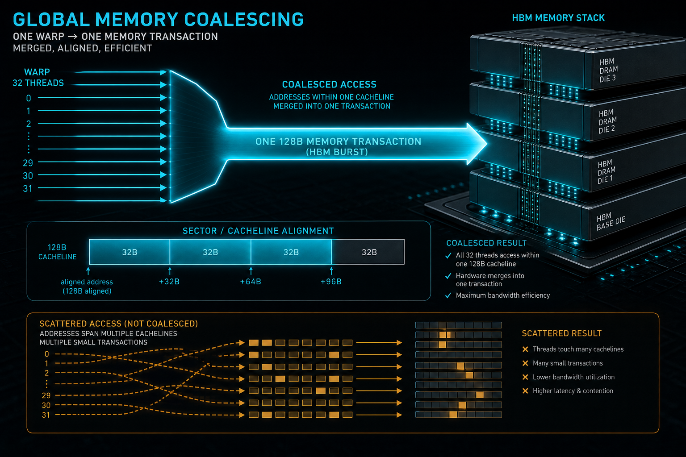
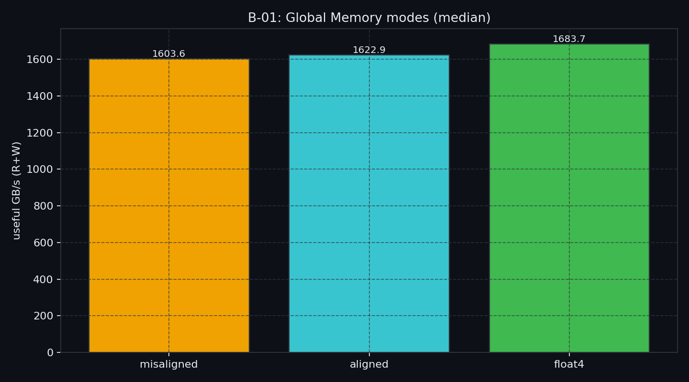
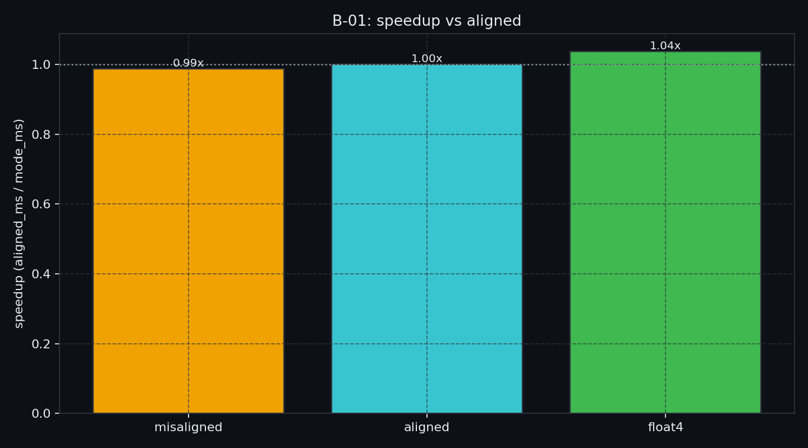

# B-01. Global Memory：合并访问、对齐与 float4——先修有效带宽再谈异步



> A-10 已分清：带宽墙时先修访存，而不是先堆异步原语。  
> 本章先把 **sector / 合并 / 向量化** 的通识讲清楚，再用同一条 GMEM copy 的三种形状对照（合并 / 对齐 / `float4`）钉住本机数字。  
> async / L2 lock / TMA **不做主测**——§3.1 只留地图，细节分别在 B-07 / B-04 / B-08。

**配套可复现**：[Yapeng-Gao/AI-System-Performance-Lab](https://github.com/Yapeng-Gao/AI-System-Performance-Lab)（文章 + `.cu` + 实测表）。有用请 Star。本章示例：[`examples/02_memory_optim/01_global_mem_bandwidth.cu`](https://github.com/Yapeng-Gao/AI-System-Performance-Lab/blob/main/examples/02_memory_optim/01_global_mem_bandwidth.cu)。

---

## TL;DR（工程结论）

> 口径：RTX 5090 / `sm_120`，CUDA event **median**，R+W useful GB/s；明细 [`docs/results/B-01_global_mem.md`](../../docs/results/B-01_global_mem.md)。

1. **合并 = 少 sector**：CC≥6.0 上 warp 访问按 **32B sector** 计数；相邻 `float` 理想约 **4 sectors/request**。真正打穿合并的是跨步/打散，不是「随便错一位就崩」。
2. **本机形状（5090，`offset=1`）**：`misaligned` **0.988×**、`float4` **1.038×**（相对 `aligned`）——三档几乎贴齐。同机上一轮是 0.973× / 1.001×，都在 0.97～1.04 带内。小 offset 在大 L2 上惩罚很轻；**不要**期待教科书式数倍。
3. **`float4` 治发射侧，但已贴天花板时 ~1×**：本机 `aligned`≈`float4`（~1623 vs ~1684 GB/s）。`float4` 本轮 first 比 median 慢，1.038× 是 0.07 ms 核上的抖动，不是稳定红利。
4. **读数口径**：绝对 ~1.6 TiB/s（R+W，/1024³）可能含 L2 → **主看相对加速比**，不当 HBM SOL，也不和 A-10 的 1954（十进制 GB、纯 copy）横比。
5. **判停与出口**：形状已齐仍 latency-bound → **B-07**；管 L2 → **B-04**；TMA → **B-08**。字段跨步 / AoS 是形状近亲，不必等引擎 → **B-09**。下一章按弧是 **B-02**（SMEM bank）。

---

## 1. 问题：同一 copy，形状怎么打穿有效带宽

A-10 Roofline 告诉你「现在是不是带宽墙」。本章不重画 Roofline，只交付**可复现处方**：同一有用载荷下，三种访问形状差多少。

| 已有章节 | 已覆盖 | 本章深化 / 避免 |
|---|---|---|
| A-10 | 带宽墙 vs 算力墙；本机 copy BW / ridge | 不重讲 Roofline 画法 |
| B-02 | SMEM bank / padding | 不讲 bank；GMEM 修好后落地 SMEM 仍要管 bank → B-02 |
| B-04 | L2 residency / persistence | **不做** L2 lock 主测 |
| B-07 | `cp.async` / pipeline | **不做** async copy 主测 |
| B-08 | Hopper TMA / bulk | **不做** TMA |
| B-09 | AoS/SoA/transpose | 不重开布局全家桶；合并物理在本章讲清。字段跨步是同一层问题，处方在 B-09，不必先读 B-07/B-08 |

边界一句话：**先修有效带宽形状，再谈异步与描述符引擎。** 章序上 B-09 在引擎之后，排查时布局和形状仍是一层。

---

## 2. 物理模型：Sector「不拆卖」与合并

你写 `float val = data[i];` 时，心里是 4 字节；显存颗粒眼里往往没有「只卖 4 字节」这档生意。GDDR / HBM 的原子搬运粒度是 **Sector（常见 32B）**：哪怕逻辑上只碰一个 `char`，总线上仍可能拉走一整 sector。进 L2 后管理粒度更大，常见是 **128B cache line**。直觉上像超市整排不拆卖——你要一颗蛋，货架仍按一排出货。

CC≥6.0 的合并规则按 sector 计数：一个 warp 的 32 路请求落在多少个 sector，硬件就大致发多少事务。Nsight 的 `sectors/request` 盯的就是这一层。

```text
理想合并（aligned contiguous float）
  thread0..31 → addr, addr+4, …, addr+124
  覆盖 128B ≈ 4 × 32B sector
  → sectors/request ≈ 4

跨步打散（示意：每线程 stride 很大）
  各线程落不同 sector
  → sectors/request 可冲到 ~32
  → useful 仍是 128B，总线却可能搬 ~1024B
  → useful / transferred ≈ 12.5%（经典反例量级）
```

合并的工程定义很干：**让 warp 内请求落进尽可能少的 32B sector（或 128B line）**，抬高 useful bytes / transferred bytes。做不到这一层，再叠 async / TMA / L2 驻留，只是在漏管子上加压。AoS 少数字段跨步是同一类浪费，数字在 B-09。

和本章实验的关系要说清：

- **大跨步 / 随机**才会打出教科书式的「sectors 爆炸」。
- 默认 `misaligned` 只是读侧 **`offset=1` float**：地址整体平移一点，warp 仍大体连续。5090 上相对 `aligned` 约 **0.99×**，正是「小错位 ≠ 合并崩盘」。
- 文献里合并 vs 非合并常见 **4 vs ~32 sectors/request**；小错位往往温和得多——**以本机 median 加速比为准**。

---

## 3. 指令层：发令员、搬砖与 float4

路（带宽）够宽之后，卡点常滑到 **Warp Scheduler 的发射槽**：每个周期能发出去的指令条数有限。同样要搬 16B，四条 `LDG.E.32` 比一条 `LDG.E.128` 更吃发令额度。

| 写法 | 典型 SASS 方向 | 作用 |
|---|---|---|
| `float` 标量 copy | 多条 `LDG.E.32` / `STG.E.32` | 已合并时的对照基线 |
| `float4` 显式向量化 | `LDG.E.128` / `STG.E.128` | 少指令；需 **16B 对齐** |
| 编译器自动拼宽字 | 视别名/对齐证明而定 | 不可控时不如显式 `float4` |
| `__ldcs` / `ldg_nt` | `ld.cs` / STREAM 类 hint | 流式、限污染；**不是**合并替代 |

把调度器想成发令员、LSU 想成车队，会更好记：

- 标量：搬 4 块砖喊 4 次（四条 32-bit load）。
- `float4`：喊一次「四块打包一起搬」（一条 128-bit load）。
- 省下的发射周期可以去发 `FFMA` 之类——这是在藏延迟，不是魔法加带宽。

`nvcc` 有时会把连续标量访问「吃」成宽字，但别名、对齐证明一变就可能拆回去；要稳，显式 `float4`（或等价向量类型）。`float3` 没有 `LDG.96`，常见是 64+32 两条。强行 `float4` 读越界尾块会直接非法访问。

对齐前提：`reinterpret_cast<float4*>` 要 **16B 对齐**；错位基址上硬向量化是 UB 或拆指令。顺序是：**先合并与对齐，再向量化**。高带宽卡上顺序访问不做向量化，容易从带宽墙滑向指令墙（见 §10-D）；已贴吞吐天花板时 `float4`≈`aligned`（本机 **1.038×**，抖动带内）是正常形状，不要硬凑「必须数倍」。

### 3.1 演进钩子（本章不主测）

形状修好之后，才轮到异步与缓存策略。细节在后文，这里只留地图：

| 下一层 | 一句话 | 去哪 |
|---|---|---|
| `cp.async` / pipeline | SM 内 GMEM→SMEM 旁路寄存器，靠多 stage 藏 LDG 延迟；低 arithmetic intensity 才常赚 | **B-07** |
| TMA | 专用拷贝引擎 + 描述符；大批量/多维/指令墙场景，不是「替代合并」的捷径 | **B-08** |
| L2 驻留 / persisting | 流式激活挤权重时，用 access policy 等手段管驱逐；Blackwell 单体 L2 等细节 | **B-04** |
| `__ldcs` / NT | 流式、少占坑；可选 `ldg_nt` 对照，**救不了**坏合并 | 本章可选；别当银弹 |

B-01 只把合并 / 对齐 / `float4` 测清楚，不把后三章实验塞进同一个 binary。

---

## 4. 决策表

| 信号 | 处方 | 出口 |
|---|---|---|
| NCU `sectors/request` 明显高于理想（float 合并常见 ~4） | 先修索引 / 访问形状（合并） | 字段跨步 / AoS → B-09（与引擎无关） |
| 已合并，但对齐差 / 宽字拆开 | 对齐基址与分配；再谈 `float4` | — |
| 已合并且偏 instruction/issue-bound | 显式 `float4` / 向量类型 | 仍 latency-bound → B-07 |
| 流式一次性读、怕污染 L2 | 可试 `__ldcs`（本章 `ldg_nt`） | 别指望它替代合并 |
| 要锁热点进 L2 | **不要**在本章折腾 | → B-04 |
| 合并已对，仍被 LDG 延迟打 | **不要**在本章叠 pipeline | → B-07 |
| 大批量多维搬运 / 指令墙 | **不要**在本章上 TMA | → B-08 |

---

## 5. 实验怎么设计

| 项 | 路径 |
|---|---|
| 代码 | `examples/02_memory_optim/01_global_mem_bandwidth.cu` |
| 结果 | `docs/results/B-01_modes.csv` / `B-01_global_mem.md` |
| 绘图 | `python scripts/plot_b01_global_mem.py` |

**一条主命令（主结论载体）**

```bash
./bin/02_memory_optim_01_global_mem_bandwidth --mode modes
```

可选：`--with-ldg-nt` 在表里多一行；单 mode（`aligned` / `misaligned` / `float4` / `ldg_nt`）便于调试。

| mode | 要回答的问题 |
|---|---|
| `misaligned` | 错位相对 `aligned` 掉多少（median 加速比）？ |
| `aligned` | 对齐连续 float copy 的基线 |
| `float4` | 向量化相对 `aligned` 是否加速？ |
| `ldg_nt`（可选） | streaming hint 是否可测差？ |
| `modes` | 一次打印全表 + CSV |

证据优先级：CUDA event **median** → GB/s 与 **相对 `aligned` 加速比**；NCU sectors/request 可选旁证（**不要**把 ncu 附着墙钟当结论）。

### 5.1 本机实测（RTX 5090 / sm_120）

平台与完整表：[`docs/results/B-01_global_mem.md`](../../docs/results/B-01_global_mem.md)。`n=16M` floats（64 MiB），`offset=1`，`runs=7`。

| mode | median_ms | GB/s (R+W) | vs aligned |
|---|---:|---:|---:|
| `misaligned` | 0.0780 | 1604 | **0.988×** |
| `aligned` | 0.0770 | 1623 | **1.000×** |
| `float4` | 0.0742 | 1684 | **1.038×** |





**怎么读**

1. 主看 `speedup_vs_aligned`：本机三档几乎贴齐——**有效结论**，不是失败。  
2. `offset=1` 仍大体连续，远不等于 stride 打散；旧稿「12.5% useful / 数倍提升」说的是跨步灾难，不是这一档。  
3. `float4` ~1×：已贴本配置吞吐天花板。本轮 1.038× 看 first/p95 仍是抖动。  
4. 绝对 GB/s 可能含 L2，勿当总线 SOL；也不和 A-10 1954 横比（单位与 kernel 不同）。

---

## 6. 工程边界

- **尾块**：kernel 用 grid-stride；`n` 对 `float4`/`modes` 须 `% 4 == 0`。  
- **对齐 UB**：`reinterpret_cast<float4*>` 要求 16B 对齐；错位缓冲请先标量或对齐拷贝。  
- **防 DCE**：元素 `+1.0f` 写回 + host `probe` 读回。  
- **不做**：async pipeline、L2 persistence、TMA——现 binary 已删除这些主路径。  
- **布局近亲**：少数字段 AoS / 跨步写是形状问题，去 B-09；不要先上 B-07/B-08。  
- **硬件**：不限 sm_90+；系列锚点仍是 5090 / `sm_120`。

---

## 7. 扩展阅读（不抢后续章）

1. 合并物理与 `sectors/request` 官方口径 → 见 §10-A（Best Practices / NCU Triage）。  
2. 向量化 Pro Tip → 见 §10-B；与本章 `float4` mode、§3 发令员直觉对齐。  
3. §3.1 地图：仍 latency-bound → [B-07](https://github.com/Yapeng-Gao/AI-System-Performance-Lab/tree/main/article/02_memory_optim/)；挤 L2 → B-04；TMA → B-08。字段跨步先 B-09。  
4. 指令墙 / 高带宽卡顺序访问 → 见 §10-D；Triton 自动合并仅扩展，不进 MVP。

---

## 8. SOP + 误区

**SOP**

1. 跑 `--mode modes`，记下三档 median 与 `speedup_vs_aligned`。  
2. 若 `misaligned` 明显慢：查基址、pitch、强制转换对齐。  
3. 若已对齐仍慢：试 `float4`；看加速比是否抬升。  
4. NCU 可选：看 `sectors/request`；理想 float 合并约 4。  
5. 形状已修好仍延迟受限 → 停本章，去 B-07；别在 B-01 叠 async/TMA。字段跨步 / AoS → B-09。

**误区**

| 误区 | 纠正 |
|---|---|
| 「现代卡带宽大，合并不用管」 | 扇区浪费仍伤 useful/transferred；先看 sectors 与相对加速比 |
| 「上了 `float4` 就能当总线打满」 | 未合并时向量化救不了；已满带宽时加速比可 ~1 |
| 「`__ldcs` / NT 等于旁路全部 cache」 | `.cs` 是 streaming / evict-first，不是合并替代 |
| 「绝对 GB/s = 总线利用率」 | 可能含 L2；主看相对 `aligned` |
| 「B-01 顺便测完 async / L2 / TMA」 | 那些是 B-07 / B-04 / B-08 |
| 「先上 TMA 再回头改 AoS」 | 布局和形状同一层；字段跨步先 B-09 |

---

## 9. 小结与下一章

先建立 sector / 发令员直觉，再跑 `--mode modes` 看相对形状；async、L2 lock、TMA 只留 §3.1 地图。字段跨步先去 B-09，不必等引擎章。

按弧下一章：**B-02 Shared Memory**——GMEM 形状修好后，数据落地 SMEM 仍要管 bank / padding。swizzle 是 bank 处方，不是 TMA 的前奏。

---

> 本文配套代码与实测：[AI-System-Performance-Lab](https://github.com/Yapeng-Gao/AI-System-Performance-Lab)。觉得有用请 Star，后续章更新更好找。  
> 本章示例：[`examples/02_memory_optim/01_global_mem_bandwidth.cu`](https://github.com/Yapeng-Gao/AI-System-Performance-Lab/blob/main/examples/02_memory_optim/01_global_mem_bandwidth.cu)。下一篇：[B-02 Shared Memory](https://github.com/Yapeng-Gao/AI-System-Performance-Lab/tree/main/article/02_memory_optim/)。

## 10. 参考文献

**A. 官方**

1. [CUDA C++ Best Practices Guide — Coalesced Access](https://docs.nvidia.com/cuda/cuda-c-best-practices-guide/) — CC≥6.0：32B sector；相邻 float 理想约 4×32B。  
2. [CUDA Programming Guide — Writing CUDA Kernels（Coalesced Global Memory）](https://docs.nvidia.com/cuda/cuda-programming-guide/02-basics/writing-cuda-kernels.html) — 相邻线程读相邻元素；最大化 bytes used / bytes transferred。  
3. [Nsight Compute — Compute Triage（Memory）](https://docs.nvidia.com/nsight-compute/ComputeTriage/index.html) — Global load sectors/request 明显高于理想 → 先修 coalescing。  
4. [PTX ISA — Cache Operators](https://docs.nvidia.com/cuda/parallel-thread-execution/#cache-operators) — `ld.cs` = streaming / evict-first。

**B. 工程**

5. [Unlock GPU Performance: Global Memory Access in CUDA](https://developer.nvidia.com/blog/unlock-gpu-performance-global-memory-access-in-cuda/) — 合并 vs 非合并 sectors/request 约 4 vs 32 量级。  
6. [CUDA Pro Tip: Vectorized Memory Access](https://developer.nvidia.com/blog/cuda-pro-tip-increase-performance-with-vectorized-memory-access/) — `float4` → `LDG.E.128`；需对齐。  
7. [How to Access Global Memory Efficiently in CUDA C/C++](https://developer.nvidia.com/blog/how-access-global-memory-efficiently-cuda-c-kernels/) — 对齐/跨步历史对照。

**C. 实证**

8. Yi et al., *CUDAMicroBench*（IPDPSW’21，[DOI:10.1109/IPDPSW52791.2021.00068](https://doi.org/10.1109/IPDPSW52791.2021.00068)；[GitHub](https://github.com/passlab/CUDAMicroBench)）— CoMem / MemAlign 形状参考。  
9. Jia et al., *Dissecting the NVIDIA Volta GPU…*（[arXiv:1804.06826](https://arxiv.org/abs/1804.06826)）— 不同 LDG 宽度带宽差异可测。

**D. 前沿**

10. *Over the Memory Wall, Into the Instruction Wall…*（[arXiv:2608.13696](https://arxiv.org/abs/2608.13696)）— 高带宽卡顺序访问易滑向指令墙；支撑「float4 治发射」。  
11. Triton / 编译器侧 coalescing+vectorization（生态综述）— 自动合并是趋势；**不进本章必做 MVP**。
