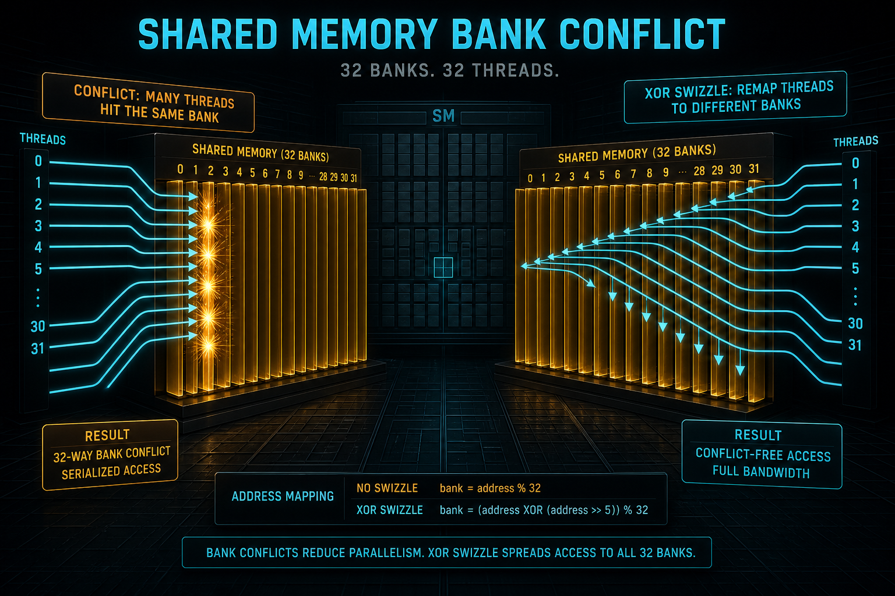
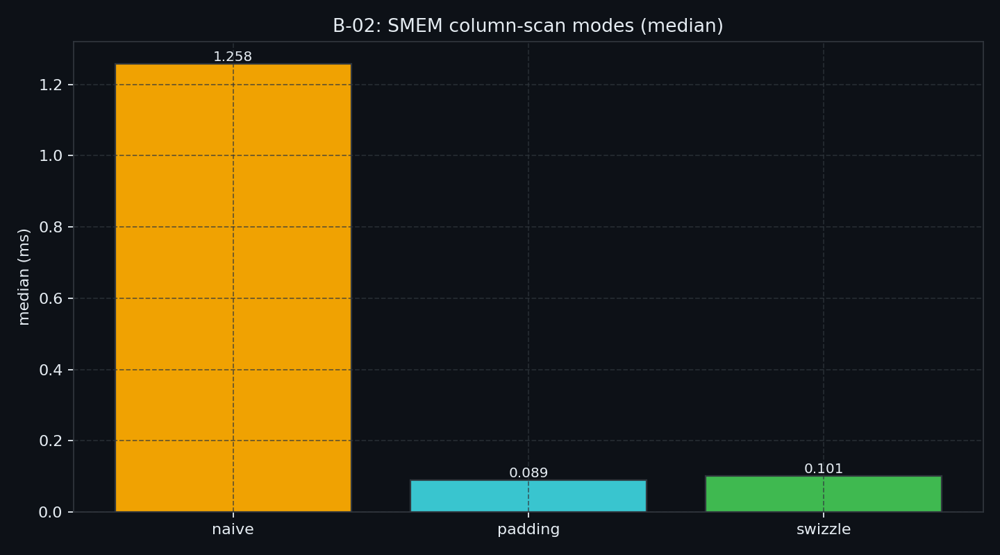
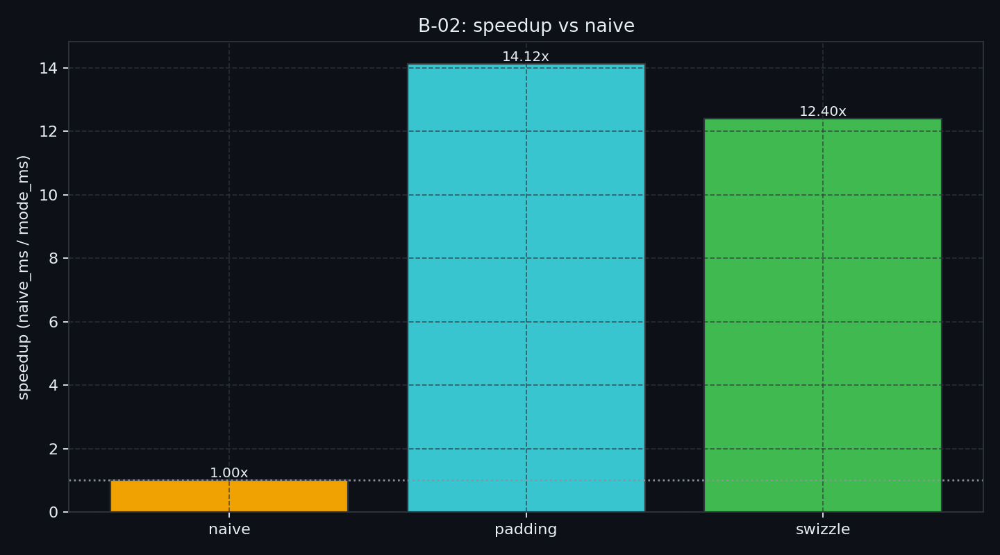

# B-02. Shared Memory：Bank Conflict、Padding 与 XOR Swizzle



> B-01 把 GMEM 的 sector / 合并 / `float4` 测清楚了。数据进 SM 之后，下一层卡点常常是 **Shared Memory 的 32 条 Bank**。  
> 本章只讲 on-chip 交通：同 bank 不同地址会串行；`[32][33]` padding 与 `col ^ row` swizzle 是两种处方。  
> TMA / `ldmatrix` / `cp.async` **不做主测**——紧凑布局以后怎么对接描述符引擎，去 B-08 / D-05。

**配套可复现**：[Yapeng-Gao/AI-System-Performance-Lab](https://github.com/Yapeng-Gao/AI-System-Performance-Lab)（文章 + `.cu` + 实测表）。有用请 Star。本章示例：[`examples/02_memory_optim/02_shared_mem_bank_conflict.cu`](https://github.com/Yapeng-Gao/AI-System-Performance-Lab/blob/main/examples/02_memory_optim/02_shared_mem_bank_conflict.cu)。

---

## TL;DR（工程结论）

> 口径：RTX 5090 / `sm_120`，CUDA event **median**；加速比 = `naive_median / mode_median`。明细 [`docs/results/B-02_shared_mem.md`](../../docs/results/B-02_shared_mem.md)。

1. **Bank = 32 条 32-bit 通道**：warp 同时打中 n 个不同 bank 就能并行；打中**同一 bank 的不同地址**就拆成 n 次（n-way）。同一地址是广播，不算冲突。
2. **本机列扫（5090）**：`naive` **1.258 ms**；`padding` **14.12×**、`swizzle` **12.41×**。这是真墙钟，不是教科书恐吓。和 B-01 `offset=1` 三档贴齐不是同一命题。
3. **不到 32× 仍有效**：event 包了 init / barrier，流水线也会掩盖一部分 replay。本机 12～14× 是预期形状，不是处方失败。
4. **Padding 与 XOR 同向**：padding 略快（约 1.14× 于 swizzle）。SMEM 有余量用 `[32][33]`；必须紧凑再用 `col ^ row`。不要按「谁更现代」选。
5. **判停与出口**：主看相对 `naive`。occupancy / spill → **B-03**；L2 → **B-04**；GMEM→SMEM 异步 → **B-07**；描述符 / `ldmatrix` → **B-08** / D-05。

---

## 1. 问题：GMEM 修好了，SMEM 仍可能 1/32

B-01 管的是 HBM 上的 sector。Shared Memory 在 SM 里，延迟低、带宽高，但不是一块平坦的 SRAM：硬件切成 **32 个 bank**，每个周期每个 bank 大致服务一个 32-bit 字。

| 已有章节 | 已覆盖 | 本章深化 / 避免 |
|---|---|---|
| B-01 | GMEM 合并 / 对齐 / `float4` | 不重讲 sector |
| B-03 | 寄存器 / spilling / occupancy | 不讲 spill 处方 |
| B-07 | `cp.async` / pipeline | **不做** 设备异步主测 |
| B-08 | TMA / bulk | **不做** TMA；swizzle 不写成「为 TMA 铺路」 |
| D-05 | Tensor Core GEMM | `ldmatrix` 只留钩子 |

边界一句话：**先修 SMEM 交通，再谈异步引擎和 Tensor Core。**

---

## 2. 物理模型：32 Bank 与 Replay

默认（32-bit 模式）连续 `float` 轮转映射：

```text
word 0 → Bank 0
word 1 → Bank 1
…
word 31 → Bank 31
word 32 → Bank 0
Bank = (addr / 4) % 32
```

三种结果：

| 情况 | 硬件 |
|---|---|
| 32 线程打 32 个不同 bank | 一轮完成 |
| 多线程读**同一地址** | 广播 |
| 多线程读**同 bank 不同地址** | 拆成多次发射（replay） |

n-way 冲突时，这条 SMEM 请求的有效吞吐大约掉到 1/n。32-way 就是教科书里的「1/32」。流水线会掩盖一部分，所以墙钟加速比往往小于 32，仍应明显大于 1。

列访问怎么挤进一个 bank：

```text
tile[32][32]，访问 tile[tid][0]
tid=0 → addr 0   → Bank 0
tid=1 → addr 32  → Bank 0
tid=2 → addr 64  → Bank 0
…
32 个线程，一个 Bank → 32-way
```

行访问 `tile[row][tid]` 则是相邻 word，正好 32 个 bank，无冲突。

---

## 3. 两种处方：Padding 与 XOR

### 3.1 Padding：改行跨度

```cpp
__shared__ float tile[32][33];  // 多一列，不参与计算
val += tile[tid][col];          // 访问式不变
```

```text
tile[0][0] → addr 0   → Bank 0
tile[1][0] → addr 33  → Bank 1
tile[2][0] → addr 66  → Bank 2
```

`gcd(33, 32) = 1`，每行起点在 bank 上轮转。官方矩阵转置示例用的就是列维 `+1`。代价：每行浪费 4 字节，大 tile 会挤 SMEM、可能掉 occupancy（细账 → B-03）。

### 3.2 XOR Swizzle：改映射，不改容量

```cpp
__shared__ float tile[32][32];
int phys = col ^ tid;           // 教学版：col ^ row
val += tile[tid][phys];
```

同逻辑列、不同行时，`phys` 是 `0..31` 的一个排列，bank 被打散。布局仍然紧凑。

CUTLASS / `ldmatrix` 里的 swizzle 更细（按 8 行、128-bit 字），那是 **D-05 / B-08** 的对接问题。本章只证明：XOR 能消列访问冲突。不要把 swizzle 读成「上 TMA 之前必须做的仪式」。

64-bit bank 模式（8 字节一字）会改映射；本章 micro-bench 按默认 32-bit、`float` 讲。

---

## 4. 决策表

| 信号 | 处方 | 出口 |
|---|---|---|
| NCU shared bank conflicts 高；列扫 / 转置读 SMEM | 先确认是不是行长 = 32 | — |
| tile 不大、SMEM 有余量 | `[T][T+1]` padding | occupancy 掉了 → B-03 |
| 必须紧凑、后面要对接宽字 / 描述符 | XOR（或库里的 swizzle） | `ldmatrix` / TMA → D-05 / B-08 |
| 同地址广播 | 不要当冲突修 | — |
| 其实是 GMEM 跨步 | **不要**在本章改 swizzle | → B-01 / B-09 |

---

## 5. 实验怎么设计

| 项 | 路径 |
|---|---|
| 代码 | `examples/02_memory_optim/02_shared_mem_bank_conflict.cu` |
| 结果 | `docs/results/B-02_shared_mem.md` / `B-02_modes.csv` |
| 绘图 | `python scripts/plot_b02_shared_mem.py` |

**一条主命令**

```bash
./bin/02_memory_optim_02_shared_mem_bank_conflict --mode modes
```

默认 `grid=2048`、`block=32`、`iters=8192`，把列扫放大到 event 能稳定看见。旧示例用单 block + `clock64`，只作对照，**不当主结论**。

| mode | 要回答的问题 |
|---|---|
| `naive` | `[32][32]` 列访问有多慢？ |
| `padding` | `+1` 列相对 naive 快多少？ |
| `swizzle` | `col ^ row` 能否收到同一量级？ |
| `modes` | 一次打表 + CSV |

证据优先级：CUDA event **median** → 相对 `naive` 加速比；NCU shared bank conflicts 可选。

### 5.1 本机实测（RTX 5090 / sm_120）

平台与完整表：[`docs/results/B-02_shared_mem.md`](../../docs/results/B-02_shared_mem.md)。`grid=2048`，`block=32`，`iters=8192`，`runs=7`。

| mode | median_ms | vs naive |
|---|---:|---:|
| `naive` | 1.2576 | **1.000×** |
| `padding` | 0.0891 | **14.121×** |
| `swizzle` | 0.1014 | **12.405×** |





**怎么读**

1. 主看 `speedup_vs_naive`：两档处方同向、明显快于 naive。  
2. 加速比小于 32 仍正常：event 包了 init / barrier，硬件也会掩盖一部分 replay。  
3. padding 略快于 swizzle（约 1.14×）。选谁看你是否必须紧凑，不要看谁「更现代」。  
4. 三档 first ≈ median，形状稳定。`probe_out0=126976` 说明循环没被 DCE 吃掉。

---

## 6. 工程边界

- **block 必须是 32**：本 micro-bench 一个 CTA 一个 warp，模拟「一列 32 线程」。  
- **swizzle 读的是置换后的列**：和 naive 不是同一批逻辑元素，比的是访存交通，不是数值相等。  
- **不做**：TMA、`cp.async`、carveout sweep、`ldmatrix`。  
- **硬件**：不限 sm_90+。

---

## 7. 扩展阅读（不抢后续章）

1. 官方 bank / padding → 见 §10-A。  
2. Shared Memory 用法博客 → 见 §10-B。  
3. 紧凑布局之后的搬运引擎 → [B-07 / B-08](https://github.com/Yapeng-Gao/AI-System-Performance-Lab/tree/main/article/02_memory_optim/)。  
4. 寄存器被 SMEM 挤掉 → B-03；`ldmatrix` → Module D。

---

## 8. SOP + 误区

**SOP**

1. 跑 `--mode modes`，记下三档 median 与 `speedup_vs_naive`。  
2. naive 明显慢：先看是不是列访问、行长是否等于 32。  
3. SMEM 够用 → padding；必须紧凑 → XOR。  
4. 可选 NCU：看 shared bank conflict 计数是否随处方掉下去。  
5. 处方有效仍慢 → 停本章，查 B-03 / B-07，别在 B-02 上 TMA。

**误区**

| 误区 | 纠正 |
|---|---|
| 「SMEM 很快，不用管 bank」 | 32-way 可以把这条请求拆成 32 次 |
| 「swizzle 是为了喂 Tensor Core」 | 本章只消冲突；TC 路径在 D-05 |
| 「上 TMA 之前必须先 XOR」 | TMA 在 B-08；这里 XOR 与 padding 是并列处方 |
| 「用 clock64 单 warp 当专栏结论」 | 主证据是 event median |
| 「广播也是 bank conflict」 | 同地址是广播 |

---

## 9. 小结与下一章

GMEM 形状（B-01）之后，SMEM 先问「这一列是不是挤在一个 bank」。Padding 改跨度，XOR 改映射；都不是异步引擎课。

按弧下一章：**B-03 寄存器 / Spilling / Occupancy**——padding 多占的那一列，有时会变成 occupancy 账单。

---

> 本文配套代码与实测：[AI-System-Performance-Lab](https://github.com/Yapeng-Gao/AI-System-Performance-Lab)。觉得有用请 Star，后续章更新更好找。  
> 本章示例：[`examples/02_memory_optim/02_shared_mem_bank_conflict.cu`](https://github.com/Yapeng-Gao/AI-System-Performance-Lab/blob/main/examples/02_memory_optim/02_shared_mem_bank_conflict.cu)。下一篇：[B-03 寄存器](https://github.com/Yapeng-Gao/AI-System-Performance-Lab/tree/main/article/02_memory_optim/)。

## 10. 参考文献

**A. 官方**

1. [CUDA Programming Guide — Shared Memory Bank Conflicts](https://docs.nvidia.com/cuda/cuda-programming-guide/02-basics/writing-cuda-kernels.html) — 同 bank 不同地址串行；转置示例用列维 `+1` padding。  
2. [CUDA C++ Best Practices Guide — Shared Memory and Memory Banks](https://docs.nvidia.com/cuda/cuda-c-best-practices-guide/index.html) — n 个不同 bank 可并行；冲突则按拆出的请求数掉吞吐；同地址广播除外。

**B. 工程**

3. [Using Shared Memory in CUDA C/C++](https://developer.nvidia.com/blog/using-shared-memory-cuda-cc/) — tile 与冲突现场。

**C. 实证**

4. 本章 `--mode modes`（5090：padding **14.12×** / swizzle **12.41×**）— 相对 `naive` 的墙钟形状。

**D. 前沿 / 邻章**

5. CUTLASS / CuTe swizzle 与 `ldmatrix` — 紧凑宽字对接；不进本章 MVP → D-05。
