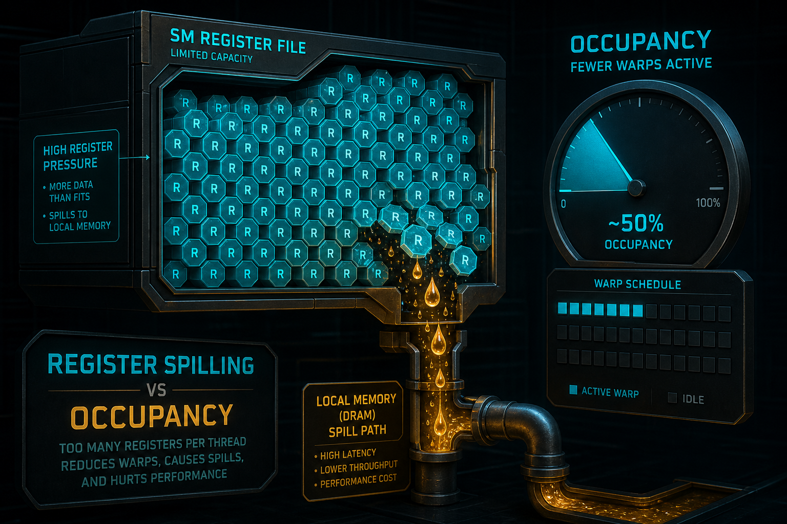
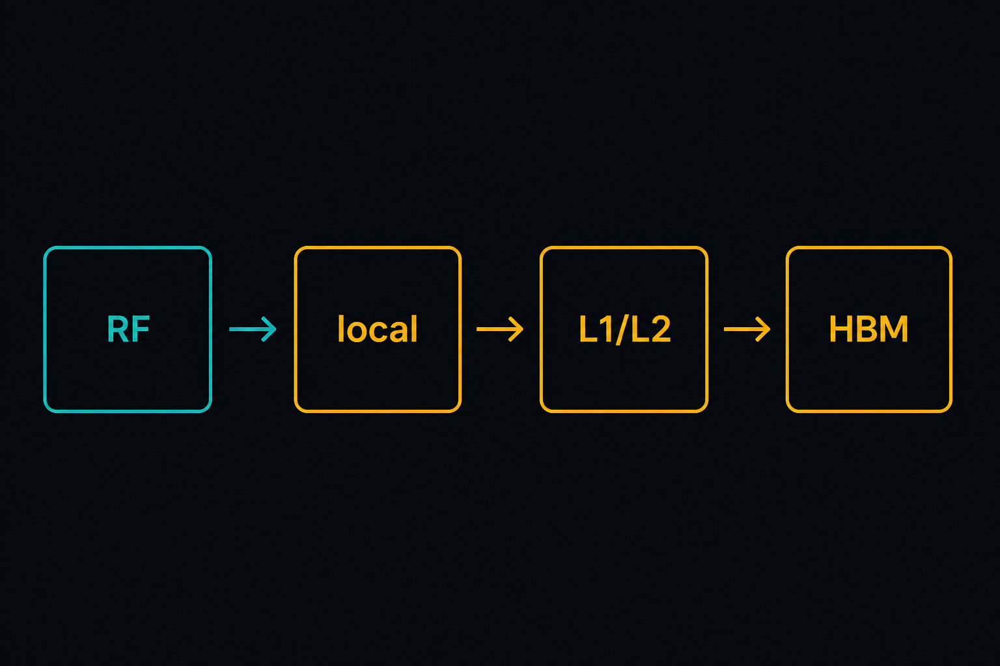
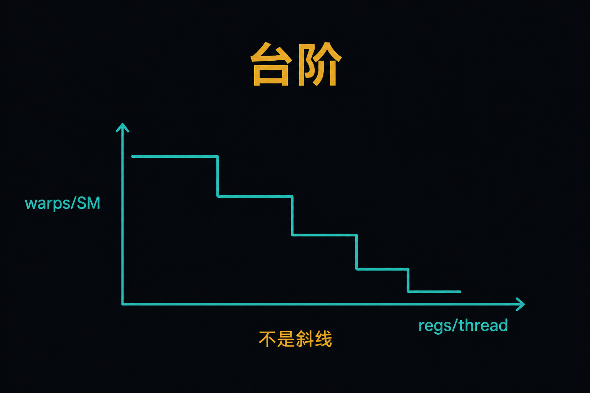
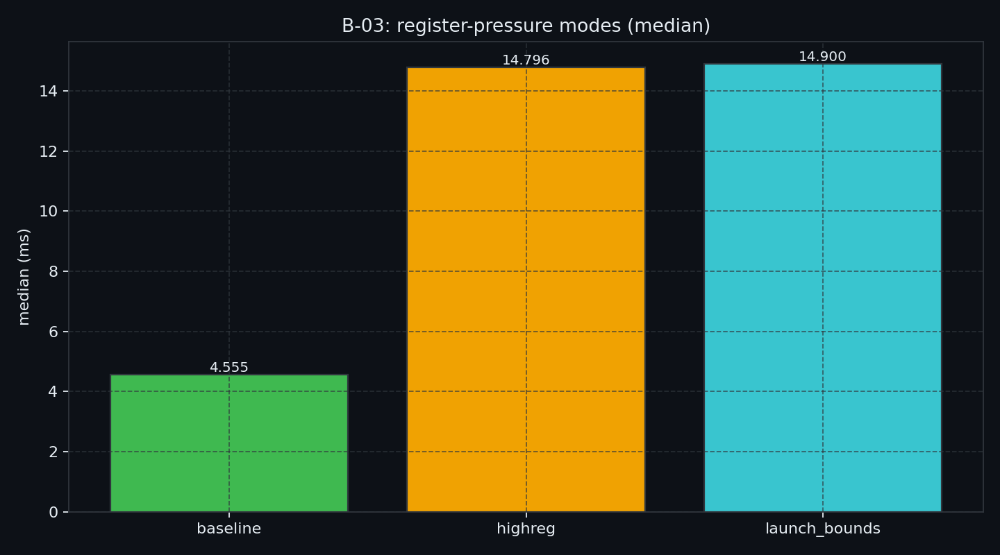
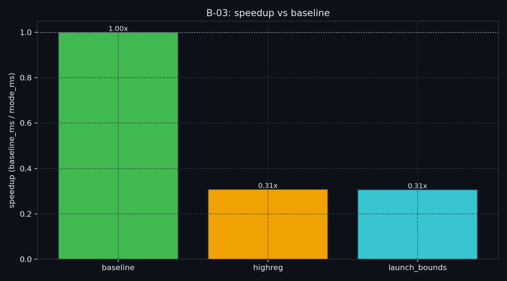

# B-03. 寄存器：Spilling、Occupancy 与 launch_bounds



> B-02 用 padding 多占了一列 SMEM。那一列有时不会停在 bank 账上，而会挤掉 occupancy，或把活变量挤出寄存器。  
> 本章把 RF、spill 分级、occupancy 阶梯和 `__launch_bounds__` 契约讲完。  
> L2 / `cp.async` / TMA **不做主测**——分别去 B-04 / B-07 / B-08。CUTLASS 分块 / warp 特化只留钩子 → D-05。

**配套可复现**：[Yapeng-Gao/AI-System-Performance-Lab](https://github.com/Yapeng-Gao/AI-System-Performance-Lab)（文章 + `.cu` + 实测表）。有用请 Star。本章示例：[`examples/02_memory_optim/03_register_spill.cu`](https://github.com/Yapeng-Gao/AI-System-Performance-Lab/blob/main/examples/02_memory_optim/03_register_spill.cu)。

---

## TL;DR（工程结论）

> 口径：RTX 5090 / `sm_120`，CUDA event **median**；加速比 = `baseline_median / mode_median`。明细 [`docs/results/B-03_register.md`](../../docs/results/B-03_register.md)。

1. **本机形状**：`highreg` **0.308×**、`launch_bounds` **0.306×**。三档 `numRegs=19`、`occ_blocks=6`；`localB` **128 → 1024**。慢的是 local 足迹，不是 occupancy 台阶。
2. **先看 `localSizeBytes`，别先看 occupancy。** `volatile` + 动态下标让数组没进 RF。`spill` 字段为 0 但 local 很大，仍按热路径 local 读（S2）。
3. **Occupancy 不是 KPI**：5090 `maxThreadsPerSM=1536`，`6×256` 已经贴顶。Volkov 仍成立——低 occupancy 可以更快；本实验没打出「regs 升、occ 掉」。
4. **`__launch_bounds__` 是契约**：本机它没改 regs/local/occ，墙钟与 `highreg` 贴齐。要履约，得先出现寄存器住不下；夹具没把数组放进 RF，契约无物可压。
5. **判停**：主看墙钟是否跟 `localB` 走。L2 → **B-04**；异步 → **B-07**。真要看 RF 台阶，需要另一套能寄存器化的夹具。

决策流：`有 spill？` → S0–S3 → `S2/S3 先清热路径` → 再看 bound：compute 偏 ILP（可更低 occupancy）/ memory 偏 TLP（小心别挤出 spill）。

---

## 1. 问题：padding 之后，账单可能转到寄存器

B-02 修的是 SMEM 交通。寄存器更快、更稀缺：每个 SM 一份 RF，所有驻留 warp 分。展开一个循环、多几个中间量，逻辑没变，墙钟却可能腰斩。NCU 里带宽没满、bank 也干净，编译日志里却有 `spill loads`。

| 已有章节 | 已覆盖 | 本章深化 / 避免 |
|---|---|---|
| B-02 | SMEM bank / padding / swizzle | 不重讲 bank；padding 挤 occupancy 接到本章 |
| B-01 / B-09 | GMEM 合并 / 布局 | 不讲 sector / AoS |
| B-04 | L2 residency | **不做** L2 lock |
| B-07 / B-08 | `cp.async` / TMA | **不做** 异步引擎 |
| D-05 | Tensor Core GEMM | Register blocking / warp 特化只留钩子 |

边界一句话：**先看 spill 分级和 occupancy 契约，再谈 L2 和搬运引擎。**

---

## 2. 物理模型：RF、Spill 分级、Occupancy 阶梯

### 2.1 RF 看起来很大，人均很小

本机 5090：`regsPerSM=65536`，`maxThreadsPerSM=1536`（48 warps）。跑满线程时人均：

```text
65536 / 1536 ≈ 42.7 regs/thread
```

教科书常写「2048 threads → 32 regs」，那是按 64 warps 上限的算术，**不是这张卡**。后文阶梯表仍用 64 warps 做示意；本机满驻留是 `6×256=1536`，看 `occ_blocks`。

人均 40 上下照样紧：一个 `double` 占 2 个。GEMM 还要 A/B tile、C 累加器、指针和索引。这是算术平均，不是配额。硬件按粒度和对齐分配，多用 1 个寄存器可能整档掉一块驻留。真数看 `ptxas` 和 `cudaFuncGetAttributes`。

```text
一个 SM（示意）

┌──────────────────────────────────────────┐
│  Register File（固定总量，片上）           │
│  R0 R1 …                                 │
│           ↑ 按 thread 分                  │
│  Warp0  Warp1  Warp2 …   ← 越多越能轮转   │
└──────────────────────────────────────────┘

RF 既决定「单线程能拿多少状态」，也决定「同时能驻留多少 warp」。
```

### 2.2 Spill：活变量进 Local Memory

编译器塞不下活变量，就把一部分放到 **Local Memory**。local 指作用域，不是「它在 SM 旁边」。物理上走 GMEM 地址空间。动态下标的局部数组、大结构、寄存器不够，都是常见入口。本章 `volatile float r[N]` + 动态下标，就是把压力推到这条边上。

| | 寄存器 | Local Memory |
|---|---|---|
| 位置 | SM 片上 | 逻辑私有，物理在 GMEM 空间，经 L1/L2 |
| 延迟 | 最低 | 命中 cache 还行；未命中到 HBM |
| 容量 | 固定，和 occupancy 互挤 | 大，但慢 |
| 谁决定 | 编译器分配 | 寄存器不够 / live range 太长 / 动态索引 |



> 图 1：local 是作用域，物理走 GMEM 空间。热循环里的 LDL/STL 才是 S2/S3。

不是多几条 ALU，是热路径换了一层存储。

### 2.3 分级：S0–S3

不是所有 spill 都要立刻改。按落点分级：

| 等级 | 描述 | 怎么处置 |
|---|---|---|
| **S0** | `spill stores = 0` 且 `spill loads = 0` | 过 |
| **S1** | 只在初始化、冷分支、循环外 | 通常放过 |
| **S2** | 热循环每次迭代都 spill | 要处理 |
| **S3** | 累加器 / tile / 高频中间量被挤出 | 先重构，别先调 `launch_bounds` |

### 2.4 怎么判定（三步）

**1. 看 ptxas（必要）**

```text
nvcc -Xptxas=-v -arch=sm_120 kernel.cu
ptxas info : 0 bytes stack frame, 0 bytes spill stores, 0 bytes spill loads
ptxas info : Used 64 registers, 32 bytes smem
```

`spill stores/loads = 0` 倾向 S0。非零进入下一步。`spill=0` 但 `stack frame` 很大（例如 1 KiB）同样要当心：线程私有状态可能已经走 local/stack，墙钟照样会掉。运行时对照 `localSizeBytes`。

**2. 看落点**

S1：循环外。S2：主循环每次都碰。S3：累加器或 tile 被溢出。

**3. 可选 NCU**

local load/store 上去、`achieved_occupancy` 乱跳、延迟里 local 占比升高 → 基本是 S2/S3。**不要**把 ncu 附着时的墙钟 ms 当结论。

### 2.5 Occupancy 公式与阶梯

**Occupancy** = 本 SM 活跃 warp / 硬件允许的最大活跃 warp。官方把它当藏延迟的常规手段：一条 warp 在等，另一条还能发。

寄存器先卡死可驻留 warp 数（工程近似）：

```text
Warps_reg = floor( TotalRegsPerSM / (RegsPerThread × 32) )
ActiveWarps = min( Warps_reg, MaxThreadsPerSM/32, SMEM 等其它上限 )
```

`TotalRegsPerSM` 常按 64K 个 32-bit 记（本机 `regsPerSM=65536` 对得上）。`RegsPerThread` 看 ptxas。真实驻留还被分配粒度、`maxThreadsPerSM` 裁。5090 是 **1536 threads/SM（48 warps）**，不是表里示意用的 2048 / 64。以 Occupancy API 为准。

只看寄存器、上限 64 warps 时的台阶：

| Regs/Thread | 可驻留 warps | 相对 64 warps |
|---:|---:|---:|
| 32 | 64 | 100% |
| 64 | 32 | 50% |
| 96 | 21 | 33% |
| 128 | 16 | 25% |
| 160 | 12 | 19% |
| 192 | 10 | 16% |
| 256 | 8 | 12.5% |

多用一点点寄存器，可能整级掉下去。`--mode modes` 打印的 `occ_blocks` 就是这条台阶在本机上的结果。



> 图 2：示意台阶。5090 满线程是 1536 / 48 warps，不是图上的 64 warps 上限；以 `occ_blocks` 为准。

---

## 3. ILP vs TLP，以及 launch_bounds

### 3.1 两种藏等待

墙钟常耗在「等」：HBM/L2/SMEM、依赖链、发射槽。

| | **ILP**（指令级） | **TLP**（线程级） |
|---|---|---|
| 做法 | 同一线程里多条独立指令 | SM 上多驻留几个 warp |
| 等的时候 | 这条在等，同线程另一条还能发 | Warp A 在等，切 Warp B |
| 代价 | 寄存器多、occupancy 低、易 spill | 单线程弱；regs 不够反而 spill |
| 手段 | 展开、register blocking、双缓冲 | 少占 reg/smem，提高驻留 |

```text
ILP  Time →
T0:  [ADD] [MUL] [ADD] [MUL]     独立指令多，等也能插空（要更多寄存器）

TLP  Time →
W0:  [RUN] [WAIT] [RUN]
W1:  [RUN] [RUN]  [WAIT]         W0 等的时候换 W1（要更高 occupancy）
```

### 3.2 该追哪条

「occupancy 越高越快」不成立。超过「刚好能藏住延迟」再砍寄存器，多出来的只是 spill。

| 核的形状 | 经验 occupancy | 为什么 |
|---|---|---|
| Memory / latency-bound（长 LDG） | 偏高（常见 ≥75% 当起点） | 要足够 warp 轮转藏 HBM 延迟 |
| SMEM 很重的 tile | 中等（常见 ≥50% 当起点） | SMEM 比 HBM 近，不必拉满 |
| Compute-bound（ALU / 以后的 TC） | 常在 25%–50% 就够 | 单线程状态优先；再高也喂不饱 |

这是起点，不是本机 KPI。以 `--mode modes` 的 median 为准。

自查：

- dram 贴顶、SM 很闲 → 偏 TLP：少占寄存器，但别把自己挤进 S2/S3。
- SM 贴顶、dram 不高 → 偏 ILP：允许更多寄存器做缓冲，盯住 live range。

### 3.3 少活变量 / 拆核（源码侧）

按这个顺序试：

1. 缩短 live range：跨循环的量移进循环，或重算代替保存。  
2. 大局部数组别动态乱索引；改 SMEM 或分阶段。  
3. 减小 tile / 累加器个数。  
4. 拆成两个 kernel，比一个「什么都留着」往往更划算。  
5. 再动 `__launch_bounds__` / `--maxrregcount`，每次回看 ptxas。

Warp 特化（搬运 warp 和计算 warp 拆开）能拆 live range，细节在 **D-05**，本章不展开。

### 3.4 `__launch_bounds__`：语法、代价、SOP

```cpp
__global__ __launch_bounds__(maxThreadsPerBlock, minBlocksPerMultiprocessor)
void kernel(...);
```

- 只写 `maxThreads`：告诉编译器最大 block，保证至少能 launch 一个。  
- 再加上 `minBlocks`：保证每个 SM 至少住进这么多 block。编译器先算出上限 `L`；初始用量超过 `L`，就往下压，通常加 local / 指令。

```cpp
// 先这样：不强迫驻留
__global__ __launch_bounds__(256) void step1(...);

// 需要 2 block/SM 再加压，立刻重测
__global__ __launch_bounds__(256, 2) void step2(...);
```

`min_blocks=2` 时，代码若压不下来，编译器为了履约会主动 spill。occupancy 好看，热循环全是 local，墙钟更差。`-maxrregcount` 是同一类刀。本章主测 `__launch_bounds__(256, 2)`，不再单开 `maxrregcount` 档。

**安全用法**

1. 先 `__launch_bounds__(maxThreads)`，不要一上来 `minBlocks`。  
2. 需要更高驻留再试 `minBlocks=2`，一次只改一个数。  
3. 每步记 ptxas（reg + spill）和同一输入的 event **median**。  
4. 出现 S2/S3 倾向就回退，或先缩短 live range。  
5. 不要说「某寄存器数必然 1 block/SM」。只信 ptxas + 基准。

---

## 4. 决策表

| 信号 | 处方 | 出口 |
|---|---|---|
| ptxas / `localSizeBytes>0`，落在热循环（S2/S3） | 先减活变量 / 拆核 | — |
| 仅 S1 | 放过，盯墙钟 | — |
| occupancy 低，latency-bound，几乎不 spill | 可试更大 block 或略减寄存器 | 仍慢 → B-07 |
| occupancy 高，墙钟差，local 字节多 | **不要**再追 occupancy | 先消 spill |
| compute-bound，想留累加器 | 接受更低 occupancy | TC 累加器 → D-05 |
| 想「强制 2 block/SM」 | 先单参数，再 `minBlocks`，每步重测 | 契约制造 spill → 撤回 |
| 其实是 L2 / 合并 | **不要**在本章改 launch_bounds | → B-04 / B-01 |

---

## 5. 实验怎么设计

| 项 | 路径 |
|---|---|
| 代码 | `examples/02_memory_optim/03_register_spill.cu` |
| 结果 | `docs/results/B-03_register.md` / `B-03_modes.csv` |
| 绘图 | `python scripts/plot_b03_register.py` |

**一条主命令**

```bash
./bin/02_memory_optim_03_register_spill --mode modes
```

默认 `n=1<<20`、`block=256`、`iters=256`。同一套 `volatile` 私有数组 + 动态下标。本机上编译器把数组放进 local，三档 `numRegs` 相同——问的是 **local 足迹**，不是「256 个寄存器」。`launch_bounds` 档检验契约会不会改分配。

| mode | 要回答的问题 |
|---|---|
| `baseline` | REGS=32 时墙钟、regs、local、occupancy？ |
| `highreg` | REGS=256 是否出现 local、occupancy 是否掉、墙钟差多少？ |
| `launch_bounds` | 同一 256 压力加上「至少 2 block/SM」后，regs/local/墙钟怎么变？ |
| `modes` | 一次打表 + CSV |

证据优先级：CUDA event **median** → 相对 `baseline`；`numRegs` / `localSizeBytes` / `occ_blocks` 同一次打印。`-Xptxas=-v` 对照 spill loads/stores。旧示例 20 次取平均不当结论。

### 5.1 本机实测（RTX 5090 / sm_120）

平台与完整表：[`docs/results/B-03_register.md`](../../docs/results/B-03_register.md)。`n=1<<20`，`block=256`，`iters=256`，`runs=7`。RF：`regsPerSM=65536`，`maxThreadsPerSM=1536`。

| mode | median_ms | vs baseline | regs | localB | occ blk/SM |
|---|---:|---:|---:|---:|---:|
| `baseline` | 4.555 | **1.000×** | 19 | 128 | 6 |
| `highreg` | 14.796 | **0.308×** | 19 | 1024 | 6 |
| `launch_bounds` | 14.900 | **0.306×** | 19 | 1024 | 6 |





**怎么读**

1. 主看墙钟是否跟 `localB` 走：128 → 1024 时落到 **0.308×**。  
2. **不要**读成 256 regs 把 occupancy 打到 12.5%。三档 regs=19、occ=6（`6×256=1536` 已贴顶）。  
3. `launch_bounds` 与 `highreg` 同资源、同量级墙钟——契约无物可压。  
4. first ≈ median。旧稿 4.6 / 16.4 ms 是同一 local 命题，缺 attrs 才像 occupancy 故事。

---

## 6. 工程边界

- **不保证每台机器都 spill**：架构、`nvcc`、`-O` 都会改分配。结论以本机 attrs + median 为准。  
- **`volatile` 数组是压力夹具**：不是生产写法。  
- **不做**：L2 persistence、TMA、`cp.async`、把 spill 改写到 SMEM（RegDem 只在 §10-D）。  
- **硬件**：不限 sm_90+。

---

## 7. 扩展阅读（不抢后续章）

1. 官方 occupancy / local / `launch_bounds` → 见 §10-A。  
2. 低 occupancy 可以更快 → 见 §10-B（Volkov）。  
3. 热数据要锁进 L2 → [B-04](https://github.com/Yapeng-Gao/AI-System-Performance-Lab/tree/main/article/02_memory_optim/)。  
4. Register blocking、warp 特化（搬运/计算拆 live range）、寄存器双缓冲、把 epilogue 挪出热循环 → **D-05**。本章只需要知道：这些手段都是在管寄存器峰值，不是另一套 bank 课。

---

## 8. SOP + 误区

**SOP**

1. 跑 `--mode modes`，记下 median、`numRegs`、`localSizeBytes`、`occ_blocks`；可选 `-Xptxas=-v`。  
2. 有 spill：按 S0–S3 分级。S2/S3 先缩 live range / 拆核，不要先加压 `minBlocks`。  
3. 用 NCU 或 roofline 判断偏 memory 还是 compute，再选 TLP 或 ILP。  
4. 需要驻留：先 `__launch_bounds__(maxThreads)`，再试 `minBlocks`，每步重测。  
5. 指标更好、墙钟更差 → 回退。仍慢 → 停本章，查 B-04 / B-07，别在 B-03 上 TMA。

**误区**

| 误区 | 纠正 |
|---|---|
| 「occupancy 越高越快」 | 低 occupancy + 高 ILP 可以更快；先看墙钟 |
| 「spill 等于写错了」 | S1 可放过；S2/S3 才优先清 |
| 「`__launch_bounds__` 能白嫖 occupancy」 | 契约常用 spill 换驻留 |
| 「local 是片上私有 SRAM」 | 逻辑私有，物理走 GMEM 层级 |
| 「spill 字段为 0 就没事」 | `stack frame` / `localSizeBytes` 大仍可能走 local |
| 「REGS=256 一定占用 256 个寄存器」 | 本机三档都是 19；`volatile` 数组进了 local |
| 「先上 TMA / 先抄 CUTLASS 再管寄存器」 | 引擎在 B-08；分块在 D-05；RF 账单在本章 |

---

## 9. 小结与下一章

SMEM 交通（B-02）之后，先问热变量还在不在寄存器。S0–S3 决定动不动手；occupancy 是台阶上的手段，不是分数；`launch_bounds` 先当契约。

按弧下一章：**B-04 L2 驻留**——寄存器和 SMEM 都管完，才轮到芯片级缓存怎么留、怎么别误锁。

---

> 本文配套代码与实测：[AI-System-Performance-Lab](https://github.com/Yapeng-Gao/AI-System-Performance-Lab)。觉得有用请 Star，后续章更新更好找。  
> 本章示例：[`examples/02_memory_optim/03_register_spill.cu`](https://github.com/Yapeng-Gao/AI-System-Performance-Lab/blob/main/examples/02_memory_optim/03_register_spill.cu)。下一篇：[B-04 L2](https://github.com/Yapeng-Gao/AI-System-Performance-Lab/tree/main/article/02_memory_optim/)。

## 10. 参考文献

**A. 官方**

1. [CUDA Programming Guide — Local Memory / Occupancy](https://docs.nvidia.com/cuda/cuda-programming-guide/02-basics/writing-cuda-kernels.html) — local 在 GMEM 空间；寄存器不够即 spill；occupancy = 活跃 warp / 上限。  
2. [CUDA Programming Guide — `__launch_bounds__`](https://docs.nvidia.com/cuda/cuda-programming-guide/05-appendices/cpp-language-extensions.html) — 超上限 `L` 则减寄存器，通常加 local / 指令。  
3. [CUDA C++ Best Practices Guide — Occupancy](https://docs.nvidia.com/cuda/cuda-c-best-practices-guide/index.html#occupancy) — 用占用率藏延迟；寄存器与驻留互挤。  
4. [CUDA Runtime — Occupancy](https://docs.nvidia.com/cuda/cuda-runtime-api/group__CUDART__OCCUPANCY.html) — `cudaOccupancyMaxActiveBlocksPerMultiprocessor`。

**B. 工程**

5. Volkov, *Better Performance at Lower Occupancy*（[GTC 2010 PDF](https://www.nvidia.com/content/gtc-2010/pdfs/2238_gtc2010.pdf)）— 藏延迟不只有多线程；更多寄存器 / 更高 ILP 可以在更低 occupancy 下更快。

**C. 实证**

6. Jia et al., *Dissecting the NVIDIA Volta GPU…*（[arXiv:1804.06826](https://arxiv.org/abs/1804.06826)）— RF / 延迟对照；本机仍以 median 为准。  
7. 本章 `--mode modes`（5090：`highreg` **0.308×**，`localB` 128→1024，regs/occ 三档相同）— 墙钟跟 local 足迹走。

**D. 前沿 / 邻章**

8. Kloosterman et al., *RegDem*（[arXiv:1907.02894](https://arxiv.org/abs/1907.02894)）— 把 spill 改写到 SMEM 的研究路径；不进本章 MVP。  
9. CUTLASS Efficient GEMM / warp 特化 / epilogue 隔离 — 寄存器峰值怎么拆；不进本章 MVP → D-05。
