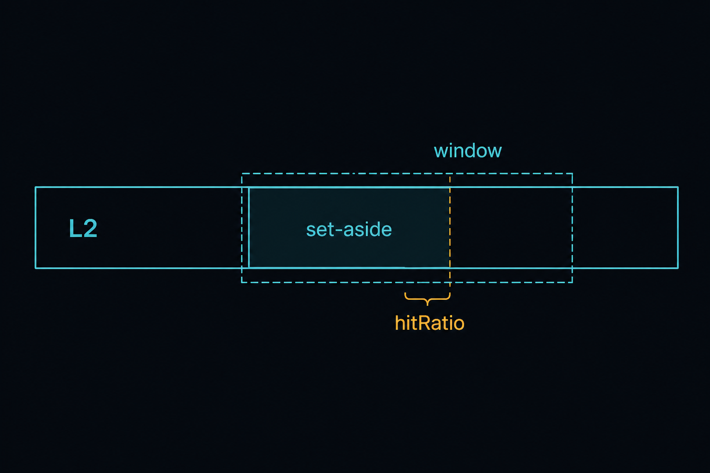
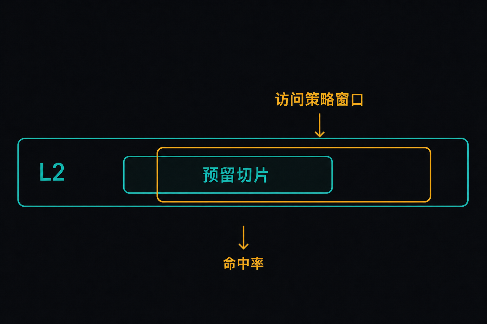
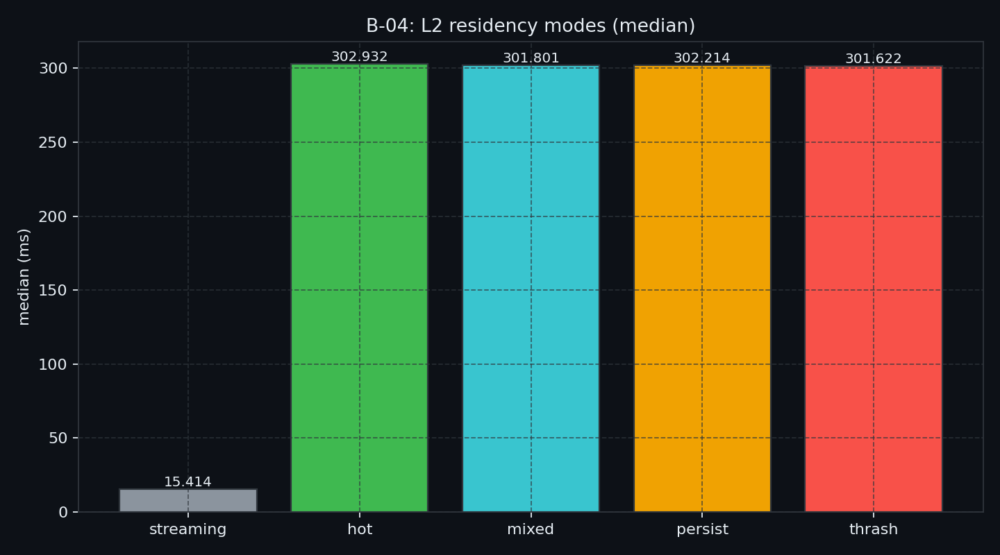
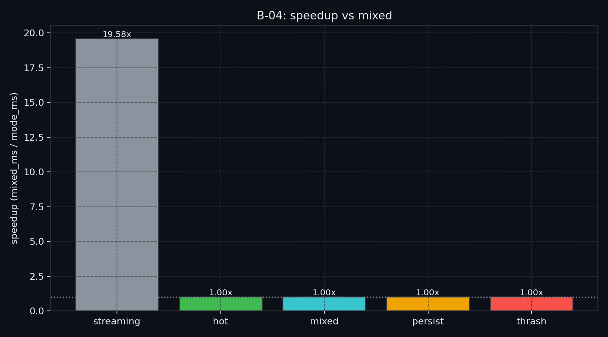
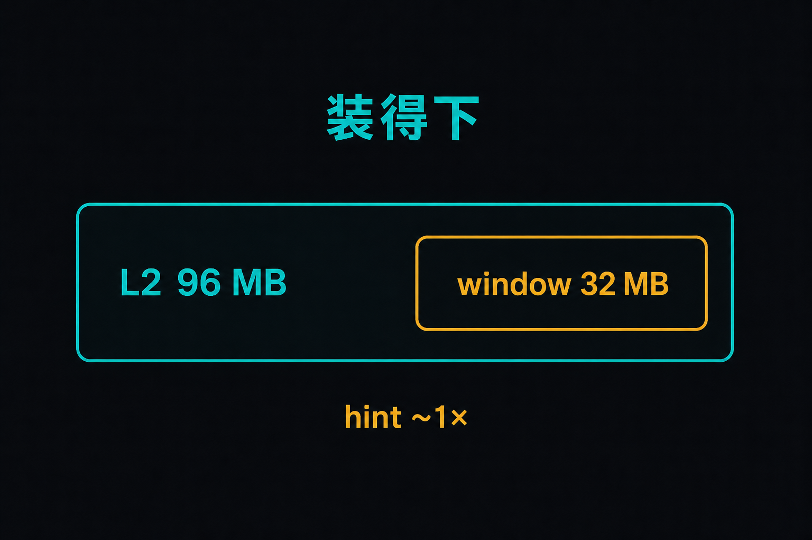

# B-04. L2：Persisting、Access Policy 与 hitRatio



> B-03 管的是 SM 里的寄存器和 local。再往外一层、全片共享的是 **L2**。  
> 本章只讲：有可复用热点时，怎么用 set-aside + Access Policy Window 让数据更倾向留在 L2；`hitRatio` 管不好就会 thrash。  
> 合并 / bank / spill / UM / `cp.async` / TMA **不做主测**。

**配套可复现**：[Yapeng-Gao/AI-System-Performance-Lab](https://github.com/Yapeng-Gao/AI-System-Performance-Lab)（文章 + `.cu` + 实测表）。有用请 Star。本章示例：[`examples/02_memory_optim/04_l2_residency.cu`](https://github.com/Yapeng-Gao/AI-System-Performance-Lab/blob/main/examples/02_memory_optim/04_l2_residency.cu)。

---

## TL;DR（工程结论）

> 口径：RTX 5090 / `sm_120`，L2=96 MB，CUDA event **median**；加速比 = `mixed_median / mode_median`。明细 [`docs/results/B-04_l2.md`](../../docs/results/B-04_l2.md)。需要 **sm_80+**。

1. **本机形状**：`persist` **0.999×**、`thrash` **1.001×** vs `mixed`。32 MB 窗口装进 96 MB L2，hint 不动墙钟。
2. **先比工作集和 L2，再比 set-aside。** `window > set-aside` 不够。窗口仍小于总 L2 时，默认缓存已经留得住；`hitRatio=1` 也 thrash 不起来。
3. **`streaming` 19.58× 是合并扫，不是 residency。** `hot` 与 `mixed` 贴齐（0.996×）。核不同，不要把 19× 写成 persist 红利。
4. **API 不是 pin。** 先划 set-aside，再给 stream 上 Access Policy Window。留不住就还是 LRU 类替换。
5. **判停**：主看 `persist` / `thrash` 相对 `mixed`。本机默认工作集已在 L2 → 停。跑完必须 reset。NCU DRAM / L2 hit 可选，**不要**把附着 ms 当结论。

---

## 1. 问题：数据到了 SM，L2 仍可能留不住

B-01 修 GMEM 形状，B-02 修 SMEM 交通，B-03 修寄存器 / local。L2 是全片共享缓存：所有 SM 都能用，所有 kernel 都会抢。默认策略不会按你的业务「锁」热点。

| 已有章节 | 已覆盖 | 本章深化 / 避免 |
|---|---|---|
| B-01 | sector / 合并 / `float4` | 不重讲合并 |
| B-02 | bank / padding | 不讲 bank |
| B-03 | spill / occupancy | 不讲寄存器处方 |
| B-05 | UM 迁页 | 不讲 fault / prefetch |
| B-07 / B-08 | `cp.async` / TMA | **不做** 异步引擎 |

边界一句话：**有可复用热点再谈 L2 residency；没有热点就停。**

```text
HBM
  ▲
 L2（全片共享）
  ▲
SM：RF / SMEM+L1
```

寄存器和 SMEM 近、但容量小、范围是 thread/block。L2 跨 SM、跨 block，默认不可控。热点留下来：DRAM 字节往往下降，长延迟等待少。一次性扫过的数据占满 L2，下一轮热点就得重新从 HBM 拉。

这套接口从 Ampere（CUDA 11）就能用，不是 CUDA 13 新发明。5090 / `sm_120` 同样走 set-aside + window。

---

## 2. 物理模型：set-aside、window、hitRatio

### 2.1 先划 set-aside

```cpp
cudaDeviceSetLimit(cudaLimitPersistingL2CacheSize, bytes);
```

`bytes` 不能超过 `cudaDeviceProp::persistingL2CacheMaxSize`。这块是**设备级共享**：多 stream / 多 kernel 一起抢。没人用 persisting 时，普通访问也能用这片。

### 2.2 再给一段地址窗口

```cpp
cudaAccessPolicyWindow w{};
w.base_ptr  = ptr;
w.num_bytes = window_bytes;   // ≤ accessPolicyMaxWindowSize
w.hitRatio  = 0.25f;          // 窗口里大约多少比例走 hitProp
w.hitProp   = cudaAccessPropertyPersisting;
w.missProp  = cudaAccessPropertyStreaming;
cudaStreamSetAttribute(stream, cudaStreamAttributeAccessPolicyWindow, &attr);
```

官方语义：窗口切成很多段，大约 `hitRatio` 的段用 `hitProp`，其余用 `missProp`。哪一段算 hit，硬件近似按这个比例随机，**不是**你标了「前 25% 字节」。`missProp` 只能是 Normal 或 Streaming。



> 图 1：persisting 是倾向留下，不是 pin。`hitRatio` 管窗口里大约多少比例走 hitProp。

### 2.3 三种配置

```text
A  window ≤ set-aside
   热点基本能留下。hitRatio=1 通常也安全。

B  window > set-aside，hitRatio ≈ set-aside/window
   只承诺留下一部分。非热点走 streaming。

C  window ≫ set-aside 且 hitRatio=1
   「整窗都想留」。留不下 → 持续替换 → DRAM 升、墙钟可能更差。
```

官方例子：set-aside 16 KB、window 32 KB、`hitRatio=1`，硬件会试图把整窗塞进 set-aside，只能留下最近用的约 16 KB，其余被挤走。两个 stream 各 16 KB、都是 `hitRatio=1`，也可能互相踢。两边改成 0.5，互踢会轻一些。

工程近似：`window > set-aside` 时先试

```text
hitRatio ≈ set_aside / window
```

本实验 `persist` 用 `--hit-ratio`（默认 0.25）；`thrash` 强制 1.0。

### 2.4 必须 reset

```cpp
cudaCtxResetPersistingL2Cache();
// 并把 window 的 num_bytes 置 0，hit/miss 改回 Normal
```

不 reset：下一发 kernel 可能还吃着上一发的 persisting 倾向，median 会漂，实验不可复现。`--mode modes` 每档之间都会关 policy + reset。

---

## 3. 决策表

| 信号 | 处方 | 出口 |
|---|---|---|
| 工作集反复复用，DRAM 高、L2 hit 低 | 试 set-aside + window；先 `window ≤ set-aside` | — |
| 工作集已小于总 L2（本机 32 MB ≪ 96 MB） | **不要**指望 persist 加速 | — |
| 纯扫一遍、没有复用 | **不要**开 persisting | — |
| 已 compute-bound | residency 墙钟常 ~1× | 算力 / 融合 → C / D |
| `window > set-aside` | 下调 `hitRatio`，或缩小 window | — |
| `persist` 不比 `mixed` 快，`thrash` 更慢 | 配置在抖；reset 后再测 | — |
| 其实是合并 / bank / spill | **不要**在本章调 window | → B-01 / B-02 / B-03 |
| 要藏 GMEM→SMEM 延迟 | **不要**当 L2 替代 | → B-07 |

---

## 4. 实验怎么设计

| 项 | 路径 |
|---|---|
| 代码 | `examples/02_memory_optim/04_l2_residency.cu` |
| 结果 | `docs/results/B-04_l2.md` / `B-04_modes.csv` |
| 绘图 | `python scripts/plot_b04_l2.py` |

**一条主命令**

```bash
./bin/02_memory_optim_04_l2_residency --mode modes
```

默认 `data-mb=64`、`iters=2048`、`set-aside-mb=8`、`window-mb=32`、`hit-ratio=0.25`、`runs=7`。需要 sm_80+；`persistingL2CacheMaxSize==0` 会退出。

| mode | 要回答的问题 |
|---|---|
| `streaming` | 合并扫、无随机 gather 有多快？（形状，不是 residency） |
| `hot` | 窗口内反复打点、policy off，和 mixed 差多少？ |
| `mixed` | 热/冷混合、policy off（公平基线） |
| `persist` | 同一 mixed + set-aside + window + hitRatio，相对 mixed 快吗？ |
| `thrash` | 同窗 `hitRatio=1`，会不会更慢？ |
| `modes` | 一次打表 + CSV |

证据优先级：event **median** → `persist` / `thrash` 相对 `mixed`。NCU 的 DRAM bytes、L2 hit 可选。旧示例把 20 次 launch 包进一次 event 再平均，不当结论。

### 4.1 本机实测

平台与表：[`docs/results/B-04_l2.md`](../../docs/results/B-04_l2.md)。5090 / `sm_120`，L2=96 MB，persistingMax=60 MB。

| mode | median_ms | vs mixed |
|---|---:|---:|
| `streaming` | 15.414 | **19.580×** |
| `hot` | 302.932 | **0.996×** |
| `mixed` | 301.801 | **1.000×** |
| `persist` | 302.214 | **0.999×** |
| `thrash` | 301.622 | **1.001×** |





**怎么读**

1. 主看 `persist` / `thrash` 相对 `mixed`。同核，只差 policy。本机 **0.999× / 1.001×**，差在抖动带内。  
2. `streaming` 19.58× 是连续扫对 gather。`hot` 并不比 `mixed` 快：窗口（32 MB）已经住进 96 MB L2。  
3. `thrash` 没变慢：`window > set-aside` 但窗口远小于总 L2，其余缓存仍留得住。  
4. 三档贴齐是有效结论。不要为了「必须数倍」把窗口改到大于 L2，除非另开 P1。



> 图 2：先比工作集和总 L2，再比 set-aside。本机默认窗口已经装得下。

---

## 5. 工程边界

- **sm_80+**。上限看 `persistingL2CacheMaxSize` / `accessPolicyMaxWindowSize`；程序会截断。  
- **persisting ≠ pin**，也不是合并替代。  
- **多 stream 抢同一 set-aside**：下调各自 `hitRatio`。  
- **不做**：TMA、`cp.async`、UM、bank、把 NCU 附着墙钟写进 TL;DR。  
- 文件名仍写「CUDA 13」是旧 CSDN 标题；接口从 CUDA 11 / Ampere 就能用。

---

## 6. 扩展阅读（不抢后续章）

1. 官方 L2 Cache Control / hitRatio → 见 §9-A。  
2. Ampere 上这套接口从哪来 → 见 §9-B。  
3. 跨空间迁页 → [B-05](https://github.com/Yapeng-Gao/AI-System-Performance-Lab/tree/main/article/02_memory_optim/)（已交付）。  
4. 形状已齐仍 latency-bound → B-07。

---

## 7. SOP + 误区

**SOP**

1. 先比工作集和 **总 L2**。已经装得下 → hint 常 ~1×，停。  
2. 有可复用热点、且工作集会挤 L2，再试 set-aside + window。  
3. 跑 `--mode modes`，主看 `persist` / `thrash` 相对 `mixed`。  
4. `window > set-aside` 先按 `set-aside/window` 估 `hitRatio`。  
5. 可选 NCU：time + DRAM bytes + L2 hit；忽略附着 ms。跑完 reset。仍慢 → 回 B-01/B-03 或去 B-07。

**误区**

| 误区 | 纠正 |
|---|---|
| 「打开 persisting 就锁死 L2」 | 倾向留下，不是 pin |
| 「streaming 数据也该 residency」 | 一次性访问用 streaming，少污染 |
| 「hitRate 单独当 KPI」 | 先看墙钟；旁证才是 DRAM / L2 |
| 「window 越大越好、hitRatio 永远 1」 | 大于 set-aside **且** 挤出总 L2 才容易 thrash |
| 「5090 上 persist 必须数倍」 | 96 MB L2 装得下 32 MB 窗口时 ~1× 是有效结论 |
| 「不用 reset」 | 下一发结果会漂 |
| 「这是 CUDA 13 / Blackwell 专属」 | Ampere 起就有；5090 只是 L2 更大 |

---

## 8. 小结与下一章

on-chip 三层：SMEM 交通（B-02）、寄存器 / local（B-03）、全片 L2（本章）。本机默认窗口已在 L2，hint ~1×。有热点且工作集会挤出 L2，再动 residency；reset 仍要做。

按弧下一章：**B-05 Unified Memory**（已交付）——离开 SM 缓存，看跨空间迁页。on-chip 对齐到此收束。

---

> 本文配套代码与实测：[AI-System-Performance-Lab](https://github.com/Yapeng-Gao/AI-System-Performance-Lab)。觉得有用请 Star，后续章更新更好找。  
> 本章示例：[`examples/02_memory_optim/04_l2_residency.cu`](https://github.com/Yapeng-Gao/AI-System-Performance-Lab/blob/main/examples/02_memory_optim/04_l2_residency.cu)。下一篇：[B-05 Unified Memory](https://github.com/Yapeng-Gao/AI-System-Performance-Lab/tree/main/article/02_memory_optim/)。

## 9. 参考文献

**A. 官方**

1. [CUDA Programming Guide — L2 Cache Control](https://docs.nvidia.com/cuda/cuda-programming-guide/04-special-topics/l2-cache-control.html) — window、hitRatio；window 大于 set-aside 会逐出。  
2. [CUDA C++ Best Practices Guide](https://docs.nvidia.com/cuda/cuda-c-best-practices-guide/index.html) — 一次性访问当 streaming；调 hitRatio 防 thrash。  
3. [cudaAccessPolicyWindow](https://docs.nvidia.com/cuda/cuda-runtime-api/structcudaAccessPolicyWindow.html) — hitRatio = 窗口内 hitProp 比例。

**B. 工程**

4. [NVIDIA Ampere Architecture In-Depth](https://developer.nvidia.com/blog/nvidia-ampere-architecture-in-depth/) — 可编程 L2 驻留从哪一代进入主线。

**C. 实证**

5. 本章 `--mode modes`（5090）：`persist` 0.999× / `thrash` 1.001× vs `mixed`；`streaming` 19.58× 是合并形状。

**D. 邻章**

6. Blackwell 单体 L2 更大 — 可能让 hint 边际变小；以本机 median 为准，不另开 API 课。
