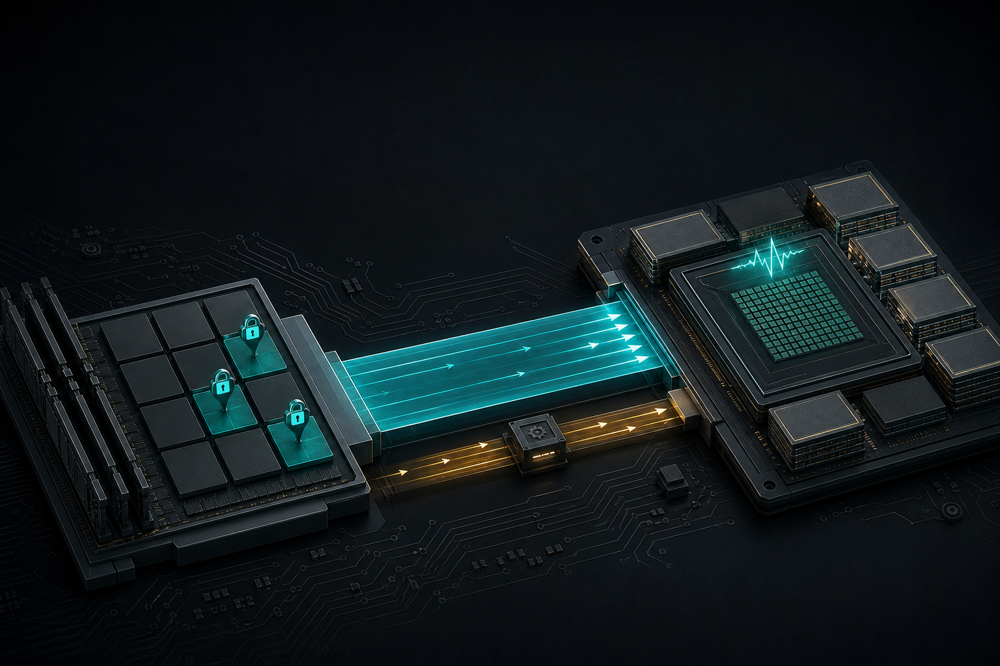

> B-05 把时延敏感路径推向了显式内存管理。  
> 显式路径的第一道门槛，不是函数名带不带 `Async`，而是：**Host 缓冲区能不能被 GPU DMA 直达**。  
> 工程里最常见的尴尬是——写了 `cudaMemcpyAsync`、也开了多 Stream，时间线照样串行。根因通常落在三处：pageable staging、默认流隐式同步、Copy Engine / 主机内存带宽已经饱和。

---

## B-06. Pinned Memory 与 DMA：H2D/D2H 吞吐上限与 Overlap 条件

## TL;DR（工程结论）

1. **Pageable 上的 `cudaMemcpyAsync` 往往不是真异步**：驱动先 stage 到临时 pinned，再 DMA；CPU 参与、吞吐更低。
2. **Pinned 是 DMA 直达与真 overlap 的物理前提**：优先 `cudaMallocHost` / `cudaHostAlloc`；`cudaHostRegister` 能用，但常见更慢。
3. **Overlap 成立条件**：pinned + 多个非默认 stream + `asyncEngineCount≥1`。同流内 H2D→Kernel 保序，跨流才能藏搬运。成功标志是 **端到端逼近单向 pinned memcpy**，不一定“比 serial 快很多”。
4. **吞吐是木桶**：有效带宽 ≈ min(PCIe 有效, 主机内存/NUMA, 小包启动开销)。两路 CE 时，双向合计常可到约 1.7–1.9× 单向。
5. **Mapped Zero-Copy 省的是 launch，不是 PCIe**：单遍触达可以接近链路带宽；反复访问应退回 `memcpy + HBM`。

---

## 1. 问题：为什么写了 Async 仍不加速

A-08 讲过 H2D / Compute / D2H 流水线长什么样；B-05 则说明 UM 不稳时该转向显式拷贝。  
本章补的是显式路径里最容易被忽略的一层：**Async 何时为真、PCIe 上限在哪、overlap 如何用证据判定**。

三类典型翻车：

```text
(1) 伪异步：pageable ──CPU staging──► pinned ──DMA──► device
(2) 伪 overlap：全程单流 / 默认流掺局 → Copy 与 Kernel 首尾相接
(3) 链路打不满：双向远低于 2×，CE 或主机内存先塌
```

对应到时间线，直觉上是这样：

```text
期望（真 overlap）          现实（伪异步 / 伪 overlap）

CE:   [H2D0][H2D1][H2D2]    CE:   [stage][H2D][stage][H2D]...
SM:      [K0][K1][K2]       SM:              [K0]    [K1]
时间 ────────────────►      时间 ──────────────────────────►
      copy ∥ compute              首尾相接，几乎不重叠
```

---

## 2. 物理模型：Staging、Pinned、Copy Engine

### 2.1 Pageable 为什么必须 staging

普通 `malloc` 内存可被操作系统换出。GPU DMA 需要稳定的物理地址，因此对 pageable 做 `cudaMemcpy(Async)` 时，驱动常见路径是：

CPU 把数据拷进驱动管理的 pinned 窗口 → DMA 搬到 device → 大块则按窗口反复 stage。

```text
┌──────── Host (pageable) ────────┐
│  malloc 缓冲（可换出）            │
└───────────────┬─────────────────┘
                │ ① CPU memcpy（staging）
                ▼
┌──────── 驱动 pinned 窗口 ───────┐
│  固定物理页，DMA 可读            │
└───────────────┬─────────────────┘
                │ ② Copy Engine DMA（经 PCIe）
                ▼
┌──────── Device HBM ─────────────┐
│  最终落点                        │
└─────────────────────────────────┘

注意：cudaMemcpyAsync 返回，常只意味着 ① 完成，不是 ② 完成
```

代价很直接：**多一次主机侧拷贝，并且更容易引入同步语义**。官方 Runtime sync behavior 也写明：pageable H2D 的“函数返回”，往往对应 staging 完成，而不是最终 DMA 完成。

### 2.2 Pinned：钉住物理页，交给 DMA

Pinned（page-locked）保证页常驻物理内存。Copy Engine 拿到页帧列表后可以直接读写，CPU 不必再当搬运工。

```text
路径 A — Pinned（DMA 直达）

┌──── Host pinned ────┐         ┌──── Device HBM ────┐
│  cudaMallocHost     │ ─DMA──► │                    │
│  物理页钉死          │  (CE)   │                    │
└─────────────────────┘         └────────────────────┘
        CPU 不参与中间拷贝


路径 B — Pageable（必须 staging）

┌── pageable ──┐  CPU   ┌─ staging ─┐  DMA  ┌── HBM ──┐
│   malloc     │ ─────► │  pinned   │ ────► │         │
└──────────────┘ memcpy └───────────┘  (CE) └─────────┘
        多一跳，吞吐更低，更易同步化
```

也因此：**只有 pinned，才谈得上与 kernel 真正 overlap**。

### 2.3 Copy Engine 与 `asyncEngineCount`

一张卡上，至少要分清两类引擎：

```text
                    ┌──────────────────────────────┐
                    │            GPU               │
 Host DRAM          │                              │
┌─────────┐  PCIe   │  ┌─────────────┐             │
│ pinned  │◄═══════►│  │ Copy Engine │──► HBM      │
│ / mapped│         │  │  (CE × N)   │             │
└─────────┘         │  └─────────────┘             │
                    │                              │
                    │  ┌─────────────┐             │
                    │  │  Compute    │◄─ SM / Kernel│
                    │  │  Engine     │             │
                    │  └─────────────┘             │
                    └──────────────────────────────┘

asyncEngineCount
  ≥ 1  → 才有资格谈  copy ∥ compute
  ≥ 2  → 才更有机会  H2D ∥ D2H（双向）
```

- **Compute Engine**：执行 kernel  
- **Copy Engine（CE）**：负责 H2D / D2H DMA  

消费级 Windows（WDDM）可能让重叠看起来更保守——发布结论时以端到端计时为主，NSYS 时间线为辅。

### 2.4 分配 API 怎么选

| API | 用途 |
|---|---|
| `cudaMallocHost` | 最常用的默认 pinned |
| `cudaHostAlloc(..., flags)` | 需要 Portable / Mapped / WriteCombined 时 |
| `cudaHostRegister` | 钉住已有 `malloc` 缓冲；对接第三方库有用，吞吐常不如直接 HostAlloc |

工程习惯：**只 pin staging / 热路径，并且循环复用**。钉太多会挤占系统可分页内存，严重时拖垮整机。

常用 flags 一句话：

- `Mapped`：Zero-Copy，kernel 可直接解引用，数据仍在 host  
- `WriteCombined`：偏 CPU 写、GPU 读；**CPU 读会很慢**  
- `Portable`：多 CUDA context 可见

---

## 3. Overlap：同流保序，跨流重叠

### 3.1 经典切块流水线

**serial（1 stream）**：同流保序，copy 与 kernel 首尾相接。

```text
时间 ────────────────────────────────────────────►

Stream0  [H2D0][K0][H2D1][K1][H2D2][K2]
CE       ████        ████        ████
SM             ▓▓▓▓        ▓▓▓▓        ▓▓▓▓

端到端 ≈ Σ(copy + kernel)   ← 没有跨 chunk 重叠
```

**overlap（多 stream）**：同流仍保序，跨流把下一块 H2D 塞进当前 kernel 窗口。

```text
时间 ────────────────────────────────────────────►

Stream0  [H2D0][K0]      [H2D2][K2]
Stream1        [H2D1][K1]      [H2D3][K3]
CE       ████  ████      ████  ████
SM             ▓▓▓▓▓▓▓▓        ▓▓▓▓▓▓▓▓
               └─ K0 ∥ H2D1 ─┘

理想端到端 ≈ max(总 copy, 总 kernel) ≈ 纯 pinned H2D
```

最小形态（示意）：

```cpp
for (int c = 0; c < num_chunks; ++c) {
  auto s = streams[c % n_streams];
  cudaMemcpyAsync(d + off, h + off, bytes, cudaMemcpyHostToDevice, s);
  kernel<<<grid, block, 0, s>>>(d + off, n);
}
```

要点：

- **同一 stream**：H2D → Kernel 必须保序（数据依赖正确）  
- **不同 stream**：chunk N 的 Kernel 可以和 chunk N+1 的 H2D 重叠  
- 全部塞进 1 条流，就退化成 `serial`，端到端 ≈ Σ(copy + kernel)

### 3.2 判定规则（主计时，辅 profile）

```text
真 overlap 成立 ⇔
  overlap 端到端 < 同参数 serial
  且/或 overlap 逼近同 size 的纯 pinned H2D（kernel 被藏住）
```

Copy-bound 时，单 chunk 上常常是 **copy ≫ kernel**（本章实测约 10×）。此时即使把 kernel 全藏掉，相对加速也可能只有几个点——画成比例更直观：

```text
一个 chunk 的墙钟构成（示意，比例约 10:1）

serial:   |████████████ copy ████████████|▓ K ▓|
overlap:  |████████████ copy ████████████|     ← K 藏进隔壁 chunk 的 copy
                                               相对加速 ≈ K / (copy+K) ≈ 几%~十几%
```

论坛里最容易误判的，就是拿“必须快 30%+”当唯一标准。

---

## 4. 实验怎么设计

配套代码：`examples/02_memory_optim/06_pinned_dma.cu`  
一键脚本：`examples/02_memory_optim/06_profile_pinned_dma.sh`

| mode | 回答什么 |
|---|---|
| `pageable` | 伪异步地板 |
| `pinned` | 单向 DMA 上限 |
| `serial` | 1 stream 切块 H2D→Kernel |
| `overlap` | 多 stream 是否把 kernel 藏进 copy |
| `bidir` | H2D∥D2H 合计能否接近 2× |
| `mapped` | Zero-Copy 单遍读有效带宽（≠ memcpy） |

输出口径：`first / median / p95` + GB/s，并用 `bw_note` 区分 memcpy 与端到端。  
证据优先级：**端到端 median** →（可选）`nsys stats` CUDA 汇总 →（有 GUI 再看时间线）。

有效带宽是木桶：

```text
              ┌─────────────────┐
              │   BW_PCIe 有效   │  ← Gen5 理论单向 ~64 GB/s，实测常 50–55
              └────────┬────────┘
                       │
              ┌────────▼────────┐
  BW_eff ≈    │  BW_host / NUMA │  ← pinned 跨 NUMA、CPU 争用会先塌
              └────────┬────────┘
                       │
              ┌────────▼────────┐
              │ 启动开销等效带宽 │  ← 小包太多时被 launch/提交吃掉
              └─────────────────┘

  BW_eff ≈ min(以上三层)
```

Gen5 消费卡上，256 MiB pinned H2D 稳态落在 **约 50–55 GB/s** 通常正常。以本机 `pinned` 为上限参考，不要拿别人机器的峰值当 KPI。

---

## 5. RTX 5090 实测

### 5.1 平台与口径

- GPU：RTX 5090，`asyncEngineCount=2`，`canMapHostMemory=1`
- 载荷：256 MiB；chunk=16 MiB；`warmup=1`，`runs=5`
- 下文未特别说明时，均报告 **median**
- 说明：本节未收录 `pageable` 对照；该模式用于验证伪异步地板，可用脚本补跑

### 5.2 结果总表

| mode | median (ms) | GB/s | bw_note | 一句话 |
|------|-------------|------|---------|--------|
| `pinned` | 4.769 | **52.42** | memcpy_payload | 单向上限，约 Gen5 理论的 82% |
| `serial` (iters=8) | 5.123 | 48.80 | e2e+kernel | 串行基线 |
| `overlap` (iters=8) | 4.808 | 51.99 | e2e+kernel | 比 serial **快 6.1%**，贴 pinned |
| `serial` (iters=256) | 5.331 | 46.90 | e2e+kernel | kernel 税略增 |
| `overlap` (iters=256) | 4.819 | 51.87 | e2e+kernel | 比 serial **快 10.6%**，仍贴 pinned |
| `bidir` | 5.336 | **93.70** | h2d+d2h | 约 **1.79×** 单向 |
| `mapped` | 5.234 | **47.76** | host_read_eff | 单遍读接近 PCIe |

### 5.3 怎么读

**单向 / 双向**

- `pinned` 52.4 GB/s 是后续一切对照的天花板。  
- `bidir` 93.7 GB/s：理想 2×≈104.8，约达到 **89%**；墙钟 5.34 ms 只比单向多约 12%。若 H2D 与 D2H 完全串行，512 MiB 大约需要 9.5 ms。

```text
单向 pinned          双向 bidir（两路 CE）

CE0: [==== H2D ====]   CE0: [==== H2D ====]
                       CE1: [==== D2H ====]
墙钟 ≈ 4.77 ms         墙钟 ≈ 5.34 ms（几乎同时推进）
载荷 256 MiB           载荷 256+256 MiB
→ 52.4 GB/s            → 93.7 GB/s ≈ 1.79× 单向
```

**Overlap（copy-bound）**

- `kernel_iters` 从 8 加到 256：`overlap` 几乎不动（约 4.81 ms），`serial` 略慢 → 瓶颈在 H2D，不在算力。  
- `overlap ≈ pinned` 且明显快于 `serial` → kernel 已被藏进 copy 窗口。  
- 相对加速只有 6–11%，是因为 kernel 本来就短，不是 overlap 失败。

```text
median 对照（iters=256）

pinned:   |████ 4.77 ms ████|          ← 纯 H2D 天花板
overlap:  |████ 4.82 ms ████|          ← 贴住天花板 ⇒ kernel 已藏住
serial:   |█████ 5.33 ms █████|        ← 多出来的就是串行 kernel 税
```

**Mapped**

- 单遍有效带宽约等于 memcpy 峰值的 **91%**，端到端与 `serial` 同阶。  
- 适合“几乎只触达一次”；同一块数据反复读，会反复打 PCIe，应改 `memcpy + HBM`。  
- **量纲不同**：不要把 mapped 的 GB/s 直接当成 `cudaMemcpy` H2D 带宽。

```text
Memcpy 路径                     Mapped Zero-Copy 路径

Host pinned ─DMA─► HBM          Host mapped ◄══ PCIe ══► SM 直接读
                  │                              （数据仍在 Host）
                  ▼
                 SM 读 HBM

单遍：两者都可能接近 PCIe
多遍：Memcpy 吃 HBM；Mapped 每遍都再打 PCIe ← 容易踩坑
```

### 5.4 NSYS CLI 旁证（无 GUI 也可）

```bash
nsys profile -o pinned_overlap --force-overwrite true \
  ./bin/02_memory_optim_06_pinned_dma \
  --mode overlap --mb 256 --chunk-mb 16 --streams 4 --kernel-iters 256

nsys stats --report cuda_api_sum,cuda_gpu_kern_sum,cuda_gpu_mem_time_sum,cuda_gpu_mem_size_sum \
  pinned_overlap.nsys-rep
```

本机摘要（overlap，iters=256；warmup+runs 共 6 轮 × 16 chunk = **96** 次）：

| 项 | 结果 |
|---|---|
| H2D Memcpy | 96 × **16.777 MB**；单次 med ≈ **298 µs**；GPU mem 合计 ≈ 28.6 ms |
| `light_touch_kernel` | 96 次；单次 med ≈ **29 µs**；合计 ≈ 2.78 ms |
| Host API | `cudaMemcpyAsync`×96，`cudaLaunchKernel`×96 |

这组数说明三件事：

1. 切块与轮次计数正确（96 = 6×16）。  
2. **单 chunk 上 copy≈298 µs ≫ kernel≈29 µs（约 10×）**，直接解释了“为什么只快几个点仍算成功”。  
3. `nsys stats` 是汇总表，不能单独证明时间线交错；它和 §5.2 的 `overlap ≈ pinned < serial` 合在一起，证据链已经够用。

> 纯 CUDA 程序跑 `nsys stats` 时，Vulkan / DX / WDDM / UM 等报表出现 `SKIPPED` 是正常现象，可以忽略。

### 5.5 复现命令

```bash
bash examples/02_memory_optim/06_profile_pinned_dma.sh

./bin/02_memory_optim_06_pinned_dma --mode pinned  --mb 256
./bin/02_memory_optim_06_pinned_dma --mode serial  --mb 256 --chunk-mb 16 --kernel-iters 8
./bin/02_memory_optim_06_pinned_dma --mode overlap --mb 256 --chunk-mb 16 --streams 4 --kernel-iters 8
./bin/02_memory_optim_06_pinned_dma --mode serial  --mb 256 --chunk-mb 16 --kernel-iters 256
./bin/02_memory_optim_06_pinned_dma --mode overlap --mb 256 --chunk-mb 16 --streams 4 --kernel-iters 256
./bin/02_memory_optim_06_pinned_dma --mode bidir   --mb 256
./bin/02_memory_optim_06_pinned_dma --mode mapped  --mb 256
./bin/02_memory_optim_06_pinned_dma --mode pageable --mb 256   # 可选：伪异步地板
```

---

## 6. 工程 SOP 与常见误区

**建议流程**

1. 先看 `asyncEngineCount` / `canMapHostMemory`  
2. 大包对比 `pageable` vs `pinned`  
3. 同参数对比 `serial` vs `overlap`：是否贴住 `pinned`  
4. 再看 `bidir` 是否接近 1.7–1.9×  
5. 只有少触达场景才考虑 `mapped`  
6. 回归时只改分配方式或 stream 拓扑，保持数据规模与 kernel 强度不变

**判停**

- `overlap ≈ pinned` 且快于 `serial` → 成功（哪怕只快几个点）  
- `overlap` 既不贴 `pinned`、也不快于 `serial` → 查单流、默认流、同步点  
- mapped 路径上数据被反复访问 → 退回显式 memcpy

**高频误区**

1. 以为函数名带 Async 就一定异步  
2. 无脑把大块 host 内存全部 pin 住  
3. 把“同流写 H2D→Kernel”理解成 overlap 失败（那是正确保序）  
4. 用单向峰值直接外推双向或整条流水线  
5. 拿 mapped GB/s 和 memcpy GB/s 横比  
6. 以为 overlap 只快 5–10% 就等于失败  
7. 没有 GUI 就否定计时结论——median 对照 + CLI stats 已经够用

---

## 7. 扩展阅读（可选）

- **`cudaMemcpyBatchAsync`（CUDA 12.8+）**：摊销海量小拷贝的 launch 开销；不规则小块仍建议先合并进 pinned staging。  
- **Grace / NVLink-C2C**：硬件相干下，系统分配内存可能成为一等公民；本章默认模型仍是离散卡 + PCIe（参见参考文献 Grace Hopper / ICPP’24）。  
- **多卡 multipath H2D**：单卡先把 pinned / overlap 做对，再考虑更激进的拓扑带宽聚合（参见 MultiPath arXiv）。

---

## 8. 小结与下一章

本章把 Host↔Device 路径收敛成三句话：

1. 先用 pinned 打满本机单向上限；  
2. 再用多 stream 把短 kernel 藏进 copy；  
3. 双向和 Zero-Copy 都要单独用证据判定，不能靠常识外推。

下一章进入 **Device 内部**：`cp.async` / `cuda::pipeline` /（可选）TMA。那是数据已经在 HBM 之后，GMEM→SMEM 如何与计算重叠的问题——和本章的 PCIe/DMA 不是同一层。

---

## 9. 参考文献

**官方文档（正文论据主来源）**

1. [CUDA C++ Best Practices Guide — Pinned Memory / Asynchronous Transfers](https://docs.nvidia.com/cuda/cuda-c-best-practices-guide/)（§10.1 附近：pinned、`asyncEngineCount`、非默认 stream）
2. [CUDA Programming Guide — Asynchronous Execution](https://docs.nvidia.com/cuda/cuda-programming-guide/02-basics/asynchronous-execution.html)（pageable 上 `cudaMemcpyAsync` 会退化；推荐 `cudaMallocHost`）
3. [CUDA Runtime API — API Synchronization Behavior](https://docs.nvidia.com/cuda/cuda-runtime-api/api-sync-behavior.html)（pageable H2D：返回常对应 staging 完成，DMA 未必结束）
4. [CUDA Runtime API — Memory Management](https://docs.nvidia.com/cuda/cuda-runtime-api/group__CUDART__MEMORY.html)（`cudaMallocHost` / `cudaHostAlloc` / `cudaHostRegister` / Mapped）
5. [Nsight Systems User Guide](https://docs.nvidia.com/nsight-systems/UserGuide/index.html)（CLI profile / `nsys stats` 旁证）

**工程博客（流水线直觉）**

6. [How to Optimize Data Transfers in CUDA C/C++](https://developer.nvidia.com/blog/how-optimize-data-transfers-cuda-cc/)
7. [How to Overlap Data Transfers in CUDA C/C++](https://developer.nvidia.com/blog/how-overlap-data-transfers-cuda-cc/)

**扩展阅读（§7，非本章必需）**

8. [Advanced CUDA APIs — Batched Memory Transfers](https://docs.nvidia.com/cuda/cuda-programming-guide/03-advanced/advanced-host-programming.html)（`cudaMemcpyBatchAsync`）
9. [Schieffer et al., Harnessing Integrated CPU-GPU System Memory for HPC: a first look into Grace Hopper](https://arxiv.org/abs/2407.07850)（ICPP’24；DOI: [10.1145/3673038.3673110](https://doi.org/10.1145/3673038.3673110)）
10. [MultiPath Memory Access: Breaking Host-GPU Bandwidth Bottlenecks in LLM Services](https://arxiv.org/abs/2512.16056)

