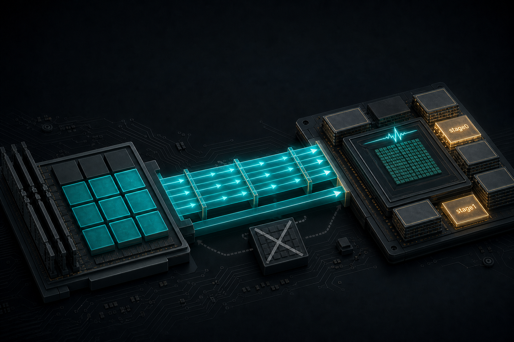

> B-06 解决的是 Host↔Device：pinned + Copy Engine，让 PCIe 搬运与 kernel 重叠。  
> 数据已经在 HBM 之后，下一层瓶颈常常变成：**SM 还在等 Global Memory**。  
> 本章进入设备内部——`cp.async` / `cuda::memcpy_async` / `cuda::pipeline`：GMEM→SMEM 如何与计算重叠，以及**什么时候流水线反而变慢**。

---

## B-07. Async Copy / Pipeline：GMEM→SMEM 何时能藏延迟，何时反而变慢

## TL;DR（工程结论）

1. **`cp.async` / `cuda::memcpy_async` 是 SM 内 DMA**：路径是 GMEM→SMEM，旁路寄存器；与 B-06 的 Host Copy Engine **不是一层**。
2. **收益来自 outstanding stages × 足够 compute overlap**，不是「async 指令本身比 sync load 更快」。
3. **低 arithmetic intensity / latency-bound 才值得上**；已 compute-bound，或 occupancy 已能藏 LDG 时，pipeline 同步与多 stage SMEM 常净亏损（Svedin 等文献曲线；本机用 `sweep` 验证是否同形）。
4. **Stage 加深换延迟，但挤占 SMEM → 掉 occupancy**；shared / partitioned `cuda::pipeline` 有 per-stage barrier 开销——能 **thread-local** 就不要 block shared。
5. **对齐 / 尺寸不满足时可能回退或走非预期路径**；Hopper+ 大批量多维搬运交给 **B-08 TMA**，本章只给钩子。

---

## 1. 问题：数据已在 HBM，为什么还在等

A-08 / B-06 讲的是 Host 侧流水线：

```text
Host CE:  [H2D][H2D][H2D]
SM:          [K ][K ][K ]
```

本章关心的是 **kernel 内部**：

```text
期望（设备内 async + 多 stage）

async copy:  [tile1][tile2][tile3][tile4]
compute:         [c1 ][c2 ][c3 ][c4 ]
                 ↑ copy ∥ compute（同一 CTA 内）

现实（同步 load，或 async 但立刻 wait）

load:  [tile1]----wait----[tile2]----wait----
math:             [c1]            [c2]
                 ↑ 首尾相接，几乎不重叠
```

两层 overlap **不要混谈**：

| 层级 | API / 硬件 | 搬运路径 | 典型证据 |
|---|---|---|---|
| Host↔Device（B-06） | `cudaMemcpyAsync` + Stream / CE | Host pinned ↔ HBM | NSYS 时间线、端到端 vs pinned |
| Device 内（本章） | `cp.async` / `cuda::pipeline` | GMEM → SMEM | CUDA event + intensity 曲线；NCU WarpStateStats |

B-01 介绍过 `cp.async`→TMA 的演进叙事；本章把它落成 **可复现 micro-bench + 决策表**。TMA 细节留给 B-08。

---

## 2. 物理模型：为什么要绕过寄存器

### 2.1 旧路径：LDG → 寄存器 → STS

传统「先搬进 shared」写法：

```text
线程：  LDG (gmem→reg)  →  STS (reg→smem)  →  再用 smem 做计算
问题：  ① 占寄存器（压力↑，occupancy↓）
        ② LDG 挂长 scoreboard，warp 容易空转
        ③ 同步点前后很难把「下一 tile 的 load」藏进「当前 tile 的算」
```

### 2.2 Ampere 路径：LDGSTS / `cp.async`

Ampere（sm_80+）为 GMEM→SMEM 提供硬件异步拷贝：数据可 **不进寄存器文件**，直接落入 shared；完成前 warp 可继续发别的指令（在正确的 commit/wait 协议下）。

```text
┌──────── HBM / GMEM ────────┐
│  tile 数据                  │
└─────────────┬──────────────┘
              │  cp.async / LDGSTS
              │  （经 MIO / async copy 路径，旁路 RF）
              ▼
┌──────── Shared Memory ─────┐
│  stage 0 / 1 / … 环形缓冲   │
└─────────────┬──────────────┘
              │  consumer_wait 之后
              ▼
┌──────── CUDA Core / Tensor ─┐
│  对当前 stage 做计算         │
└─────────────────────────────┘
```

工程含义：

- **不是**「这条指令的单次延迟一定更短」；
- **是**「把搬运从「占寄存器 + 长 scoreboard」里拆出来，好做软件流水线」。

官方 Ampere Tuning Guide 也强调：该特性让程序员显式控制 **compute 与 GMEM→SM 数据搬运** 的重叠，并避免为 copy 额外烧寄存器。

### 2.3 和「已经很高的 Occupancy」什么关系

GPU 本就会用多 warp 藏延迟。若 occupancy 已经很高、访存又已被盖住，再套一层 pipeline：

- 多占 SMEM（多 stage）→ 可能 **降低** occupancy；
- 多付 commit/wait / barrier 成本；

净效果完全可能变慢。这正是标题后半句的来源。

---

## 3. API 分层：从 sync 到 pipeline

建议心里记四层（由浅到深）：

```text
① sync load / gmem→reg→smem          ← 基线、永远能跑
② __pipeline_memcpy_async + wait_prior ← 贴近 PTX，控制细
③ cuda::memcpy_async + barrier/pipeline ← 推荐工程入口（libcu++）
④ TMA / cp.async.bulk（Hopper+）       ← B-08，本章只钩子
```

### 3.1 `memcpy_async` + 立刻 wait ≠ 流水线

只把 `LDG+STS` 换成 `memcpy_async`，然后马上 `consumer_wait`，往往只是：

- 少走寄存器（有时有益）；
- **没有**制造 outstanding 拷贝与计算的重叠。

配套实验里的 `async1` 就是这个对照：回答「换指令本身有没有赚」。

### 3.2 真正赚 overlap 的是多 stage

双缓冲 / 多缓冲的时间线（示意）：

```text
stage 缓冲：  [0][1][0][1][0]...

copy:   |#0|#1|  #2 |  #3 |  #4 |
math:       |c0 |c1 |c2 |c3 |
            ↑ 算 stage0 时，stage1 的 copy 已在飞
```

`cuda::pipeline` 的生产者/消费者协议：

1. `producer_acquire` → 拿到空 stage  
2. `memcpy_async` → 提交异步拷贝  
3. `producer_commit` → 关闭本 stage 的提交窗口  
4. …中间可穿插计算或其他工作…  
5. `consumer_wait` → 等最老 stage 就绪  
6. 读 smem、计算  
7. `consumer_release` → 归还 stage

### 3.3 Thread-local vs Block-shared

Programming Guide 写得很直白：

- **Thread-local pipeline**（`cuda::make_pipeline()`）：无 per-stage shared barrier，优先；
- **Block-scope / partitioned**：即使 unified，也可能付一套 shared barrier 成本——只有真要 producer/consumer 角色分离时才值得。

官方还警告 **Warp Entanglement**：同一 warp 内 pipeline 状态共享；`producer_commit` 应在 **收敛** 的线程上调用，否则 wait 可能「多等」别的线程的 batch。分歧后先 `__syncwarp` 再 commit。

### 3.4 对齐与回退（写清门槛，细节留给 B-08）

`cuda::memcpy_async` 在不同架构上可能走 `cp.async`、在 Hopper+ 且满足对齐/尺寸时甚至走 TMA 相关路径；条件不满足时可能回退。  
工程上：**保证 16B 对齐、拷贝粒度合理**，再用 SASS（`LDGSTS` / `CP.ASYNC`）确认没有静默退化。本章 micro-bench 用 `sizeof(float)` 的 per-thread 拷贝是为了对照清晰；生产 GEMM 会走更大粒度的向量化 / TMA。

---

## 4. 决策表：何时上、几 stage、何时回退

| 信号 | 建议 |
|---|---|
| 低 AI，NCU 见大量 long scoreboard / 算力空转 | 试 2-stage pipeline；看加速比 |
| 已接近 compute SOL，或 occupancy 很高且无明显访存 stall | **先别上**；或上了也要用 sweep 证明没变慢 |
| 2-stage 有收益，4-stage 持平/变慢 | 停在 2；查 SMEM 是否挤掉 occupancy |
| `async1` ≈ `sync`，但 `pipe2` 明显更快 | 赚的是 **流水线**，不是单条 async 指令 |
| `pipe2_blk` 慢于 thread-local `pipe2` | 不要为「看起来更高级」上 shared pipeline |
| 需要大批量多维 tile、地址计算本身吃指令带宽 | 钩子 → **B-08 TMA** |

文献形状（写作预期，不是你机器上的绝对数字）：

- Svedin et al.（PMBS@SC’21）：低 AI 常见 **约 1.07–1.35×**；高 AI 可掉到 **~0.95×**。  
- Li et al.（IISWC’23）：当 GMEM→SMEM **不是**系统瓶颈时，async 设置几乎无收益。

---

## 5. 实验怎么设计

配套代码：`examples/02_memory_optim/07_cp_async_pipeline.cu`  
一键脚本：`examples/02_memory_optim/07_profile_cp_async_pipeline.sh`

| mode | 回答什么 |
|---|---|
| `sync` | 公平基线：`gmem→reg→smem` |
| `async1` | 仅换 async、立刻 wait，有无收益/开销？ |
| `pipe2` | 2-stage thread-local 是否加速？ |
| `pipe4` | 更深 stage 继续赚，还是被 SMEM 反噬？ |
| `pipe2_blk` | block-shared pipeline 相对 thread-local 贵多少？ |
| `sweep` | 扫 `fma-iters`，画 **加速比 vs intensity** |

输出口径：`first / median / p95 / mean`（ms）+ 粗算 payload GB/s；`sweep` 直接打 CSV：

```text
fma_iters,sync_ms,pipe2_ms,pipe4_ms,speedup_pipe2,speedup_pipe4
```

证据优先级：

1. **主证据**：裸跑 `sweep` 的加速比曲线（写入 `docs/results/`）  
2. **旁证**：NCU `--section WarpStateStats`（看主导 stall 类型；sm_120 上部分 legacy 指标名可能 `n/a`）  
3. **可选**：SASS 确认出现 `LDGSTS` / `CP.ASYNC`  
4. **明确不用**：`ncu` 附着时程序自己打印的 ms/GB/s（会被 replay 放大）

需要 sm_80+。Blackwell（如 RTX 5090）仍保留 cp.async 路径，本章不是「仅 Ampere 考古」。  
新增示例后请 **重新 cmake 再 build**，否则可能找不到 `02_memory_optim_07_cp_async_pipeline` target。

### 5.1 预期曲线（读结果时对照）

```text
speedup (sync / pipe)
  ▲
  │     ╭── 低 AI：pipeline 有机会 >1
  │    ╱
  │───╱──────── 1.0（打平）
  │  ╱
  │ ╱  高 AI：同步开销 > 藏延迟收益，可 <1
  │╱
  └──────────────────────────► fma-iters / AI
```

判读口诀：

- 曲线从左上落到 1.0 附近 → 与文献一致，标题成立；  
- 全程 <1 → 查是否已 compute-bound、SMEM 过大、或 warp 未收敛；  
- `pipe4` 全面弱于 `pipe2` → 更深 stage 在你这组 tile/occupancy 下不划算。

### 5.2 RTX 5090 实测（裸跑）

- GPU：RTX 5090，`sm_120`，`sharedMemPerBlock=48 KB`
- 载荷：`n=4194304`（16 MiB float），`tiles/block=64`，`block=256`，`runs=7`，`warmup=2`
- 口径：CUDA event **median**（**不要**在 `ncu` 附着时读程序打印的 ms/GB/s）
- 明细：`docs/results/B-07_cp_async_pipeline.md`

**Intensity sweep（裸跑；`fma=8` 取自同日固定 mode 的 sync/pipe2/pipe4）**

| fma_iters | sync_ms | pipe2_ms | pipe4_ms | speedup_pipe2 | speedup_pipe4 |
|----------|---------|----------|----------|---------------|---------------|
| 8† | 0.0213 | 0.0193 | 0.0202 | **1.104×** | **1.054×** |
| 16 | 0.0244 | 0.0224 | 0.0231 | **1.087×** | **1.055×** |
| 32 | 0.0335 | 0.0316 | 0.0316 | **1.060×** | **1.059×** |
| 64 | 0.0519 | 0.0500 | 0.0527 | **1.036×** | 0.984× |
| 128 | 0.0890 | 0.0898 | 0.0931 | 0.990× | 0.956× |
| 256 | 0.1635 | 0.1708 | 0.1738 | 0.958× | 0.941× |

† `fma=8` 来自 §下表固定 mode（同一二进制、同一 `n/tiles/block`），与 `sweep` CSV 口径一致。`sweep` 还会打印 `1/2/4`；若终端仍有完整 CSV，补进 `docs/results/B-07_cp_async_pipeline.md` 即可。

```text
speedup_pipe2（RTX 5090）

 1.10 ┤ ●8
 1.09 ┤  ●16
 1.06 ┤   ●32
 1.04 ┤    ●64
 1.00 ┤─────────●128── 盈亏线
 0.96 ┤            ●256
      └──────────────────► fma_iters
```

**固定 mode（`fma_iters=8`，同一天裸跑）**

| mode | median (ms) | 相对 sync | 一句话 |
|------|-------------|-----------|--------|
| `sync` | 0.0213 | 1.00× | 基线 |
| `async1` | 0.0231 | **0.92×** | 只换 async、立刻 wait → 更慢 |
| `pipe2` | 0.0193 | **1.10×** | 本组最佳 |
| `pipe4` | 0.0202 | **1.05×** | 仍快于 sync，但不如 pipe2 |
| `pipe2_blk` | 0.0207 | **1.03×** | shared pipeline 税，不如 thread-local |

**怎么读**

1. **何时能藏延迟**：`fma≈8~32`，`pipe2` 约 **+6%～+10%**；此时多 stage 才有意义。  
2. **何时变慢**：过 ~64 后加速比掉向 ≤1；`fma=256` 约 **0.96×**——算力/短依赖变重后协议变纯开销。  
3. **换指令 ≠ 流水线**：同强度下 `async1` 比 `sync` **慢 ~8%**。  
4. **别盲目加深 / 别无脑 shared pipeline**：`pipe4`、`pipe2_blk` 都差于 `pipe2`。  
5. 与 §5.3 NCU「短依赖主导」一致：高强度段不该指望再叠 async stage 翻盘。

### 5.3 NCU 旁证（WarpStateStats）

**不要**用 `ncu --set full` 解读程序自己的 median（会被 replay 放大到百毫秒～秒级）。  
sm_120 上 `long_scoreboard` / `mio_throttle` 等 legacy 指标名常返回 **n/a**；改看 section：

```bash
# 在 build/ 目录下（一行写完，避免续行被 shell 拆开）
ncu --launch-skip 2 --launch-count 1 --section WarpStateStats --section MemoryWorkloadAnalysis -o cp_async_sync ./bin/02_memory_optim_07_cp_async_pipeline --mode sync --fma-iters 4 --runs 1 --warmup 2

ncu --import cp_async_sync.ncu-rep --page details
```

本机（`fma_iters=4`，`kernel_sync`）要点：

- 主导 stall：**fixed latency execution dependency**（短依赖，等 FMA/短延迟指令结果）  
- NCU 估计 local speedup 提示约 **40.3%**（占 issue 间隔的主要贡献之一）  
- **不是**「等 GMEM 的 long scoreboard」叙事 → 与高 AI 段 `pipe2/pipe4 < 1` 一致：  
  **对症不是再叠 async stage，而是别在已短依赖受限的路径上付 pipeline 税。**

### 5.4 SASS 旁证（确认走了 async copy）

目标：确认 `async1` / `pipe2` 路径出现 **`LDGSTS` 或 `CP.ASYNC`**，而 `sync` 更接近 **`LDG` + `STS`（经寄存器）**。

```bash
# 在仓库根目录（需 nvcc + nvdisasm/cuobjdump；5090 机器上跑）
bash examples/02_memory_optim/07_dump_sass.sh
# 产物：docs/sass/ampere/07_cp_async_pipeline.sass
#       docs/sass/blackwell/07_cp_async_pipeline.sass

grep -nE 'LDGSTS|CP\.ASYNC|LDG\.E|STS' docs/sass/blackwell/07_cp_async_pipeline.sass | head
```

判读：

| 期望 | 含义 |
|---|---|
| pipe / async 核里见到 `LDGSTS` / `CP.ASYNC` | GMEM→SMEM 异步路径生效 |
| sync 核以 `LDG`/`STS` 为主 | 对照基线（经寄存器） |
| 完全没有上述串且性能异常 | 检查是否静默回退 / 架构与编译 `-arch` 是否匹配 |

> 本机 Windows 开发环境若无 nvcc，在跑实测的 Linux/5090 节点执行上述脚本，把 `docs/sass/**` 一并提交即可。

### 5.5 复现命令

```bash
# 主证据：在 build/ 下裸跑（不要挂 ncu）
./bin/02_memory_optim_07_cp_async_pipeline --mode sweep
# 若需单独抽出低 AI 行：
# ./bin/02_memory_optim_07_cp_async_pipeline --mode sweep | awk -F, 'NR==1 || ($1+0>0 && $1+0<=8)'

./bin/02_memory_optim_07_cp_async_pipeline --mode sync      --fma-iters 8
./bin/02_memory_optim_07_cp_async_pipeline --mode async1    --fma-iters 8
./bin/02_memory_optim_07_cp_async_pipeline --mode pipe2     --fma-iters 8
./bin/02_memory_optim_07_cp_async_pipeline --mode pipe4     --fma-iters 8
./bin/02_memory_optim_07_cp_async_pipeline --mode pipe2_blk --fma-iters 8

# 或：在仓库根目录批量跑（脚本会自己找 bin）
bash examples/02_memory_optim/07_profile_cp_async_pipeline.sh
# 可选旁证：DO_NCU=1 bash examples/02_memory_optim/07_profile_cp_async_pipeline.sh
# SASS：bash examples/02_memory_optim/07_dump_sass.sh
```

---

## 6. 工程边界：SMEM、MIO、以及 B-02 仍然有效

**SMEM 预算**

```text
smem ≈ stages × tile_bytes_per_block
stages↑ → 可藏的延迟↑，但
         → 每 SM 能驻留的 block↓ → occupancy↓ → 可能反噬
```

**MIO throttle**

异步拷贝发太猛时，stall 可能从 long scoreboard 变成 MIO 侧节流。此时继续加深 pipeline 或减小 tile、调整发射节奏，而不是盲加 stage。

**和 B-02 的关系**

`cp.async` 只负责「把字节放到 shared」。数据落地后：

- Bank conflict 照样惩罚；  
- 面向 Tensor Core 的布局仍要 padding / swizzle（B-02）。

异步搬运 **不是** bank conflict 的免死金牌。

---

## 7. 扩展阅读（可选，不抢 B-08 / Module D）

- **CudaDMA → Ampere**：旧方案用专用 copy warp 软仿异步；Ampere 后普通计算 warp 即可发 `memcpy_async`（见 NVIDIA Ampere 数据搬运博客）。  
- **CUTLASS multistage vs warp-specialized**：前者同一批 warp 既产又消；后者拆 producer/consumer warp。生产级 GEMM 细节进 Module D / CUTLASS 教程即可。  
- **Hopper TMA**：把「算地址 + 搬多维 tile」卸给硬件拷贝引擎，用 `mbarrier` 交接——这是 B-08 的主线。  
- **Blackwell**：库内仍可见 `cp.async` warp-specialized 路径；消费级新卡上本章结论仍然有用。

---

## 8. 工程 SOP 与常见误区

**建议流程**

1. 确认 sm_80+；先跑 `sync` 基线  
2. 同参数跑 `async1`：区分「换指令」与「流水线」  
3. 跑 `pipe2` / `pipe4`，再跑 `sweep` 看曲线是否过 1.0  
4. 必要时对比 `pipe2_blk`  
5. 有收益再考虑嵌进真实算子；无收益就停，不要为 pipeline 而 pipeline  
6. 需要大 tile / 多维搬运 → 评估 B-08 TMA

**判停**

- 低 AI 段 `pipe2/pipe4 > 1`，高 AI 段回到 ~1 或略 <1 → 符合预期，按工作负载选择是否启用  
- 全程 <1 且 NCU 已 compute-bound → 回退 sync / 减 stage  
- `async1` 无收益但 `pipe2` 有 → 保留多 stage，不要只换 API

**高频误区**

1. 把 B-06 的 Host `cudaMemcpyAsync` 和设备内 `cuda::memcpy_async` 当成同一件事  
2. 写了 async 却立刻 wait，以为已经「流水线化」  
3. 无脑 4-stage/8-stage，忽略 SMEM→occupancy  
4. 在 divergent warp 上 commit，踩 Warp Entanglement  
5. 用共享 pipeline「看起来更正规」，却多付 barrier  
6. 忽略对齐/粒度导致的静默回退  
7. 以为上了 async 就不用再管 bank / swizzle

---

## 9. 小结与下一章

本章把设备内异步搬运收敛成三句话：

1. **先证明你是 latency-bound**（或至少低 AI），再上 pipeline；  
2. **赚的是 outstanding copy ∥ compute**，不是指令名字；  
3. **用 intensity 扫描判停**——高 AI 变慢是正常物理结果，不是实现一定写错。

下一章 **B-08** 进入 Hopper **TMA**：当 tile 更大、地址更不规则、指令带宽本身成为墙时，把拷贝卸给专用引擎。那是本章 Ampere 路径的下一站，不是替代关系上的「谁更正确」。

---

## 10. 参考文献

**官方文档（正文论据主来源）**

1. [CUDA Programming Guide — Asynchronous Data Copies](https://docs.nvidia.com/cuda/cuda-programming-guide/04-special-topics/async-copies.html)
2. [CUDA Programming Guide — Pipelines](https://docs.nvidia.com/cuda/cuda-programming-guide/04-special-topics/pipelines.html)（thread-local 优先；Warp Entanglement）
3. [NVIDIA Ampere GPU Architecture Tuning Guide](https://docs.nvidia.com/cuda/ampere-tuning-guide/)（GMEM→SMEM 硬件加速、旁路寄存器）

**工程博客 / CCCL**

4. [Controlling Data Movement to Boost Performance on the NVIDIA Ampere Architecture](https://developer.nvidia.com/blog/controlling-data-movement-to-boost-performance-on-ampere-architecture/)
5. [cuda::memcpy_async — CCCL / libcu++](https://nvidia.github.io/cccl/libcudacxx/extended_api/asynchronous_operations/memcpy_async.html)

**高质量实证**

6. Svedin et al., *Benchmarking the Nvidia GPU Lineage: From Early K80 to Modern A100 with Asynchronous Memory Transfers*（PMBS@SC’21 / [arXiv:2106.04979](https://arxiv.org/abs/2106.04979)）
7. Li et al., *Performance Implications of Async Memcpy and UVM: A Tale of Two Data Transfer Modes*（IISWC’23，[PDF](https://lca.ece.utexas.edu/pubs/Li_IISWC_2023.pdf)）

**扩展阅读（§7，非本章必需）**

8. Colfax / SIGARCH, [Efficient GEMM Kernel Designs with Pipelining](https://research.colfax-intl.com/cutlass-tutorial-design-of-a-gemm-kernel/)
9. [CUTLASS — Synchronization / Pipeline](https://docs.nvidia.com/cutlass/media/docs/cpp/pipeline.html)
10. MLC.ai, [Pipelining GEMM with TMA](https://mlc.ai/modern-gpu-programming-for-mlsys/chapter_gemm_async/index.html)（B-08 铺垫）
