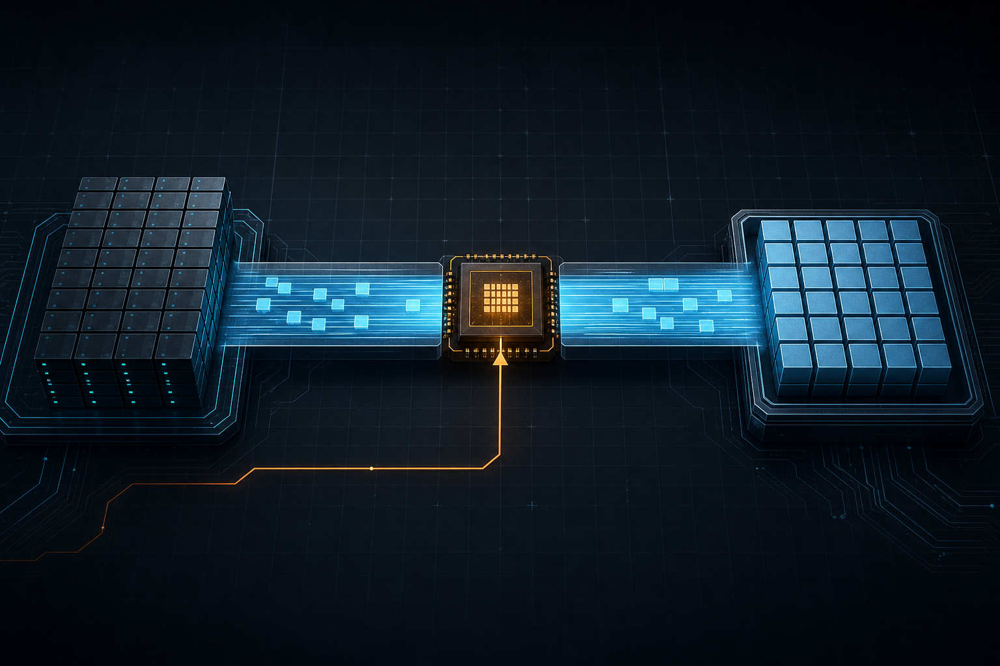

> B-07 解决的是 Ampere 路径：`cp.async` / `cuda::pipeline`，用多 stage 藏 GMEM 延迟。  
> 当 tile 更大、地址更不规则、**算地址 + 发一堆 copy 本身吃指令带宽**时，下一站是把搬运卸给专用引擎。  
> 本章进入 Hopper+ **TMA**：单线程 issue、descriptor / tensor map、`mbarrier` 交接——以及**什么时候固定开销反而让你变慢**。

---

## B-08. Hopper TMA：从单线程 Bulk Copy 到吞吐墙

## TL;DR（工程结论）

1. **TMA 是专用异步拷贝引擎**（GMEM↔SMEM；亦可 cluster DSM）：与 B-07 的 SM 内 `cp.async`、B-06 的 Host CE **不是一层**。
2. **收益核心是单线程 issue + descriptor 卸地址/边界/predication** → 省寄存器与指令带宽；不是「单次延迟一定更短」。文献完整路径（含 mbarrier）可观察到约 **+170 cycle** 量级开销，需靠 **大 tile / compute overlap** 摊销。
3. **该上**：大 tile、多维/跨步、地址计算或 copy 循环本身吃指令带宽、需要与 compute 深度重叠（warp-spec 场景）。
4. **别上 / 先别上**：小块、对齐/尺寸不满足、descriptor 重建过频、已 compute-bound 且 B-07 pipeline 已够用。
5. **同步模型**：G2S 用 `mbarrier` + `expect_tx`（或 `arrive_tx`）；S2G 常走 **bulk async-group**——与 G2S 的 barrier 模型不要混用。

---

## 1. 问题：B-07 之后还卡在哪

B-07 的四层梯子里，第 ④ 层只留了钩子：

```text
① sync load / gmem→reg→smem
② __pipeline_memcpy_async
③ cuda::memcpy_async + pipeline
④ TMA / cp.async.bulk          ← 本章
```

Ampere `cp.async` 已经旁路寄存器，但 **每个线程仍要算自己的地址并发指令**。tile 变大、维度变多时：

- 地址/predication 指令本身成为墙；
- 寄存器被 index math 挤占；
- 想做 warp-specialized producer 时，copy warp 的「发令开销」过高。

TMA 的回答是：**一个线程把 descriptor + 坐标交给硬件引擎**，其余线程去算（或等待 barrier）。

| 层级 | API / 硬件 | 谁算地址 | 典型证据 |
|---|---|---|---|
| B-06 Host↔Device | CE + Stream | 驱动/CE | NSYS |
| B-07 Device `cp.async` | LDGSTS / pipeline | **每线程** | intensity 曲线、SASS `LDGSTS` |
| B-08 Device TMA | bulk / tensor map | **描述符 + 引擎** | event 带宽、SASS TMA/BULK、issue 计数 |

---

## 2. 物理模型：引擎、描述符、旁路 L1

```text
Ampere cp.async（每线程）：
  thread i: 算 addr_i → cp.async → smem[i]
  × 32/128/256 …

Hopper+ TMA（单线程 issue）：
  elect thread: 提交 (tensor_map, coords) 或 (ptr, bytes)
       │
       ▼
  TMA engine ──异步──► SMEM tile（可旁路 L1）
       │
       ▼
  mbarrier.complete_tx（字节记账）→ 消费者 wait
```

工程含义（对照 Luo et al. microbench）：

- TMA 延迟曲线更像 **受 L2 影响、少一截 L1 拐点**；
- 完整路径（issue + expect_tx + arrive/wait）相对普通访问可有约 **+170 cycle**——所以 **立刻 wait 的小拷贝**完全可能比 sync 协作 load 更慢；
- 赚的是 **大批量 + 与 compute 重叠**，不是单次 load 更便宜。

官方也强调：尽量 **少次数、大字节** 的 bulk；对齐不满足时，`cuda::memcpy_async` 可能回退，而 `memcpy_async_tx` / `cp.async.bulk` **直接 UB**——micro-bench 必须把对齐写死。

---

## 3. API 分层与同步

心里记四层（由浅到深）：

```text
① 1D cp.async.bulk / cuda::device::memcpy_async_tx   ← 指针+长度，无 tensor map
② cuTensorMapEncode* + cp.async.bulk.tensor          ← 多维 tile + 坐标
③ cuda::memcpy_async（Hopper+ 满足对齐时也可走 TMA）← 有回退；对照实验慎用
④ CuTe / CUTLASS PipelineTmaAsync                    ← 生产 GEMM，扩展阅读
```

### 3.1 1D bulk：指针 + 字节数

- GMEM / SMEM：**16B 对齐**；size：**16 的倍数**。
- 推荐用 `ptx::elect_sync`（或 `invoke_one`）选举 issue 线程，避免编译器给 `if (threadIdx.x==0)` 插 peeling loop。
- `memcpy_async_tx` **总是**走 TMA；tx 字节要用 `barrier_arrive_tx` / `expect_tx` 显式声明。

### 3.2 2D tensor map：主机编码 + `__grid_constant__`

1. Host：`cuTensorMapEncodeTiled`（可用 `cudaGetDriverEntryPointByVersion` 取符号）。  
2. Kernel 参数：`const __grid_constant__ CUtensorMap`。  
3. Device：`cp.async.bulk.tensor` + 坐标；**目标 SMEM 128B 对齐**。  
4. OOB 区域 G2S 会零填充——这是硬件行为，不是 bug。

### 3.3 G2S vs S2G 完成模型

本章 MVP **只做 G2S**（读进 SMEM + compute）。S2G 写回常见于 GEMM epilogue，完成模型不同，务必分清：

| 方向 | 完成跟踪 |
|---|---|
| GMEM→SMEM（本章） | `mbarrier` + tx 字节 |
| SMEM→GMEM（扩展） | 常 `cp.async.bulk.commit_group` + `wait_group_read`（**不是**同一套 mbarrier 语义） |

若做 S2G：写回前要对 SMEM 做 `fence_proxy_async`，再 `__syncthreads()`，否则 TMA 引擎可能读到旧值。

### 3.4 和 B-07 pipeline 的关系

- **立刻 wait 的 bulk** ≈ B-07 的 `async1`：回答「换引擎本身」。  
- **多 stage TMA prefetch** ≈ B-07 的 `pipe2`：回答「能否藏延迟」。  
- 生产级还会拆 **producer warp（只发 TMA）/ consumer warpgroup（WGMMA）**——本章不实现，见扩展阅读。

---

## 4. 决策表：何时上 TMA、何时回退 B-07

| 信号 | 建议 |
|---|---|
| 大 tile、多维/跨步、index math 明显 | 试 TMA（先 `bulk1d`/`tensor2d`，再 `pipe2`） |
| B-07 `sweep` 已在低 AI 赚到，且 tile 仍小 | **先留在 B-07**；TMA 固定开销可能不划算 |
| `bulk1d` ≈ 或 < `sync`，但 `pipe2` > 1 | 赚的是 **prefetch overlap**，不是单次 bulk |
| 对齐搞不定 / 调试困难 | 回退 sync 或 B-07；不要硬上 `memcpy_async_tx` |
| 需要 cluster 多播同一份 K/V | 概念上 TMA multicast（B-01 钩子）；本章 micro-bench **不做** |
| 要冲 GEMM/Attention SOL | Module D / CUTLASS / FA3；不要指望本 micro-bench 复现库性能 |

文献形状（写作预期，不是你机器上的绝对数字）：

- Luo et al.（[arXiv:2501.12084](https://arxiv.org/abs/2501.12084)）：TMA 完整路径延迟开销显著；async 编程模型 GEMM 约 **1.5×** 量级潜力。  
- PyTorch TMA FP8 文：descriptor **错误用法 / 过多传输** 可把收益吃光甚至倒退。  
- ACTA（GPGPU’25）：tile / queue 配置空间爆炸——手调敏感，先扫 intensity 再扫 tile。

---

## 5. 实验怎么设计

配套代码：`examples/02_memory_optim/08_tma_intro.cu`  
一键脚本：`examples/02_memory_optim/08_profile_tma.sh`

| mode | 回答什么 |
|---|---|
| `sync` | 协作 sync load 整 tile（公平基线） |
| `bulk1d` | 1D TMA + 立刻 wait：换引擎本身？ |
| `tensor2d` | 2D tensor-map：多维路径是否稳住？ |
| `pipe2` | 2-stage TMA prefetch：能否藏延迟？ |
| `sweep` | 扫 `fma-iters`，画加速比 vs intensity |

Tile 固定 **1024 floats（32×32）**；`n` 须整除 tile。`sync` 基线是 **整 tile 协作 load**（不是 B-07 那种 per-thread 单元素小拷贝），才能和 TMA bulk 公平对照。输出口径：`first / median / p95 / mean` + 粗算 payload GB/s；`sweep` CSV：

```text
fma_iters,sync_ms,bulk1d_ms,tensor2d_ms,pipe2_ms,speedup_bulk1d,speedup_tensor2d,speedup_pipe2
```

证据优先级：

1. **主证据**：裸跑 `sweep` 曲线 → `docs/results/B-08_*.csv`  
2. **旁证**：NCU WarpStateStats / MemoryWorkload（`DO_NCU=1`）  
3. **可选**：SASS（`08_dump_sass.sh`）确认 TMA/BULK 类指令  
4. **明确不用**：`ncu` 附着时程序自己打印的 ms/GB/s  

需要 **sm_90+**。新增示例后请 **重新 cmake 再 build**，否则可能找不到 `02_memory_optim_08_tma_intro`。Blackwell（如 RTX 5090）建议 `-DCMAKE_CUDA_ARCHITECTURES=120`（CUDA ≥12.8 时默认列表已尝试附带 120）。

### 5.1 预期曲线（读结果时对照）

```text
speedup (sync / TMA mode)
  ▲
  │     ╭── 低 AI + 大 tile：pipe2 最有机会 >1
  │    ╱
  │───╱──────── 1.0
  │  ╱
  │ ╱  高 AI 或立刻 wait：bulk/tensor 可能 ≤1（固定开销）
  │╱
  └──────────────────────────► fma-iters / AI
```

判读口诀：

- `bulk1d`/`tensor2d` 全程 ≤1，但 `pipe2` 在低 AI >1 → 标题后半句成立：引擎本身不是免费的，**重叠**才是产品；  
- 三者全程 <1 → 查对齐、tile 是否太小、是否已 compute-bound；  
- `tensor2d` 明显慢于 `bulk1d` → 查 2D stride/box/坐标，或本机 2D 路径开销更大（先修正确性再谈优化）。

### 5.2 本机实测

> 当前仓库结果页为模板：`docs/results/B-08_tma.md`。  
> 在 **RTX 5090 / sm_120**（或 H100）上跑完 `08_profile_tma.sh` 后，把 CSV 写入 `docs/results/B-08_sweep.csv` / `B-08_modes.csv`，再执行：
>
> ```bash
> python scripts/plot_b08_tma.py
> ```
>
> 将生成 `assets/B-08-speedup-vs-fma.png` 与 `assets/B-08-mode-speedup-bars.png`，并把表格贴回本节。

---

## 6. 工程边界

### 6.1 对齐与 UB

| 路径 | 关键对齐 |
|---|---|
| 1D bulk | GMEM/SMEM 16B；size ×16 |
| 2D tensor | GMEM 16B；stride ×16；**SMEM 128B** |
| `memcpy_async` | 不满足时可回退；**不要**拿它当「一定是 TMA」的证据 |

### 6.2 落地后仍要管 bank / swizzle

TMA 只负责「把字节放到 shared」。面向 Tensor Core 的 swizzle mode（32B/64B/128B）与 B-02 bank 规则仍然成立——描述符里的 swizzle 是 **给 WGMMA 友好布局**用的，不是 bank conflict 免死金牌。

### 6.3 Cluster multicast / DSM

B-01 提过 TMA multicast：一份 HBM 读 → 多 SM SMEM。本章 MVP **刻意不做**（硬件契约 + barrier 偏移复杂）。需要时进 Cluster 专题 / Module D。

### 6.4 Blackwell 仍保留 cp.async

消费级新卡上 B-07 结论仍然有用；TMA 是 **另一条梯子**，不是「有 Blackwell 就必须重写一切」。

---

## 7. 扩展阅读（不抢 Module D）

- Colfax, [Mastering the Hopper TMA](https://research.colfax-intl.com/tutorial-hopper-tma/)：CuTe 操作路径。  
- Colfax / CUTLASS：multistage vs warp-specialized + `PipelineTmaAsync`。  
- Shah et al., **FlashAttention-3**（NeurIPS’24 / [arXiv:2407.08608](https://arxiv.org/abs/2407.08608)）：TMA + WGMMA + warp-spec 的生产级叠法。  
- ACTA（GPGPU’25）：自动选 tile/queue——解释手调有多痛。  
- Yadav et al., **Cypress**（PLDI’25 / [arXiv:2504.07004](https://arxiv.org/abs/2504.07004)）：把 TMA/WGMMA 编排藏进任务式抽象。  
- PyTorch, [Hopper TMA for FP8 GEMMs](https://pytorch.org/blog/hopper-tma-unit/)：收益与 descriptor 开销反例。

---

## 8. 工程 SOP 与常见误区

**建议流程**

1. 确认 sm_90+；先跑 `sync`  
2. 跑 `bulk1d`：区分「换引擎」与「流水线」  
3. 跑 `tensor2d`：多维路径是否正确且不崩带宽  
4. 跑 `pipe2` + `sweep`：看低 AI 是否 >1、高 AI 是否回落  
5. 有收益再嵌真实算子；无收益就停  
6. 需要布局/AoS-SoA → B-09

**判停**

- 低 AI：`pipe2 > 1`，高 AI → ~1 → 符合预期  
- `bulk1d`/`tensor2d` <1 且 `pipe2` 也 <1 → 回退 B-07 或加大 tile 再测  
- 仅 `tensor2d` 异常 → 先查 encode / 坐标 / 128B 对齐

**高频误区**

1. 把 Host `cudaMemcpyAsync`、B-07 `memcpy_async`、TMA bulk 当成同一件事  
2. 写了 TMA 却立刻 wait，又期待「自动变快」  
3. 用 `threadIdx.x==0` issue 却不 elect，踩 peeling / 串行化  
4. G2S 用 mbarrier、S2G 却忘了 `wait_group` / proxy fence  
5. 不对齐仍调 `memcpy_async_tx`（UB）  
6. 每次 kernel 重建巨大 descriptor / 多余的 host→device 传输  
7. 以为上了 TMA 就不用再管 bank / swizzle / 布局（→ B-02 / B-09）

---

## 9. 小结与下一章

本章把 TMA 收敛成三句话：

1. **先证明你有「大 tile / 指令带宽墙 / 需要深度 overlap」**，再上 TMA；  
2. **赚的是单线程 issue + 引擎搬运 ∥ compute**，不是指令名字；  
3. **用 intensity 扫描判停**——立刻 wait 变慢、prefetch 才赚，是正常物理结果。

下一章 **B-09** 回到数据布局：AoS/SoA/Transpose——一次布局调整如何改变事务与有效带宽。TMA 再强，也救不了从第一天就选错的布局。

---

## 10. 参考文献

**官方文档（正文论据主来源）**

1. [CUDA Programming Guide — Asynchronous Data Copies](https://docs.nvidia.com/cuda/cuda-programming-guide/04-special-topics/async-copies.html)
2. [NVIDIA Hopper Architecture In-Depth](https://developer.nvidia.com/blog/nvidia-hopper-architecture-in-depth/)
3. [CCCL — Tensor Memory Accelerator (TMA)](https://nvidia.github.io/cccl/unstable/cccl/tma.html)
4. NVIDIA Hopper Tuning Guide（TMA / async barrier）

**工程教程**

5. Colfax, [CUTLASS Tutorial: Mastering the Hopper TMA](https://research.colfax-intl.com/tutorial-hopper-tma/)
6. MLC.ai, [Pipelining GEMM with TMA](https://mlc.ai/modern-gpu-programming-for-mlsys/chapter_gemm_async/index.html)
7. PyTorch, [Deep Dive on the Hopper TMA Unit for FP8 GEMMs](https://pytorch.org/blog/hopper-tma-unit/)

**高质量实证 / 前沿**

8. Luo et al., *Benchmarking and Dissecting the Nvidia Hopper GPU Architecture*（IPDPS’24 / [arXiv:2402.13499](https://arxiv.org/abs/2402.13499)）
9. Luo et al., *Dissecting the NVIDIA Hopper Architecture through Microbenchmarking…*（[arXiv:2501.12084](https://arxiv.org/abs/2501.12084)）——TMA 延迟/吞吐
10. Shah et al., *FlashAttention-3*（NeurIPS’24 / [arXiv:2407.08608](https://arxiv.org/abs/2407.08608)）
11. ACTA: Automatic Configuration of the TMA（GPGPU’25 / [DOI:10.1145/3725798.3725802](https://doi.org/10.1145/3725798.3725802)）
12. Yadav et al., *Task-Based Tensor Computations on Modern GPUs*（Cypress，PLDI’25 / [arXiv:2504.07004](https://arxiv.org/abs/2504.07004)）
