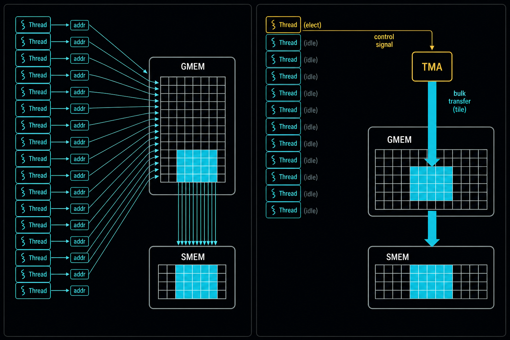
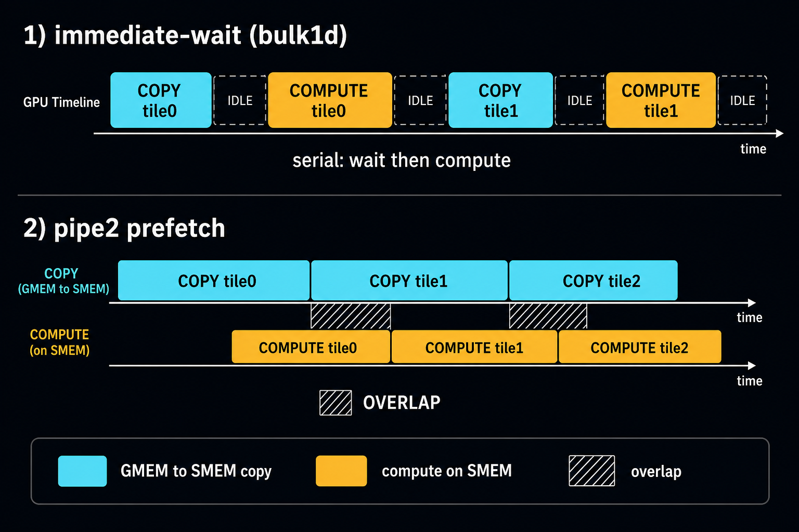
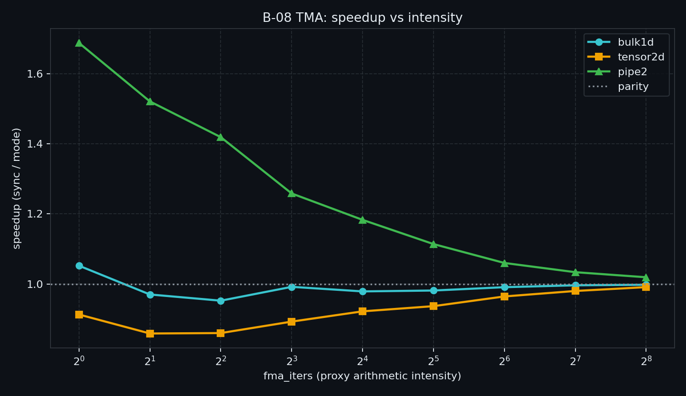
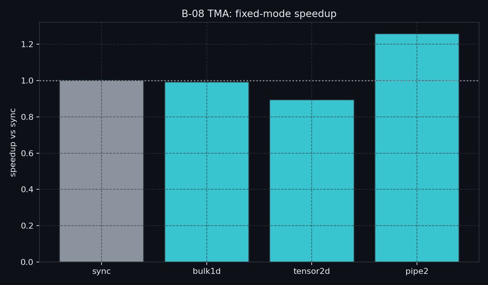

> B-07 解决的是 Ampere 路径：`cp.async` / `cuda::pipeline`，用多 stage 藏 GMEM 延迟。  
> 当 tile 更大、地址更不规则、**算地址 + 发一堆 copy 本身吃指令带宽**时，下一站是把搬运卸给专用引擎。  
> 本章进入 Hopper+ **TMA**：单线程 issue、descriptor / tensor map、`mbarrier` 交接——以及**什么时候固定开销反而让你变慢**。

---

## B-08. Hopper TMA：从单线程 Bulk Copy 到吞吐墙

## TL;DR（工程结论）

1. **TMA 是专用异步拷贝引擎**（GMEM↔SMEM；亦可 cluster DSM）：与 B-07 的 SM 内 `cp.async`、B-06 的 Host CE **不是一层**。
2. **收益来自单线程 issue + 引擎搬运 ∥ compute**，不是「换 TMA 指令本身更快」。本机（RTX 5090）：立刻 wait 的 `bulk1d`/`tensor2d` 约 **0.86～1.05×**；2-stage `pipe2` 低 AI 可达约 **1.69×**。
3. **该上**：需要大 tile / 多维搬运、或要把 copy 从计算 warp 卸掉（warp-spec）；上之前先用 `sweep` 证明 `pipe2` 段 >1。
4. **别上 / 先别上**：只换引擎立刻 wait、对齐搞不定、已 compute-bound（本机 `fma≥128` 时 `pipe2` 已回落到 ~1.03×）、B-07 pipeline 已够用。
5. **同步模型**：G2S 用 `mbarrier` + `expect_tx` / `arrive_tx`；S2G 常走 **bulk async-group**——两套完成模型不要混用。

---

## 1. 问题：B-07 之后还卡在哪

B-07 的四层梯子里，第 ④ 层只留了钩子：

```text
① sync          ② pipeline_memcpy     ③ cuda::pipeline      ④ TMA bulk
   gmem→reg→smem    Ampere 异步拷贝         多 stage 流水线         专用引擎
                                                              ▲ 本章
```

Ampere `cp.async` 已经旁路寄存器，但 **每个线程仍要算自己的地址并发指令**。tile 变大、维度变多时：地址/predication 吃指令带宽、挤寄存器；warp-spec 时 copy warp「发令」过贵。

TMA 的回答：**一个线程把 descriptor + 坐标交给硬件引擎**，其余线程去算（或等 barrier）。



> 左：每线程各自算地址、发一串小拷贝。右：elect 线程发一条控制；TMA 引擎整块搬 tile。

| 层级 | API / 硬件 | 谁算地址 | 典型证据 |
|---|---|---|---|
| B-06 Host↔Device | CE + Stream | 驱动/CE | NSYS |
| B-07 Device `cp.async` | LDGSTS / pipeline | **每线程** | intensity 曲线 |
| B-08 Device TMA | bulk / tensor map | **描述符 + 引擎** | intensity 曲线（本章） |

---

## 2. 物理模型：引擎、描述符、mbarrier

```text
                    ┌─────────────┐
   elect thread ───►│ 提交命令     │  (tensor_map, coords) 或 (ptr, bytes)
        │           │ 一条 issue  │
        │           └──────┬──────┘
        │                  │ 异步
        │                  ▼
   GMEM ════════════════► TMA engine ════════════════► SMEM tile
   (HBM)                   │                           (可旁路 L1)
                           │ complete_tx（按字节记账）
                           ▼
                      mbarrier ──wait──► 全体线程开始读 SMEM / 计算
```

时间线上，两种用法差很多：



> 上：`bulk1d`/`tensor2d` 立刻 wait → copy 与 compute 串行（本机 ≈ 0.9～1.0×）。  
> 下：`pipe2` 算当前 tile 时预取下一块 → 才能藏延迟（本机低 AI ≈ 1.7×）。

工程含义：

- 文献（Luo et al.）：完整路径可有约 **+170 cycle** 固定开销。  
- 本机：4 KiB tile 立刻 wait 几乎不赚；**重叠**才赚。  
- 对齐不满足时 `memcpy_async_tx` / `cp.async.bulk` 是 **UB**——对齐必须写死。

---

## 3. API 分层与同步

心里记四层（由浅到深）：

```text
① 1D cp.async.bulk / cuda::device::memcpy_async_tx   ← 指针+长度，无 tensor map
② cuTensorMapEncode* + cp.async.bulk.tensor          ← 多维 tile + 坐标
③ cuda::memcpy_async（Hopper+ 满足对齐时也可走 TMA）← 有回退；对照实验慎用
④ CuTe / CUTLASS PipelineTmaAsync                    ← 生产 GEMM，扩展阅读
```

### 3.1 1D bulk：指针 + 字节数

- GMEM / SMEM：**16B 对齐**；size：**16 的倍数**。
- 用 `ptx::elect_sync`（或 `invoke_one`）选举 issue 线程，避免 `if (threadIdx.x==0)` 被插 peeling loop。
- `memcpy_async_tx` **总是**走 TMA；tx 字节用 `barrier_arrive_tx` / `expect_tx` 显式声明。

### 3.2 2D tensor map：主机编码 + `__grid_constant__`

1. Host：`cuTensorMapEncodeTiled`（可用 `cudaGetDriverEntryPointByVersion`）。  
2. Kernel：`const __grid_constant__ CUtensorMap`。  
3. Device：`cp.async.bulk.tensor` + 坐标；**目标 SMEM 128B 对齐**。  
4. OOB 区域 G2S 零填充——硬件行为，不是 bug。

### 3.3 G2S vs S2G 完成模型

本章 MVP **只做 G2S**。S2G 常见于 GEMM epilogue，完成模型不同：

| 方向 | 完成跟踪 |
|---|---|
| GMEM→SMEM（本章） | `mbarrier` + tx 字节 |
| SMEM→GMEM（扩展） | `cp.async.bulk.commit_group` + `wait_group_read` |

S2G 写回前：`fence_proxy_async` → `__syncthreads()`，否则引擎可能读到旧 SMEM。

### 3.4 和 B-07 pipeline 的关系

| 本章 mode | 对应 B-07 | 时间线（见图） | 本机结果 |
|---|---|---|---|
| `bulk1d` / `tensor2d` | ≈ `async1` | 立刻 wait，串行 | ≈ 0.9～1.0× |
| `pipe2` | ≈ `pipe2` | prefetch ∥ compute | 低 AI 最高约 1.69× |

生产级还会拆 producer warp（只发 TMA）/ consumer warpgroup（WGMMA）——本章不实现，见 §7。

---

## 4. 决策表：何时上 TMA、何时回退 B-07

| 信号 | 建议 |
|---|---|
| 需要大 tile / 多维 / 卸掉 copy 指令压力 | 试 TMA：先看 `pipe2` 的 `sweep`，再考虑嵌算子 |
| `bulk1d`/`tensor2d` ≤1，但 `pipe2` >1（本机典型） | **保留 prefetch**；不要只换 API 立刻 wait |
| 已 compute-bound（本机约 `fma≥128`） | 停；TMA 协议变纯开销 |
| B-07 `sweep` 已够、且无多维/指令带宽墙 | **先留在 B-07** |
| 对齐搞不定 | 回退 sync / B-07；勿硬上 `memcpy_async_tx`（UB） |
| cluster 多播同一份 K/V | 概念上 TMA multicast（B-01）；本章不做 |
| 冲 GEMM/Attention SOL | Module D / CUTLASS / FA3；本 micro-bench 不复现库性能 |

---

## 5. 实验怎么设计

配套代码：`examples/02_memory_optim/08_tma_intro.cu`  
**主命令（一条就够）：**

```bash
./bin/02_memory_optim_08_tma_intro --mode sweep
```

| mode | 回答什么 |
|---|---|
| `sync` | 协作 sync load 整 tile（公平基线） |
| `bulk1d` | 1D TMA + 立刻 wait |
| `tensor2d` | 2D tensor-map + 立刻 wait |
| `pipe2` | 2-stage TMA prefetch |
| `sweep` | 扫 `fma-iters` → 加速比 vs intensity（**主证据**） |

Tile 固定 **1024 floats（32×32，4 KiB）**；`n` 须整除 tile。`sync` 是 **整 tile 协作 load**（不是 B-07 的 per-thread 单元素），才能和 TMA bulk 公平对照。

`sweep` 输出 CSV：

```text
fma_iters,sync_ms,bulk1d_ms,tensor2d_ms,pipe2_ms,speedup_*,...
```

证据优先级：① 裸跑 `sweep` → `docs/results/B-08_*.csv`；② 可选 NCU / SASS。  
**不要**在 `ncu` 附着时读程序自己打印的 ms。需要 **sm_90+**；Blackwell 建议 `-DCMAKE_CUDA_ARCHITECTURES=120`。增删 `.cu` 后请重新 `cmake`。

### 5.1 预期形状（本机已验证）

```text
speedup (sync / mode)
  ▲
  │  pipe2 ╭── 低 AI：明显 >1
  │       ╱
  │──────╱──────── 1.0
  │     ╱  bulk1d ≈ 1；tensor2d 常 <1
  │    ╱   高 AI：全体 → 1
  └──────────────────────► fma-iters
```

### 5.2 RTX 5090 实测（裸跑）

- GPU：RTX 5090，`sm_120`，`sharedMemPerBlock=48 KB`
- 载荷：`n=4194304`，`tiles/block=64`，`block=256`；2D 视图 `2048×2048`
- 口径：CUDA event **median**
- 明细：`docs/results/B-08_tma.md`

**Intensity sweep**

| fma_iters | sync_ms | bulk1d | tensor2d | pipe2 | sp_bulk1d | sp_tensor2d | sp_pipe2 |
|----------|---------|--------|----------|-------|-----------|-------------|----------|
| 1 | 0.0368 | 0.0350 | 0.0404 | 0.0218 | **1.052×** | 0.913× | **1.688×** |
| 2 | 0.0362 | 0.0373 | 0.0421 | 0.0238 | 0.970× | 0.859× | **1.521×** |
| 4 | 0.0409 | 0.0429 | 0.0475 | 0.0288 | 0.952× | 0.860× | **1.419×** |
| 8 | 0.0505 | 0.0509 | 0.0566 | 0.0402 | 0.992× | 0.893× | **1.258×** |
| 16 | 0.0695 | 0.0710 | 0.0754 | 0.0588 | 0.979× | 0.922× | **1.183×** |
| 32 | 0.1074 | 0.1095 | 0.1147 | 0.0964 | 0.981× | 0.937× | **1.114×** |
| 64 | 0.1836 | 0.1852 | 0.1903 | 0.1732 | 0.991× | 0.964× | **1.060×** |
| 128 | 0.3363 | 0.3376 | 0.3432 | 0.3254 | 0.996× | 0.980× | 1.034× |
| 256 | 0.6418 | 0.6433 | 0.6476 | 0.6297 | 0.998× | 0.991× | 1.019× |



> 数据源：`docs/results/B-08_sweep.csv`；重画：`python scripts/plot_b08_tma.py`。

**固定 mode（`fma_iters=8`，取自 sweep 同行）**

| mode | median (ms) | 相对 sync | 一句话 |
|------|-------------|-----------|--------|
| `sync` | 0.0505 | 1.00× | 协作 sync load 基线 |
| `bulk1d` | 0.0509 | **0.99×** | 换引擎立刻 wait ≈ 打平 |
| `tensor2d` | 0.0566 | **0.89×** | 2D 立刻 wait 更慢 |
| `pipe2` | 0.0402 | **1.26×** | prefetch 才赚 |



> 数据源：`docs/results/B-08_modes.csv`。

**怎么读**

1. **藏延迟靠 overlap**：`pipe2` 在 `fma=1` 约 **1.69×**，`fma=8` 约 **1.26×**。  
2. **换引擎 ≠ 加速**：`bulk1d`/`tensor2d` 立刻 wait 全程约 **0.86～1.05×**。  
3. **高 AI 回落**：`fma=256` 时 `pipe2≈1.02×`——算力淹没协议开销，与 B-07 同形。

---

## 6. 工程边界

### 6.1 对齐与 UB

| 路径 | 关键对齐 |
|---|---|
| 1D bulk | GMEM/SMEM 16B；size ×16 |
| 2D tensor | GMEM 16B；stride ×16；**SMEM 128B** |
| `memcpy_async` | 可不满足时回退；**不能**当「一定是 TMA」的证据 |

### 6.2 落地后仍要管 bank / swizzle

TMA 只负责「把字节放到 shared」。描述符 swizzle（32B/64B/128B）是给 WGMMA 友好布局用的，**不是** bank conflict 免死金牌（见 B-02）。

### 6.3 Cluster multicast / DSM

B-01 提过 TMA multicast。本章 MVP **不做**；需要时进 Cluster / Module D。

### 6.4 Blackwell 仍保留 cp.async

B-07 在消费级新卡上仍然有用；TMA 是另一条梯子，不是「有 Blackwell 就必须重写一切」。

---

## 7. 扩展阅读（不抢 Module D）

- Colfax, [Mastering the Hopper TMA](https://research.colfax-intl.com/tutorial-hopper-tma/)  
- Colfax / CUTLASS：warp-specialized + `PipelineTmaAsync`  
- Shah et al., **FlashAttention-3**（NeurIPS’24 / [arXiv:2407.08608](https://arxiv.org/abs/2407.08608)）  
- ACTA（GPGPU’25）：自动选 tile/queue  
- Yadav et al., **Cypress**（PLDI’25 / [arXiv:2504.07004](https://arxiv.org/abs/2504.07004)）  
- PyTorch, [Hopper TMA for FP8 GEMMs](https://pytorch.org/blog/hopper-tma-unit/)（descriptor 开销反例）  
- Luo et al., [arXiv:2501.12084](https://arxiv.org/abs/2501.12084)（TMA 延迟/吞吐 microbench）

---

## 8. 工程 SOP 与常见误区

**建议流程**

1. 确认 sm_90+  
2. 直接跑 `./bin/02_memory_optim_08_tma_intro --mode sweep`  
3. 看 `speedup_pipe2`：低 AI >1、高 AI →1 → 标题成立  
4. 若只有 `bulk1d`/`tensor2d` ≤1、没有 overlap 计划 → **不要**为 TMA 而 TMA  
5. 有收益再嵌真实算子；需要布局 → B-09

**判停**

- `pipe2` 低 AI 明显 >1（本机约 1.3～1.7×）→ 值得在 latency-bound 路径保留 prefetch  
- 全程只有立刻 wait ≤1 → 回退 B-07，或加大 tile / 上真 overlap 后再测  
- 仅 `tensor2d` 异常慢 → 先查 encode / 坐标 / 128B 对齐

**高频误区**

1. 把 Host `cudaMemcpyAsync`、B-07 `memcpy_async`、TMA bulk 当成同一件事  
2. 写了 TMA 却立刻 wait，又期待「自动变快」（本机已打脸）  
3. 用 `threadIdx.x==0` issue 却不 elect  
4. G2S / S2G 完成模型混用  
5. 不对齐仍调 `memcpy_async_tx`（UB）  
6. 每次 launch 重建/重传巨大 descriptor  
7. 以为上了 TMA 就不用管 bank / swizzle / 布局

---

## 9. 小结与下一章

三句话：

1. **先证明你需要 overlap（或指令带宽墙）**，再上 TMA——本机 `pipe2` 极低 AI 约 **1.69×**；  
2. **赚的是引擎搬运 ∥ compute**，不是指令名字（立刻 wait 的 `bulk1d≈1.0×`、`tensor2d≈0.89×`）；  
3. **用 `sweep` 判停**——高 AI 回落到 ~1 是正常物理结果。

下一章 **B-09** 回到数据布局：AoS/SoA/Transpose。TMA 再强，也救不了从第一天就选错的布局。

---

## 10. 参考文献

**官方文档**

1. [CUDA Programming Guide — Asynchronous Data Copies](https://docs.nvidia.com/cuda/cuda-programming-guide/04-special-topics/async-copies.html)
2. [NVIDIA Hopper Architecture In-Depth](https://developer.nvidia.com/blog/nvidia-hopper-architecture-in-depth/)
3. [CCCL — Tensor Memory Accelerator (TMA)](https://nvidia.github.io/cccl/unstable/cccl/tma.html)
4. NVIDIA Hopper Tuning Guide

**工程教程**

5. Colfax, [Mastering the Hopper TMA](https://research.colfax-intl.com/tutorial-hopper-tma/)
6. MLC.ai, [Pipelining GEMM with TMA](https://mlc.ai/modern-gpu-programming-for-mlsys/chapter_gemm_async/index.html)
7. PyTorch, [Deep Dive on the Hopper TMA Unit for FP8 GEMMs](https://pytorch.org/blog/hopper-tma-unit/)

**实证 / 前沿**

8. Luo et al., IPDPS’24 / [arXiv:2402.13499](https://arxiv.org/abs/2402.13499)
9. Luo et al., [arXiv:2501.12084](https://arxiv.org/abs/2501.12084)
10. Shah et al., FlashAttention-3（NeurIPS’24 / [arXiv:2407.08608](https://arxiv.org/abs/2407.08608)）
11. ACTA（GPGPU’25 / [DOI:10.1145/3725798.3725802](https://doi.org/10.1145/3725798.3725802)）
12. Yadav et al., Cypress（PLDI’25 / [arXiv:2504.07004](https://arxiv.org/abs/2504.07004)）
