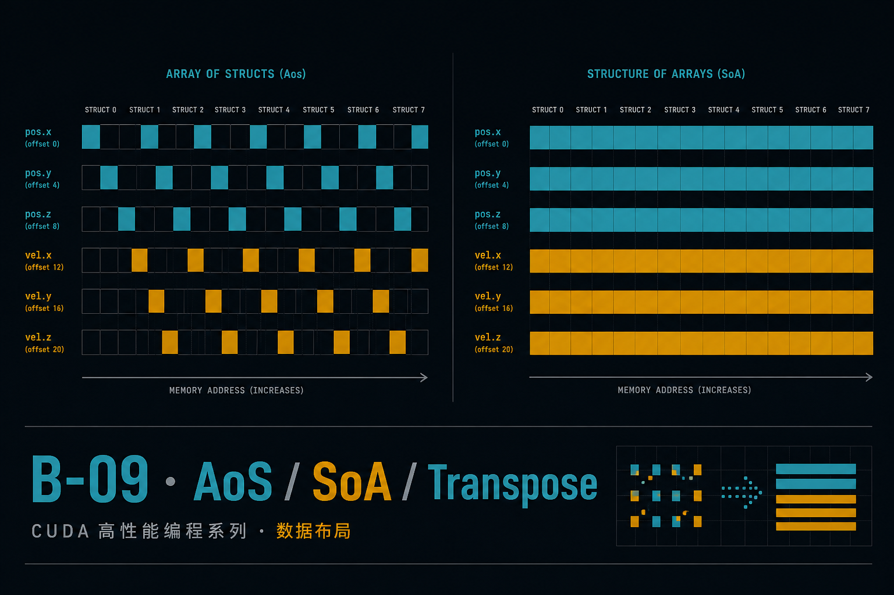
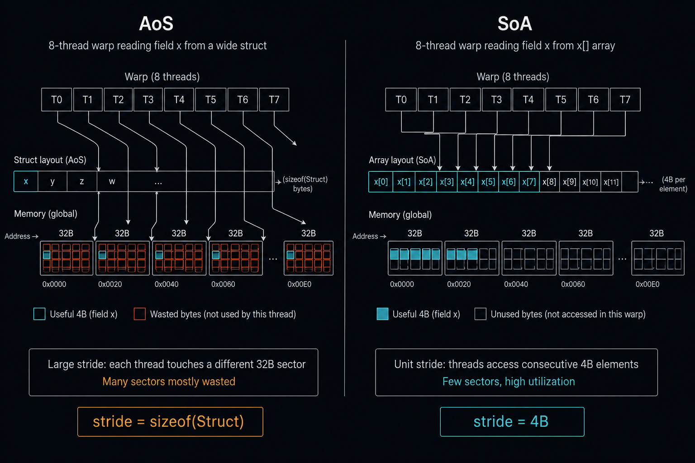
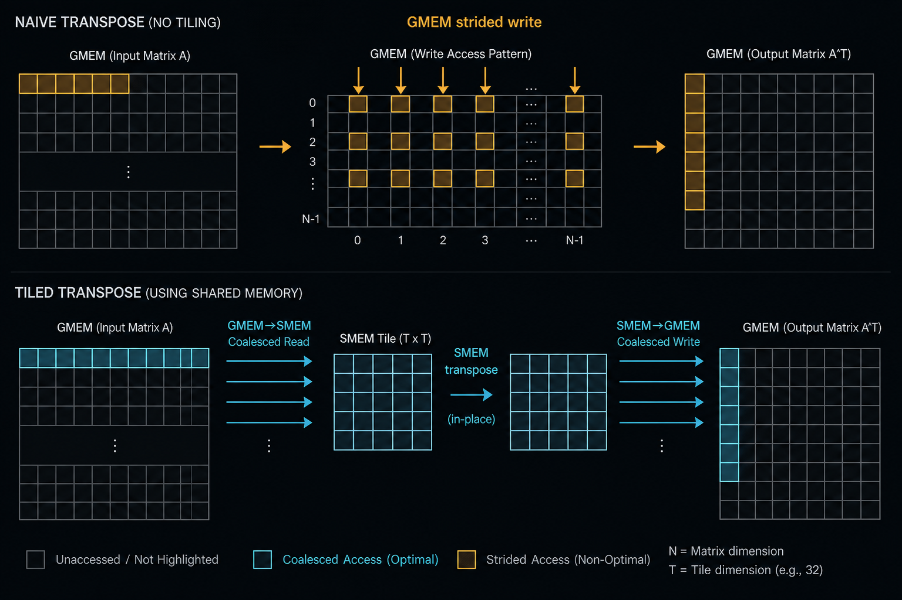
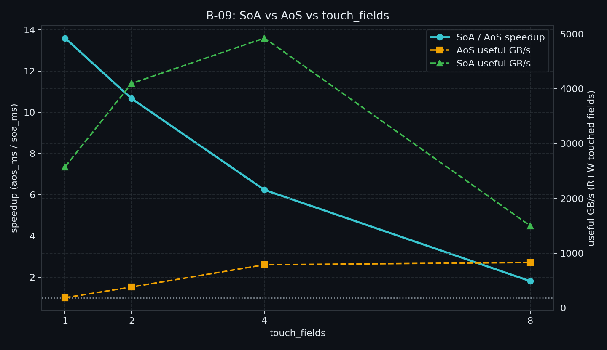
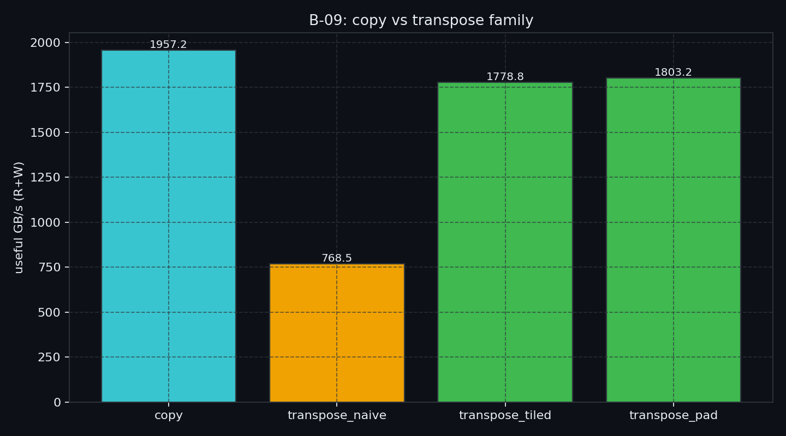

> B-08 证明：TMA 再强，也只是「怎么搬」。  
> 若从第一天就把字段交错成 AoS、或把该合并的写拆成跨步，引擎只能更高效地搬废字节。  
> 本章回到 **数据布局**：AoS↔SoA、以及 Transpose 这种「布局变换算子」——一次调整如何改变 sector 事务与有效带宽。

---

## B-09. 数据布局（AoS/SoA/Transpose）：一次布局调整带来的事务变化

## TL;DR（工程结论）

> 口径：RTX 5090 / `sm_120`，CUDA event **median**，useful payload GB/s。完整表见 [`docs/results/B-09_layout.md`](../../docs/results/B-09_layout.md)。

1. **布局决定事务形状**：同一逻辑读一个 `float`，AoS 常让 warp 打到多 sector；SoA 让相邻线程读相邻地址。CC≥6.0 按 **32B sector** 计数（Best Practices）。
2. **该换 SoA**：少字段热读时红利最大——本机 `touch_fields=1` 时 SoA 相对 AoS **~13.6×**（190 vs 2576 useful GB/s）。
3. **别盲目全量永久 SoA**：触达↑红利收窄——本机加速比 **13.6 → 10.7 → 6.2 → 1.80**（touch 1/2/4/8），`touch=8` 仍 SoA 更快但已近 2× 量级；热路径总整记录读写或宿主强绑 AoS 时先估转换成本。
4. **Transpose 用 SMEM tile**：本机 naive 仅 copy 的 **~39%**；tiled / pad 达 **~91% / ~92%**（pad 略优，挂钩 B-02 bank）。
5. **判停**：主看 useful GB/s 与加速比形状（可因 L2 高于 DRAM 标称——勿当总线利用率）；有 NCU 再看 `sectors/request`（理想 float 合并约 **4**）。

---

## 1. 问题：引擎之后，还卡在「第一天怎么排」

B-01 已讲清 sector / 合并物理；B-07/B-08 讲清怎么异步搬。本章只回答两件事——都是「布局决定事务」，只是时间点不同：

| 问题 | 本章交付 | 一句话 |
|---|---|---|
| 字段级访问该 AoS 还是 SoA？ | `aos` / `soa` + `touch_fields` 扫 | **怎么存**（长期布局） |
| 必须改行列布局时怎么付费？ | `copy` / `transpose_*` 对照 | **必须改存时怎么付费**（算子内 / 离线变换） |

边界（避免重讲）：

| 章节 | 已覆盖 | 本章不重复 |
|---|---|---|
| B-01 | sector、合并、向量化叙事 | 不重写「什么是合并」长教程 |
| B-02 | SMEM bank / padding | transpose pad 只挂钩一句 |
| B-08 | TMA / mbarrier | 不扫 AI、不写 descriptor |
| B-10 | Checklist 汇总 | 本章只产「布局症状→处方」原料 |



> 左：AoS，相邻线程的同一字段相隔 `sizeof(Struct)` → 多 sector。右：SoA，字段数组连续 → 少事务、高 useful/transferred。

---

## 2. 物理模型：stride 就是事务形状

记宽记录 `struct { float f[8]; }`（32B）。线程 `i` 读第 0 个字段：

```text
AoS:  &p[i].f[0]  → 地址 stride = 32B
      warp: 0,32,64,… → 往往 32×32B sector（若每线程各落一扇区）

SoA:  &x[i]       → 地址 stride = 4B
      warp: 连续 128B → 理想约 4×32B sector
```

工程含义：

- **少数字段热读**：AoS 每线程常各落一 32B sector；未用字段占满扇区 → useful/transferred 差。
- **触达字段↑**：同一 particle 的多字段落在**同一 32B sector** 里时，后续字段多半吃 L2/扇区复用，AoS 的 DRAM 惩罚被摊销 → 与 SoA 的差距**通常收窄**。这不是「AoS 变合并了」，墙钟仍可能 SoA 更快。
- 口径：**useful payload** = 触达字段的读+写字节；禁止用「整 struct 名义带宽」粉饰 AoS。
- 解读时：本机 `sweep` 的绝对 GB/s 受 L2 容量与热数据影响；**看加速比随 `touch_fields` 的形状**，勿和总线利用率混谈。

---

## 3. 决策表：何时换布局、何时做 Transpose

| 信号 | 建议 |
|---|---|
| 热循环按字段扫、每次只用 1～少数字段 | **SoA（或列式）作设备侧主布局** |
| 几乎总是整记录读写，且宿主 API 绑 AoS | 可暂留 AoS；或 **kernel 内局部转 SoA / views**（扩展阅读） |
| 算法需要行↔列（矩阵 / 卷积 im2col 类） | **算子内 tiled transpose**，或一次性离线转置后常驻 |
| NCU `sectors/request` 相对理想值明显偏高 | **先修布局 / 索引映射**，再谈 TMA / pipeline |
| 已 compute-bound，布局差被算力盖住 | 仍建议修布局（省功耗与给后续算子留余量），但别指望巨大墙钟加速 |

SoA ≠ 银弹：全量、频繁的 AoS↔SoA 转换本身吃带宽。转换有成本时，优先保证 **最热 kernel 的触达路径** 是合并友好的。

---

## 4. Transpose 处方：把跨步留在 SMEM



> 上：GMEM 读合、写跨步 → 带宽地板。下：GMEM→SMEM（合）→ tile 内转置 → SMEM→GMEM（合）。

| 配置 | 行为 | 期望 |
|---|---|---|
| `copy` | 同行读写 | 上限参照 |
| `transpose_naive` | 读合、写跨步 | 远低于 copy |
| `transpose_tiled` | SMEM 重排 | 接近 copy |
| `transpose_pad` | `tile[32][33]` | 消 bank；细节见 B-02 |

Harris 经典结论：合并全局访问是大头；pad 再补 bank。本章用同一叙事做 **可复现 binary**，不重讲 bank 全家桶。

---

## 5. 实验怎么设计

| 项 | 路径 |
|---|---|
| 代码 | `examples/02_memory_optim/09_layout_transform.cu` |
| 结果 | `docs/results/B-09_sweep.csv` / `B-09_modes.csv` / `B-09_layout.md` |
| 绘图 | `python scripts/plot_b09_layout.py` |

**一条主命令（布局主结论）**

```bash
./bin/02_memory_optim_09_layout_transform --mode sweep
```

**一条命令（transpose + 默认 touch=1 的 layout 全表）**

```bash
./bin/02_memory_optim_09_layout_transform --mode modes
```

| mode | 问题 |
|---|---|
| `aos` / `soa` | 固定 `touch_fields` 的 useful GB/s |
| `sweep` | `touch_fields∈{1,2,4,8}`：加速比是否随触达比例收窄 |
| `copy` / `transpose_*` | naive 地板 vs tiled/pad vs copy 天花板 |

证据优先级：CUDA event **median** → useful GB/s / 加速比；NCU sectors/request 可选旁证（**不要**把 ncu 附着时自打印 ms 当结论）。

```bash
DO_NCU=1 bash examples/02_memory_optim/09_profile_layout.sh ncu-only
```

### 5.1 本机实测（RTX 5090 / sm_120）

平台与完整表：[`docs/results/B-09_layout.md`](../../docs/results/B-09_layout.md)。重画：

```bash
python scripts/plot_b09_layout.py
```

**Touch-fields sweep（主结论）**

| touch_fields | aos_ms | soa_ms | aos GB/s | soa GB/s | SoA/AoS |
|---:|---:|---:|---:|---:|---:|
| 1 | 0.177 | 0.013 | 190 | 2576 | **13.59** |
| 2 | 0.175 | 0.016 | 384 | 4096 | **10.66** |
| 4 | 0.170 | 0.027 | 790 | 4923 | **6.23** |
| 8 | 0.323 | 0.179 | 832 | 1501 | **1.80** |



**Transpose vs copy（dim=4096；verify OK）**

| mode | median_ms | useful GB/s | vs copy |
|---|---:|---:|---:|
| copy | 0.069 | 1957 | 1.00× |
| transpose_naive | 0.175 | 768 | 0.39× |
| transpose_tiled | 0.075 | 1779 | 0.91× |
| transpose_pad | 0.074 | 1803 | 0.92× |



**怎么读**

1. 少字段：SoA **~13.6×**——布局红利最大。  
2. 触达↑：加速比收窄到 **~1.8×**，形状符合大纲假设，未要求回到 1。  
3. tiled/pad 逼近 copy；naive 是明确地板；pad 相对 tiled 的增量远小于 naive→tiled。  
4. SoA 在 touch=2/4 的极高 useful GB/s 含 L2 贡献——对比看加速比，勿当 HBM 总线打满。

---

## 6. 工程边界

- **硬件**：不限 sm_90+；合并是全架构问题。  
- **防 DCE**：字段更新必须写回 device 可见存储（示例对触达字段 `+1`）。  
- **AoS 实现陷阱**：禁止 `Particle local = p[i]; …; p[i]=local;` 这种整结构体赋值——编译器可能一次搬满 32B，**测不到**字段跨步。  
- **矩阵边长**：示例要求 `--dim` 为 32 的倍数（tile=32）。  
- **与 TMA**：描述符 swizzle / WGMMA 友好布局是 Module D 故事；本章只保证 GMEM 事务形状正确。

---

## 7. 扩展阅读（不抢后续 Module）

- Colfax, [Matrix Transpose in CUTLASS](https://research.colfax-intl.com/tutorial-matrix-transpose-in-cutlass/)（CuTe 抽象同一物理处方）  
- AoS→SoA + data views：[arXiv:2405.12507](https://arxiv.org/abs/2405.12507)、[arXiv:2512.05516](https://arxiv.org/abs/2512.05516)  
- 注解驱动布局变换（CPE’25）：[DOI:10.1002/cpe.70199](https://doi.org/10.1002/cpe.70199)  
- DynaSOAr 机制段：[arXiv:1810.11765](https://arxiv.org/abs/1810.11765)  
- 下一章 **B-10**：把 B-01～B-09 收成「症状 → 证据 → 处方」一页 Checklist

---

## 8. 工程 SOP 与常见误区

**建议流程**

1. 用 `--mode sweep` 看 SoA/AoS 是否随 `touch_fields` 收窄  
2. 低 touch 且加速比明显 >1 → 设备侧主路径改 SoA（或列式）  
3. 需要行列变换 → `--mode modes` 看 tiled/pad 是否接近 copy  
4. 有 NCU：对比 aos vs soa 的 sectors/request；修布局优先于上 TMA  
5. 汇总进 B-10 checklist

**判停**

- `touch=1` 仍 SoA≈AoS → 查是否整 struct 赋值、L2 是否把工作集盖住（可加大 `--n`）、N 是否过小  
- tiled 远低于 copy → 查 dim 对齐、bank（试 `transpose_pad`）、是否误用 naive 索引  
- 正确性检查失败 → 先修下标 / tile 映射，再看带宽  
- 只有转换成本、没有热路径收益 → 别为 SoA 而 SoA

**高频误区**

1. 把 Host AoS API 便利性直接当成 Device 最优布局  
2. 用「名义 GB/s」（含未触达字段）为 AoS 辩护  
3. 整 struct 读写却声称在测「单字段跨步」  
4. 上了 TMA/pipeline 却不修跨步写（B-08 误区⑦的落地版）  
5. 把 SMEM bank 教程复读一遍却不报 copy 对照

---

## 9. 小结与下一章

三句话：

1. **少字段热读 → SoA**；用 `sweep` 看红利何时收窄。  
2. **Transpose 用 SMEM tile**，目标是逼近 copy，不是「换个下标」。  
3. **布局先于引擎**：B-08 搬得再好，也救不了第一天选错的 stride。

下一章 **B-10** 做 Module B Checklist：从症状到证据到处方的统一表。

---

## 10. 参考文献

**官方文档**

1. [CUDA C++ Best Practices Guide — Coalesced Access to Global Memory](https://docs.nvidia.com/cuda/cuda-c-best-practices-guide/)  
2. [CUDA Programming Guide — Writing CUDA SIMT Kernels](https://docs.nvidia.com/cuda/cuda-programming-guide/02-basics/writing-cuda-kernels.html)（Coalesced Global Memory）  
3. [Nsight Compute — Compute Triage Guide](https://docs.nvidia.com/nsight-compute/ComputeTriage/index.html)（sectors/request）

**工程教程**

4. Mark Harris, [An Efficient Matrix Transpose in CUDA C/C++](https://developer.nvidia.com/blog/efficient-matrix-transpose-cuda-cc/)  
5. Colfax, [Tutorial: Matrix Transpose in CUTLASS](https://research.colfax-intl.com/tutorial-matrix-transpose-in-cutlass/)  
6. Semih Güreşçi, [GPU Memory: AoS vs SoA](https://semihguresci.com/blog/gpu-memory-access-benchmark-experiment-06-aos-vs-soa/)（文献形状；非本机绝对数）

**实证 / 前沿**

7. AoS→SoA + views：[arXiv:2405.12507](https://arxiv.org/abs/2405.12507)；扩展 [arXiv:2512.05516](https://arxiv.org/abs/2512.05516)  
8. DynaSOAr：[arXiv:1810.11765](https://arxiv.org/abs/1810.11765)  
9. Eberhardt et al., GPUDrano（CAV’17）  
10. Annotation-guided AoS→SoA（CPE’25）：[DOI:10.1002/cpe.70199](https://doi.org/10.1002/cpe.70199)
