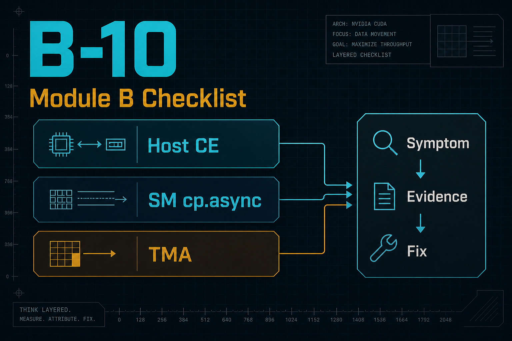
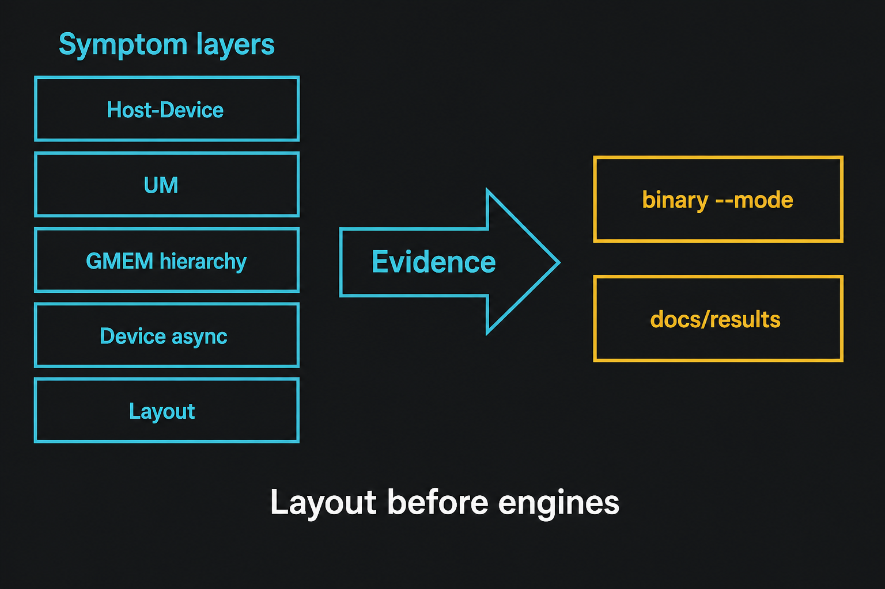

> B-09 把「布局决定事务」钉成可复现数字。  
> Module B 读完仍常卡在两件事：**我到底是哪类症状？** 以及 **证据在哪个 binary？**  
> 本章不新开 micro-bench：先给「认出症状」的分流，再给「症状 → 证据 → 处方」总表（§4），回链 B-01～B-09。

**配套可复现**：[Yapeng-Gao/AI-System-Performance-Lab](https://github.com/Yapeng-Gao/AI-System-Performance-Lab)（文章 + `.cu` + 实测表）。有用请 Star。 本章无独立 `.cu`（Checklist）；见仓库 `docs/results/`。

---

## B-10. Module B Checklist：从「症状」到「证据」到「处方」

## TL;DR（工程结论）

> 数字为 RTX 5090 / `sm_120` 各章已落盘形状（CUDA event **median**）；完整表见 [`docs/results/B-10_checklist.md`](../../docs/results/B-10_checklist.md)。带宽章绝对 GB/s 可能含 **L2**——**主看加速比/相对形状**。

1. **先认出症状层，再选证据，勿一上来换 API**：用 §2 的「时间花在哪 → SOL 分流 → 观察速查」定层；层错了处方必废。
2. **每条处方挂证据入口**：`examples/02_memory_optim/0N_*.cu --mode …` +（若有）`docs/results/B-0N_*`；主证据 = 裸跑 event median，**禁止** ncu 附着墙钟。
3. **三层 Async 分清**：B-06 Host CE ≠ B-07 SM `cp.async`/`pipeline` ≠ B-08 TMA bulk。
4. **布局先于引擎**：sectors/request 偏高或 useful 形状异常 → 先 B-09/B-01（本机 touch=1：SoA/AoS ≈ **13.6×**）。
5. **Checklist 是导航**：判停看「能否复现该章形状」，细节回链各章正文（同目录 `B-0N*.md`）。

---

## 1. 问题：有处方表，仍对不上号

各章都有决策表，但排查时常卡在更前面一步——**还不知道自己是表里哪一行**。

| 交付 | 说明 |
|---|---|
| **认出症状** | §2：无 profiler 自问 → NSYS 时间线 → NCU SOL → 观察速查 |
| **对上处方** | §4：症状 → 证据 → 处方 → 回链 |
| **防混层** | §5：三层 Async + 布局 vs 引擎 |
| **索引** | §6 + `docs/results/B-10_checklist.md` |

| 边界 | 本章做 | 本章不做 |
|---|---|---|
| B-01～B-09 | 汇总 + 回链本机形状 | 不重讲机制、不重跑全家桶 |
| Module C | 一句钩子 | 不写 warp / atomics / Graph |



> 左：症状层。中：证据（`binary --mode` / `docs/results`）。底线：**布局先于引擎**。

---

## 2. 如何认出自己的症状

目标不是一次量对所有指标，而是 **用最少步骤锁到 §4 的一行**。顺序固定：

```text
端到端墙钟 → 时间主要在 Host/UM 还是 Kernel？
        │
        ├─ Host / 拷贝 / UM 迁移占主导 → §2.1～2.2（先别开 NCU 抠 kernel）
        └─ Kernel 占主导             → §2.3 NCU SOL → §2.4 观察速查 → §4 对应行
```

### 2.1 两分钟自问（还没开 profiler）

按顺序回答；**第一个「是」** 就进该层，不要并行猜 API。

| # | 自问 | 「是」→ 先看症状层 | 进 §4 行 |
|---|---|---|---|
| 1 | 热路径大量 `cudaMallocManaged` / 跨进程共享 managed，且冷启动或尾延迟差？ | UM | UM 冷启动 / 迁移风暴 |
| 2 | 端到端里 H2D/D2H 很重，或写了 `MemcpyAsync`+多 stream 仍像串行？ | Host↔Device | 伪异步 / 伪 overlap |
| 3 | Kernel 慢，且数据是宽 struct / 少字段扫描 / 行列转置？ | 布局 | 布局 / 跨步写 |
| 4 | 已用 SMEM tiling，但改访问下标或 pad 前后差很大？ | SMEM | bank 冲突 |
| 5 | `-Xptxas=-v` 已见 spill，或刚加 `__launch_bounds__` 后暴跌？ | Reg | spill / Occupancy 误判 |
| 6 | 明确有可复用热点，却在试 L2 persisting / 结果飘？ | L2 | L2 驻留误用 |
| 7 | 低算术强度、GMEM→SMEM 搬运显眼，已在试 async/TMA？ | 设备内 async | B-07 / B-08（先分清层） |
| 8 | 以上都弱，但有效带宽差、访问跨步？ | GMEM | 合并差 |

不确定时：**先用秒表把「拷贝时间」和「kernel 时间」拆开**（两次 event 或一次 NSYS），不要直接上 TMA。

### 2.2 有 NSYS：先看时间花在哪

| 时间线主要看见 | 症状层倾向 | 下一步 |
|---|---|---|
| H2D/D2H 很长，kernel 很短；或 memcpy 与 compute 首尾相接无重叠 | Host↔Device | §4 Host 行 → B-06 |
| Kernel 期间大量 page migrate / fault；首轮远慢于稳态 | UM | §4 UM 行 → B-05 |
| Kernel 占墙钟大头，拷贝可忽略 | 设备内 | §2.3 NCU，勿在 Host 层打转 |

Overlap / UM 是否成立，**以时间线为准**，不以函数名带不带 Async 为准。

### 2.3 有 NCU：SOL 分流后再对行

只在 **kernel 已是主因** 时用。看 Speed of Light（见 §11-2）：

| SOL 粗分 | 含义 | Module B 里优先怀疑 |
|---|---|---|
| Memory ≫ Compute | 喂不饱或事务浪费 | 布局 / 合并 / bank / 有效带宽（B-09→B-01→B-02） |
| Compute ≫ Memory | 算力或短依赖墙 | 少碰拷贝引擎；spill/Occupancy（B-03）；async 常不赚（B-07/B-08） |
| 双低（latency 风险） | 发不出足够 outstanding 工作 | 低 AI 可试 pipeline（B-07）；立刻 wait 的 async/TMA 常无效 |
| 双高 | 已近硬件墙 | 换算法/融合留给后续 Module；本表处方收益有限 |

Memory 侧再一眼：`sectors/request` 相对理想偏高（float 合并常看 ~4）→ **先布局/合并，再引擎**。

### 2.4 观察 → §4 行（速查）

把「我看见的现象」映射到主表；仍迷糊就从上到下试，**一次只验证一行**。

| 我看见… | 先对 §4 症状行 | 最小验证 |
|---|---|---|
| pageable 缓冲 + Async；NSYS 无 overlap | Host 伪异步 / 伪 overlap | `06_pinned_dma`：`pageable` vs `pinned` / `overlap` |
| managed；first ≫ median；或 migrate 风暴 | UM | `05_*`：`fault` vs `prefetch` |
| 少字段扫 particle/vertex；或 NCU sec/req≈32 | 布局 | `09_* --mode sweep`（本机 touch=1 ~13.6×） |
| SMEM tile 改 stride/pad 吞吐跳变 | SMEM bank | `02_*` pad/swizzle |
| ptxas spill↑ 且热循环变慢 | Reg spill | `03_*` + `-Xptxas=-v` |
| 开了 persisting 但 DRAM 未降 / 忘记 reset | L2 | `04_*` 三件套 |
| 低 AI；`async1` 不比 sync 快 | 设备内 copy | `07_*`：`sync`/`async1`/`pipe2`/`sweep` |
| 大 tile；立刻 wait 的 TMA≈1× | TMA 指令税 | `08_* --mode sweep`（sm_90+） |
| 跨步明显但非 AoS 故事 | GMEM 合并 | `01_*` + sectors |

锁到一行后，才进入 §4 的证据与处方。

---

## 3. Triage 闭环（定层之后）

```text
1. 用 §2 锁到症状行（不要跳步换 API）
2. 开该行 binary，看 event median 是否同向
3. 需要时间线 → NSYS；需要事务形状 → NCU sectors（旁证）
4. 按处方只改一处 → 同一入口回归
5. 形状对上 → 停；对不上 → 回 §2 换层，勿叠 API
```

主证据 = 裸跑 CUDA event；ncu/nsys/SASS = 旁证。

---

## 4. 症状 → 证据 → 处方（主表）

正文回链：同目录 `B-0N*.md`（勿依赖 URL 编码）。结果链如下。

| 症状层 | 典型信号 | 证据入口 | 处方（一句话） | 章 |
|---|---|---|---|---|
| Host↔Device 伪异步 / 伪 overlap | pageable + `MemcpyAsync`；单流；远低于 pinned | `06_pinned_dma`：`pageable`/`pinned`/`serial`/`overlap`；[结果](../../docs/results/B-06_pinned_dma_rtx5090.md) | pinned + 多非默认 stream；成功≈贴单向 pinned（~52 GB/s） | B-06 |
| UM 冷启动 / 迁移风暴 | first 与 steady 差大；fault 时间线；多 GPU ping-pong | `05_unified_memory_pf`：`fault`/`prefetch`/`advise`；[结果](../../docs/results/B-05_unified_memory.md) | 先 prefetch+同步；advise 是 hint；多 GPU 可写默认弃 UM | B-05 |
| GMEM 合并差 / 有效带宽低 | 跨步；sectors/request 偏高；未向量化 | `01_global_mem_bandwidth`；NCU Memory / sectors | 合并 + 向量化；大 tile 再谈 TMA | B-01 |
| SMEM bank 冲突 | 同 bank 多路；tile/transpose 掉速 | `02_shared_mem_bank_conflict`；pad/swizzle | padding / swizzle；transpose 用 `TILE+1` | B-02 |
| 寄存器 spill / Occupancy 误判 | ptxas spill↑；盲目追 Occupancy | `03_register_spill`；`-Xptxas=-v` | 先看 spill 是否在 hot path；Occupancy 非 KPI | B-03 |
| L2 热点未驻留 / 误用 persisting | streaming 却开 residency；忘记 reset | `04_l2_residency`；time+DRAM+L2 三件套 | 有热点才 residency；扫 set-aside×hitRatio；必 reset | B-04 |
| 设备内 copy 延迟藏不住 | 低 AI 仍 sync；async 立刻 wait | `07_cp_async_pipeline`：`sync`/`async1`/`pipe2`/`sweep`；[结果](../../docs/results/B-07_cp_async_pipeline.md) | 低 AI → thread-local `pipe2`（~1.15–1.31×）；高 AI 停 | B-07 |
| 大 tile / 多维搬运指令税 | pipeline 已够或不够；立刻 wait 的 TMA | `08_tma_intro`（**sm_90+**）：`sweep`；[结果](../../docs/results/B-08_tma.md) | 先证明 overlap 段>1 再上 TMA；立刻 wait 常不赚（~0.86–1.05×） | B-08 |
| 布局 / 跨步写自杀 | 少字段扫 AoS；naive transpose | `09_layout_transform`：`sweep`/`transpose_*`；[结果](../../docs/results/B-09_layout.md) | 少字段→SoA；transpose→SMEM tile（tiled≈copy **91%**；naive≈**39%**） | B-09 |

---

## 5. 防混层：两张小表

### 5.1 三层 Async

| 层 | 路径 | 章 | 成功长什么样 |
|---|---|---|---|
| Host CE | H2D/D2H DMA | B-06 | 时间线真 overlap；吞吐贴 pinned 上限 |
| SM `cp.async` / pipeline | GMEM→SMEM | B-07 | 低 AI 加速比>1；`async1` 立刻 wait 可更慢 |
| TMA bulk | 专用引擎 GMEM↔SMEM | B-08 | 引擎∥compute（prefetch）；立刻 wait 常 ≤1 |

### 5.2 布局 vs 引擎

| 信号 | 先做 | 后做 |
|---|---|---|
| sectors/request 相对理想偏高（float 合并常看 ~4） | B-09 / B-01 | B-07 / B-08 |
| useful GB/s 差但合并已好、低 AI | B-07 intensity `sweep` | 仍不够再 B-08（sm_90+） |
| Host 侧伪异步 | B-06（与设备内 async **无关**） | — |

本机锚点（索引，非本章新测）：B-09 touch=1 SoA/AoS **~13.6×**，NCU AoS **32** vs SoA **4** sec/req；B-07 高 AI → `pipe2`≤1；B-08 `pipe2` 低 AI 才明显赚。

---

## 6. 证据落点索引

完整一页：[`docs/results/B-10_checklist.md`](../../docs/results/B-10_checklist.md)。

| 章 | Binary（`build/bin/` 或等价） | 建议主命令 | 结果 / 图 |
|---|---|---|---|
| B-01 | `02_memory_optim_01_global_mem_bandwidth` | `--mode modes` | `docs/results/B-01_*` |
| B-02 | `02_memory_optim_02_shared_mem_bank_conflict` | `--mode modes` | `docs/results/B-02_*` |
| B-03 | `02_memory_optim_03_register_spill` | 章内 + `-Xptxas=-v` | 正文 |
| B-04 | `02_memory_optim_04_l2_residency` | 章内 mode | 正文 |
| B-05 | `02_memory_optim_05_unified_memory_pf` | `fault` / profile 脚本 | `docs/results/B-05_*` |
| B-06 | `02_memory_optim_06_pinned_dma` | `modes` / `overlap` | `docs/results/B-06_*` |
| B-07 | `02_memory_optim_07_cp_async_pipeline` | `--mode sweep` | `docs/results/B-07_*` |
| B-08 | `02_memory_optim_08_tma_intro` | `--mode sweep`（sm_90+） | `docs/results/B-08_*` |
| B-09 | `02_memory_optim_09_layout_transform` | `--mode sweep` | `docs/results/B-09_*` |

证据优先级：event median →（可选）NSYS →（可选）NCU →（可选）SASS。

---

## 7. 工程边界

- **本章无新 `.cu`、无新主结论 CSV**；数字全部回链已发布章。
- **硬件**：总表不限架构；B-08 行继承 **sm_90+**。
- **口径**：禁止 ncu 附着程序自打印 ms/GB/s；带宽看加速比形状。
- **与 Module C**：访存收束于此；并发原语另开模块。

---

## 8. 扩展阅读（不抢后续 Module）

- GPU MODE Lecture 8 结构参考：[CUDA Performance Checklist](https://christianjmills.com/posts/cuda-mode-notes/lecture-008/)（数字以本仓库为准）  
- 官方分流与 async 语义：见 §11-2、§11-3  
- 下一站 **Module C**：Warp / CG / Atomics / Fusion / Graph（[`Module-C.md`](../../docs/CUDA专栏大纲/Module-C.md)）——不重开 coalescing / TMA 教程  

各章机制细目回对应章 §10，此处不重复抄表。

---

## 9. SOP 与常见误区

**建议流程**

1. **先 §2 认出症状行**（自问 → NSYS → SOL → 观察速查），不要跳过定层直接换 API  
2. 打开 §4 对应行的 binary，只跑表内 mode  
3. 对照 `docs/results`（或章内表）看形状是否同向  
4. 按处方改**一处**，同一入口回归  
5. Host 问题勿用设备 async「补救」；布局问题勿先上 TMA  
6. 形状已对齐或加速比→1 → **停**

**判停**

- 证据入口复现不了该章形状 → 查口径（payload / median / 是否 ncu 附着）与问题规模  
- 换了 API 但层没对 → 回 §2 / §5  
- 只有转换成本、没有热路径收益 → 别为 SoA / pipeline / TMA 而上  
- §2 多行同时像 → **先拆墙钟**（Host vs Kernel），再进 NCU

**高频误区**

1. 还没定层就换 API（最常见）  
2. 把 Host `cudaMemcpyAsync`、`cuda::memcpy_async`、TMA 当成同一层  
3. 写了 async 却立刻 wait，以为已经流水线化  
4. sectors/request 爆炸却先换拷贝引擎  
5. 用 ncu 附着墙钟写进结论  
6. 把 Occupancy / L2 hit rate / 绝对 GB/s 当唯一 KPI  
7. 多 GPU 可写场景死撑 UM  
8. Checklist 当新理论，不回链证据就改生产代码

---

## 10. 小结与下一章

三句话：

1. **先认出症状（§2），再对处方（§4）**；API 名字不是诊断。  
2. **三层 Async 分清；布局先于引擎**。  
3. **Module B 到此收束**；细节在 B-01～B-09，证据在 `examples/` + `docs/results/`。

下一模块 **Module C** 从 Warp 原语与并发控制起笔，不再重开访存教程。

---

## 11. 参考文献

**官方 / 工具**

1. [CUDA C++ Best Practices Guide](https://docs.nvidia.com/cuda/cuda-c-best-practices-guide/)（Pinned / Coalescing / Shared / Local）  
2. [Nsight Compute Profiling Guide](https://docs.nvidia.com/nsight-compute/ProfilingGuide/)（Speed of Light / Memory；Triage 镜像若 404 以此为准）  
3. [CUDA Programming Guide — Asynchronous Data Copies](https://docs.nvidia.com/cuda/cuda-programming-guide/04-special-topics/async-copies.html) · [Pipelines](https://docs.nvidia.com/cuda/cuda-programming-guide/04-special-topics/pipelines.html)  
4. [Nsight Systems User Guide](https://docs.nvidia.com/nsight-systems/UserGuide/index.html)

**工程 / 实证**

5. GPU MODE Lecture 8 笔记：[CUDA Performance Checklist](https://christianjmills.com/posts/cuda-mode-notes/lecture-008/)（结构参考；数字以本仓库为准）  
6. Svedin et al., *Benchmarking the Nvidia GPU Lineage…*：[arXiv:2106.04979](https://arxiv.org/abs/2106.04979)（低 AI async 受益、高 AI 可 ≤1）  
7. Li et al., *Performance Implications of Async Memcpy and UVM…*，IISWC’23：[DOI:10.1109/IISWC59245.2023.00024](https://doi.org/10.1109/iiswc59245.2023.00024)（[PDF](https://lca.ece.utexas.edu/pubs/Li_IISWC_2023.pdf)）；扩展 TACO’25：[DOI:10.1145/3746231](https://doi.org/10.1145/3746231)

**本仓库各章 §10**：机制级链接见 B-01～B-09，本章不重复整表。
---

> 本文配套代码与实测：[AI-System-Performance-Lab](https://github.com/Yapeng-Gao/AI-System-Performance-Lab)。觉得有用请 Star，后续章更新更好找。
