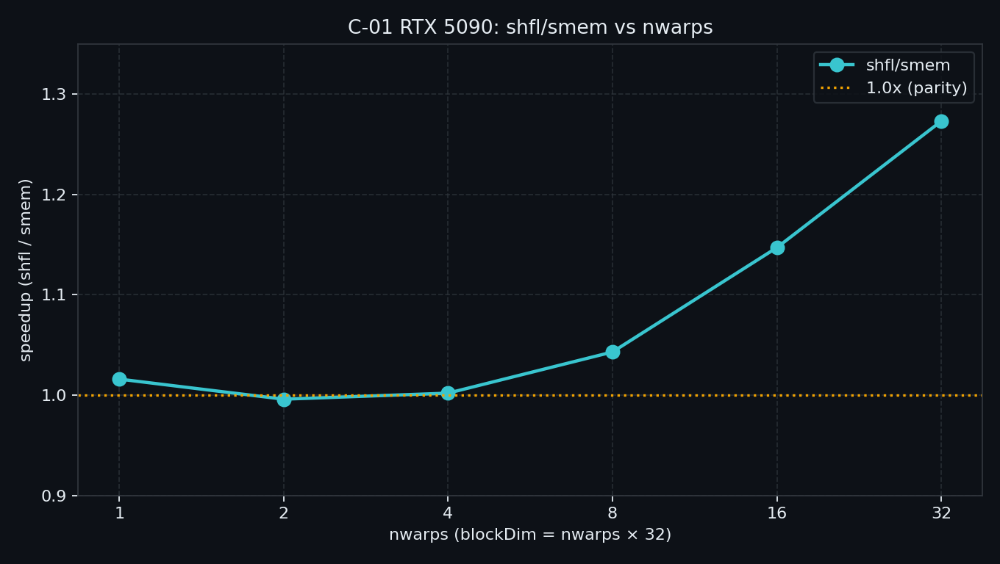

> B-10 把访存症状收成 Checklist。  
> 访存会了，热路径还常卡在：**同 warp 里怎么正确、便宜地交换数据**。  
> Module C 从这里起笔：一条 reduce micro-bench，钉死 `*_sync` mask、shfl vs SMEM、以及 Ampere+ 整数硬件 reduce 的边界。

---

## C-01. Warp Primitives：寄存器级通信、mask 正确性与规约加速比

## TL;DR（工程结论）

> 口径：RTX 5090 / `sm_120`，CUDA event **median**。完整表见 [`docs/results/C-01_warp_primitives.md`](../../docs/results/C-01_warp_primitives.md)。

1. **Warp 原语 = 寄存器总线**：`__shfl_*_sync` 省掉「STS → bar → LDS」；赚的是更少指令 + 更少 SMEM 压力，不是「比寄存器还快」。
2. **必须用 `*_sync` + 显式 mask**（Volta+）：legacy `__shfl` 不安全；**不要**把 `__activemask()` 当规范参与集合。
3. **本机主曲线（诚实）**：GMEM 主导时 shfl≈smem（nwarps≤4：**~1.00×**）；block 变大后 SMEM 树变贵，**nwarps=16 → 1.15×，32 → 1.27×**。别用数倍级预期硬套本 microbench。
4. **Ampere+ 整数硬件 reduce**：本机 `redux` vs `shfl_i` ≈ **1.06×**；**不支持 float**——浮点仍走 shfl。
5. **判停**：裸跑看 `shfl/smem` 随 nwarps 形状；NCU（nwarps=32）shfl 的 `inst_executed`≈smem 的 **0.58×**、shared wavefront≈**0.22×**——**禁止**把 ncu 附着墙钟当结论。

---

## 1. 问题：访存收束之后，协作从哪一层开始

| 问题 | 本章交付 |
|---|---|
| 同 warp 如何交换寄存器？ | Shuffle / Vote /（sm_80+）Reduce |
| mask 怎么写才安全？ | 决策表 + 误区清单 |
| block 规约怎么少用 SMEM？ | `smem` vs `shfl` micro-bench |
| 整数能否一条指令规约？ | `redux` 定点（sm_80+） |

边界：

| 章节 | 已覆盖 | 本章不重复 |
|---|---|---|
| A-03 / A-04 | Warp 映射、SIMT、Divergence | 不重讲「什么是 warp / 为何 divergence 贵」 |
| B-02 | SMEM bank | naive SMEM 基线只挂钩一句 |
| B-10 | 访存 Checklist | 不重开 coalescing / TMA |
| C-02（下） | Cooperative Groups | 不用 `cg::reduce` 作主线 |
| C-03（下） | Atomics 争用 | ballot 只给聚合入口形态 |
| Module D | DeviceReduce / Softmax | 不做多 block 全局规约 |


> 左：写共享 → `__syncthreads` → 再读（跨线程交换的经典路径）。右：`__shfl_down_sync` 寄存器直连。Block 级规约仍可能用少量 SMEM 收每 warp 一份部分和（见 §4）。

---

## 2. 物理模型：锁步假设已死，寄存器总线还在

A-04 写过：Volta+ **Independent Thread Scheduling** 下，不能再赌「同 warp 永远隐式同步」。协作要拆成两件事：

```text
通信（便宜）：  lane A 寄存器 ──SHFL──► lane B 寄存器
同步（显式）：  参与集合 = mask；集体调用必须 *_sync
```

| 路径 | 典型代价 | 适用 |
|---|---|---|
| SMEM：STS → `__syncthreads` → LDS | 指令多；吃 SMEM/bank | block 内跨 warp |
| SHFL：一条 shuffle | 延迟介于寄存器与 SMEM 之间（文献 microbench） | **同 warp** |
| `__reduce_*_sync`（sm_80+） | 单指令集体（整型） | warp 内 int 规约 |

Shuffle 不是免费午餐；但若整棵 SMEM 树只为 warp 内交换服务，通常更亏。跨 warp 仍要 SMEM（或更上层原语）。本章 block 处方是 **warp 内 shfl + 每 warp 一份 SMEM**，不是宣称「零共享」。

---

## 3. API 分层与 mask 纪律

本章会用到的层：

| 层 | 代表 | 作用 |
|---|---|---|
| **Vote** | `__ballot_sync` / `any` / `all` | 谓词 → 32-bit 掩码 |
| **Shuffle** | `__shfl_down_sync` 等 | 寄存器交换；规约/扫描/广播 |
| **Reduce（硬件）** | `__reduce_add_sync` … | sm_80+；32-bit 整型 |
| Match | `__match_*_sync` | 扩展；正文不展开 |

**mask 怎么写**

| 做法 | 裁决 |
|---|---|
| 全 warp 收敛集体（本章 reduce 主路径） | `0xffffffff`，且保证 32 lane 都执行该 intrinsic |
| 子集参与（发散后的聚合） | **用程序逻辑算出**参与位；可用 `ballot` 辅助 |
| 把 `__activemask()` 直接当集体 mask | **不要**——那是「此刻碰巧收敛」的快照，不是规范参与集合 |
| 继续用 legacy `__shfl` / `__ballot` | **不要**（Volta+） |

mask 细则见 §10。C-02 再用 Cooperative Groups 把分组写得更可读；本章先把 intrinsic 钉死。

---

## 4. 决策表与规约处方

| 信号 | 建议 |
|---|---|
| 热路径是 **warp 内** sum/min/max/broadcast | **`__shfl_*_sync` 树**（float/通用） |
| 同上，且类型是 **32-bit int**，设备 ≥ sm_80 | 优先试 **`__reduce_*_sync`**，再与 shfl-int 对照 |
| 需要 block 结果 | warp reduce → SMEM 写每 warp 一份 → 首 warp 再 reduce（本章模式） |
| 需要整 device 结果 / 数值稳定 Softmax | **Module D**；本章停 |
| 想少写 mask、要 tile/coalesced 抽象 | **C-02 Cooperative Groups** |
| 大量 atomic 撞同一地址 | 先 ballot/elect 聚合入口 → **C-03** 深挖 contention |

**处方（与示例同构）**

```text
每线程 grid-stride 局部累加
        │
        ├─ smem：整棵树在 SMEM + __syncthreads
        └─ shfl：warp 内 shfl 树 → lane0 写 warp_sums[wid]
                 → __syncthreads → 首 warp 再 shfl
```

Scan（前缀和）与 reduce 同构（常用 `shfl_up`）；首版示例不单独 mode，完整算子级 scan 留给 Module D。

---

## 5. 实验怎么设计

| 项 | 路径 |
|---|---|
| 代码 | `examples/03_compute_primitives/01_warp_primitives.cu` |
| 结果 | [`docs/results/C-01_warp_primitives.md`](../../docs/results/C-01_warp_primitives.md) · `C-01_sweep.csv` / `C-01_modes.csv` |
| 绘图 | `python scripts/plot_c01_warp_primitives.py` |

**一条主命令（主结论）**

```bash
./bin/03_compute_primitives_01_warp_primitives --mode sweep
```

**定点全表（redux / ballot）**

```bash
./bin/03_compute_primitives_01_warp_primitives --mode modes
```

| mode | 问题 | 进主结论？ |
|---|---|---|
| `smem` / `shfl` | 定点时延 | 对照 |
| `sweep` | `nwarps∈{1,2,4,8,16,32}` 的 `shfl/smem` | **主曲线** |
| `redux` | int：`__reduce_add_sync` vs shfl-int（sm_80+） | 定点表 |
| `ballot` | `__ballot_sync` + 每 warp lane0 累加奇数个数（聚合写回形态） | 定点表 |
| `modes` | 上面定点一次跑齐 | 写结果用 |

证据优先级：CUDA event **median** → 加速比；正确性失败非零退出；NCU/SASS **可选**，默认不加 profile shell。

### 5.1 本机实测（RTX 5090 / sm_120）

平台与完整表：[`docs/results/C-01_warp_primitives.md`](../../docs/results/C-01_warp_primitives.md)。重画：

```bash
python scripts/plot_c01_warp_primitives.py
```

**Sweep（主结论）**

| nwarps | smem_ms | shfl_ms | shfl/smem |
|---:|---:|---:|---:|
| 1 | 0.0283 | 0.0278 | **1.016** |
| 2 | 0.0215 | 0.0216 | **0.996** |
| 4 | 0.0209 | 0.0209 | **1.002** |
| 8 | 0.0248 | 0.0238 | **1.043** |
| 16 | 0.0240 | 0.0209 | **1.147** |
| 32 | 0.0304 | 0.0239 | **1.273** |



**Modes 定点（nwarps=8）**

| tag | median_ms | 相对 |
|---|---:|---|
| smem / shfl | 0.0232 / 0.0220 | shfl/smem **1.054×** |
| shfl_i / redux | 0.0225 / 0.0213 | redux/shfl_i **1.055×** |
| ballot | 0.0252 | verify OK（odd=8388608） |

**怎么读**

1. **小 block（≤4 warps）≈持平**：16M 元素 grid-stride 读 GMEM，规约方式几乎不进墙钟。  
2. **大 block 才露出 shfl**：16→1.15×，32→1.27×——SMEM 树的同步/共享往返变贵。  
3. **redux ~1.06×**：有，但别当数量级故事；float 仍无硬件 reduce。  
4. 文献应用侧 1.2～2×（IPDPS’17）是通信密集内核形状；**本机主结论用上表，不硬对齐论文绝对数。**

### 5.2 旁证（NCU，RTX 5090 / nwarps=32）

```bash
DO_NCU=1 bash examples/03_compute_primitives/01_profile_warp.sh ncu-only
```

完整表：[`docs/results/C-01_warp_primitives.md`](../../docs/results/C-01_warp_primitives.md)。**忽略**附着墙钟 ms。

| Metric | smem | shfl | shfl/smem |
|---|---:|---:|---:|
| `inst_executed` | 9.70M | 5.63M | **0.58** |
| shared wavefronts | 1.41M | 0.31M | **0.22** |
| shared_ld | 99 280 | 1 360 | **0.014** |
| barrier stall | 75.2M | 48.2M | **0.64** |

| Metric | shfl_int | redux | 备注 |
|---|---:|---:|---|
| `inst_executed` | 5.76M | 5.79M | 整 kernel ≈持平（GMEM 主导） |
| shared wavefronts | 0.31M | 0.09M | redux 更低 |

**怎么读**：NCU 证明大 block 上 shfl 少指令、少 SMEM；与裸跑 **1.27×** 同向。redux 的墙钟故事仍以裸跑 ~1.06× 为准，不要拿 replay 后的 ms 横比。

---

## 6. 工程边界

| 项 | 说明 |
|---|---|
| 硬件 | Shuffle/Vote：全架构常用路径；`__reduce_*_sync`：**sm_80+** |
| 类型 | 硬件 reduce：**32-bit 有符号/无符号整型**（及文档列出的 bit 逻辑）；float → shfl / 库 |
| 正确性 | 示例对 partial 求和与 host 参考比对；改 kernel 勿去掉写回 |
| SMEM | shfl 路径仍为每 block 预留最多 32 个 warp 部分和；不是「零共享」神话 |
| 与 B | 规约前后的 GMEM 加载仍要合并友好——症状像带宽时先回 B-10 |
| 与 D | 多 block / 多 kernel 全局规约、Softmax 数值稳定 → Module D |

---

## 7. 扩展阅读（不抢后续章）

| 想继续 | 去向 |
|---|---|
| 少写 mask、tile/coalesced 集体 | **C-02** Cooperative Groups（见 Module-C） |
| 生产级 warp reduce | CUB `WarpReduce`（见 §10-B）；本章不链 DeviceReduce |
| 自动把 load 综合成 shuffle | PTXASW / CGO’23（见 §10-D） |
| warp 聚合原子、渲染梯度原子墙 | ARC / ASPLOS’25 → **C-03**（见 §10-D） |

---

## 8. SOP + 误区

**SOP**

1. 确认协作粒度是 **warp 内** 还是必须跨 warp。  
2. 写集体调用：选 `*_sync`，用**逻辑 mask**（全员则 `0xffffffff`）。  
3. block 规约：先 warp shfl（或 int redux），再少量 SMEM 收尾。  
4. `01_warp_primitives --mode sweep` 看加速比形状；`--mode modes` 核对 redux/ballot。  
5. 判停：形状合理 + verify OK；再考虑 CUB/CG，而不是先上 Device 库。

**误区**

| 误区 | 正解 |
|---|---|
| 继续用 `__shfl` 无 `_sync` | Volta+ 迁移到 `*_sync` |
| `mask = __activemask()` 当规范参与集 | 逻辑算 mask；activemask 仅侦探用 |
| 以为 shuffle 比寄存器还快 | 延迟介于寄存器与 SMEM 之间 |
| float 走 `__reduce_add_sync` | 不支持；用 shfl 或库 |
| 本章示例 = 全局 DeviceReduce | 只到 block partial；全局归 Module D |

---

## 9. 小结与下一章

同 warp 协作的默认写法：`*_sync` + 逻辑 mask；能 shfl 就少用整棵 SMEM 树；sm_80+ 的 int 再试硬件 reduce。  
`sweep` 回答「换 shfl 值不值」；ballot 只演示聚合写回的入口，争用曲线留给 C-03。  

下一章 **C-02 Cooperative Groups**：`thread_block_tile` / `coalesced_group` 把分组写安全，不再复读本章 intrinsic 表。

---

## 10. 参考文献

### A. 官方

1. CUDA C++ Programming Guide — [Warp Shuffle Functions](https://docs.nvidia.com/cuda/cuda-c-programming-guide/index.html#warp-shuffle-functions)  
2. CUDA C++ Programming Guide — [Warp Vote Functions](https://docs.nvidia.com/cuda/cuda-c-programming-guide/index.html#warp-vote-functions)  
3. CUDA C++ Programming Guide — [Warp Reduce Functions](https://docs.nvidia.com/cuda/cuda-c-programming-guide/index.html#warp-reduce-functions)  
4. [Volta Tuning Guide — Independent Thread Scheduling](https://docs.nvidia.com/cuda/volta-tuning-guide/)  
5. [Ampere Tuning Guide — Warp level Reduction](https://docs.nvidia.com/cuda/ampere-tuning-guide/)

### B. 工程

6. NVIDIA, [Using CUDA Warp-Level Primitives](https://developer.nvidia.com/blog/using-cuda-warp-level-primitives/)  
7. Harris et al., [Faster Parallel Reductions on Kepler](https://developer.nvidia.com/blog/faster-parallel-reductions-kepler/)  
8. CCCL/CUB — [Warp-wide primitives](https://nvidia.github.io/cccl/cub/)

### C. 实证

9. Wang, Xie, Cong, IPDPS’17, [DOI:10.1109/IPDPS.2017.79](https://doi.org/10.1109/IPDPS.2017.79)（[PDF](https://vast.cs.ucla.edu/sites/default/files/publications/ipdps-submission.pdf)）  
10. Zhang et al., [arXiv:2004.05371](https://arxiv.org/abs/2004.05371)  
11. NVIDIA cuda-samples — `reduction_kernel.cu`（`__reduce_add_sync` 特化参考）

### D. 前沿 / 扩展

12. Takeshima & Honda, PTXASW, CGO’23 / [arXiv:2301.11389](https://arxiv.org/abs/2301.11389)  
13. Durvasula et al., ARC, ASPLOS’25, [DOI:10.1145/3669940.3707238](https://doi.org/10.1145/3669940.3707238)  
14. Luo et al., [arXiv:2501.12084](https://arxiv.org/abs/2501.12084)；Blackwell microbench [arXiv:2507.10789](https://arxiv.org/abs/2507.10789)（架构旁证，不替代本章主结论）
