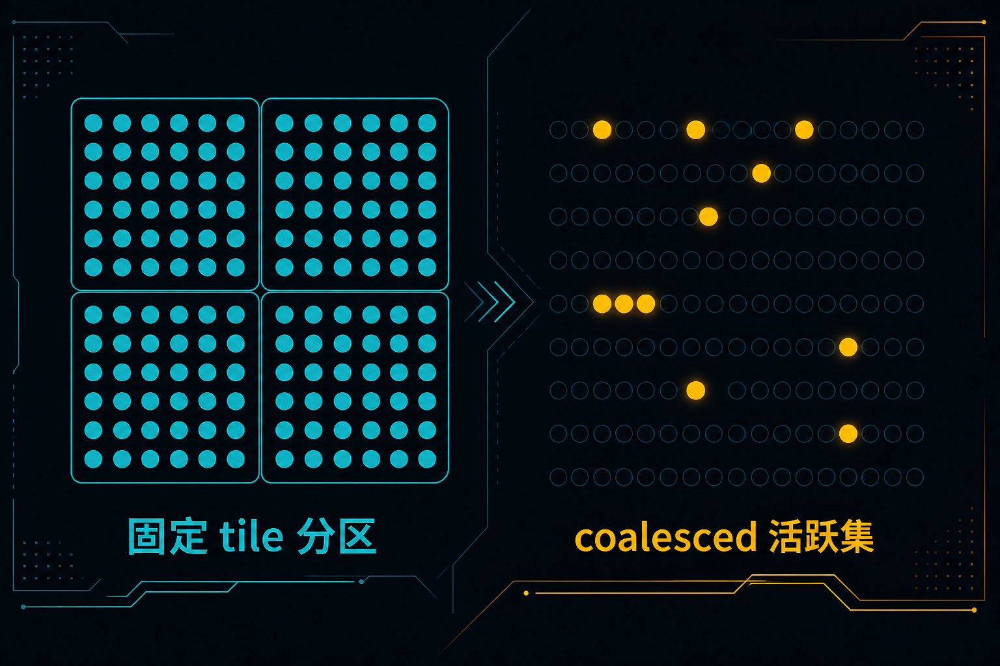
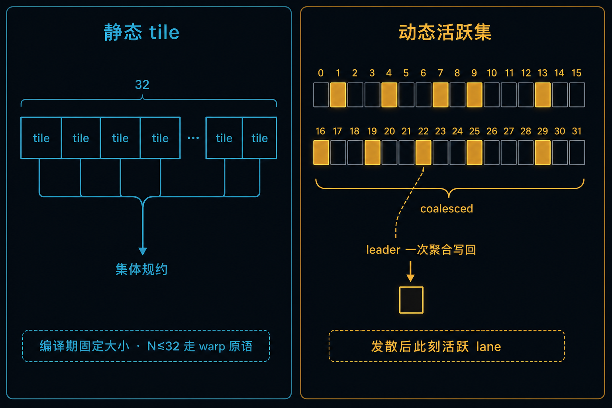

> C-01 钉死了 `__shfl_*_sync` 与 mask 纪律。  
> 手写 mask 能跑，但分组一变复杂就难组合。  
> 本章把分组收成句柄：`thread_block_tile` / `coalesced_group`，并用本机曲线钉死「抽象税≈0」与「tile>32 悬崖」。

**配套可复现**：[Yapeng-Gao/AI-System-Performance-Lab](https://github.com/Yapeng-Gao/AI-System-Performance-Lab)（文章 + `.cu` + 实测表）。有用请 Star。 本章示例：[`examples/03_compute_primitives/02_cooperative_groups.cu`](https://github.com/Yapeng-Gao/AI-System-Performance-Lab/blob/main/examples/03_compute_primitives/02_cooperative_groups.cu)。

---

## C-02. Cooperative Groups：安全分组、tile 集体与 coalesced 聚合

## TL;DR（工程结论）

> 口径：RTX 5090 / `sm_120`，CUDA event **median**；reduce 用 `--reps 50` 放大原语代价。完整表见 [`docs/results/C-02_cooperative_groups.md`](../../docs/results/C-02_cooperative_groups.md)。

1. **CG = 分组句柄，不是更快的 shuffle**：`thread_block_tile<N>`（N≤32）把 mask/rank 收进类型；本机 tile32 / cg_reduce 相对手写 intrinsic ≈ **1.00× / 0.99×**。
2. **该上静态 tile**：固定子 warp / 半 warp 集体、少手写 mask、要把 group 当参数传进 `__device__` 函数时，用 `tiled_partition<N>`。
3. **tile 大小悬崖（本机）**：`cg::reduce` 在 tile≤32 持平；**64→1.60×，128→1.66×**（相对 tile=32）。大 tile 走软件多 warp sync——**别当 block-wide 默认**。
4. **`coalesced_group`**：发散后「此刻活跃线程」的安全集合，适合聚合原子入口；**不是**任意逻辑 mask 的替代（与 C-01 `activemask` 纪律同族）。
5. **判停**：看 `tile32/intrinsic`≈1 且 `sweep` 在 >32 抬升；cluster 有则 verify OK。**禁止**把 ncu 附着墙钟当结论。

---

## 1. 问题：intrinsic 会了，分组怎么写得可组合

| 问题 | 本章交付 |
|---|---|
| 少写 mask，还能同速？ | `thread_block_tile` vs 手写 intrinsic |
| 固定子集集体怎么表达？ | `tiled_partition<N>` |
| 发散后谁该参与集体？ | `coalesced_threads` |
| 大 tile `cg::reduce` 能不能当 block reduce？ | `sweep` 悬崖曲线 |
| Hopper+ 簇内共享怎么验？ | `cluster` 可选支线（功能） |

边界：

| 章节 | 已覆盖 | 本章不重复 |
|---|---|---|
| C-01 | `*_sync` / shfl vs SMEM / redux | 不重测 smem 树；手写 shfl 只作基线标签 |
| A-04 | Divergence / ITS | 不重讲机制课 |
| C-03（下） | Atomics 争用 | coalesced 只给入口形态 + 正确性 |
| C-04（下） | 同步分层 / grid sync | 不做 `this_grid` / cooperative launch 全家桶 |
| Module D | DeviceReduce | 不做多 block 全局规约 |
| B-08 | TMA / async | 不抢 DSMEM+TMA 深挖 |



> 左：静态 tile——编译期固定大小，N≤32 走 warp 原语（对应 `tiled_partition<N>`）。右：动态活跃集——发散后此刻活跃 lane；leader 一次聚合写回（对应 `coalesced_threads()`）。

---

## 2. 物理模型：先有 group，再有集体

```text
this_thread_block()          ← 启动配置隐含
        │
        ├─ tiled_partition<N>  → thread_block_tile<N>   （固定、可嵌套）
        ├─ coalesced_threads() → coalesced_group        （动态活跃集）
        └─ this_cluster()      → cluster_group          （sm_90+，可选）
```

| 路径 | 集合怎么定 | 典型集体 | 本机角色 |
|---|---|---|---|
| 手写 `__shfl_*_sync` | 你填 mask | shuffle / vote | 基线 |
| `thread_block_tile<N>` | 分区几何 + 编译期 N | `shfl_*` / `reduce` / `sync` | 主对照 |
| `coalesced_group` | 此刻收敛的活跃 lane | `size` / `shfl` / leader atomic | 定点 |
| `cluster_group` | 启动时 cluster 维 | `sync` / `map_shared_rank` | 可选功能 |

N≤32 的 tile 落在单 warp 内，同步便宜；N>32 跨多个 warp，CG 用更通用的软件路径（论坛口径：busy-wait on memory），墙钟会抬——这就是主曲线要钉的悬崖。

---

## 3. API 分层（本章用到的）

| 层 | 代表 | 作用 |
|---|---|---|
| Implicit | `this_thread_block()` | 拿到 block 句柄，再 partition |
| Tile | `tiled_partition<N>(block)` | 静态子组；N 为 2 的幂且 ≤ block |
| Coalesced | `coalesced_threads()` | 发散分支内的活跃集 |
| Collectives | `g.shfl_down` / `cg::reduce` / `g.sync` | 在 group 上做集体 |
| Cluster（可选） | `this_cluster()` | 簇屏障 + DSMEM 映射 |

```cpp
namespace cg = cooperative_groups;
cg::thread_block block = cg::this_thread_block();
cg::thread_block_tile<32> tile = cg::tiled_partition<32>(block);
float v = cg::reduce(tile, local, cg::plus<float>());
```

`coalesced` 聚合入口（与示例同构）：

```cpp
if (pred) {
  cg::coalesced_group g = cg::coalesced_threads();
  if (g.thread_rank() == 0)
    atomicAdd(out, (unsigned long long)g.size());
}
```

mask 细则仍归 C-01；本章用类型把「谁参与」说清楚。grid 级 `this_grid()` + `cudaLaunchCooperativeKernel` 留给 C-04。

---

## 4. 决策表

| 信号 | 建议 |
|---|---|
| 固定 N≤32 的 warp/子 warp 集体，要少写 mask | **`thread_block_tile<N>`**（或 `cg::reduce`） |
| 要把 group 当参数传入 device 函数 | 传 `thread_block_tile<N>` / `coalesced_group` |
| 发散后只对活跃线程聚合原子 | **`coalesced_threads()`** → C-03 深挖争用 |
| block-wide / 多 warp 规约要性能 | **别用** 大 tile `cg::reduce`；回 C-01 处方或 **CUB** |
| 整 device 规约 / Softmax | **Module D** |
| 跨 block 同步 / grid barrier | **C-04** |
| 簇内 DSMEM 小验证（sm_90+） | 本章 `cluster` 支线；生产路径另测 |

**处方（与示例同构）**

```text
每线程 grid-stride 局部累加
        │
        ├─ intrinsic：__shfl_down_sync 树（基线）
        ├─ tile32：thread_block_tile<32>.shfl_down
        └─ cg_reduce：cg::reduce(tile, …)  （sweep 扫 N）
```

`--reps` 只放大规约轮次（一次 GMEM 载入），把「分组原语差价」从访存墙里剥出来；verify 仍走 reps=1 精确比对。

---

## 5. 实验怎么设计

| 项 | 路径 |
|---|---|
| 代码 | `examples/03_compute_primitives/02_cooperative_groups.cu` |
| 结果 | [`docs/results/C-02_cooperative_groups.md`](../../docs/results/C-02_cooperative_groups.md) · `C-02_sweep.csv` / `C-02_modes.csv` |
| 绘图 | `python scripts/plot_c02_cooperative_groups.py` |

**一条主命令（主结论）**

```bash
./bin/03_compute_primitives_02_cooperative_groups --mode sweep
```

**定点全表（抽象税 / coalesced / cluster）**

```bash
./bin/03_compute_primitives_02_cooperative_groups --mode modes
```

| mode | 问题 | 进主结论？ |
|---|---|---|
| `intrinsic` / `tile32` / `cg_reduce` | 抽象税 @ tile=32 | 定点 |
| `sweep` | tile∈{8,16,32,64,128} 的 `cg::reduce` 形状 | **主曲线** |
| `coalesced` | 聚合计数正确？ | 定点表 |
| `cluster` | sm_90+ DSMEM 邻块读 | 可选 |
| `modes` | 定点一次跑齐 | 写结果用 |

证据优先级：CUDA event **median** → 相对 tile=32 的 norm；正确性失败非零退出。NCU 可选，本章默认不加 profile shell。

### 5.1 本机实测（RTX 5090 / sm_120）

平台与完整表：[`docs/results/C-02_cooperative_groups.md`](../../docs/results/C-02_cooperative_groups.md)。重画：

```bash
python scripts/plot_c02_cooperative_groups.py
```

**Sweep（主结论）**

| tile | median_ms | norm(÷tile32) |
|---:|---:|---:|
| 8 | 0.0275 | **0.993** |
| 16 | 0.0258 | **0.931** |
| 32 | 0.0277 | **1.000** |
| 64 | 0.0444 | **1.603** |
| 128 | 0.0461 | **1.664** |


**Modes 定点（tile=32）**

| tag | median_ms | 相对 |
|---|---:|---|
| intrinsic / tile32 / cg_reduce | 0.0253 / 0.0254 / 0.0250 | **1.004× / 0.990×** |
| coalesced | 0.2354 | verify OK（odd=8388608） |
| cluster | 0.0069 | verify OK（clusize=2） |

**怎么读**

1. **抽象税≈0**：三种写法在噪声内——CG 不额外收通行费（tile≤32）。tile=16 的 norm 0.93 略快于 32，属亚 warp 波动，不改「≤32 持平」结论。
2. **悬崖在 32 之后**：64/128 相对 tile32 贵约六成；与「大 tile 软件 sync」同向。
3. **coalesced / cluster**：功能旁证；时延不与 reduce 加速比横比。cluster 核几乎无计算，短时延别当性能故事。

### 5.2 旁证

本章未跑 NCU。若要补：对比 `intrinsic` vs `cg_reduce@32` 的 `inst_executed`（应对齐），以及 `@128` 的 barrier/stall 是否抬升。主结论仍以裸跑 median 为准。

---

## 6. 工程边界

| 项 | 说明 |
|---|---|
| 硬件 | tile / coalesced：全架构常用路径；`this_cluster`：**sm_90+** |
| 类型 | 示例 float reduce + int coalesced 计数；生产类型按 CUB/CG 文档 |
| 正确性 | partial 求和 / odd_count / DSMEM 邻块值与 host 期望比对 |
| 大 tile | CC≤7.5 的大 tile 可能需 `block_tile_memory`；sm_80+ 按官方说明 |
| 与 C-01 | mask 纪律不改；本章只换表达层 |
| 与 D | 多 block DeviceReduce → Module D |

---

## 7. 扩展阅读（不抢后续章）

| 想继续 | 去向 |
|---|---|
| 生产级 block reduce | CUB `BlockReduce`（见 §10-B）；别用大 tile CG 顶替 |
| warp 聚合原子争用曲线 | **C-03**（见 §10-D ARC） |
| grid sync / cooperative launch | **C-04**（见 §10-C SyncMicrobenchmark） |
| Cluster DSMEM 深挖 | 官方 Clusters 节（见 §10-A）；不抢 B-08 TMA |

---

## 8. SOP + 误区

**SOP**

1. 确认集合是固定 tile、发散活跃集，还是必须跨 warp/block。  
2. N≤32：优先 `thread_block_tile` / `cg::reduce`；要极致可控仍可用手写 `*_sync`。  
3. N>32 或整 block：回 C-01 处方或 CUB，先跑 `--mode sweep` 看悬崖。  
4. 发散聚合：`coalesced_threads` + leader；争用曲线留给 C-03。  
5. 判停：`modes` 抽象税≈1 且 `sweep` 在 >32 抬升；再考虑库与下章。

**误区**

| 误区 | 正解 |
|---|---|
| CG 比手写 shuffle 更快 | 本机 ≈同速；赚的是可读性与可组合性 |
| `cg::reduce(tile<128>)` 当默认 block reduce | 悬崖：本机 ~1.6×；用 CUB / C-01 模式 |
| `coalesced_threads` = 任意逻辑 mask | 只是此刻活跃集；逻辑 mask 仍自己算（C-01） |
| cluster 短时延 = 生产加速比 | 功能验证核；DSMEM 收益另测 |
| 继续用 legacy 无 `_sync` shuffle | Volta+ 仍走 C-01 纪律 |

---

## 9. 小结与下一章

分组先写成句柄：tile≤32 几乎零抽象税；跨过 32 要付软件 sync 的账。  
`sweep` 回答「大 tile 值不值」；coalesced 只演示聚合入口，争用留给下一章。  

下一章 **C-03 Atomics 与 contention**：global vs shared、分层规约、warp-aggregated 深挖——不再复读本章 CG 分层表。

---

## 10. 参考文献

### A. 官方

1. [CUDA Programming Guide — Cooperative Groups](https://docs.nvidia.com/cuda/cuda-programming-guide/04-special-topics/cooperative-groups.html)  
2. [Device-Callable APIs — Cooperative Groups](https://docs.nvidia.com/cuda/cuda-programming-guide/05-appendices/device-callable-apis.html)  
3. [CUDA C++ Programming Guide — Thread Block Clusters](https://docs.nvidia.com/cuda/cuda-c-programming-guide/)（Clusters 节）

### B. 工程

4. NVIDIA, [Cooperative Groups: Flexible CUDA Thread Programming](https://developer.nvidia.com/blog/cooperative-groups/)  
5. NVIDIA 论坛，[CG vs CUB reduce](https://forums.developer.nvidia.com/t/cooperative-groups-are-much-slower-than-cub/312479)（tile≤32 vs >32）  
6. CCCL/CUB — [Block/Warp collectives](https://nvidia.github.io/cccl/cub/)

### C. 实证

7. Zhang et al., [arXiv:2004.05371](https://arxiv.org/abs/2004.05371)（SyncMicrobenchmark；grid sync 成本旁证 → C-04）  
8. 本仓库 C-01 结果 [`C-01_warp_primitives.md`](../../docs/results/C-01_warp_primitives.md)（手写 shfl 基线）

### D. 前沿 / 扩展

9. Collange, [Warp-synchronous programming with Cooperative Groups](https://www.irisa.fr/alf/downloads/collange/talks/collange_warp_synchronous_19.pdf)  
10. Durvasula et al., ARC, ASPLOS’25, [DOI:10.1145/3669940.3707238](https://doi.org/10.1145/3669940.3707238) → **C-03**
---

> 本文配套代码与实测：[AI-System-Performance-Lab](https://github.com/Yapeng-Gao/AI-System-Performance-Lab)。觉得有用请 Star，后续章更新更好找。
