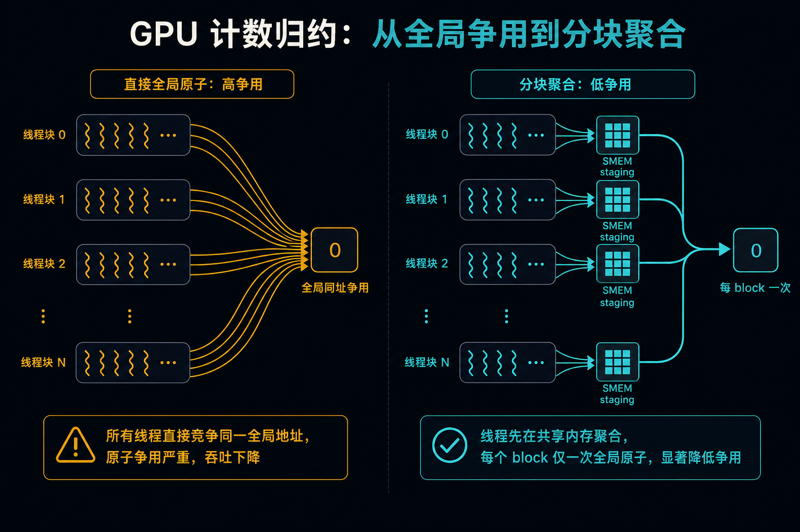
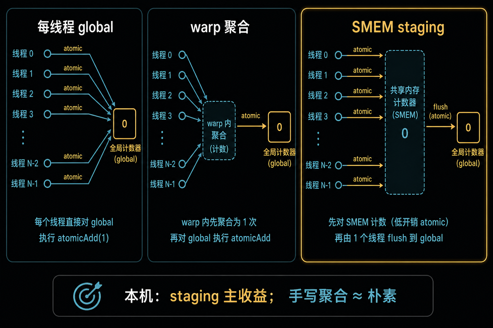
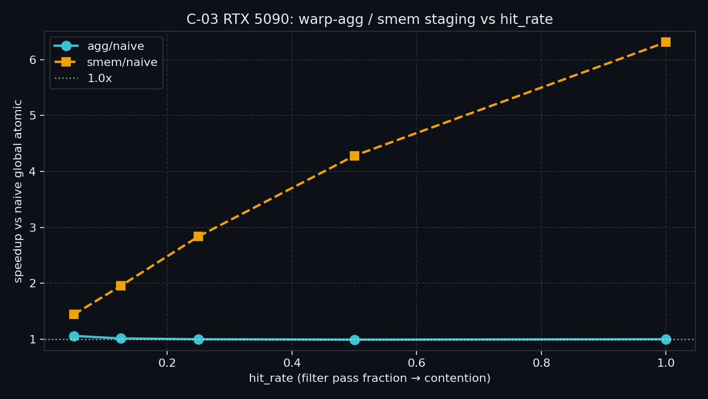

> C-02 给了 `coalesced_threads` 聚合入口，正确性已过。  
> 还缺一条轴：**撞同一地址有多贵，staging / 手写聚合各值多少**。  
> 本章用过滤计数 micro-bench 扫 `hit_rate`，本机结论与 Kepler 博客不同——以 5090 曲线为准。

---

## C-03. Atomics 与 Contention：争用曲线、分层 staging 与 warp 聚合

## TL;DR（工程结论）

> 口径：RTX 5090 / `sm_120`，CUDA event **median**。完整表见 [`docs/results/C-03_atomics_contention.md`](../../docs/results/C-03_atomics_contention.md)。

1. **争用决定墙钟**：同址 `atomicAdd` 堆得越满，naive 越慢；处方优先 **少撞 global 原子单元**，不是先换「更快的 atomic 助记符」。
2. **本机主处方 = SMEM staging**：block 内先 `atomicAdd(SMEM)`，再每 block 一次 global；`smem/naive` 随 hit_rate 抬升，**@1.0 → 6.31×**（modes **6.56×**）。
3. **手写 warp-agg ≈ naive（~1.0×）**：同 warp、同地址、相同 +1 时，现代工具链/硬件多半已自动聚合；`coalesced` 写法仍值得保留（可读、可移植），**别预期数量级加速**。
4. **别硬套 Kepler Pro Tip**：当年「聚合 global ≫ SMEM」；本机是 **staging ≫（已等价的）naive/agg global**。数字用上表，不抄 blog 20×。
5. **判停**：看 `smem/naive` 随 hit_rate 形状；`agg/naive≈1` 可接受。**禁止**把 ncu 附着墙钟当结论。

---

## 1. 问题：聚合入口有了，争用账怎么算

| 问题 | 本章交付 |
|---|---|
| 同址原子有多贵？ | `hit_rate` 争用曲线 |
| 手写 warp 聚合还值不值？ | `agg` vs `naive` |
| block staging 是否更赚？ | `smem` / `agg_smem` |
| 和老博客数字怎么对齐？ | 本机校准表 |

边界：

| 章节 | 已覆盖 | 本章不重复 |
|---|---|---|
| C-01 | ballot / elect 入口 | 不重讲 mask |
| C-02 | `coalesced_threads` 形态 + 正确性 | 不重测 CG 抽象税 / tile 悬崖 |
| C-04（下） | 同步分层 | `__syncthreads` 只作 staging 一步 |
| Module D | DeviceReduce / 直方图库 | 不做生产 histogram |
| ARC / 渲染 | 应用侧原子墙 | 只作 §7 动机 |



> 左：每命中线程直接 global atomic。中：warp 内聚合成一次 global。右：先撞 SMEM，再每 block 刷一次 global——本机主收益在右路。

---

## 2. 物理模型：少次数，比「更快的 atomic」更先

```text
高争用同址计数
        │
        ├─ naive：每命中线程 → atomicAdd(global)     ← 请求挤在 L2 atomic 路径
        ├─ agg  ：coalesced 后每组一次 → global       ← 少次数；现代栈上常已被自动做掉
        └─ smem ：atomicAdd(SMEM) → 每 block 一次 global  ← 争用留在 SM 内
```

| 路径 | 全局原子次数（量级） | 本机角色 |
|---|---|---|
| naive | ~命中线程数 | 基线；墙钟随 hit_rate 涨 |
| agg | ~活跃 coalesced 组数 | 与 naive 几乎同速 |
| smem | ~block 数（有命中时） | **主加速比** |
| agg_smem | ~block 数 | ≈ smem |

直觉：原子贵在 **冲突串行**。能把冲突关进 SMEM、把 global 次数压到「每 block 一次」，往往比在 global 上再抠 warp 聚合更赚——至少在本机同址计数形态如此。

---

## 3. API / 模式（本章用到的）

| 层 | 代表 | 作用 |
|---|---|---|
| Global atomic | `atomicAdd(ull*, 1)` | 设备可见计数 |
| Shared atomic | `atomicAdd` 到 `__shared__` | block 内 staging |
| Warp 聚合 | `cg::coalesced_threads()` + leader | 承接 C-02；每组一次写回 |
| 谓词控制 | `in[i] < thresh` | 用 `hit_rate` 扫争用强度 |

示例与 NVIDIA filtering Pro Tip 同构的简化版：数组值域 `[0,999]`，`thresh = round(hit_rate*1000)`，命中则对**同一**全局计数器 +1。

```cpp
// smem staging（与示例同构）
__shared__ unsigned long long block_ctr;
if (threadIdx.x == 0) block_ctr = 0;
__syncthreads();
if (in[i] < thresh) atomicAdd(&block_ctr, 1ULL);
__syncthreads();
if (threadIdx.x == 0 && block_ctr) atomicAdd(out, block_ctr);
```

`agg` 路径继续用 C-02 的 `coalesced_threads`；不在本章重开 CG 教程。

---

## 4. 决策表

| 信号 | 建议 |
|---|---|
| 同 block 大量线程更新**同一**计数器（本机） | **SMEM staging** → 每 block 一次 global |
| 要可读的 warp 聚合写法 / 防旧工具链 | `coalesced` / ballot+elect；**别默认期待 ≫ naive** |
| 多 bin、低冲突直方图 | 先估冲突；冲突低时原子本身可能不是主墙 → Module D / 专用库 |
| 渲染梯度等多地址、变增量原子墙 | 见 §7 ARC；本章微基准不覆盖 |
| 跨 block 同步 / grid barrier | **C-04** |
| 整 device 规约 | **Module D** |

**处方（与示例同构）**

```text
谓词过滤计数（扫 hit_rate）
        │
        ├─ naive：命中 → atomicAdd(global)
        ├─ smem ：命中 → atomicAdd(SMEM) → block flush
        ├─ agg  ：命中 → coalesced → leader atomicAdd(global)
        └─ agg_smem：coalesced → SMEM → block flush
```

---

## 5. 实验怎么设计

| 项 | 路径 |
|---|---|
| 代码 | `examples/03_compute_primitives/03_atomics_contention.cu` |
| 结果 | [`docs/results/C-03_atomics_contention.md`](../../docs/results/C-03_atomics_contention.md) · `C-03_sweep.csv` / `C-03_modes.csv` |
| 绘图 | `python scripts/plot_c03_atomics_contention.py` |

**一条主命令（主结论）**

```bash
./bin/03_compute_primitives_03_atomics_contention --mode sweep
```

**定点全表（默认 hit_rate=1）**

```bash
./bin/03_compute_primitives_03_atomics_contention --mode modes
```

| mode | 问题 | 进主结论？ |
|---|---|---|
| `naive` / `smem` / `agg` | 定点时延 | 对照 |
| `agg_smem` | staging+聚合 | 定点 |
| `sweep` | hit_rate∈{0.05…1.0} 的加速比形状 | **主曲线** |
| `modes` | 定点一次跑齐 | 写结果用 |

证据：event **median**；计数与 host 期望比对。NCU 可选；默认无 profile shell。

### 5.1 本机实测（RTX 5090 / sm_120）

平台与完整表：[`docs/results/C-03_atomics_contention.md`](../../docs/results/C-03_atomics_contention.md)。

```bash
python scripts/plot_c03_atomics_contention.py
```

**Sweep（主结论）**

| hit_rate | naive_ms | smem_ms | agg_ms | agg/naive | smem/naive |
|---:|---:|---:|---:|---:|---:|
| 0.05 | 0.0379 | 0.0263 | 0.0358 | **1.060** | **1.443** |
| 0.125 | 0.0521 | 0.0267 | 0.0514 | **1.015** | **1.953** |
| 0.25 | 0.0790 | 0.0278 | 0.0790 | **1.000** | **2.839** |
| 0.5 | 0.1321 | 0.0308 | 0.1330 | **0.993** | **4.282** |
| 1.0 | 0.2335 | 0.0370 | 0.2335 | **1.000** | **6.312** |



**Modes（hit_rate=1.0）**

| tag | median_ms | 相对 naive |
|---|---:|---|
| naive / agg | 0.2319 / 0.2310 | **1.004×** |
| smem / agg_smem | 0.0354 / 0.0354 | **6.56× / 6.55×** |

**怎么读**

1. **agg 全程贴着 naive**：不是 verify 失败，是差价已被吃掉。
2. **smem 才随争用拉开**：hit 越高，staging 越值；naive 近似线性变慢，smem 几乎平坦。
3. **agg_smem ≈ smem**：已有 block staging 时，再套 coalesced 几乎无额外收益。

### 5.2 旁证

本章未跑 NCU。若要补：高 hit 下对比 naive vs smem 的 atomic / L2 相关 metric；主结论仍以裸跑 median 为准。

---

## 6. 工程边界

| 项 | 说明 |
|---|---|
| 硬件 | `atomicAdd` int/ull：全架构常用；本章主路径 ull 计数 |
| 形态 | **同址过滤计数**；多 bin / 变增量另测 |
| 正确性 | 各 mode hits 与 host 期望一致 |
| 编译器 | 朴素同址 +1 可能被自动聚合——对照要诚实 |
| 与 C-01/C-02 | 聚合 API 已会；本章只加争用轴 |
| 与 D | 生产直方图 / Device 规约 → Module D |

---

## 7. 扩展阅读（不抢后续章）

| 想继续 | 去向 |
|---|---|
| Kepler 时代 warp-agg 故事 | NVIDIA Pro Tip（见 §10-B）；数字勿直接当本机 |
| 渲染梯度自适应原子 | ARC ASPLOS’25（见 §10-D） |
| grid / block 同步分层 | **C-04** |
| 库级 histogram / DeviceReduce | **Module D** / CUB |

---

## 8. SOP + 误区

**SOP**

1. 确认是同址高争用，还是多地址稀疏更新。  
2. 同址计数：先写 **SMEM staging**，再测 `--mode sweep`。  
3. 需要聚合写法时用 `coalesced` / ballot；用 `agg/naive` 检查是否还有差价。  
4. 与老 blog 数字冲突时，**以本机 sweep 为准**。  
5. 判停：`smem/naive` 形状合理 + verify OK。

**误区**

| 误区 | 正解 |
|---|---|
| 手写 warp-agg 一定数倍于 naive | 本机 ≈1.0×；先看工具链是否已聚合 |
| 抄 Kepler「聚合 global 最优」 | 本机 staging 更优；重测再决策 |
| SMEM atomic 永远更快 | 形态/架构相关；用 sweep 说话 |
| 本章 = 生产直方图 | 只到同址计数处方；库归 Module D |
| 把 ncu 附着 ms 当加速比 | 禁止 |

---

## 9. 小结与下一章

同址争用：本机先把原子关进 SMEM，再每 block 刷 global；手写 warp-agg 当保险写法，不当加速神话。  
`sweep` 回答「争用加重时谁在涨」；同步原语全家桶留给下一章。  

下一章 **C-04 同步分层**：`__syncwarp` / block barrier / grid sync——不再复读本章原子争用曲线。

---

## 10. 参考文献

### A. 官方

1. [CUDA Programming Guide — Atomic Functions](https://docs.nvidia.com/cuda/cuda-programming-guide/05-appendices/cpp-language-extensions.html)  
2. [Advanced Kernel Programming — scoped atomics](https://docs.nvidia.com/cuda/cuda-programming-guide/03-advanced/advanced-kernel-programming.html)

### B. 工程

3. NVIDIA, [CUDA Pro Tip: Warp-Aggregated Atomics](https://developer.nvidia.com/blog/cuda-pro-tip-optimized-filtering-warp-aggregated-atomics/)  
4. NVIDIA, [Cooperative Groups](https://developer.nvidia.com/blog/cooperative-groups/)（aggregated atomic 段）  
5. NVIDIA 论坛讨论（shared vs global atomic，Turing+）——SMEM 不总更快

### C. 实证

6. 本仓库 [`C-03_atomics_contention.md`](../../docs/results/C-03_atomics_contention.md)（5090 主结论）  
7. [`C-02_cooperative_groups.md`](../../docs/results/C-02_cooperative_groups.md)（coalesced 入口）

### D. 前沿 / 扩展

8. Durvasula et al., ARC, ASPLOS’25, [DOI:10.1145/3669940.3707238](https://doi.org/10.1145/3669940.3707238)  
9. Garcia de Gonzalo et al., CGO’19（自动 warp 原语 / 原子规约）  
