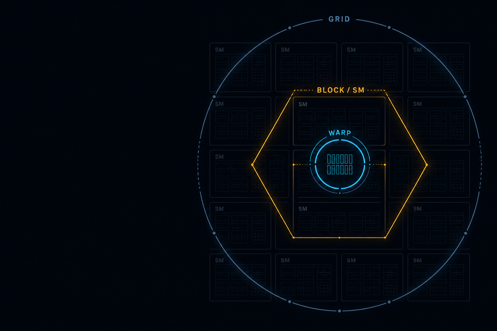
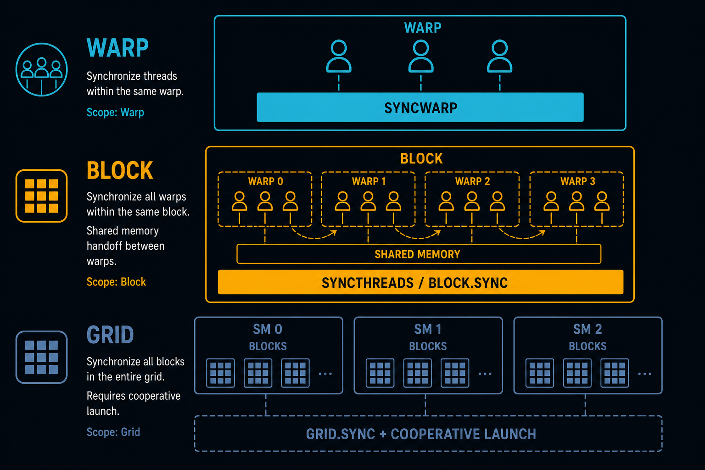
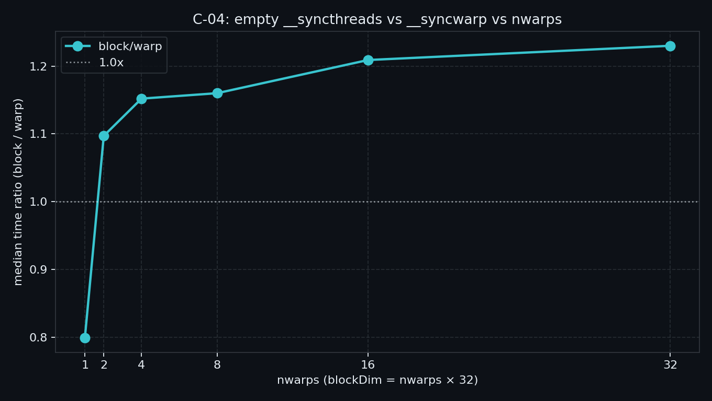
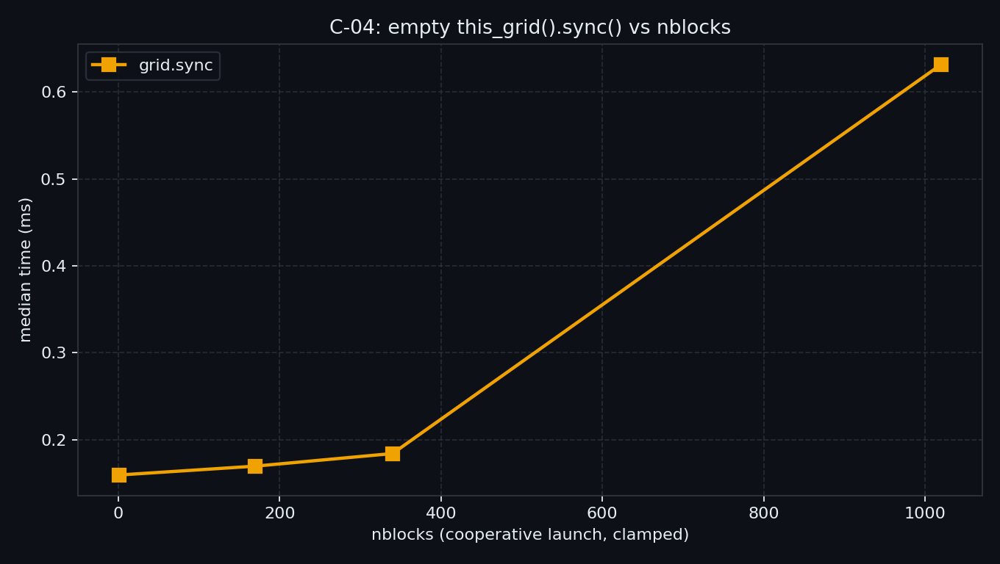

> C-03 处方里反复出现 barrier，但没回答：**哪一层、多贵、何时上 grid**。  
> 本章用空同步 micro-bench 对照 `__syncwarp` / `__syncthreads` / `this_grid().sync()`，并用同载荷 `phases` 钉死「grid ≠ 自动更快」。  
> 本机结论：**断层在 grid vs SM 内**（~17×），不是 warp vs block。

---

## C-04. 同步分层：warp / block / grid 的代价、可见性与 cooperative launch

## TL;DR（工程结论）

> 口径：RTX 5090 / `sm_120`，CUDA event **median**。完整表见 [`docs/results/C-04_sync_layers.md`](../../docs/results/C-04_sync_layers.md)。

1. **主断层 = grid vs block**：同配置空同步 `grid/block ≈ 17.2×`（nwarps=8，nblocks=170）。warp 与 block 只差约 **1.1×～1.23×**——处方是 **别把跨 SM 会合当便宜的 block sync**，不是「warp ≪ block」神话。
2. **`__syncwarp` ≠ 免费，也不能冒充 block**：同 warp 经 **内存** 交接要会合+可见性；跨 warp SMEM 交接走 `__syncthreads`（`correctness` 有 sync 已过）。
3. **Block 默认 `__syncthreads` / `block.sync()`**：整 block 阶段分界、SMEM 交接用硬件 block barrier。C-02：大 tile CG sync 勿当 block 默认。
4. **Grid 有门槛、随装填变贵、未必更快**：必须 cooperative launch（本机 coop_max≈1020）。`sweep_grid`：1～2 blocks/SM 几乎平坦，**6/SM 时 0.63 ms（相对 1 block ~4×）**；`phases`：单核 **0.0197 ms** vs 两 kernel **~0.02 ms**（ratio≈1）——为状态复用上 grid，不是为加速（launch 拆解 → C-06）。
5. **判停**：看 `grid/block` + `sweep_grid` 装填跳变；`block/warp` 只作次级形状。**禁止**把 ncu 附着墙钟当结论。

---

## 1. 问题：barrier 写进处方之后

| 问题 | 本章交付 |
|---|---|
| 三层空同步各多贵？ | `warp` / `block` / `grid` + `sweep` |
| grid 随规模怎么涨？ | `sweep_grid` |
| 缺 block sync 会怎样？ | `correctness`（有 sync 断言；无 sync = UB 不冒充稳定失败） |
| grid 是否该替代双 kernel？ | `phases` 总墙钟一行 |

边界：

| 章节 | 已覆盖 | 本章不重复 |
|---|---|---|
| C-01 | mask / `*_sync` | 不重测 shfl vs SMEM |
| C-02 | CG 分组 / tile 悬崖 | 不重测抽象税；`this_grid` 留给本章 |
| C-03 | 原子争用 / staging | barrier 只当承接，不重测 atomic 曲线 |
| C-05 / C-06 | fusion / launch·Graph | 不做寄存器融合账；不拆 launch |
| B-08 / C-09 | mbarrier / named barrier | 仅 §7 钩子 |



> 上：warp 内 `__syncwarp`。中：block 内 `__syncthreads`（SMEM 交接）。下：grid 内 `this_grid().sync()`，且必须 cooperative launch。

---

## 2. 物理模型：可见性范围，不是「同一种 bar」

```text
隐式 barrier = kernel 边界（多 kernel / stream 同步）
        │
        ├─ warp ：__syncwarp(mask)     ← 同 warp 会合 + memory fence
        ├─ block：__syncthreads()      ← 同 CTA；SMEM 交接默认这一层
        └─ grid ：this_grid().sync()   ← 跨 SM；要 coop launch + 可常驻
```

| 层 | 典型 API | 可见性直觉 | 本机空同步直觉 |
|---|---|---|---|
| warp | `__syncwarp` | 同 warp 经内存读写 | ~0.01 ms 量级；与 block 接近 |
| block | `__syncthreads` / `block.sync()` | 同 block（含 SMEM） | 略贵于 warp（~1.1×）；默认 SMEM 交接 |
| grid | `grid.sync()` | 全 grid | **贵一个数量级+**（~17× block）；随 blocks/SM 跳 |
| 隐式 | 两次 kernel | 全局，经 kernel 边界 | `phases` 与 grid 单核同量级；见 C-06 |

文献形状（Zhang et al.；IISWC’24）：grid 延迟更相关 **每 SM block 数**。本机 `sweep_grid`：1～2/SM 平坦，满 coop（6/SM）跳到 ~0.63 ms——形状对齐；warp vs block 的「数量级差」在本机空同步上 **不成立**，以 `grid/block` 为主结论。

---

## 3. API 清单（本章用到的）

| 层 | 代表 | 注意 |
|---|---|---|
| Warp | `__syncwarp()` / `__syncwarp(mask)` | 参与集一致；勿用它「假装」block barrier |
| Block | `__syncthreads()` | SMEM handoff 默认；与 `cg::sync(this_thread_block())` 同层 |
| Grid | `cg::this_grid().sync()` | **禁止**只靠 `<<<>>>`；要用 `cudaLaunchCooperativeKernel` |
| Host | `cudaDevAttrCooperativeLaunch` + occupancy | grid 规模夹紧到可常驻上限，否则 launch 失败 |

```cpp
// grid sync（与示例同构）
__global__ void k(int iters, unsigned long long* out) {
  auto grid = cooperative_groups::this_grid();
  for (int i = 0; i < iters; ++i) grid.sync();
  // ...
}
// host:
cudaLaunchCooperativeKernel((void*)k, gridDim, blockDim, args, 0, stream);
```

论坛常见坑：`<<<>>>` 启动后 `this_grid().is_valid()==0`，再 `sync` → launch failure。示例启动时打印 `CooperativeLaunch` 与 `coop_max_grid`。

---

## 4. 决策表

| 信号 | 建议 |
|---|---|
| 同 warp、经 SMEM/global 交接 | `__syncwarp`（或已含会合的 `*_sync` 集体） |
| 同 block、SMEM 生产者–消费者 / 阶段分界 | **`__syncthreads`** |
| 跨 block 多阶段，且要保 SMEM/寄存器状态 | **grid sync + cooperative launch**（先查 coop / occupancy） |
| 跨 block 只是「算完再开下一核」 | 多 kernel（隐式 barrier）；先跑 `phases` 看总墙钟 |
| 子集 warp 流水 / async copy 交接 | named barrier / `cuda::barrier` → B-08 / C-09；本章不做 |
| 想靠「少 sync」省时间 | 先确认少的是**正确层**；乱删 block sync 是正确性事故 |

---

## 5. 实验怎么设计

| mode | 问题 | 进主结论？ |
|---|---|---|
| `warp` / `block` / `grid` | 单层空同步 median？ | 定点 |
| `sweep` | `nwarps` 上 `block/warp`？ | **次级**（本机仅 ~1.1×；防「warp≪block」误读） |
| `sweep_grid` | `nblocks` 上 grid 时延 / 装填跳变？ | **主曲线** |
| `correctness` | 有 `__syncthreads` 的 SMEM 交接？ | 定点 |
| `phases` | grid 单核 vs 两 kernel？ | 定点（不拆 launch） |
| `modes` | 定点全表；**主数字 `grid/block`** | 写结果用 |

```bash
./bin/03_compute_primitives_04_sync_layers --mode sweep
./bin/03_compute_primitives_04_sync_layers --mode sweep_grid
./bin/03_compute_primitives_04_sync_layers --mode modes
```

防 DCE：空同步循环累加 `clock64()` 写回。`iters` 默认 256。

---

## 6. 实测（RTX 5090）

> 完整表：[`docs/results/C-04_sync_layers.md`](../../docs/results/C-04_sync_layers.md)。口径：CUDA event **median**；空同步 `iters=256`。

### 6.1 Sweep：`block/warp` vs `nwarps`

| nwarps | warp_ms | block_ms | block/warp |
|---:|---:|---:|---:|
| 1 | 0.0156 | 0.0124 | 0.80（噪声，勿采信） |
| 2 | 0.0122 | 0.0133 | 1.10 |
| 4 | 0.0116 | 0.0133 | 1.15 |
| 8 | 0.0116 | 0.0135 | 1.16 |
| 16 | 0.0133 | 0.0161 | 1.21 |
| 32 | 0.0150 | 0.0185 | **1.23** |



> 次级曲线：差距有限；别据此说「能 syncwarp 就别 syncthreads」。

### 6.2 Sweep grid：空 `grid.sync` vs `nblocks`

| nblocks | grid_ms | 相对 nblocks=1 |
|---:|---:|---:|
| 1 | 0.159 | 1.00× |
| 170（1/SM） | 0.170 | 1.06× |
| 340（2/SM） | 0.184 | 1.16× |
| 1020（6/SM，coop_max） | **0.632** | **3.97×** |



### 6.3 Modes / phases（定点）

| 路径 | median_ms | 相对 |
|---|---:|---|
| warp | 0.0089 | — |
| block | 0.0098 | block/warp **1.11×** |
| grid | 0.1686 | grid/block **17.2×** |
| phases_grid | 0.0197 | verify OK |
| phases_two_k | ~0.02 | verify OK |
| phases ratio | **≈1.0** | grid/two_kernel；不自动更快 |

怎么读：先看 **17×** 再决定要不要上 grid；`phases≈1` 说明同载荷下 coop 单核并不白捡加速。

---

## 7. 扩展阅读（不抢后续 Module）

1. Async arrive-wait / mbarrier：见 §10 与 B-08；全 block/warp 仍优先 `__syncthreads` / `__syncwarp`（官方口径）。  
2. Named barrier / warp specialization：候选 C-07/C-09。  
3. Launch 墙钟与 CUDA Graph：→ **C-06**（本章 `phases` 只给总时延一行）。  
4. SyncMicrobenchmark 原始数据与测量法：见 §10-C。

---

## 8. 误区与 SOP

| 误区 | 纠正 |
|---|---|
| `<<<>>>` + `this_grid().sync()` | 改 `cudaLaunchCooperativeKernel`；查 `is_valid` / 属性 |
| 用 `__syncwarp` 同步整 block SMEM | 改 `__syncthreads` |
| grid 规模开到「理论最大 block」 | 按 occupancy 夹紧；否则 coop launch 失败 |
| 看见 grid sync 就期待加速 | 先跑 `phases`；慢或持平都可能正确 |
| 把 ncu 附着 ms 写进结论 | 只信裸跑 event median |

**SOP（最短）**

1. 定可见性范围：warp / block / grid / 多 kernel。  
2. Block SMEM 交接 → `__syncthreads`；先跑 `correctness`。  
3. 要测代价 → `--mode sweep` + `--mode sweep_grid`。  
4. 犹豫 grid vs 双核 → `--mode phases`；再决定是否上 coop。  
5. launch / Graph 优化 → C-06，不在本章拆。

---

## 9. 小结与下一章

同步不是一种 bar：范围错了是正确性，层选贵了是性能。  
空同步曲线回答「多贵」；`phases` 回答「该不该上 grid」。  

下一章 **C-05 Kernel fusion 代价边界**：fuse 少了 launch/同步点，却可能打爆寄存器与 occupancy——不再复读本章三层 sync 曲线。

---

## 10. 参考文献

### A. 官方

1. [CUDA Programming Guide — Synchronization / `__syncthreads`](https://docs.nvidia.com/cuda/cuda-programming-guide/)  
2. [Using CUDA Warp-Level Primitives](https://developer.nvidia.com/blog/using-cuda-warp-level-primitives/)（`__syncwarp`）  
3. [CUDA Programming Guide — Cooperative Groups](https://docs.nvidia.com/cuda/cuda-programming-guide/04-special-topics/cooperative-groups.html)（`this_grid` / coop launch）  
4. [CUDA Runtime — `cudaLaunchCooperativeKernel`](https://docs.nvidia.com/cuda/cuda-runtime-api/group__CUDART__EXECUTION.html)  
5. [Async Barriers](https://docs.nvidia.com/cuda/cuda-programming-guide/04-special-topics/async-barriers.html)（边界：全 block/warp 仍建议经典 sync）

### B. 工程

6. NVIDIA 论坛：`this_grid` + `<<<>>>` → invalid / launch failure  
7. 本仓库 C-02 实测：大 tile CG sync ≠ block 默认 barrier

### C. 实证

8. Zhang et al., IPDPS’20 / [arXiv:2004.05371](https://arxiv.org/abs/2004.05371)（SyncMicrobenchmark）  
9. IISWC’24，Characterizing CUDA and OpenMP syncs（[PDF](https://userweb.cs.txstate.edu/~burtscher/papers/iiswc24b.pdf)）  
10. 本仓库 [`C-04_sync_layers.md`](../../docs/results/C-04_sync_layers.md)（5090 主结论）

### D. 前沿 / 扩展

11. Programmatic Dependent Launch（sm_90+ PG）→ C-06 / E  
12. Named barrier / warp specialization 工程笔记 → C-07/C-09  
