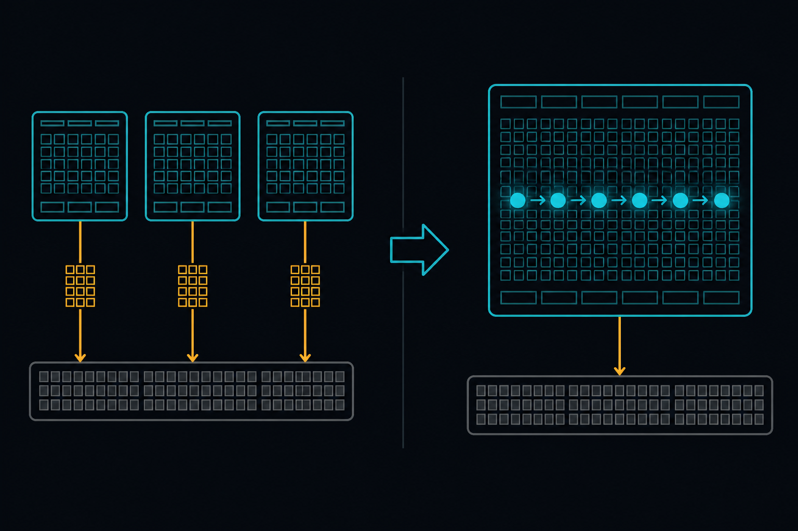
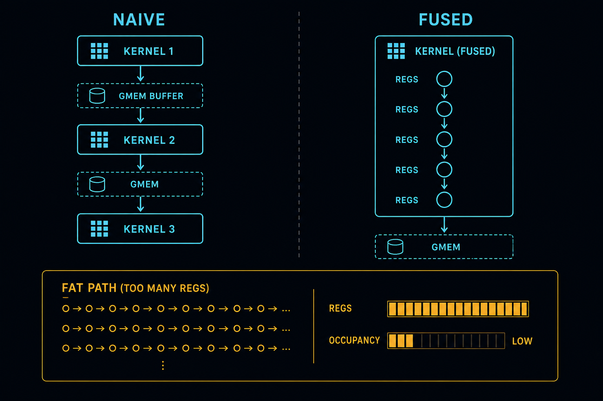

> C-04 钉死：少同步点不等于该 fuse。  
> 本章回答垂直融合何时省 GMEM 真赚、何时寄存器/occupancy 把收益吃掉。  
> 本机：瘦融合随链长 **3.9×→9.8×**；`fat` 把 occupancy 6→1，相对瘦融合慢 **8×**。

---

## C-05. Kernel Fusion 代价边界：少写回 vs 寄存器压力与 occupancy

## TL;DR（工程结论）

> 口径：RTX 5090 / `sm_120`，CUDA event **median**（整条链一包）。完整表见 [`docs/results/C-05_kernel_fusion.md`](../../docs/results/C-05_kernel_fusion.md)。

1. **短 elementwise 链该垂直 fuse**：`fused/naive` @k=2…8 → **3.87×→9.81×**；fused 墙钟几乎平坦（~0.08 ms），naive 随 k 涨——主收益是 **少 GMEM 往返**。
2. **fuse 也可能更慢**：`fat`（FAT_TEMPS=48）occupancy **6→1**，`fat/fused=8.01×`（更慢），甚至慢于 naive——寄存器压力悬崖成立。
3. **两轴一起看**：瘦融合与 stage 同为 **6 blocks/SM**（不靠抬 occupancy 赚钱）；fat 必须看 occupancy + 墙钟。
4. **可维护性也是代价**：短链手写；长链先看编译器（→ E）。
5. **判停**：`sweep` 的加速比随 k 抬升；`modes` 的 `fat/fused>1`。**禁止**把 ncu 附着墙钟当结论。

---

## 1. 问题：少 launch 之后还该不该 fuse

| 问题 | 本章交付 |
|---|---|
| 多核点式链有多贵？ | `naive`（中间写 global） |
| 垂直融合能赚多少？ | `fused` + `sweep` vs `k` |
| 寄存器压力怎么翻车？ | `fat` 定点 + occupancy |
| 和 Graph/launch？ | 一句钩子 → C-06 |

边界：

| 章节 | 已覆盖 | 本章不重复 |
|---|---|---|
| C-04 | sync 分层 | 不重测空同步 |
| C-06 | launch / Graph | 不拆 host launch |
| Module D | Softmax / GEMM epilogue | 不做生产算子融合 |
| Module E | torch.compile | 不做框架自动融合正文 |



> 左：每级写回 GMEM。中：单核寄存器直通。右：fat 人为堆 live 临时，occupancy 可能掉。

---

## 2. 物理模型：省流量 vs 烧寄存器

```text
naive:  x --K1--> GMEM --K2--> GMEM --K3--> y     ← 多次往返
fused:  x --[K1;K2;K3 in regs]--> y               ← 一次写回
fat:    fused + 一堆 live tmp → sink（压力探针）
```

| 收益 | 风险 |
|---|---|
| 少 GMEM 读写 | 每线程 regs ↑ → occupancy ↓ |
| 少 kernel launch（次要） | spill / 难维护 |
| 编译器可跨级优化 | 过度融合难复用 |

水平融合（独立核拼一块）本章不做主线；见 §7。

---

## 3. API / 实验形态

| 路径 | 做法 |
|---|---|
| naive | `k` 次 `kernel_stage`，双缓冲 ping-pong |
| fused | 单核 for `s=0..k-1` `stage_op` |
| fat | 同 fused 写 `out`；`C05_FAT_TEMPS` 个 live 累加进 `sink` 防 DCE |

`stage_op`：`y = a_s*y + b_s`，偶级 ReLU。计时：**一对 event 包住整条链**。

---

## 4. 决策表

| 信号 | 建议 |
|---|---|
| 短点式链、大 `n`、中间无复用需求 | **垂直融合** |
| 融合后 occupancy 明显掉、墙钟变差 | 拆回多核或减 live 量 |
| 只为少 launch | 先测墙钟；launch 拆解 → **C-06** / Graph |
| 长链 / 框架图 | 先看编译器是否已 fuse → E |
| GEMM+epilogue | → Module D，不在本章手写 |

---

## 5. 实验怎么设计

| mode | 问题 | 进主结论？ |
|---|---|---|
| `naive` / `fused` | 定点时延 | 定点 |
| `fat` | 压力探针 | **modes 定点**（不进 sweep） |
| `sweep` | `k∈{2,3,4,6,8}`：`fused/naive` | **主曲线** |
| `modes` | 全表 + occupancy | 写结果用 |

```bash
./bin/03_compute_primitives_05_kernel_fusion --mode sweep
./bin/03_compute_primitives_05_kernel_fusion --mode modes
```

---

## 6. 实测（RTX 5090）

> [`docs/results/C-05_kernel_fusion.md`](../../docs/results/C-05_kernel_fusion.md)。口径：median；n=16M；block=256。

### 6.1 Sweep：`fused/naive` vs `k`

| k | naive_ms | fused_ms | fused/naive |
|---:|---:|---:|---:|
| 2 | 0.318 | 0.082 | **3.87×** |
| 3 | 0.333 | 0.084 | **3.99×** |
| 4 | 0.490 | 0.083 | **5.87×** |
| 6 | 0.662 | 0.083 | **7.94×** |
| 8 | 0.832 | 0.085 | **9.81×** |


> fused 几乎不随 k 涨；naive 近似线性——链越长，少写回越赚。

### 6.2 Modes（k=4，含 fat）

| tag | median_ms | occ_bpsm | 相对 |
|---|---:|---:|---|
| naive | 0.491 | 6 | — |
| fused | 0.083 | 6 | fused/naive **5.89×** |
| fat | 0.667 | **1** | fat/fused **8.01×**（更慢） |

怎么读：瘦融合不伤 occupancy；fat 把 blocks/SM 打到 1 后墙钟崩盘，甚至慢过 naive。

---

## 7. 扩展阅读

1. CUDA Graph / launch 墙 → **C-06**（本章只把省 launch 当次要收益）。  
2. torch.compile / Inductor 自动 fuse → Module E。  
3. 水平融合 HFUSE；自动 VF 库（Fused Kernel Library 等）→ §10-D。  
4. GEMM epilogue / FlashAttention 类融合 → Module D。

---

## 8. 误区与 SOP

| 误区 | 纠正 |
|---|---|
| 能 fuse 就一定更快 | 看 occupancy / 墙钟；跑 `fat` 对照 |
| 少 kernel = 主收益 | 点式链主收益常是少 GMEM |
| fat 是生产写法 | 仅压力探针 |
| 用 ncu 附着 ms 当下结论 | 只信裸跑 median |

**SOP**

1. 确认是垂直依赖的短点式链。  
2. `--mode sweep` 看 `fused/naive` vs `k`。  
3. `--mode modes` 看 `fat` 与 occupancy。  
4. 仍为 launch 墙 → C-06；算子级融合 → D/E。

---

## 9. 小结与下一章

融合是用寄存器换流量；换过头 occupancy 先崩。  
`sweep` 回答赚多少；`fat` 回答怎样翻车。  

下一章 **C-06 CUDA Graph 与 launch overhead**：把「少 launch」这条轴单独测清——不再复读本章 elementwise 融合曲线。

---

## 10. 参考文献

### A. 官方

1. [CUDA C Best Practices Guide](https://docs.nvidia.com/cuda/cuda-c-best-practices-guide/)（Memory / Occupancy）  
2. Occupancy API：`cudaOccupancyMaxActiveBlocksPerMultiprocessor`

### B. 工程

3. NVIDIA, [Kernel Fusion in NVIDIA CUDA](https://developer.nvidia.com/blog/kernel-fusion-in-nvidia-cuda-optimizing-memory-traffic-and-launch-overhead/)  
4. NVIDIA, [Shared Memory Register Spilling](https://developer.nvidia.com/blog/how-to-improve-cuda-kernel-performance-with-shared-memory-register-spilling/)（CUDA 13）  
5. 寄存器阶跃 / spill 工程笔记（occupancy 阈值）

### C. 实证

6. Filipovič et al., [arXiv:1305.1183](https://arxiv.org/abs/1305.1183)（fusion on BLAS；occupancy 可拖慢）  
7. 本仓库 [`C-05_kernel_fusion.md`](../../docs/results/C-05_kernel_fusion.md)（5090 主结论）  
8. C-04：`phases`≈1 ——「少同步/少 launch 不自动更快」同族

### D. 前沿 / 扩展

9. [arXiv:2508.07071](https://arxiv.org/abs/2508.07071) Fused Kernel Library；HFUSE / MCFuser / FlashFuser 等  
10. torch.compile / Inductor → Module E  
