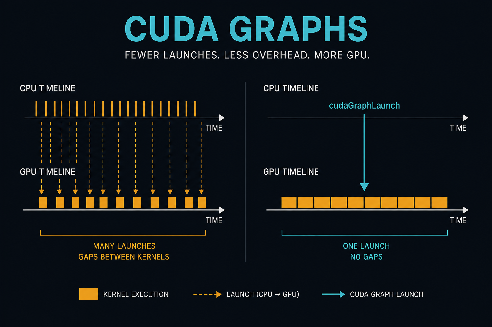
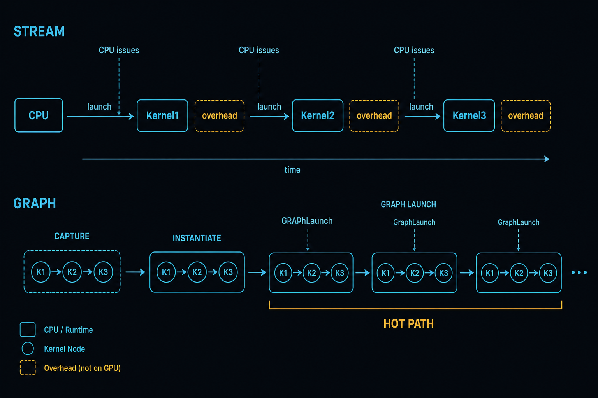
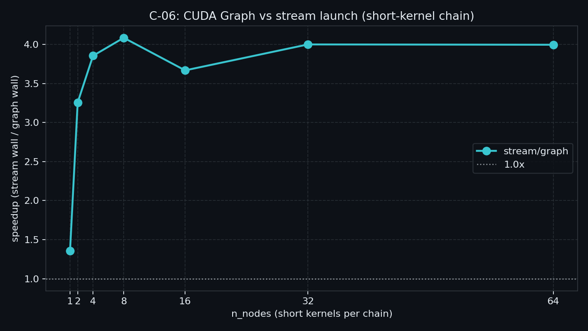
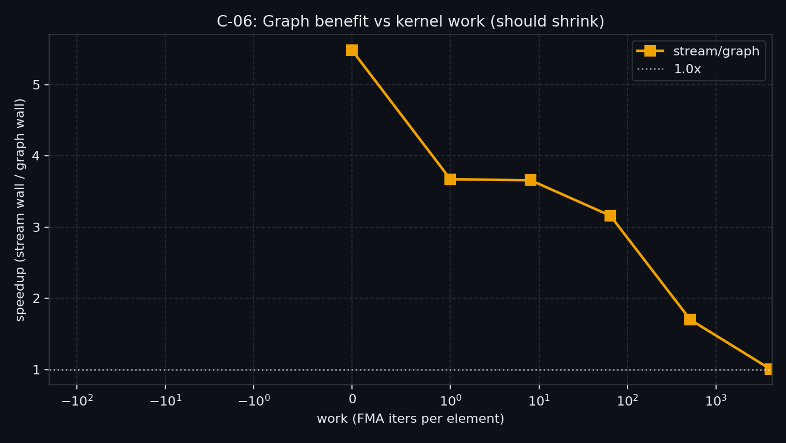

> C-05 钉死：垂直融合主收益常是少 GMEM；省 launch 只是次要一句。  
> 本章单独测清：**短核链上 launch 税有多厚**，以及 **CUDA Graph replay 何时值得上**。  
> 本机：短核链 `stream/graph` 约 **3.7～4.1×**；`work=4096` 收窄到 **1.01×**。

**配套可复现**：[Yapeng-Gao/AI-System-Performance-Lab](https://github.com/Yapeng-Gao/AI-System-Performance-Lab)（文章 + `.cu` + 实测表）。有用请 Star。 本章示例：[`examples/03_compute_primitives/06_cuda_graph.cu`](https://github.com/Yapeng-Gao/AI-System-Performance-Lab/blob/main/examples/03_compute_primitives/06_cuda_graph.cu)。

---

## C-06. CUDA Graph 与 Launch Overhead：短核墙、capture-replay 与何时上图

## TL;DR（工程结论）

> 口径：RTX 5090 / `sm_120`，CUDA event **median**（热路径整条链；**instantiate 不计进热路径**）。完整表见 [`docs/results/C-06_cuda_graph.md`](../../docs/results/C-06_cuda_graph.md)。

1. **短核会被 launch 税吃掉**：`sweep` 上 stream 随节点近似线性（1.18→36 ms @reps=200）；核本身极轻时，端到端被提交次数抬高。
2. **Graph replay 稳定赚约 4×**：nodes≥2 时 `stream/graph`≈**3.3～4.1×**（峰值 @8=**4.08×**）；modes 定点 **3.68×**。
3. **核变长 / 节点太少 → 收益收窄**：nodes=1 仅 **1.36×**；`sweep_work`：work=0→**5.48×**，512→**1.70×**，**4096→1.01×**——别对算力主导的核强行上图。
4. **instantiate 一次性**：modes 报 **0.24 ms**（热路径外）；相对 200× 回放可摊薄，拓扑常变另算。
5. **判停**：主看相对形状与加速比；**禁止** ncu 附着墙钟。本机 µs **不直接对齐** V100 blog 绝对数。

---

## 1. 问题：少 launch 这条轴单独测

| 问题 | 本章交付 |
|---|---|
| 短核链逐次 launch 有多贵？ | `stream` + `sweep` |
| Graph replay 能赚多少？ | `graph` + 同曲线对照 |
| 核变长后还赚吗？ | `sweep_work` |
| instantiate 一次多少？ | `modes` 单独一行 |

边界：

| 章节 | 已覆盖 | 本章不重复 |
|---|---|---|
| C-05 | 垂直融合省 GMEM | **不重测** elementwise 融合；钉死 **Graph ≠ body fusion** |
| C-04 | grid sync / `phases` | 不重测 device sync 分层 |
| A-08 | Stream / CE overlap | 不重讲 stream 课 |
| Module E | torch CUDA Graph | 不做框架 capture 正文 |
| C-07 / C-08 | Persistent / 多核重叠 | 仅 §7 钩子 |



> 上：CPU 逐次 launch，GPU 短核之间夹驱动间隙。下：capture → instantiate 一次，热路径反复 `cudaGraphLaunch`。

---

## 2. 物理模型：body fusion vs launch fusion

```text
C-05 body fusion:   K1;K2;K3 挤进一个 kernel（少 GMEM）
C-06 launch fusion: 仍多个 kernel node，但一次 GraphLaunch 提交整图
```

| | stream 循环 | CUDA Graph |
|---|---|---|
| 热路径提交 | 每个核一次 `<<<>>>` | 每图一次 `cudaGraphLaunch` |
| 固定成本 | 每次 launch | capture + **instantiate**（计时外） |
| 适用 | 拓扑常变、调试 | 拓扑稳定、短核高重复 |

文献形状（Getting Started with Graphs）：极短核链上有效时间/核可从 ~3.8µs 收到 ~3.4µs 量级；instantiate 可达数百 µs，必须靠重复摊薄。本机只认相对形状与加速比。

---

## 3. API / 实验形态

| 路径 | 做法 |
|---|---|
| stream | 同 stream 上循环 launch `n_nodes` 个短核；外层 `chain_reps` 放大 launch 税 |
| graph | `BeginCapture` → 同序列 → `EndCapture` → **`Instantiate`（计时外）** → 热循环 `cudaGraphLaunch` × `chain_reps` |
| 短核 | `kernel_short`：小 `n` + 少 FMA（`work`）；防 DCE 靠写 `data[i]` |
| 正确性 | stream 出 golden，graph 结果比对 |

主路径用 **stream capture**；显式 `cudaGraphAddKernelNode` 本章不展开。

---

## 4. 决策表

| 信号 | 建议 |
|---|---|
| 短核、多节点、拓扑稳定、高重复 | **上 Graph**，instantiate 摊到热循环外 |
| `sweep_work` 已逼近 1 / 节点很少（如 nodes=1） | 别上图；body 已主导端到端，或先看 C-05 是否该 fuse |
| 每步改 launch 参数 / 拓扑常变 | stream；或 `ExecUpdate` / 重建（扩展） |
| Python / torch 推理图 | → Module E，不在本章手写 capture |
| 只想少 launch、中间量很大 | 先看 C-05 垂直融合，再谈 Graph |

---

## 5. 实验怎么设计

| mode | 问题 | 进主结论？ |
|---|---|---|
| `stream` / `graph` | 定点端到端 | 定点 |
| `sweep` | `n_nodes∈{1,2,4,8,16,32,64}`：`stream/graph` | **主曲线** |
| `sweep_work` | 固定 `n_nodes`，扫 `work` | **副曲线** |
| `modes` | 定点 + **instantiate 一行** | 写结果用 |

```bash
# 5090 常用：CMAKE_CUDA_ARCHITECTURES=120；增删 .cu 后先重跑 cmake
./bin/03_compute_primitives_06_cuda_graph --mode sweep
./bin/03_compute_primitives_06_cuda_graph --mode sweep_work
./bin/03_compute_primitives_06_cuda_graph --mode modes
```

默认：`n=4096`，`work=1`，`chain_reps=200`，`block=256`。主证据 = event median；host chrono 只用于 instantiate 定点（可选旁证 G 默认不做单次 Launch API 拆解）。

---

## 6. 实测（RTX 5090）

> [`docs/results/C-06_cuda_graph.md`](../../docs/results/C-06_cuda_graph.md)。口径：median；n=4096；chain_reps=200；block=256。

### 6.1 Sweep：`stream/graph` vs `n_nodes`（work=1）

| n_nodes | stream_ms | graph_ms | stream/graph |
|---:|---:|---:|---:|
| 1 | 1.180 | 0.871 | **1.36×** |
| 2 | 2.217 | 0.681 | **3.26×** |
| 4 | 3.224 | 0.837 | **3.85×** |
| 8 | 5.080 | 1.244 | **4.08×** |
| 16 | 9.065 | 2.472 | **3.67×** |
| 32 | 18.085 | 4.522 | **4.00×** |
| 64 | 36.039 | 9.022 | **4.00×** |



> 节点≥2 后加速比贴在 ~4×，**不是随节点无限涨**：stream/graph 两边都近似线性，比值平台。nodes=1 几乎无可合并提交，只有 1.36×。

### 6.2 Sweep work：收益是否收窄（n_nodes=16）

| work | stream_ms | graph_ms | stream/graph |
|---:|---:|---:|---:|
| 0 | 9.062 | 1.653 | **5.48×** |
| 1 | 9.074 | 2.472 | **3.67×** |
| 8 | 9.049 | 2.473 | **3.66×** |
| 64 | 9.109 | 2.881 | **3.16×** |
| 512 | 9.071 | 5.335 | **1.70×** |
| 4096 | 23.702 | 23.535 | **1.01×** |



> stream 在 work≤512 钉在 ~9 ms（仍 launch 墙）；work=4096 两边几乎重合——**body 已主导端到端**，Graph 该退场。

### 6.3 Modes：instantiate 定点（n_nodes=16, work=1）

| tag | median_ms | instantiate_ms |
|---|---:|---:|
| stream | 9.110 | — |
| graph | 2.473 | **0.241**（不进热路径） |

speedup **3.68×**；verify 全过。

---

## 7. 扩展阅读

1. `cudaGraphExecUpdate` / 动态参数 → 见 §10-B；生产动态图纪律。  
2. CUDA 12.6+ constant-time launch（直线图）→ 见 §10-B；勿当本机绝对 µs。  
3. torch.compile `reduce-overhead` / CUDAGraph Trees → **Module E**。  
4. Persistent kernel → **C-07**（occupancy 常驻拉活，不重测本章曲线）；多 stream 重叠仍是候选 C-08。

---

## 8. 误区与 SOP

| 误区 | 纠正 |
|---|---|
| Graph = kernel fusion | Graph 是提交层；body 融合见 C-05 |
| instantiate 摊进热路径 | 单独报；热循环只 Launch |
| body 已很重仍强行上图 | 先看 `sweep_work`；本机 work=4096→**1.01×** |
| 用 ncu 附着 ms 下结论 | 只信裸跑 median |
| 对齐 blog 绝对 µs | 只比本机相对形状 |

**SOP**

1. 确认是短核、拓扑相对稳定、会重复跑。  
2. `--mode sweep` 看 `stream/graph` vs `n_nodes`。  
3. `--mode sweep_work` 确认核变长后收益是否收窄。  
4. `--mode modes` 记下 instantiate；热路径不含它。  
5. 框架侧 Graph → E；仍带宽墙 → 回 C-05。

---

## 9. 小结与下一章

短核多节点上 Graph 稳赚约 4×；核够长（本机 work=4096）收益归零。  
instantiate 一次付清，别摊进热路径。C-05 管 body，本章管提交层。

下一章 **C-07 Persistent**：occupancy 常驻 + leader 拉活，不再复读本章短核链曲线。Warp spec 不在 C-07 主线。

---

## 10. 参考文献

### A. 官方

1. [CUDA Programming Guide — CUDA Graphs](https://docs.nvidia.com/cuda/cuda-programming-guide/04-special-topics/cuda-graphs.html)  
2. Runtime：`cudaStreamBeginCapture` / `cudaGraphInstantiate` / `cudaGraphLaunch`

### B. 工程

3. NVIDIA, [Getting Started with CUDA Graphs](https://developer.nvidia.com/blog/cuda-graphs/)  
4. NVIDIA, [Constant Time Launch for Straight-Line CUDA Graphs](https://developer.nvidia.com/blog/constant-time-launch-for-straight-line-cuda-graphs-and-other-performance-enhancements/)  
5. NVIDIA, [Employing CUDA Graphs in a Dynamic Environment](https://developer.nvidia.com/blog/employing-cuda-graphs-in-a-dynamic-environment/)  
6. 论坛口径：launch 有固定税；body 主导端到端时 Graph 几乎无关

### C. 实证

7. 本仓库 [`C-06_cuda_graph.md`](../../docs/results/C-06_cuda_graph.md)（5090 主结论）  
8. C-05：融合省流量为主，launch 次要  
9. C-04：`phases`≈1 ——「少核/少 sync 不自动更快」同族  
10. Zhang et al., [arXiv:2004.05371](https://arxiv.org/abs/2004.05371)（launch / sync 微基准旁证）

### D. 前沿 / 扩展

11. Programmatic Dependent Launch（sm_90+）  
12. torch.compile / CUDAGraph Trees → Module E
---

> 本文配套代码与实测：[AI-System-Performance-Lab](https://github.com/Yapeng-Gao/AI-System-Performance-Lab)。觉得有用请 Star，后续章更新更好找。
