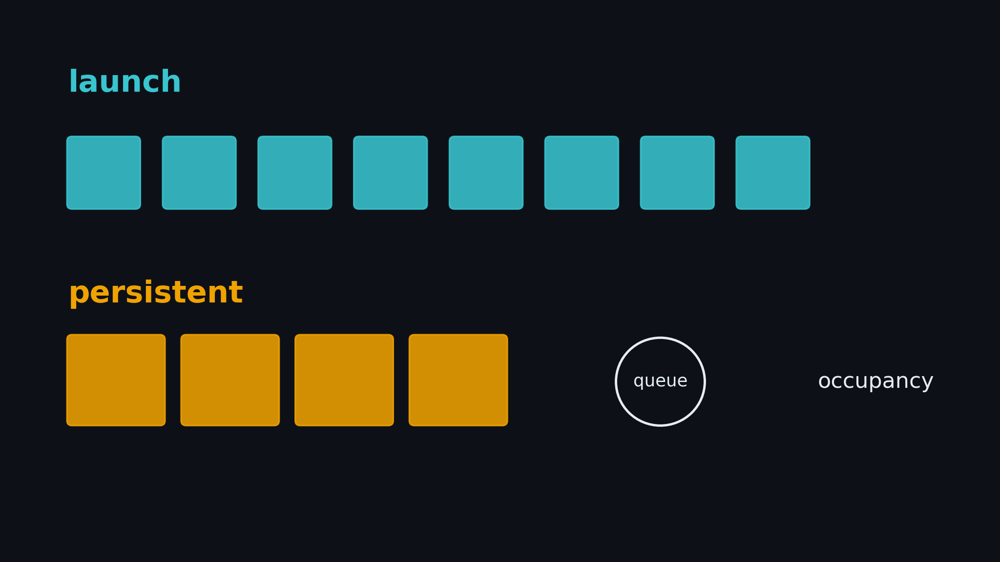
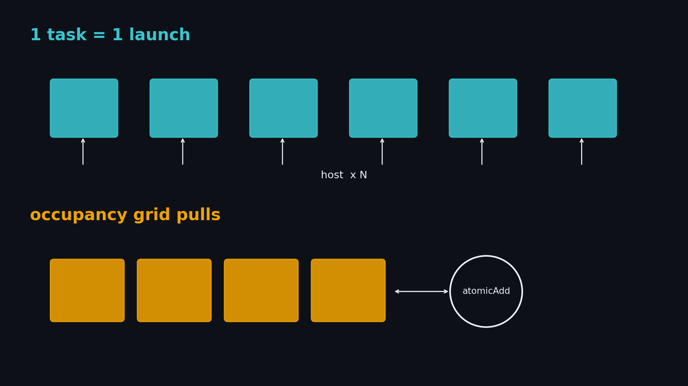
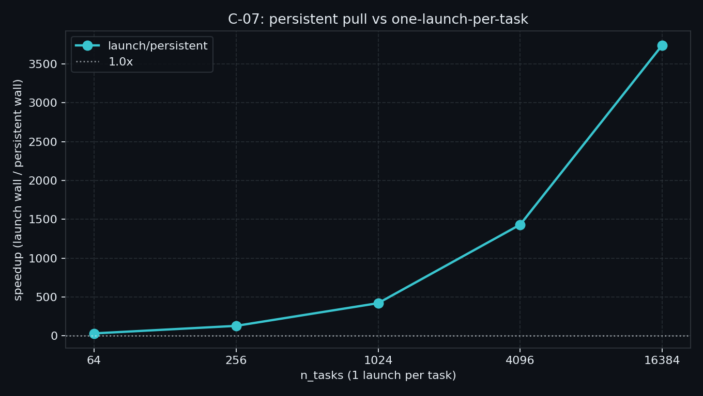
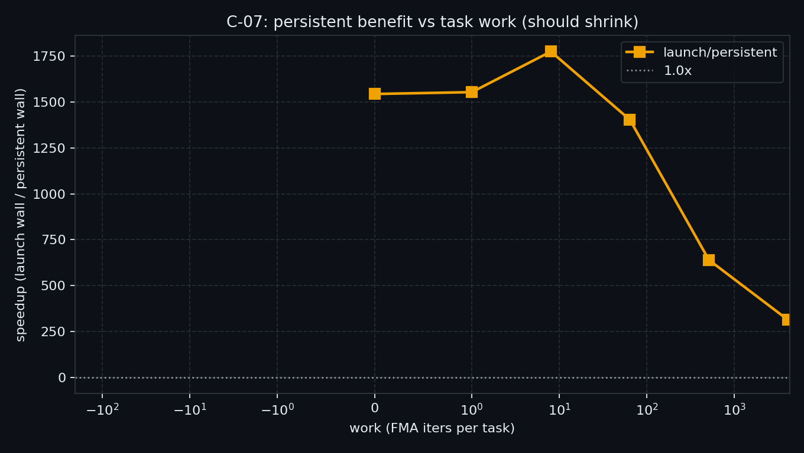

# C-07. Persistent Kernel：常驻网格、拉活与何时别再 launch



> C-06 钉死：短核链上 Graph 摊的是**提交**；核变长收益归零。  
> 本章走另一条杠杆：**网格按 occupancy 裁到能常驻，block leader 自己拉活，少再 `<<<>>>`**。  
> 本机：一任务一发 `launch/persistent` 从 **32×**（64 task）到 **3740×**（16384）；`work=4096` 收到 **314×**，oversub 更慢。

**配套可复现**：[Yapeng-Gao/AI-System-Performance-Lab](https://github.com/Yapeng-Gao/AI-System-Performance-Lab)（文章 + `.cu` + 实测表）。有用请 Star。本章示例：[`examples/03_compute_primitives/07_persistent.cu`](https://github.com/Yapeng-Gao/AI-System-Performance-Lab/blob/main/examples/03_compute_primitives/07_persistent.cu)。

## TL;DR（工程结论）

> 口径：RTX 5090 / `sm_120`，SMs=170，`persist_grid=1020`（6 block/SM）。CUDA event **median**；event 与 kernel **同 stream**。完整表见 [`docs/results/C-07_persistent.md`](../../docs/results/C-07_persistent.md)。

1. **Persistent = occupancy 尺寸的网格常驻，leader 循环拉任务。** 本机 Occupancy API 给出 6×170=**1020**。网格打到 8160（×8）的 `oversub` 是 **0.0117 ms vs persist 0.0079 ms**——更大不是更常驻。
2. **和 Graph 摊的不是一层。** C-06 短核链 `stream/graph`≈4×。本章是任务流上少退出：`launch` 约 **3.0 µs/次** 线性叠，persist 在 6～13µs 几乎不跟 `n_tasks` 走。
3. **一任务一发时加速比会非常大，且叠了并行度。** `sweep`：**32×→129×→422×→1431×→3740×**。这是「N 次 1-block launch」对「1020 block 常驻」，不是 Persistent 的通用倍数。禁止 batch 后再说没差。
4. **任务变重，杠杆变弱，但夹具收不到 1×。** `sweep_work`：work≤64 仍 ~1500×；**512→640×；4096→314×**（launch 12.3→29.4 ms）。C-06 能收到 1.01×，是因为两边占用相近；这里 launch 永远 1 block。
5. **判停**：主看形状与 `oversub` 有没有赢。千倍不要当标题战绩。禁止 ncu 附着墙钟。

## 1. 问题：还有一种摊 launch 的办法

C-06 的基线是一条**短核链**：同 stream 上连发，再和 Graph replay 比。本章换成**任务流**：每个短任务单独 launch 一次。

| 问题 | 本章交付 |
|---|---|
| 一任务一发有多贵？ | `launch` + `sweep` |
| 常驻拉活能不能摊掉？ | `persistent` |
| 任务变重还赚吗？ | `sweep_work` |
| 网格过大还叫常驻吗？ | `oversub` / `modes` |

| 章节 | 已覆盖 | 本章不重复 |
|---|---|---|
| C-06 | Graph vs 短核链 | **不重测** replay 曲线；Graph 摊提交，本章摊「不退出」 |
| C-04 | `grid.sync` / coop | 不依赖 `this_grid().sync()` |
| C-05 | body fusion | 不重测 elementwise 融合 |
| C-03 | 每线程 atomic 争用 | 队列只有 **block leader 一次** `atomicAdd` |
| B-03 | spill / occupancy 台阶 | 只调用 Occupancy API，不重开寄存器课 |
| D-05 | CUTLASS persistent GEMM | 只钩子 |



> 上：每个短任务一次 `<<<1,256>>>`，launch 税按任务数叠。下：按 occupancy 裁网格，leader `atomicAdd` 取下一个 task，做完再取，直到队列空。

## 2. 物理模型：常驻是构造出来的，不是发射得够多

普通 launch 按问题规模定网格：`ceil(n / blockDim)`。硬件把 block 分成一波一波调度，做完一波再上下一波。任务很多、每个核又极短时，你付的是「反复进内核、反复退内核」的税。

Persistent 反过来：先问这个核在这块 GPU 上**能同时住多少 block**，只发射这么多，让它们留下，用软件队列把任务拉完。

```text
oversubscribe:  grid = 很多 tile   →  硬件分波调度，核反复进进出出
resident:       grid = occ × SMs   →  一波住满，block 循环拉活后退出
```

Gupta 等人把这套叫 Persistent Threads：用队列绕过「一波工作对应一次硬件调度」的默认假设。单全局计数器 FIFO 是基线，不是工作窃取。

两件常被混在一起的事：

- **Occupancy 定网格**是「按资源构造常驻」。本章主路径。
- **Cooperative launch + `grid.sync`** 是「整网格契约」。超了 occupancy×SM，coop 会失败。那是 C-04，本章不用。

`oversub` 把同一条 persistent 核的网格乘 8：多出来的 block 往往要等前面的退了才上得去，队列多半已被住满的那一波抽干。它不该系统性大赢。赢了也只说明调度有抖动，不能把「发射更多」说成更常驻。

## 3. API / 实验形态

| 路径 | 做法 |
|---|---|
| `launch` | 对每个 task：`kernel_one_task<<<1, 256>>>`。**禁止**把一串 task 塞进同一次 launch |
| `persistent` | `blocks_per_sm = OccupancyAPI(kernel_persistent)`；`grid = blocks_per_sm × SMs`；`threadIdx.x==0` 对 `next` 做 `atomicAdd(1)`，`__syncthreads` 广播，做完再拉 |
| `oversub` | 同一核，`grid = persist_grid × 8` |
| 短任务 | 每 task `work` 次 FMA，写 `out[task]`；默认 `work=1` |
| 正确性 | device `out[]` 对 host `task_value` |

Leader 拉活（示意）：

```cuda
__shared__ unsigned int idx;
if (threadIdx.x == 0) idx = atomicAdd(next, 1u);
__syncthreads();
if (idx >= n_tasks) return;
// block 做 tasks[idx]
```

每线程自己 `atomicAdd` 会把本章做成 C-03 争用墙。纯 grid-stride 扫完全部下标，则是一个大核做完，更像 C-05，不是拉活。

计时：`cudaEventRecord(..., stream)`，kernel 也在这条 stream 上。跨 stream 记 event 会量到空 gap（B-04 作废跑）。`next` 的 `MemsetAsync(0)` 放在 event 前，不跟 n 次 launch 抢「谁更公平」。

## 4. 决策表

| 信号 | 建议 |
|---|---|
| 短任务很多、一任务一发、拓扑不好 capture | **试 Persistent**；看 `sweep` 的 `launch/persistent` |
| 任务已经该合成一次大 launch / 整卡核 | 别再一任务一发；常驻的千倍数字对不上这种 workload |
| 静态短核链、拓扑稳定、高重复 | **先 C-06 Graph**，不要用常驻重写那条链 |
| 要跨 block 做阶段栅栏 | → C-04 coop / `grid.sync`，不是本章的拉活循环 |
| 产消 warp / TMA 路径 / 库级 GEMM tile | → B-07 / D-05，不是「再 launch 少几次」 |
| 只是想少写回 GMEM | → C-05 垂直融合 |

## 5. 实验怎么设计

| mode | 问题 | 进主结论？ |
|---|---|---|
| `launch` / `persistent` | 定点端到端 | 定点 |
| `sweep` | `n_tasks∈{64,256,1024,4096,16384}`，`work=1` | **主曲线** |
| `sweep_work` | 固定 `n_tasks=4096`，扫 `work` | **副曲线** |
| `oversub` | occupancy 网格 ×8 | 定点 |
| `modes` | 定点 + `blocks_per_sm` / `persist_grid` + oversub 一行 | 写结果用 |

**主命令**

```bash
./bin/03_compute_primitives_07_persistent --mode sweep
./bin/03_compute_primitives_07_persistent --mode sweep_work
./bin/03_compute_primitives_07_persistent --mode modes
```

默认夹具：`n_tasks=4096`，`work=1`，`block=256`，launch 的 grid **恒为 1**。不要为了好看改成 batch。

证据优先级：裸跑 event median。NCU/NSYS 默认不做。

### 5.1 本机实测

平台：RTX 5090 / `sm_120` / 170 SM / `persist_grid=1020`。表与怎么读：[`docs/results/C-07_persistent.md`](../../docs/results/C-07_persistent.md)。

| n_tasks | launch_ms | persist_ms | launch/persistent |
|---:|---:|---:|---:|
| 64 | 0.210 | 0.0065 | **32.5×** |
| 256 | 0.799 | 0.0062 | **129×** |
| 1024 | 3.12 | 0.0074 | **422×** |
| 4096 | 12.18 | 0.0085 | **1431×** |
| 16384 | 48.71 | 0.0130 | **3740×** |



| work | launch_ms | persist_ms | launch/persistent |
|---:|---:|---:|---:|
| 0～64 | ~12.3 | ~0.008 | **1400～1770×** |
| 512 | 12.28 | 0.019 | **640×** |
| 4096 | 29.42 | 0.094 | **314×** |



`modes`：launch 12.42 ms；persist 0.0079 ms（`launch/persistent`=**1572×**）；oversub 0.0117 ms（`oversub/persistent`=**1.48×**，没赢）。

怎么读：launch ≈ **3.0 µs/次**；persist 几乎不跟任务数走。加速比里同时有 launch 税和「1 block 串行 vs 1020 block」。`work` 抬高后从 ~1500× 收到 **314×**，说明杠杆在弱，不是测废了。本机 3.0µs 低于文献常说的 5–10µs，只认本机相对形状。

## 6. 工程边界

- **1 task = 1 launch。** batch 会抹掉命题。加速比因此含「整卡 vs 单 block」，这是反模式本身，不是 Occupancy API 的魔法。
- **常驻网格按 occupancy 构造**，不是 coop 契约；超发是 oversub，不是「更 persistent」。
- 队列是单计数器。leader 争用、尾块不均，写进误区，不在本章修工作窃取。
- 常驻网格占满 SM 时，同设备上别的核会饿。生产里有时只占一部分 SM；本章不测多核共存（候选 C-08 / A-08 也不在这里重开）。
- 数据可以留在片上做下一轮，那是 Persistent 的另一半好处。本章微基准为了和 `launch` 对齐，每 task 只写 `out[task]`，不演示片上接力。

## 7. 扩展阅读（不抢后续 Module）

1. Occupancy API 与 coop 上限：见 §10-1、§10-2。本章主路径不用 coop。
2. CUTLASS persistent GEMM / tile scheduler：见 §10-8 → **Module D**，不是再写一遍拉活循环。
3. Megakernel / 多算子编译融合：见 §10-9；产品栈不在 C。
4. 设备侧多核重叠若以后要写，是候选 C-08，**不是必须下一章**。索引收束走 C-10。

## 8. SOP + 误区

1. 先确认问题是「短任务反复 launch」，不是带宽（回 B）或该 fuse（C-05）或该上 Graph（C-06）。  
2. 用 Occupancy API 定 `persist_grid`，打印 `blocks_per_sm`。  
3. `--mode sweep` 看 `launch/persistent` vs `n_tasks`。  
4. `--mode sweep_work` 看加速比是否从千倍往下收；本夹具不会收到 1×。  
5. `--mode modes` 看一眼 `oversub`；它不是第三条主曲线。  
6. 不要为逼近 1× 或压低倍数去改 batch / 加长 `work`。

| 误区 | 纠正 |
|---|---|
| 网格发得越大越 persistent | 超过 occupancy 是 oversubscribe |
| persist 必须数倍，否则实现错了 | 1× 有效；反过来，千倍也不许当通用战绩 |
| 每线程 atomic 抢任务 | 滑回 C-03；用 block leader |
| 和 Graph 再比一条主曲线 | Graph 已在 C-06 |
| 用 ncu 附着 ms 写进标题 | 只认裸跑 event |

## 9. 小结与下一章

Graph 摊提交，Persistent 摊不退出。  
常驻网格按 occupancy 裁，任务由 leader 拉，不靠把 grid 发爆。  
一任务一发时 launch 税按 ~3µs 叠；任务变重加速比会收（本机 1500×→314×），夹具到不了 1×。

C-08 / C-09 仍是候选槽，不阻塞。索引在 C-10。下一篇先看 Module C 目录。

---

> 本文配套代码与实测：[AI-System-Performance-Lab](https://github.com/Yapeng-Gao/AI-System-Performance-Lab)。觉得有用请 Star，后续章更新更好找。  
> 本章示例：[`examples/03_compute_primitives/07_persistent.cu`](https://github.com/Yapeng-Gao/AI-System-Performance-Lab/blob/main/examples/03_compute_primitives/07_persistent.cu)。下一篇：[C 模块文章目录](https://github.com/Yapeng-Gao/AI-System-Performance-Lab/tree/main/article/03_compute_primitives/)。

## 10. 参考文献

### A. 官方

1. [CUDA Runtime — Occupancy](https://docs.nvidia.com/cuda/cuda-runtime-api/group__CUDART__OCCUPANCY.html)  
2. [CUDA Programming Guide — Cooperative Groups](https://docs.nvidia.com/cuda/cuda-programming-guide/)（coop 网格上限；本章主路径不用 coop）

### B. 工程

3. NVIDIA, [CUDA Pro Tip: Occupancy API](https://developer.nvidia.com/blog/cuda-pro-tip-occupancy-api-simplifies-launch-configuration/)  
4. NVIDIA 论坛：[persistent kernel concept](https://forums.developer.nvidia.com/t/question-about-persistent-kernel-concept/320600)

### C. 实证

5. Gupta et al., [A study of Persistent Threads style GPU programming](https://doi.org/10.1109/inpar.2012.6339596)（InPar 2012）  
6. 本仓库 [`C-06_cuda_graph.md`](../../docs/results/C-06_cuda_graph.md)（5090：短核 Graph ~4×，长核 →1.01×）  
7. PyGraph, [arXiv:2503.19779](https://arxiv.org/abs/2503.19779)（文献：单次 launch 常 ~5–10µs；不当本机绝对数）

### D. 前沿 / 扩展

8. CUTLASS persistent GEMM tile scheduler → Module D  
9. Megakernel / 编译器融合多算子（2025 一类工作）→ 不进本章必做
