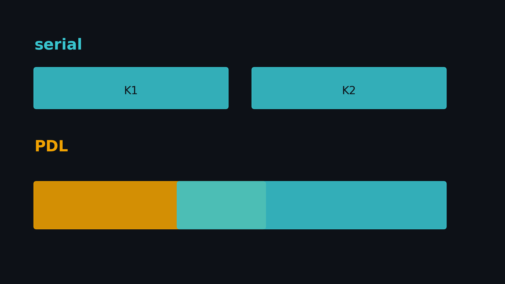
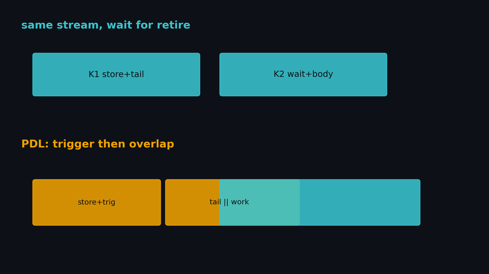
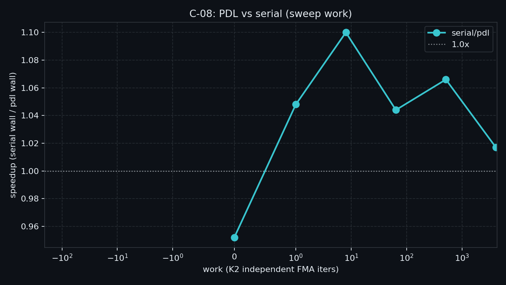
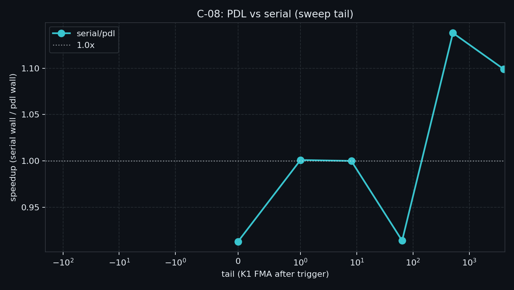

# C-08. PDL：同流依赖核的提前启动与何时叠不上



> 封面只画机制。本机定点 `serial/pdl`=**1.13×**（约 4µs），不要按色块长度读加速比。

> C-07 钉死：一任务一发时常驻能摊 launch；占满 SM 时别的核会饿。  
> 本章换依赖核：同 stream 上 K1 写、K2 读，**次核能不能在主核退休前启动**。  
> 本机：`serial/pdl` 贴 **1×**；定点最多 **1.13×**；`pdl_full/pdl`=**0.999×**。门槛 sm_90+。

**配套可复现**：[Yapeng-Gao/AI-System-Performance-Lab](https://github.com/Yapeng-Gao/AI-System-Performance-Lab)（文章 + `.cu` + 实测表）。有用请 Star。本章示例：[`examples/03_compute_primitives/08_pdl.cu`](https://github.com/Yapeng-Gao/AI-System-Performance-Lab/blob/main/examples/03_compute_primitives/08_pdl.cu)。

## TL;DR（工程结论）

> 口径：RTX 5090 / `sm_120`，SMs=170，`half_grid=510` / `full_grid=1020`（6 block/SM）。CUDA event **median**；event 与 kernel **同 stream**。完整表见 [`docs/results/C-08_pdl.md`](../../docs/results/C-08_pdl.md)。

1. **PDL = 同流上下一个核可以在主核退休前 boot。** Host 仍先发 K1，再 `cudaLaunchKernelEx(K2, ProgrammaticStreamSerialization)`。独立核走 A-08，设备 launch 子网格不在本章。
2. **提前 boot ≠ 数据可见。** K2 必须 `cudaGridDependencySynchronize`。只开 attribute、不 wait，是竞态。
3. **能叠的是 K1 trigger 之后的 tail 与 K2 wait 之前的独立 work。** 本机 `sweep`：**0.95×～1.10×**。没有独立 work（work=0）是 **0.95×**；work=4096 回到 **1.02×**。
4. **没有尾巴或占满 occupancy，都叠不出更多计算。** `sweep_tail` 在 tail=0 是 **0.91×**；定点 `serial/pdl`=**1.13×**（约 4µs）；`pdl_full/pdl`=**0.999×**。
5. **判停**：主看形状。本夹具结论就是 **1× 量级**。禁止 ncu 附着墙钟。禁止改成双 stream 装重叠。

## 1. 问题：依赖核还能不能提前启动

A-08 叠的是**独立活**和拷贝∥计算。两条流、没有数据依赖，硬件可以并排。  
同流上 K2 要读 K1 的结果，默认必须等 K1 整网格退休。Graph（C-06）摊的是提交，不改这条退休语义。

PDL（sm_90+）给同流依赖核一条缝：主核声明「次核可以 boot」，次核自己在读依赖数据前 fence。

| 问题 | 本章交付 |
|---|---|
| 同流串行依赖核有多长？ | `serial` |
| 半 occupancy 下 PDL 能不能短？ | `pdl` + `sweep` |
| 没有 tail 还能赢吗？ | `sweep_tail` |
| 满网格还叠得上吗？ | `pdl_full` / `modes` |

| 章节 | 已覆盖 | 本章不重复 |
|---|---|---|
| A-08 | Host Stream / CE | **不重测** H2D 流水线；独立核走异流 |
| C-06 | Graph replay | **不重测** 短核链；Graph 摊提交 |
| C-07 | 常驻拉活 | **不重测** 一任务一发；只借用「占满 SM 会饿」 |
| C-05 | body fusion | 该 fuse 就不要拆成两核再 PDL |
| D-05 | CUTLASS PDL GEMM | 只钩子 |



> 上：同流 K1 做完（含 tail）再跑 K2。下：K1 写完并 trigger，tail 与 K2 的独立 work 可以叠；K2 读 `out[]` 之前必须 wait。

## 2. 物理模型：提前 boot 不是第二套 stream

```text
serial:   [ K1 store | K1 tail ][ K2 work | K2 consume ]
PDL:      [ K1 store | trig | K1 tail     ]
                        [ K2 work | wait | consume ]
```

Host 还是一条 stream、两次 launch。attribute 只允许次核提前被调度，不必等主核整网格退休。  
次核读 `out[]` 之前必须 `cudaGridDependencySynchronize`。官方语义是等主核**做完并 flush**；能叠的只有 wait **之前**的独立段。

两个满 occupancy 网格会抢 SM。半 occupancy 是给 tail 和 work 留并排空间。本机 `pdl_full` 贴 `pdl`（0.999×），省下的是调度缝。

## 3. API / 实验形态

| 路径 | 做法 |
|---|---|
| `serial` | `<<<K1>>>` 再 `<<<K2>>>`，无 PDL attribute |
| `pdl` | K1 同样 `<<<>>>`；K2 `cudaLaunchKernelEx` + `ProgrammaticStreamSerialization` |
| K1 | 写 `out[i]` → `cudaTriggerProgrammaticLaunchCompletion` → `tail` 次 FMA（不改 `out`） |
| K2 | `work` 次独立 FMA → `cudaGridDependencySynchronize` → `sink[i]=2*out[i]` |
| 网格 | 默认 `occ×SM/2`；`pdl_full` = `occ×SM` |
| 正确性 | `sink[i]` 对 host `0.002*(i+1)` |

```cuda
// K1
out[i] = 0.001f * (i + 1);
cudaTriggerProgrammaticLaunchCompletion();
// tail: burn only

// K2
// independent work
cudaGridDependencySynchronize();
sink[i] = out[i] * 2.f;
```

计时：`cudaEventRecord(..., stream)`。跨 stream 记 event 会量空 gap。

## 4. 决策表

| 信号 | 建议 |
|---|---|
| 两核有 GMEM 依赖，且主核有独立 tail / 次核有独立 prologue | 看 `serial/pdl`。本机定点只省 **~4µs（1.13×）** |
| 没有 tail、两边都是读依赖数据 | 别上；本机 tail=0 是 **0.91×** |
| 两核都能把 SM 住满 | 别上；本机 `pdl_full`≈`pdl` |
| 两核独立 | → A-08 异流，不是本章 |
| 拓扑稳定的短核链 | 先 C-06 Graph |
| 中间量很大、该垂直融合 | → C-05，不要拆开再 PDL |
| 生产 GEMM epilogue/prologue | → D-05 / CUTLASS，不在本章手写库 |

## 5. 实验怎么设计

| mode | 问题 | 进主结论？ |
|---|---|---|
| `serial` / `pdl` | 定点端到端 | 定点 |
| `sweep` | 固定 `tail=512`，扫 `work` | **主曲线** |
| `sweep_tail` | 固定 `work=512`，扫 `tail` | **副曲线** |
| `modes` | 定点 + `pdl_full` | 写结果用 |

**主命令**

```bash
./bin/03_compute_primitives_08_pdl --mode sweep
./bin/03_compute_primitives_08_pdl --mode sweep_tail
./bin/03_compute_primitives_08_pdl --mode modes
```

默认：`n=1<<20`，`work=512`，`tail=512`，`block=256`，网格 = 半 occupancy。CC < 9.0 直接退出。

证据：裸跑 event median。NCU/NSYS 默认不做。

### 5.1 本机实测

平台：RTX 5090 / `sm_120` / 170 SM / `half_grid=510` / `full_grid=1020`。表与怎么读：[`docs/results/C-08_pdl.md`](../../docs/results/C-08_pdl.md)。

| work | serial_ms | pdl_ms | serial/pdl |
|---:|---:|---:|---:|
| 0 | 0.0205 | 0.0215 | **0.95×** |
| 8 | 0.0225 | 0.0205 | **1.10×** |
| 512 | 0.0338 | 0.0317 | **1.07×** |
| 4096 | 0.1260 | 0.1239 | **1.02×** |



| tail | serial_ms | pdl_ms | serial/pdl |
|---:|---:|---:|---:|
| 0 | 0.0215 | 0.0236 | **0.91×** |
| 512 | 0.0338 | 0.0297 | **1.14×** |
| 4096 | 0.1249 | 0.1137 | **1.10×** |



定点 `modes`：serial 0.0348 ms / pdl 0.0307 ms = **1.13×**；`pdl_full` 也是 0.0307 ms（0.999×）。  
怎么读：墙钟多在 20～35µs，定点大约省 4µs。没有 tail / 没有独立 work 时 PDL 更慢。1× 就停。

## 6. 工程边界

- **sm_90+。** 5090 是 `sm_120`。写作机若是老卡，binary 会拒绝跑，不要改门槛去迁就。
- K2 **必须**读 K1 的 `out[]`。拆掉依赖就变成 A-08。
- `cudaGridDependencySynchronize` 等的是主核完成+flush。独立 work 必须放在 wait **前面**。
- 半 occupancy 是为了留出并排空间，不是调参作弊。`pdl_full` 必须留在 `modes` 里。
- 常驻占满 SM（C-07）时不要指望再叠一个依赖核。

## 7. 扩展阅读（不抢后续 Module）

1. CUDA PG PDL 与 `LaunchKernelEx`：见 §10-1、§10-2。  
2. CUTLASS / CuTe Blackwell PDL GEMM：见 §10-7 → **Module D**。  
3. Graph 上的 programmatic edge：见 §10-8；不重开 C-06。  
4. named barrier 若以后要写，是候选 C-09，**不是必须下一章**。索引走 C-10。

## 8. SOP + 误区

1. 先确认是**同流依赖核**，不是拷贝∥计算（A-08）或该 fuse（C-05）。  
2. Occupancy API 定满网格，主测用一半。  
3. `--mode sweep` 看 `serial/pdl` vs `work`。  
4. `--mode sweep_tail` 确认没有尾巴是否贴 1×。  
5. `--mode modes` 看一眼 `pdl_full`。  
6. 1× 就停，不要改成双 stream。

| 误区 | 纠正 |
|---|---|
| PDL 就是多 stream | 仍是同流；attribute 只允许提前 boot |
| 开了 attribute 就安全 | 次核读依赖数据前必须 wait |
| 网格越大越能叠 | 满 occupancy 抢 SM |
| 1× 说明实现错了 | 1× 有效；本夹具结论就是 1× 量级 |
| 为看见 2× 加长 burn / 改双 stream | 拆依赖就变成 A-08；那不是 PDL |
| 和 Graph 再比一条主曲线 | Graph 已在 C-06 |

## 9. 小结与下一章

独立核走 A-08，提交走 C-06，常驻走 C-07。  
PDL 只处理同流依赖核的提前启动；叠的是 tail 与独立 work。  
本机最多 **1.13×**。没有尾巴或 body 已经很长，就贴 1×。

C-09 仍是候选。下一篇先看 Module C 目录。

---

> 本文配套代码与实测：[AI-System-Performance-Lab](https://github.com/Yapeng-Gao/AI-System-Performance-Lab)。觉得有用请 Star，后续章更新更好找。  
> 本章示例：[`examples/03_compute_primitives/08_pdl.cu`](https://github.com/Yapeng-Gao/AI-System-Performance-Lab/blob/main/examples/03_compute_primitives/08_pdl.cu)。下一篇：[C 模块文章目录](https://github.com/Yapeng-Gao/AI-System-Performance-Lab/tree/main/article/03_compute_primitives/)。

## 10. 参考文献

### A. 官方

1. [CUDA Programming Guide — PDL](https://docs.nvidia.com/cuda/cuda-programming-guide/04-special-topics/programmatic-dependent-launch.html)  
2. Runtime：`cudaLaunchKernelEx` / `cudaLaunchAttributeProgrammaticStreamSerialization`

### B. 工程

3. [CUTLASS Dependent kernel launches](https://docs.nvidia.com/cutlass/latest/media/docs/cpp/dependent_kernel_launch.html)  
4. [H100 course: Kernel Launch Control](https://cudacourseh100.github.io/pages/lesson-8.2.html)

### C. 实证

5. 本仓库 [`C-06_cuda_graph.md`](../../docs/results/C-06_cuda_graph.md)（提交层另一杠杆）  
6. 本仓库 [`C-07_persistent.md`](../../docs/results/C-07_persistent.md)（满 occupancy 占 SM）

### D. 前沿 / 扩展

7. CUTLASS / CuTe Blackwell PDL GEMM → Module D  
8. Graph `cudaGraphDependencyTypeProgrammatic` → 不进本章必做
