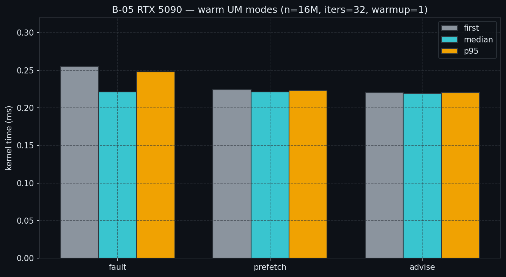
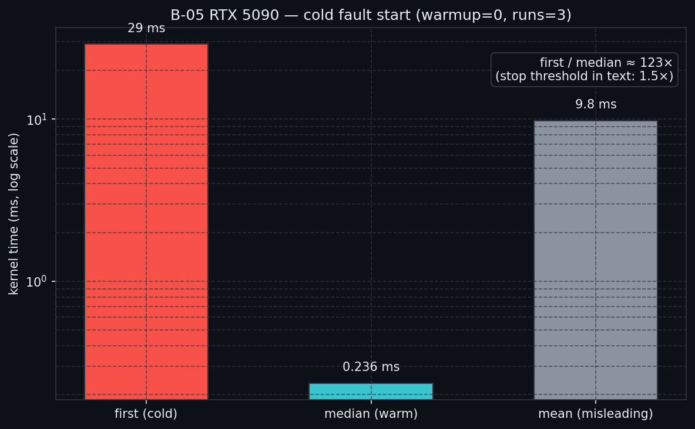

# B-05 Unified Memory — RTX 5090 参考结果

> 摘自正文 `article/02_memory_optim/B-05*.md` §8；便于仓库内对照。

## 平台 / 口径

- GPU：RTX 5090
- 载荷：`n=16777216` floats（64 MiB），`iters=32`
- 可执行文件：`02_memory_optim_05_unified_memory_pf`
- 封面：`article/02_memory_optim/assets/B-05-unified-memory-cover.png`

## 暖身后续跑（warmup=1, runs=5）

CSV：[`B-05_modes_warm.csv`](B-05_modes_warm.csv)

| mode | first (ms) | median (ms) | p95 (ms) |
|------|------------|-------------|----------|
| fault | 0.255 | 0.221 | 0.248 |
| prefetch | 0.224 | 0.221 | 0.223 |
| advise | 0.220 | 0.219 | 0.220 |



## 冷启动 fault-only（warmup=0, runs=3）

CSV：[`B-05_cold_fault.csv`](B-05_cold_fault.csv)

| metric | ms |
|--------|-----|
| first | 29.0 |
| median | 0.236 |
| p95 | 26.1 |
| mean | 9.8 |



## 复现

```bash
bash examples/02_memory_optim/05_profile_unified_memory.sh
WARMUP=0 RUNS=3 bash examples/02_memory_optim/05_profile_unified_memory.sh fault
python scripts/plot_b05_unified_memory.py
```
