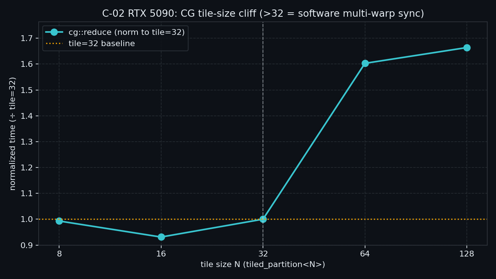

# C-02 Cooperative Groups — 实测摘要

> 状态：✅ 已测（RTX 5090 / `sm_120`）  
> 正文：`article/03_compute_primitives/C-02*.md`

## 平台

| 项 | 值 |
|---|---|
| GPU | NVIDIA GeForce RTX 5090 |
| CC | sm_120 |
| SMs | 170 |
| n | 16777216 |
| block | 128 |
| grid | 1360（auto = SMs×8） |
| reps | 50（只放大规约；verify 走 reps=1） |
| runs / warmup | 7 / 2 |
| 主证据 | CUDA event **median** |

## 复现命令

```bash
./bin/03_compute_primitives_02_cooperative_groups --mode sweep
./bin/03_compute_primitives_02_cooperative_groups --mode modes
```

## Sweep（主曲线：`cg::reduce` vs tile 大小；>32 悬崖）

verify cg_reduce OK（sum=142606336）。

| tile | median_ms | norm(÷tile32) |
|---:|---:|---:|
| 8 | 0.0275 | **0.993** |
| 16 | 0.0258 | **0.931** |
| 32 | 0.0277 | **1.000** |
| 64 | 0.0444 | **1.603** |
| 128 | 0.0461 | **1.664** |

### 怎么读

1. **tile≤32：持平**（norm ≈0.93～1.00）。走 warp 同步路径；tile=16 略快于 32 属亚 warp 波动，不改结论。
2. **tile>32：悬崖**——64→**1.60×**，128→**1.66×**（相对 tile=32）。多 warp CG tile 的软件通用 sync（busy-wait）露出来了。
3. **工程裁决**：`cg::reduce` 只在 **tile≤32（子集）** 当默认；block-wide 规约回 C-01 处方或 CUB，别拿大 tile CG 顶替。



## Modes（定点：抽象税 @ tile=32）

| tag | median_ms | 相对 |
|---|---:|---|
| intrinsic | 0.0253 | 基线 |
| tile32 | 0.0254 | tile32/intrinsic **1.004×** |
| cg_reduce | 0.0250 | cg_reduce/intrinsic **0.990×** |
| coalesced | 0.2354 | verify OK（odd=8388608） |
| cluster | 0.0069 | verify OK（clusize=2，DSMEM 邻块读） |

### 怎么读

1. **抽象税≈0**：`thread_block_tile<32>.shfl_down` 与 `cg::reduce` 相对手写 `__shfl_down_sync` 都在噪声内（1.00× / 0.99×）——CG 是分组句柄，不是更慢的 shuffle。
2. **coalesced**：聚合计数正确；时延含 atomic，不与 reduce 加速比横比。
3. **cluster**：DSMEM 邻块读 + `cluster.sync` 功能正确；短时延是小核（几乎无计算），**不作主加速比故事**。

## 对大纲「文献形状」假设的校准

| 假设 | 本机 |
|---|---|
| tile≤32：CG ≈ intrinsic（抽象税可忽略） | **成立**：1.00× / 0.99× |
| tile>32：CG 软件 sync 明显变慢 | **成立**：64/128 ≈ **1.60× / 1.66×** |
| coalesced 正确聚合；cluster DSMEM 功能正确 | **成立**（verify OK） |
