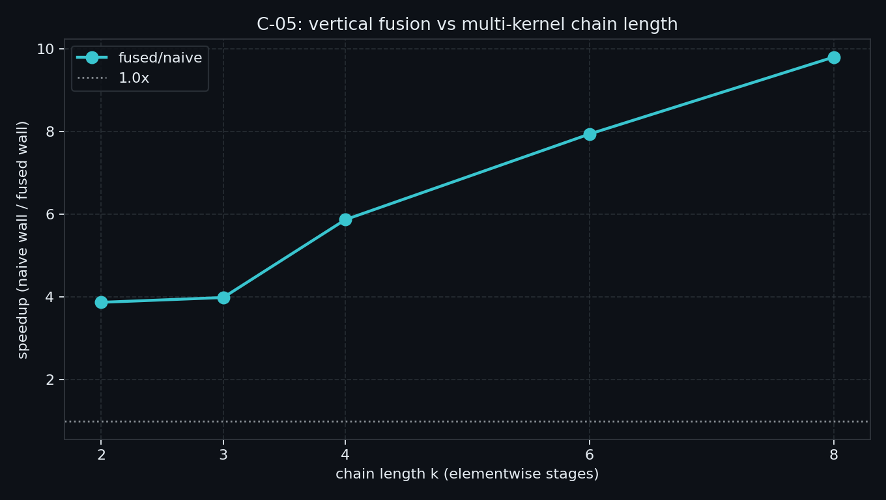

# C-05 Kernel Fusion — 实测摘要

> 状态：✅ 已测（RTX 5090 / `sm_120`）  
> 正文：`article/03_compute_primitives/C-05*.md`  
> 示例：`examples/03_compute_primitives/05_kernel_fusion.cu`

## 平台

| 项 | 值 |
|---|---|
| GPU | NVIDIA GeForce RTX 5090 |
| CC | sm_120 |
| SMs | 170 |
| n | 16777216 |
| block / grid | 256 / 1360（SMs×8） |
| FAT_TEMPS | 48 |
| runs / warmup | 7 / 2 |
| 主证据 | CUDA event **median**（整条链一包） |

## 复现命令

```bash
./bin/03_compute_primitives_05_kernel_fusion --mode sweep
./bin/03_compute_primitives_05_kernel_fusion --mode modes
```

## Sweep（主曲线：fused/naive vs k）

occupancy：`stage=6`、`fused=6`（同 block=256）。

| k | naive_ms | fused_ms | fused/naive |
|---:|---:|---:|---:|
| 2 | 0.3182 | 0.0821 | **3.87×** |
| 3 | 0.3332 | 0.0835 | **3.99×** |
| 4 | 0.4898 | 0.0834 | **5.87×** |
| 6 | 0.6620 | 0.0833 | **7.94×** |
| 8 | 0.8318 | 0.0848 | **9.81×** |



### 怎么读

1. **fused 墙钟几乎平坦（~0.082～0.085 ms）**；naive 随 k 近似线性涨（0.32→0.83）——垂直融合把中间往返砍掉后，主成本接近「一次读 + 一次写」。
2. **`fused/naive` 随 k 抬升（3.9×→9.8×）**：链越长，少写回赚得越多；对齐「带宽墙 elementwise 该 fuse」。
3. 瘦融合 **不伤 occupancy**（与 stage 同为 6 blocks/SM）——本机短链融合的主收益是流量，不是靠抬 occupancy。

## Modes（定点 k=4，含 fat）

| tag | median_ms | occ_bpsm | 相对 |
|---|---:|---:|---|
| naive | 0.4905 | 6 | — |
| fused | 0.0833 | 6 | fused/naive **5.89×** |
| fat | 0.6670 | **1** | fat/fused **8.01×**（更慢） |

### 怎么读

1. **fat 把 occupancy 从 6 打到 1**，墙钟相对瘦融合差 **8×**——压力悬崖成立；`fat` 是探针，不是处方。
2. fat（0.67 ms）甚至 **慢于 naive（0.49 ms）**：过度融合/寄存器堆砌可以输给「老老实实多核」。
3. verify 全过；sink 仅防 DCE。

## CSV

- `docs/results/C-05_sweep.csv`

```bash
python scripts/plot_c05_kernel_fusion.py
```
